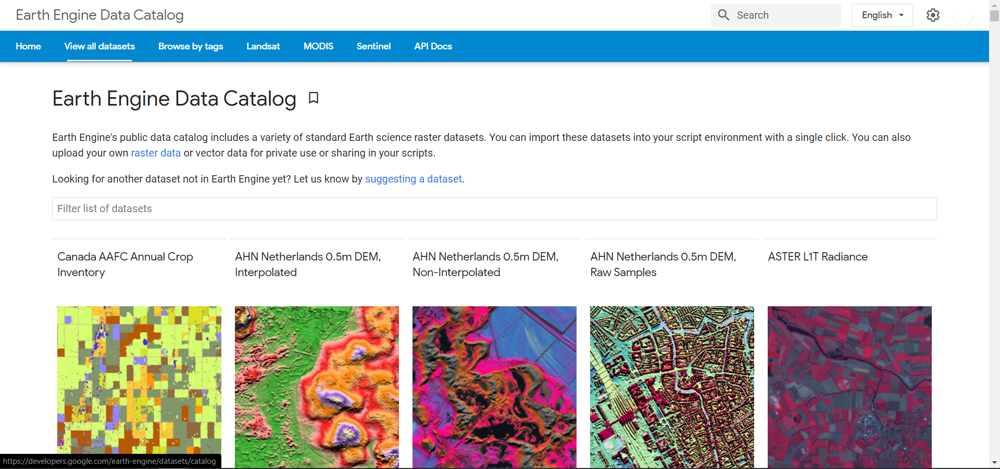

\newpage
\mainmatter
```{=latex}
\renewcommand\headrulewidth{1pt}
\pagestyle{fancy} 
  \fancyfoot{}
  \fancyfoot[LE,RO]{\thepage}
  \fancyhead{}
  \fancyhead[LE,RO]{\leftmark}
  \fancyhead[LO,RE]{\rightmark}
\fancypagestyle{plain}{}
```
# Introducción

## Propósito del libro

La idea del presente manual es fungir como una guía introductoria que ayude a los nuevos usuarios de Google Earth Engine (GEE) a entender su estructura, funcionamiento y capacidades y facilitar el uso de esta poderosa herramienta gratuita. Existen algunos artículos previos que han presentado las características básicas de GEE, sin embargo, la mayoría están escritas en inglés (Gorelick et al, 2017; Amani et al., 2020), aunque en español existen algunas publicaciones también (ver Perilla y Mas, [2020]). La documentación propia de GEE ya existe en inglés, pero con este manual escrito en español se busca ampliar el público objetivo y aumentar el alcance del programa hacia países hispanoparlantes. 

Es importante aclarar que esta guía es solamente introductoria, por lo tanto, hay muchas funciones que se pueden realizar en GEE que quedan fuera de este documento (por ejemplo, los análisis de series de tiempo o la creación de aplicaciones). Además, debido a su carácter introductorio, este manual está dirigido a usuarios con y sin conocimientos previos de programación. GEE está en constante actualización, por lo que este manual se enfoca en el corazón del funcionamiento de la API de GEE, que es lo que menos cambia en el tiempo. Sin embargo, aconsejamos buscar información adicional sobre las actualizaciones de GEE, así como revisar su documentación oficial.

Para aprender a usar GEE, como todos los programas de programación, se debe llevar a cabo un proceso de prueba y error, mediante el desarrollo de códigos propios. Los autores esperamos que esta herramienta ayude a los nuevos usuarios a comenzar a utilizar GEE y a alcanzar sus objetivos particulares de investigación.

## Organización del libro

El manual está organizado en doce capítulos que cubren diferentes aspectos de esta API ("Application Programming Interface", o interfaz de programación de aplicaciones). El primer capítulo describe algunos aspectos generales de GEE. El siguiente capítulo detalla los pasos a seguir para poder usar GEE, así como los elementos básicos de dicha herramienta. Posteriormente, se presentan algunas funciones básicas para ayudar al usuario a interactuar con la API y las diferencias entre la programación del lado del servidor y del usuario. A continuación, en cinco capítulos, se describen los tipos de objetos más frecuentemente utilizados en GEE: geometrías, vectores, colecciones de vectores, imágenes y colecciones de imágenes, así como sus métodos. Posteriormente, se describe con detalle cómo subir información a GEE para poder utilizarla en GEE. Después, se describen algunos métodos más avanzados para utilizar en conjunto información vectorial y ráster. El último capítulo muestra el procedimiento para realizar una clasificación supervisada en la API. 

El manual incluye ejemplos que ayudarán a entender la sintaxis y experimentar con distintos tipos de datos, provenientes de distintas fuentes. De manera particular, en los capítulos sobre imágenes y colecciones de imágenes se incluyen ejemplos más prácticos con aplicaciones reales que tratan de integrar varios de los métodos revisados. Por último, este manual cuenta con una serie de ejercicios complementarios y explicativos los cuales pueden ser implementados directamente en línea. El enlace para acceder a este material se encontrará más adelante.

## Descripción general de Google Earth Engine

### ¿Qué es Google Earth Engine?

Google Earth Engine (GEE) es una plataforma desarrollada por Google que permite realizar procesamientos geoespaciales a gran escala, utilizando bases de datos con millones de datos. Uno de los principales intereses de esta plataforma es reducir el tiempo invertido en el pre-procesamiento y facilitar los análisis realizados con información geoespacial.

Desde hace varios años existen distintas misiones espaciales que registran datos de la Tierra a través de satélites, los cuales se almacenan en acervos de imágenes. Aunque esta información ha sido muy útil para el desarrollo científico, siempre ha existido el problema de la “Big-Data” (bases de datos enormes). Es decir, que dichos acervos de imágenes cuentan con millones de imágenes disponibles que resultan imposibles de procesar y analizar en su totalidad utilizando una computadora personal. Esta situación evitaba la posibilidad de aprovechar el potencial total de esta información.

GEE nace de la necesidad de aprovechar esa “Big-Data”, ofreciendo una herramienta que pueda lidiar tecnológicamente con el manejo de enromes volúmenes de información, permitiendo entonces que los usuarios se concentren en la generación de resultados y nuevos desarrollos científicos. Para lograr este objetivo, se creó una infraestructura con tres elementos claves, que son los que permiten el funcionamiento de GEE: el catálogo de información, la capacidad computacional y las APIs.

GEE recopiló la información geoespacial de diferentes fuentes alrededor del mundo y creó copias de esos datos en su propio "datacenter" logrando así almacenar más de 20 petabytes (20 000 000 de gigabytes) de información en un solo lugar. El programa ofrece un amplio repositorio de información geográfica global que ya se encuentra cargada en su catálogo, lo cual facilita el acceso a diferentes fuentes de datos (Fig. 1.1). Entre la información que se puede consultar directamente en GEE se encuentran: acervos para todo el mundo de imágenes Landsat (1-8), MODIS, Sentinel (1-3, 5), SRTM, AVHRR, GOESS, ALOS, mosaicos anuales de PALSAR/PALSAR 2 y algunos productos derivados de estas imágenes u otros insumos como información climática global (WorldClim), capas de cambios en la cobertura forestal (Global Forest Cover Change), información de la altura del dosel global (Global Forest Canopy height), mapas de densidad de carbono globales (Global Aboveground and Belowground Biomass Carbon Density Map), datos de precipitación globales (CHIRPS), límites políticos (FAO GAUL: Global Administrative Unit Layers 2015, Country Boundaries), polígonos de áreas protegidas mundiales (WDPA: World Database on Protected Areas (polygons)), densidad poblacional (GPWv411: Population Density (Gridded Population of the World Version 4.11)), cuencas (WWF HydroSHEDS Hydrologically Conditioned DEM, 3 Arc-Seconds), entre otras.

```{r, echo = F, out.width="100%", fig.cap="Algunos ejemplos de fuentes de información disponibles en GEE."}

```

:::: {.bluebox2 data-latex=""}
::: {.awesomeblock data-latex="{5pt}{\faLightbulb}{darkblue}"}
Para consultar toda la información que esta disponible en GEE se puede dirigir al siguiente enlace: https://developers.google.com/earth-engine/datasets
:::
::::

De manera paralela al catálogo de información, GEE puso a disposición un conjunto de servidores para poder realizar rápida y eficazmente cálculos y computaciones sobre esos datos. En 2010, estos servidores tenían una capacidad más o menos equivalente a 10000 computadores personales.

:::: {.bluebox2 data-latex=""}
::: {.awesomeblock data-latex="{5pt}{\faLightbulb}{darkblue}"}
Se estima que en 2010 GEE era capaz de ejecutar en cuestión de días procesamientos que en un computador personal habría tardado 15 años.
:::
::::

El tercer componente clave para el funcionamiento de GEE son las API ("Application Program Interface"). Una API es una interfaz que permite la comunicación entre nosotros (los usuarios) y los servidores de Google, proporcionando el acceso y el uso de la capacidad computacional de Google para nuestros análisis. Las API de GEE tienen el objetivo de facilitar la creación de programas, por lo cual, cuentan con una serie de funciones, métodos y algoritmos preprogramados que se pueden llamar con una simple línea de código. La idea central de las API de GEE es brindar una interfaz que permita crear códigos y programas claros y concisos.

GEE ofrece dos APIs, una en JavaScript, la cual se accede vía internet, mediante un explorador y es la más conocida, actualizada y amigable con los usuarios. Además, es la que contiene más documentación y ayuda disponible. Por esta razón, el manual se enfocará a hablar sobre la API de Javascript. Por otro lado, existe la API en Python, la cual se puede trabajar desde la consola de Python y permite -hasta cierto punto- usar complementariamente bibliotecas de Python, para así hacer procesamientos más complejos, o funcionalidades que la API de Java no permite. Sin embargo, las desventajas de la API de Python incluyen: el tener que instalar varias bibliotecas en la computadora para poder trabajar con GEE, existe mucho menos documentación y ayuda disponible para esta API y requiere de la actualización constante de algunas bibliotecas para su uso apropiado. A continuación se mencionan algunas de las principales ventajas de la API de Javascript: 

1. Los datos pueden ser consultados directamente en la nube (no requieren ser descargados para trabajar con ellos), lo que ahorra tiempo y espacio de almacenamiento para el usuario. En cambio, si se quiere usar alguna biblioteca de Python será necesaria descargar la información.
2. El procesamiento se hace en la nube, a través de internet, utilizando el poder de cómputo asignado para la API, lo cual reduce el gasto de memoria RAM (solo necesita una conexión estable y el consumo de RAM depende del consumo del navegador). En la API de Python hay un mayor consumo de memoria RAM (para ejecutar la consola de python y sus bibliotecas) y requiere igualmente una conexión estable a internet.
3. Su interfaz es mucho más amigable con los usuarios, ya que ofrece una plataforma más interactiva para programar y más sencilla para enseñar.
4. Se pueden realizar fácilmente consultas de las colecciones de imágenes y sus metadatos, antes de decidir importarlos. La API de Python no permite realizar ese tipo de consultas fácilmente, de modo que hay que tener una absoluta claridad de las propiedades del conjunto de datos que se va a utilizar.
5. Otra gran ventaja de la plataforma radica en que los códigos se guardan en la sesión de cada usuario. Esto permite mantener un control de los códigos y automáticamente se genera un registro histórico (parecido al control de versiones de git), lo cual facilita el seguimiento y comparación de cambios entre las versiones (y permite revertir a versiones anteriores). Además, se pueden generar repositorios compartidos para generar proyectos colaborativos.

### Ejemplos de aplicaciones realizadas con GEE

GEE  se ha utilizado para diversos estudios enfocados en estudiar la superficie terrestre mediante sensores remotos, especialmente imágenes multiespectrales (por ejemplo, Landsat, Sentinel-2, MODIS) y en algunos casos imágenes de radar de apertura sintética (por ejemplo, Sentinel-1). Algunos ejemplos de sus usos son:

* Realizar análisis de series de tiempo para detectar cambios de cobertura (Arévalo et al., 2020; Hamunyela et al., 2020).
* Evaluar los cambios de la cobertura boscosa global, en alta resolución, para periodos superiores a una década (Hansen et al., 2013).
* Estimar de variables biofísicas de la superficie terrestre (Campos-Taberner et al., 2018).
* Enmascarar nubes de imágenes (Mateo-García et al., 2018).
* Monitorear asentamientos humanos (Trianni et al., 2014).
* Analizar la disponibilidad de imágenes y observaciones despejadas (Solórzano et al., 2020a; Solórzano et al., 2020b).
* Mapear campos de cultivo (Xiong et al., 2017; Dong et al., 2016)
* Identificar plantaciones de palma de aceite (Lee et al., 2016).
* Mapear cicatrices de incendios (Arruda et al., 2021).
* Evaluar el grado sequía de la superficie terrestre (Sazib et al., 2018).
* Mapear características de humedales (Slagter et al., 2018).
* Caracterizar islas de calor (Ravanelli et al., 2018), entre muchas otras. 

Además, es una herramienta cuyo uso ha ido en aumento gracias a sus enormes capacidades de procesamiento y su corto tiempo para realizar análisis con información geoespacial (Kumar et al., 2018).

:::: {.bluebox2 data-latex=""}
::: {.awesomeblock data-latex="{5pt}{\faLightbulb}{darkblue}"}
GEE sugiere que para citar su herramienta en cualquier tipo de trabajo se haga referencia a Gorelick et al. (2017).
:::
::::
