\newpage
# Primeros pasos

## Registro para el uso de GEE Javascript API

Lo primero que hay que hacer para poder utilizar la API Javascript de GEE es ingresar a su sitio web para registrarse como usuario. Para ello, hay que acceder a la siguiente liga:

**https://earthengine.google.com/**

Después, le damos clic en la esquina superior derecha donde dice **Sign Up** (Fig. 2.1). 

```{r, echo = F, out.width="100%", fig.cap="Pantalla de incio en la página de registro de GEE."}
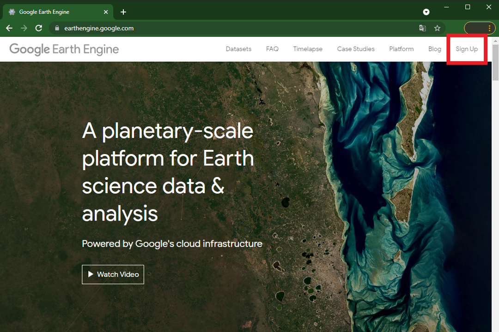
```

Luego se ingresan todos los datos que pide el formulario. Recordar que para utilizar GEE se requiere de una cuenta de Google (Fig. 2.2).

:::: {.bluebox2 data-latex=""}
::: {.awesomeblock data-latex="{5pt}{\faLightbulb}{darkblue}"}
Se recomienda usar una cuenta de Google que tenga suficiente espacio disponible en Google Drive, ya que será la forma más fácil de exportar los resultados generados en GEE.
:::
::::

```{r, echo = F, out.width="60%", fig.cap="Formulario de datos a llenar para registrarse en GEE."}
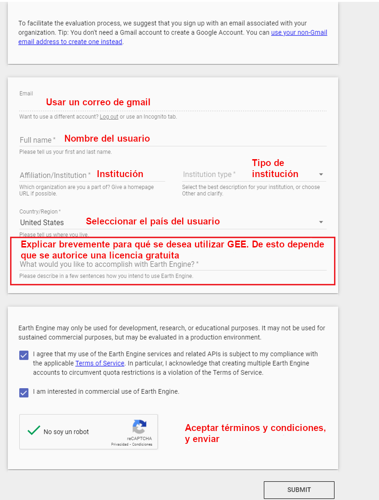
```

Una vez realizado el registro, hay que esperar un tiempo (puede ser desde minutos a días) hasta que llegue una confirmación por parte de GEE a nuestro correo informando que ya se puede hacer uso de la API (Fig. 2.3).

```{r, echo = F, out.width="60%", fig.cap="Ejemplo de correo de confirmación por parte de GEE para poder utilizar la API."}
knitr::include_graphics("Img/correo.png")
```

Una vez que tengamos dicha confirmación, podemos acceder a la API a través del siguiente enlace:

**https://code.earthengine.google.com/**

y se accede con la cuenta de Google con la que nos registramos.

Una vez registrados, se podrá acceder al material de todos los ejercicios entrando al siguiente enlace: https://code.earthengine.google.com/?accept_repo=users/JonathanVSV/GEE_manual 

## Elementos básicos de la interfaz gráfica

Una vez abierta la Javascript API, se observan cuatro pantallas (Fig. 2.4): la pantalla de repositorios, la pantalla de rutinas, la pantalla de mapa y la pantalla de control.

```{r, echo = F, out.width="100%", fig.cap="Vistazo inicial de la API de GEE."}
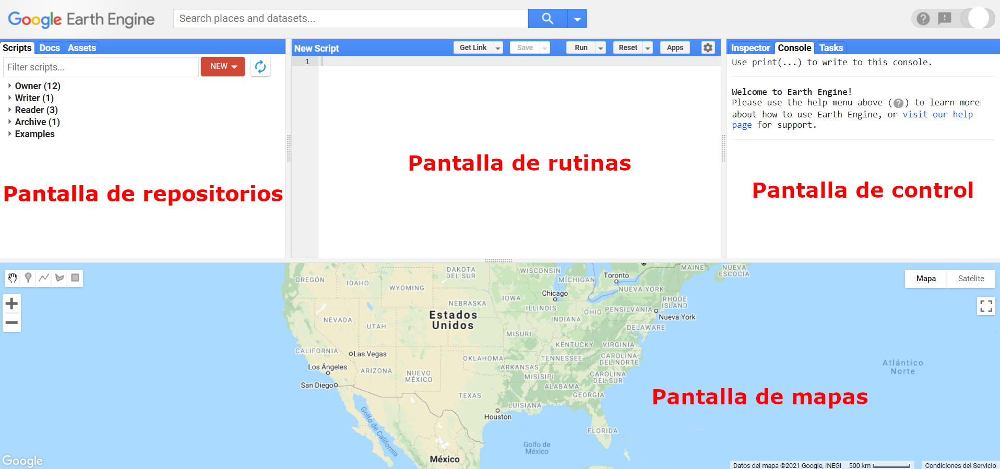
```

Los elementos de la API se enlistan a continuación:

**Scripts**

La pantalla de repositorioes es el espacio donde se guardan y ordenan las rutinas o scripts (en inglés) del usuario. En ella se pueden crear repositorios y carpetas para organizar los archivos de código, como se muestra a continuación (Fig. 2.5):

```{r, echo = F, out.width="80%", fig.cap="Opciones disponibles dentro de la pestaña de Nuevo."}
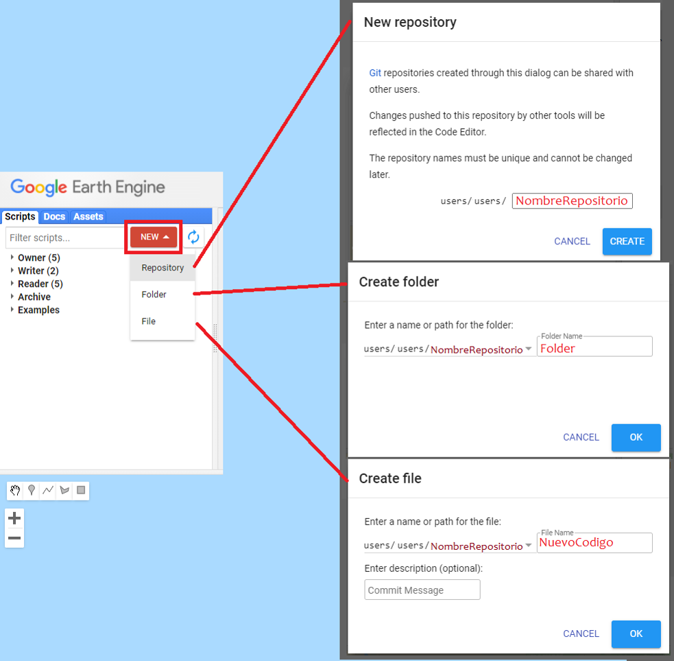
```

Dentro de este espacio existen varias categorías. Las primeras tres se pueden utilizar para determinar distintos niveles de acceso para diversos usuarios (Fig. 2.6):

1. **Owner** (Propietario): en esta sección se guardan los códigos creados por el mismo usuario. 
2. **Writer** (Editor): en este apartado se guardan códigos que pueden ser creados por otros usuarios, pero para los cuales tenemos autorización de modificarlos.
3. **Reader** (Lector): en esta parte aparecen códigos que otros usuarios nos han compartido, pero que no tenemos autorización de modificarlos.
4. **Examples** (Ejemplos): se pueden consultar ejemplos de código para hacer algunas tareas específicas. Por ejemplo, existe un apartado específico para consultar las distintas maneras de enmascarar nubes utilizando diferentes colecciones de imágenes (por ejemplo: Landsat 4-7, Landsat 8, Sentinel-2, MODIS). 
5. **Archive** (Archivo): se pueden guardar archivos de código que ya no se utilicen, pero que no se desean eliminar.

```{r, echo = F, out.width="40%", fig.cap="Vista del panel de repositorios dentro de GEE."}
knitr::include_graphics("Img/left_panel.png")
```

:::: {.bluebox2 data-latex=""}
::: {.awesomeblock data-latex="{5pt}{\faLightbulb}{darkblue}"}
El usuario puede compartir repositorios con otros usuarios de GEE como lector o editor. De esta manera, todos los archivos que se encuentren dentro de un repositorio serán compartidos con los usuarios indicados. Esta opción está disponible al darle clic en el símbolo del engranaje a la derecha de cada repositorio (aparece una vez que se coloca el puntero sobre el nombre del repositorio; Fig. 2.7). 
:::
::::

```{r, echo = F, out.width="40%", fig.cap="Vista del espacio de propietario."}
knitr::include_graphics("Img/engranaje.png")
```

**Docs**

Es un área donde se pueden consultar todos los métodos y algoritmos que se encuentran preprogramados y cargados en GEE (Fig. 2.8). Además, para cada método se indica lo que hace, la entrada que requiere y el tipo de objeto que se obtiene como salida, así como los argumentos del método (Fig. 2.9). Estos métodos se encuentran agrupados por objetos del servidor (los objetos se explican más adelante). Adicionalmente, tiene un buscador donde también se pueden consultar los métodos.

```{r, echo = F, out.width="40%", fig.cap="Ejemplo de la pestaña de documentación dentro de GEE."}
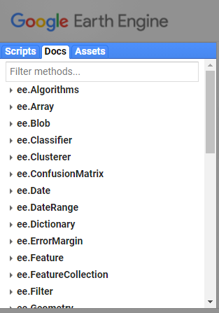
```

```{r, echo = F, out.width="40%", fig.cap="Ejemplo de consulta de un método dentro de la sección de documentación."}
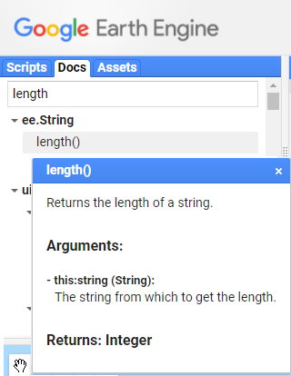
```

**Assets**

La primera vez que se accede a la pestaña de Assets hay que crear una carpeta principal ("Home Folder") para almacenar la información que se desee importar a GEE. Se recomienda nombrar esta carpeta con el mismo nombre de usuario (Fig. 2.10).

```{r, echo = F, out.width="60%", fig.cap="Folder de inicio dentro de la API."}
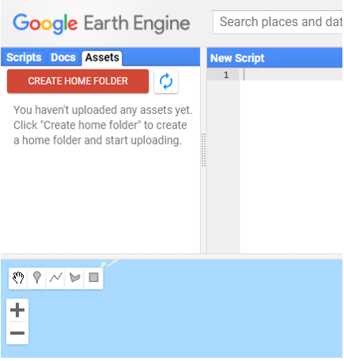
```

En este apartado el usuario puede subir y guardar su propia información para ser utilizada dentro de GEE (Fig. 2.11). Se pueden subir archivos en formato ráster, vector (.shp con sus archivos auxiliares, o un .zip) o separado por comas, únicamente (Fig. 2.12).

```{r, echo = F, out.width="40%", fig.cap="Vistazo de la sección de información del usuario."}
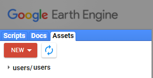
```

```{r, echo = F, out.width="100%", fig.cap="Ejemplos de pantallas para subir diferentes tipos de datos a GEE."}
knitr::include_graphics("Img/newAssets.png")
```

**Pantalla de rutinas**

Esta ventana es donde se va a escribir el código en JavaScript (Fig. 2.13). En la parte superior de esta pantalla se encuentran varios botones. El primero, `Get link` sirve para compartir el código que se tenga abierto mediante una liga. Además, al darle clic en la flecha de despliegue (en la opcion `Manage Links`) se puede hacer un manejo de las ligas que se tengan activas, así como borrar ligas que ya no se utilicen (Fig. 2.14).

```{r, echo = F, out.width="50%", fig.cap="Vistazo de la pantalla de rutinas o scripts."}
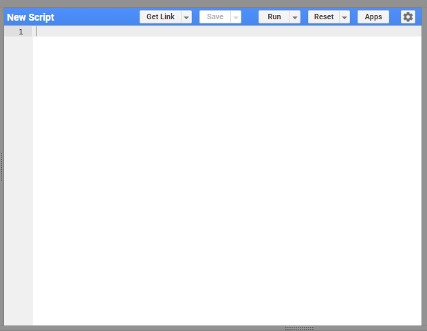
```

```{r, echo = F, out.width="30%", fig.cap="Ubicación del botón para obtener enlaces para compartir rutinas."}
knitr::include_graphics("Img/links.png")
```

A su derecha se encuentra el botón de `Save` el cual permite guardar el código con el que se esté trabajando (Fig. 2.15). Además, al darle clic en la flecha de despliegue se puede usar la opción `Save` as para crear una copia del código con otro nombre.

```{r, echo = F, out.width="30%", fig.cap="Ubicación del botón para guardar el código."}
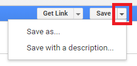
```

A continuación está el botón`Run` que sirve para correr el código que se muestra en la pantalla de rutinas, de principio a fin (Fig. 2.16). Al darle clic a este botón se envía el código a los servidores de Google y se realiza el procedimiento indicado.

```{r, echo = F, out.width="30%", fig.cap="Ubicación del botón para correr el código."}
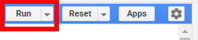
```

A su derecha se encuentra el botón de `Reset` el cual sirve para borrar todo el código que se tenga escrito en la pantalla de rutinas.

Después se encuentra el botón de `Apps` que sirve para crear aplicaciones a partir del código que se encuentra en la pantalla. La creación de aplicaciones no se cubrirá en este manual, pero se refiere a programas que permiten crear una interfaz amigable con un usuario que no tenga conocimientos de GEE. De esta manera, se puede facilitar el uso de un código programado sin necesidad de acceder directamente al código. Para consultar algunos ejemplos de aplicaciones construidas en GEE se puede visitar el siguiente enlace: https://www.earthengine.app/

Por último, en el botón del engranaje se encuentran opciones para prender y apagar líneas de código como subrayar sugerencias en la pantalla de rutinas o autocompletar símbolos como `’`, `"`, `(` y `{`.

:::: {.bluebox2 data-latex=""}
::: {.awesomeblock data-latex="{5pt}{\faLightbulb}{darkblue}"}
Cuando se corre un código en la consola con el botón de `Run`, este no corre directamente en los servidores de Google, sino que se transcriben a código GeoJSON, se envían a los servidores de Google y se espera una respuesta.
:::
::::

:::: {.bluebox2 data-latex=""}
::: {.awesomeblock data-latex="{5pt}{\faLightbulb}{darkblue}"}
Para buscar un texto específico dentro del código, se debe dar clic en la pantalla de rutinas y presionar ctrl+F (algunos atajos pueden variar según la configuración del teclado). Esta pantalla permite buscar una cadena de caracteres determinada dentro del código. Además, al volver a presionar ctrl+F, también se activa el recuadro de sustitución, el facilita el sustituir una cadena de caracteres determinada por otra. Para consultar el listado completo de atajos se puede presionar ctrl+shift+H.
:::
::::

**Search**

Es una barra de búsqueda (Search) en la que se pueden buscar fuentes de datos o sitios (Fig. 2.17). Resulta útil para encontrar la ruta de alguna fuente de datos o una colección en particular, así como para consultar sus metadatos, bandas y características.

```{r, echo = F, out.width="80%", fig.cap="Vista de la barra de búsqueda."}
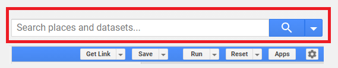
```

**Pantalla de Mapa**

En esta pantalla de mapas se puede (Fig. 2.18):

1. Dibujar y visualizar puntos, polígonos, líneas o rectángulos. 
2. Mostrar la información que se haya indicado mediante la función `Map.addLayer`.
3. Añadir un mapa base (Google maps o Google earth).

```{r, echo = F, out.width="80%", fig.cap="Vista de la pantalla de mapas, indicando las diferentes herramientas que se pueden utilizar en ella."}
knitr::include_graphics("Img/drawing.png")
```

**Gestor de capas**

El gestor de capas permite prender y apagar las capas que se estén mostrando en el área del mapa (Fig. 2.19). Además, sirve para modificar las características necesarias para su visualización (por ejemplo, transparencia, color, distribución del histograma, compuesto de color, etc). Este menú aparece una vez que se cargan capas a la pantalla de mapas.

```{r, echo = F, out.width="80%", fig.cap="Ejemplo del uso del administrador de capas."}
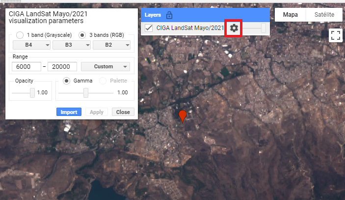
```

**Pantalla de control**

La pantalla de control contiene tres pestañas: consola (console), inspector (inspector) y de tareas (tasks). Esta pantalla le va a permitir al usuario hacer algunas consultas de la información con la que se está trabajando o finalizar tareas de exportación de información. A continuación se describe cada una de estas pestañas.

**Console**

La consola consiste en la pantalla de comunicación con el servidor (Fig. 2.20). En ella se muestran los errores que se obtienen al correr un código o se puede mostrar la información indicada por la función `print`.

```{r, echo = F, out.width="80%", fig.cap="Vista de la consola en GEE."}
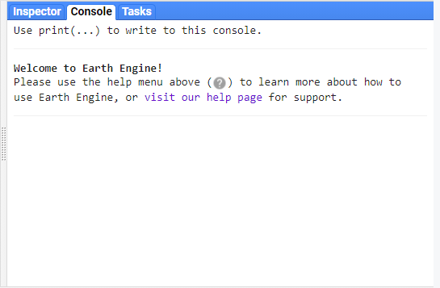
```

**Inspector**

Permite consultar los valores de las capas que se muestran en el mapa, al dar clic sobre el punto de interés (Fig. 2.21).

```{r, echo = F, out.width="80%", fig.cap="Vista de la pestaña de la herramienta de Inspector."}
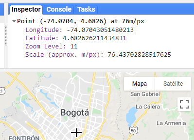
```

**Tasks**

En esta pestaña se muestran las tareas que se hayan exportado mediante la función `Export` y permite correr el trabajo de exportación al sitio donde el usuario le haya indicado (drive, assets; Fig. 2.22). Además, esta pestaña tiene otras funcionalidades:

1. Mostrar las tareas para ejecutar (con el botón de `Run`, el cual permite especificar detalles de la exportación).
2. Presentar las tareas en ejecución (color gris).
3. Señalar el tiempo demorado en el trabajo.
4. Indicar cuándo el trabajo se ha finalizado (color azul).
5. Cuando hay un error en algún objeto exportado, se verá el trabajo marcado en rojo, indicando el error. Por último, al dar clic sobre el signo de interrogación que aparece al colocar el cursor sobre algún trabajo, se puede obtener mayor información del trabajo como, por ejemplo, el error que arrojó el servidor al tratar de realizar una exportación o la ubicación del archivo exportado.

```{r, echo = F, out.width="80%", fig.cap="Vista de la pestaña de tareas dentro de GEE."}
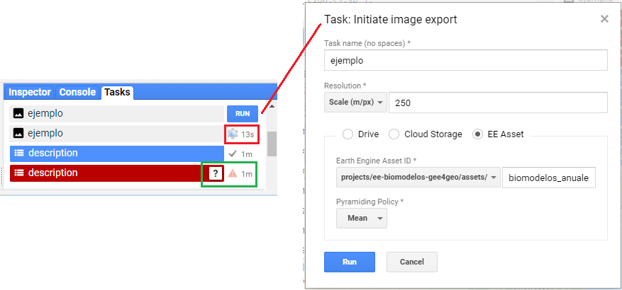
```

## Programación en GEE

La programación dentro de la API de GEE es una orientada a objetos, siguiendo la sintaxis del lenguaje de programación Javascript. Los objetos se pueden interpretar como contenedores de información sobre los cuales se van a aplicar diferentes funciones o métodos para crear nuevos objetos o sobreescribir objetos preexistentes.

### Simbología

*	`‘ ’` : comillas simples.
*	`“ ”` : comillas dobles.
* `[ ]` : corchetes.
*	`{ }` : llaves.
*	`( )` : paréntesis.
*	`-` : guion.
*	`_` : guion bajo.
*	`,` : coma.


### Lenguaje Javascript en GEE

La sintaxis de JavaScript tiene algunas peculiaridades que deben cumplirse para que se pueda correr el código sin problemas. Entre la sintaxis básica se pueden considerar los siguientes puntos (de igual forma iremos tocando la gramatica del código a lo largo de los ejemplos):

1.	Es un lenguaje sensible a las mayúsculas y minúsculas. De tal manera que puede haber dos objetos diferentes uno llamado `a` y otro diferente llamado `A`.
2.	Siempre se debe cerrar cualquier comando con un `;` (aunque de no hacerlo el código funcionará igualmente).
3.	Comúnmente en Javascript se utiliza el "lowerCamelCase" (unir palabras pero cada una comenzando con su respectiva mayúscula) para unir palabras, en lugar de guiones `-` o guión bajo `_`. Por ejemplo: `intervalMean` o `updateMask`.
4.	Todas las variables, funciones y objetos deben ser definidos mediante la función `var`.
5.	El operador `=`asigna un valor a una variable.
6.	Los operadores matemáticos son: `+ - * /`.
7.	Para concatenar dos cadenas de caracteres se utiliza el símbolo `+`.
8.	Para realizar comentarios se puede utilizar `//` para comentarios de una línea, o también `/* … */` para comentarios de varias líneas.
9.	Se suele utilizar el operador `.` (punto) para aplicar un método al objeto que lo precede. En este manual, todos los métodos aplicados a algún objeto se escribirán precedidos por el operador `.`  para evitar errores de sintaxis.
10.	Son igualmente válidas las comillas sencillas `''` como las comillas dobles `""`, pero no deben mezclarse ambos tipos de comillas en una misma línea.


:::: {.bluebox2 data-latex=""}
::: {.awesomeblock data-latex="{5pt}{\faLightbulb}{darkblue}"}
El término correcto para llamar a los procesos aplicados con el operador `.` es el de método ("method"), lo cual quiere decir que son procedimientos ligados a un tipo de objeto. Por ejemplo, en `ee.Image.updateMask`, el método `updateMask` es uno ligado a un objeto de tipo imagen (`ee.Image`). Por el contrario, las funciones en un sentido estricto se aplican a un objeto mediante la sintaxis: `function(objeto){}`. Distintos tipos de objetos tienen diferentes métodos ligados a ellos.
:::
::::
