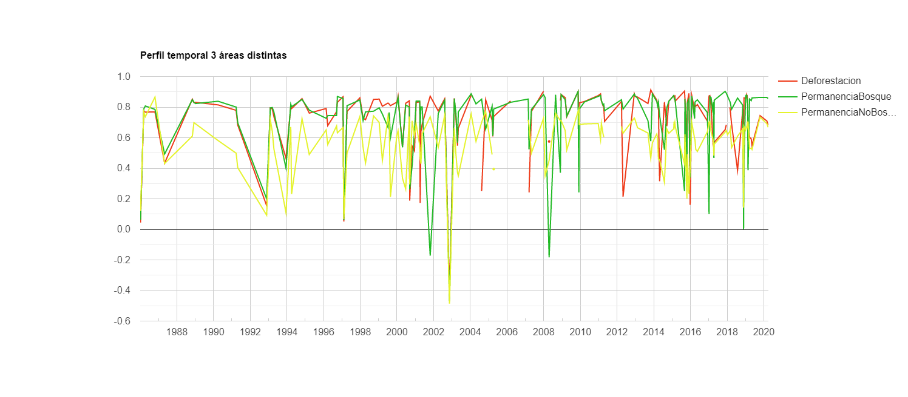

\newpage
# Interfaz de usuario

Dentro de GEE hay un grupo de funciones que permiten interactuar con los objetos y obtener información sobre sus características o propiedades. A este conjunto de funciones le llamaremos funciones de interfaz de usuario, ya que permiten obtener información sobre los objetos, visualizarlos o exportarlos para trabajar con ellos en un entorno distinto a GEE. Estas funciones resultan muy útiles para ayudar al usuario a entender los procesos que está programando, así como verificar que los procesos realicen la tarea deseada. Dentro de este grupo de funciones se distinguen cuatro grupos de funciones que se detallan en las siguientes secciones.

## Impresión en consola

La función más sencilla de la interfaz es la de imprimir objetos en la consola. Esto se realiza mediante la función `print` (imprimir). Al llamar esta función e indicar cualquier objeto como argumento, éste se evalúa y se imprime su estructura en la consola. Esta función permite obtener información básica de los objetos como el tipo de objeto, número de registros, características y propiedades de los elementos que lo conforman. Además, esta función resulta muy útil para rastrear errores de programación ("bugs") en los códigos. El resultado de la siguiente línea de código se puede apreciar en la Fig. 3.1.

```{js, echo = T}
print('Hola Mundo');
```

```{r, echo = F, out.width="40%",  fig.cap="Ejemplo del uso de la función print para imprimir en la consola"}
knitr::include_graphics("Img/holaMundo.png")
```

:::: {.bluebox2 data-latex=""}
::: {.awesomeblock data-latex="{5pt}{\faLightbulb}{darkblue}"}
Se recomienda utilizar varias impresiones en la consola (mediante `print`) por programa para verificar el resultado de procesos intermedios. 
:::
::::

## Interacción con la pantalla de mapas

Este grupo de funciones permiten agregar objetos del lado del servidor a la pantalla de mapas, así como controlar algunos parámetros de dicha pantalla. Todas las funciones encargadas del manejo de la pantalla de mapas se encuentran dentro de la biblioteca `Map`.

:::: {.bluebox2 data-latex=""}
::: {.awesomeblock data-latex="{5pt}{\faLightbulb}{darkblue}"}
Para revisar todas las funciones disponibles para la interfaz del usuario, ver la sección de **Code Editor**  en la siguiente liga: https://developers.google.com/earth-engine/apidocs. Además, en esta sección se indican los argumentos que acepta cada función, así como el tipo de objeto de la salida.
:::
::::

#### Map.addLayer {-}

`Map.addLayer` permite mostrar elementos en la pantalla de mapa de la API. Por lo tanto, permite mostrar objetos de tipo vector (`ee.Feature`) o imagen (`ee.Image`; estos objetos se presentan con mayor detalle más adelante). Los argumentos de la función `Map.addLayer` incluyen el objeto a añadir a la pantalla de mapas, seguido de un diccionario con información para el despliegue de la capa. Por último, se puede indicar el nombre de la capa con el que se desea mostrar la capa en la pantalla de mapas.

Al utilizar `Map.addLayer` sobre una imagen se pueden indicar los siguientes argumentos: `bands` (bandas), `min` y `max` (valores mínimos y máximos de para visualizar la información). Estos se deben pasar dentro de un par de llaves `{}` como un diccionario (ver Capítulo 5 para una descripción de lo que es un diccionario). Las bandas se deben agregar en el orden RGB, es decir, primero la banda que corresponde al canal rojo, seguida del verde y del azul. Esta función también permite asignar colores mediante el argumento de `palette` (paleta de colores). Dependiendo de las bandas que se elija mostrar se puede mostrar únicamente una banda en tonos de gris o un compuesto RGB. Por ejemplo, para cargar una imagen a la pantalla de mapas (Fig. 3.2):

```{js, echo = T}
Map.addLayer(image, {bands: ['B4', 'B3', 'B2'], 
                      min: 0, max: 2000}, 
                      'RGB');
```

```{r, echo = F, out.width="100%",  fig.cap="Ejemplo de visualización de un compuesto RGB de una imagen Landsat 8 sobre Laguna de Términos, México"}
knitr::include_graphics("Img/LTerminos.png")
```

:::: {.bluebox2 data-latex=""}
::: {.awesomeblock data-latex="{5pt}{\faLightbulb}{darkblue}"}
En algunas ocasiones, al intentar cargar objetos en la pantalla de mapas, que sean producto de procesamientos demandantes, la consola puede mostrar un error indicando que se superó el tiempo de espera o del límite de memoria disponible. En estos casos, se sugiere exportar el resultado, en lugar de tratar de cargarlo en la pantalla de mapas y después visualizarlo de manera local en algún SIG o software similar (por ejemplo, QGIS).
:::
::::

:::: {.bluebox2 data-latex=""}
::: {.awesomeblock data-latex="{5pt}{\faLightbulb}{darkblue}"}
La proyección por defecto para mostrar la información en la pantalla de mapas corresponde a EPSG:3857. Los códigos EPSG se pueden consultar en el siguiente enlace: https://epsg.io/. Dicha proyección únicamente se hace para poder visualizar la información, mas no transforma la información con la que el usuario trabaja.
:::
::::

Para el caso de los vectores (`ee.Feature`) se puede realizar una operación similar a las imágenes, aunque el único argumento válido es `color` (Fig. 3.3.):

```{js, echo = T}
Map.addLayer(feature, {color: 'FF0000'}, 'featuresColored');
```

```{r, echo = F, out.width="100%",  fig.cap="Ejemplo de visualización de un vector con los límites políticos de los países de Sudamérica donde se indica su color"}
knitr::include_graphics("Img/SAmerica.png")
```

:::: {.bluebox2 data-latex=""}
::: {.awesomeblock data-latex="{5pt}{\faLightbulb}{darkblue}"}
El código de los colores pasados al argumento de `palette` o `color` corresponden a códigos hexadecimales. El siguiente enlace puede ser útil para consultar los códigos decimales de distintos colores: https://htmlcolorcodes.com/es/
:::
::::

#### Map.centerObject {-}

Esta función permite centrar la pantalla de mapas en algún objeto o coordenada (longitud, latitud). Además, se puede indicar el zoom con el cual se quiere centrar el objeto.

```{js, echo = T}
Map.setCenter(-39.86, 20.52, 5)
```

## Creación de gráficos

Este grupo de funciones permiten realizar gráficos de diversos tipos. Sin embargo, cada tipo de gráfico contiene argumentos válidos diferentes. Todas estas funciones se encuentran agrupadas dentro de la biblioteca `ui.Chart`. Los objetos básicos que permite graficar GEE son: vectores (`ee.Feature`), colecciones de vectores (`ee.FeatureCollection`), imágenes (`ee.Image`), colecciones de imágenes (`ee.ImageCollection`), arreglos (`ee.Array`) y listas (`ee.List`). Además, para indicar los colores a utilizar en el gráfico o el título del mismo se puede utilizar el método `.setOptions` sobre el objeto de tipo gráfico.

#### ui.Chart.feature {-}

Este conjunto de funciones permite obtener distintos tipos de gráficos a partir de un vector o una colección de vectores y mostrar su resultado al imprimirlos en la consola (mediante la función `print`). Algunas de las funciones disponibles son: 

* `ui.Chart.feature.byFeature`.
* `ui.Chart.feature.byProperty`.
* `ui.Chart.feature.groups`. 
* `ui.Chart.feature.histogram`.

Por ejemplo:

```{js, echo = T}
ui.Chart.feature.byProperty({
  // Indicar el vector o colección de atributos a partir del cual se 
  // va a hacer el gráfico
  feature: coleccionAtributos, 
  // La propiedad a colocar en el eje de las x
  xProperties: 'Clase',
})

```

#### ui.Chart.image {-}

Este conjunto de funciones permiten obtener distintos tipos de gráficos a partir de una imagen o colección de imágenes. Algunas de las funciones que se encuentran disponibles son: 

*	`ui.Chart.image.byClass`
*	`ui.Chart.image.byRegion`
*	`ui.Chart.image.doySeries`
*	`ui.Chart.image.histogram`
*	`ui.Chart.image.seriesByRegion`, entre otras.

Por ejemplo, para graficar una serie de tiempo a partir de una colección de imágenes se utiliza la función `ui.Chart.image.seriesByRegion`. Este tipo de gráficos permiten graficar las series de tiempo de algunas áreas determinadas utilizando una colección de imágenes (Fig. 3.4).

```{js, echo = T}
ui.Chart.image.seriesByRegion({
  // Definir la colección de imágenes a graficar
  imageCollection: coleccionImagenes, 
  // Definir las regiones sobre las cuales se va a extraer la
  // información para el gráfico
  regions: areas.filter(ee.Filter.eq('Tipo','Bosque')),
  // El reductor a utilizar para resumir la información de la
  // colección de imágenes en las regiones indicadas
  reducer: ee.Reducer.mean(), 
  // La banda sobre la cual se quiere construir el gráfico
  band: 'NDVI', 
  // Tamaño en m del píxel para obtener la información
  scale: 30, 
  // Propiedad para nombrar a cada serie
  seriesProperty: 'Tipo'
})
  .setOptions({
    title: 'Bosque',
    colors: ['#EE3A19']
  });
```

```{r, echo = F, out.width="100%",  fig.cap="Ejemplo de un gráfico que muestra los perfiles temporales de un índice de vegetación (NDVI) en tres tipos de áreas: deforestación, permanenecia de bosque y permanencia de no bosque."}

```

:::: {.bluebox2 data-latex=""}
::: {.awesomeblock data-latex="{5pt}{\faLightbulb}{darkblue}"}
El nombre de las funciones para generar gráficos en GEE dan una idea del tipo de gráfica que se puede generar con dicha función y el tipo de insumos que requiere cada tipo de gráfico.
:::
::::
                                              
## Exportación de objetos fuera de GEE

Este grupo de funciones permiten exportar algún resultado fuera de GEE para ser manejado en otro programa. Todas estas funciones se encuentran dentro de la biblioteca `Export.` Sin embargo, sólo existen cuatro formatos válidos para exportar desde GEE: ráster (`ee.Image`), vector (`ee.FeatureCollection`), mapa y vídeo.

#### Export.image {-}

En el caso de las imágenes (ráster, `ee.Image`), la función para exportarlas es `Export.image`. Dentro de GEE hay tres opciones para exportar los resultados de una imagen: 

*	`Export.image.toAsset`
*	`Export.image.toDrive` 
*	`Export.image.toCloudStorage`

El primero permite exportar la imagen (ráster) a la sección de Assets, es decir, la sección donde el usuario puede subir su información a GEE. Esta opción es útil para cuando el resultado se va a utilizar en otro procedimiento de GEE. La segunda opción permite exportarlo al Google Drive de la cuenta con la que se tiene acceso a GEE. Esta opción es útil para trabajar con las imágenes (rásters) en algún entorno local, como algún SIG. La última opción permite exportar la imagen al Google Cloud Storage para utilizarla en algún otro proceso a realizar en Google Cloud Platform. La opción que creemos es más común para cualquier usuario será la de `Export.image.toDrive`. Para exportar información de GEE al Google Drive, se recomienda utilizar distintas carpetas para organizar la información. El nombre de la carpeta se define en el argumento de `folder`.

:::: {.bluebox2 data-latex=""}
::: {.awesomeblock data-latex="{5pt}{\faLightbulb}{darkblue}"}
Sólo se pueden exportar imágenes en formato `ee.Image`. Sin embargo, no siempre resulta obvio el formato de las imágenes, ya que algunas veces se pueden convertir a un formato de arreglo (`ee.Array`), tras lo cual hay que volver a convertir la información a formato de imagen (`ee.Image`) para poder exportarla. La aplicación permite exportar únicamente en formato GeoTiff o TRFrecord (tensores), siendo la primera la opción por defecto.
:::
::::

Un ejemplo de cómo exportar una imagen se presenta a continuación. 

```{js echo = T}
Export.image.toDrive({
  // Definir la imagen a exportar
  image: imgDiff,
  // Especificar el nombre con el cual se va a guardar la imagen en
  // el Google Drive
  description: 'DiferenciaNDVI_2016-2017',
  // Determinar el tamaño del píxel en m de la imagen a exportar
  scale: 30,
  // Exportar la imagen en formato GeoTIFF
  fileFormat: 'GeoTIFF',
  // Definir la carpeta del Google Drive en la que se va a exportar
  // la imagen
  folder: 'DiferenciaNDVIL8'
}); 
```

:::: {.bluebox2 data-latex=""}
::: {.awesomeblock data-latex="{5pt}{\faLightbulb}{darkblue}"}
En GEE muchas operaciones utilizan el término de `scale`, sin embargo, este no se refiere a la escala de trabajo en un sentido tradicional (por ejemplo, 1:50000), sino que se refiere al tamaño de píxel expresado en metros.
:::
::::

:::: {.bluebox2 data-latex=""}
::: {.awesomeblock data-latex="{5pt}{\faLightbulb}{darkblue}"}
En algunas ocasiones, al intentar exportar una imagen muy grande (mayor a 10 000 000 de píxeles), la consola puede mostrar un error indicando que el objeto a exportar tiene un número muy alto de píxeles. En este caso, se debe aumentar el número de píxeles máximo permitido para la exportación. Esto se logra indicando el argumento `maxPixels` dentro del diccionario que se pasa a `Export.image.toDrive`. Por ejemplo, `maxPixels: 1e10`, lo cual permite exportar una imagen con hasta 1 x 10^10 píxeles.
:::
::::

#### Export.table {-}

Por su parte, el formato vector (`ee.Feature`) permite exportar información vector y tablas sin información geográfica. De nuevo, para poder exportar en el formato vector, el objeto exportado debe estar en formato colección de vectores (`ee.FeatureCollection`). Al igual que en el caso de las imágenes, dentro de GEE hay 3 opciones para exportar objetos de tipo vector: 

*	`Export.table.toAsset`.
*	`Export.table.toDrive`.
*	`Export.table.toCloudStorage`. 

Para el caso de las tablas, sin información geográfica asociada, se debe definir el objeto como un objeto vector sin geometría (es decir, `null`) y en la tabla de atributos anexar la información deseada. Un ejemplo del uso de esta función se presenta a continuación:

```{js echo = T}
Export.table.toDrive({
  // Definir la colección de vectores a exportar
  collection: feature,
  // Especificar el nombre con el que se va a guardar el 
  // archivo en el Google Drive
  description: 'nombreArchivo',
  // Determinar la carpeta dentro de Google Drive donde
  // se va a guardar el archivo
  folder: 'mifolder',
  // Exportar la información en formato csv (valores 
  // delimitados por comas)
  fileFormat: 'CSV'
});
```

:::: {.bluebox2 data-latex=""}
::: {.awesomeblock data-latex="{5pt}{\faLightbulb}{darkblue}"}
GEE permite exportar información en formato vector sólo en formato CSV, GeoJSON, KML, KMZ, SHP, o TFRecord. El primer formato es el formato predeterminado. 
:::
::::

#### Export.video {-}

Esta opción permite exportar una colección de imágenes como vídeo ya sea al almacenamiento de la nube de Google o al Drive.

*	`Export.video.toCloudStorage`.
*	`Export.video.toDrive`.

Esta función puede resultar atractiva para observar los cambios de un área de interés, a través del tiempo. A continuación se muestra cómo exportar una colección de imágenes en vídeo:

```{js echo = T}
Export.video.toDrive({
  // Definir la colección de imágenes a exportar
  collection: coleccionImgs,
  // Especificar el nombre con el que se va a guardar el vídeo
  // en el Google Drive
  description: 'videoTimelapse',
  // Definir la carpeta donde se va a exportar el vídeo
  folder: 'mifolder',
  // Determinar el número de cuadros por segundo
  framesPerSecond: 24
 });
```
