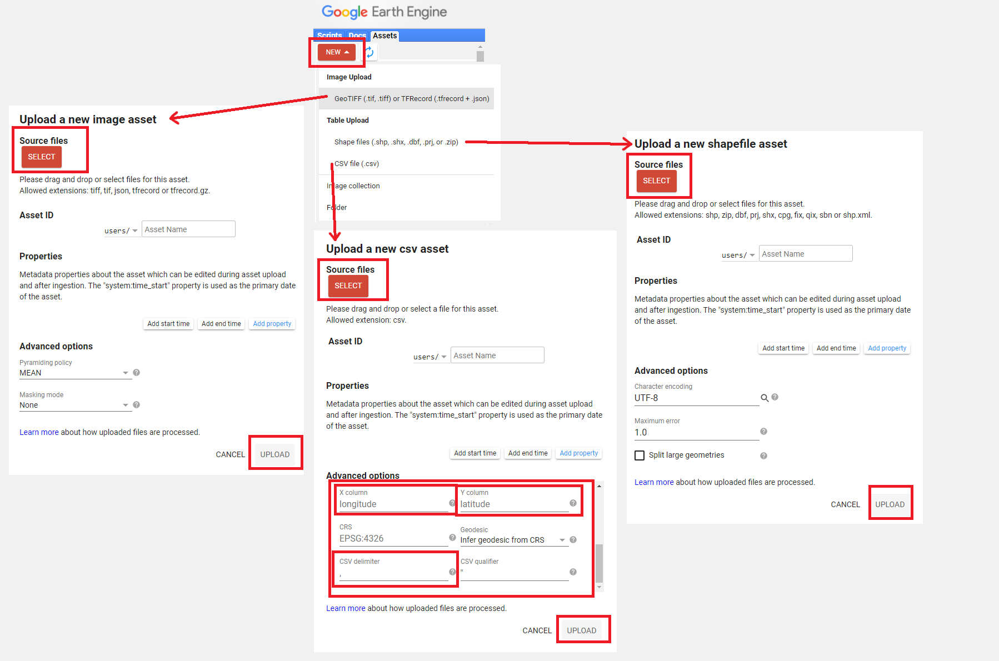
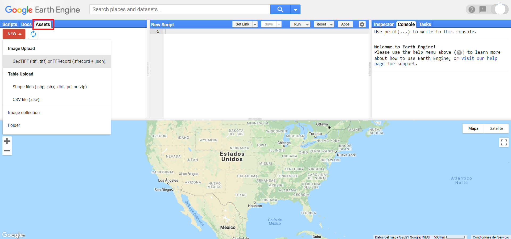
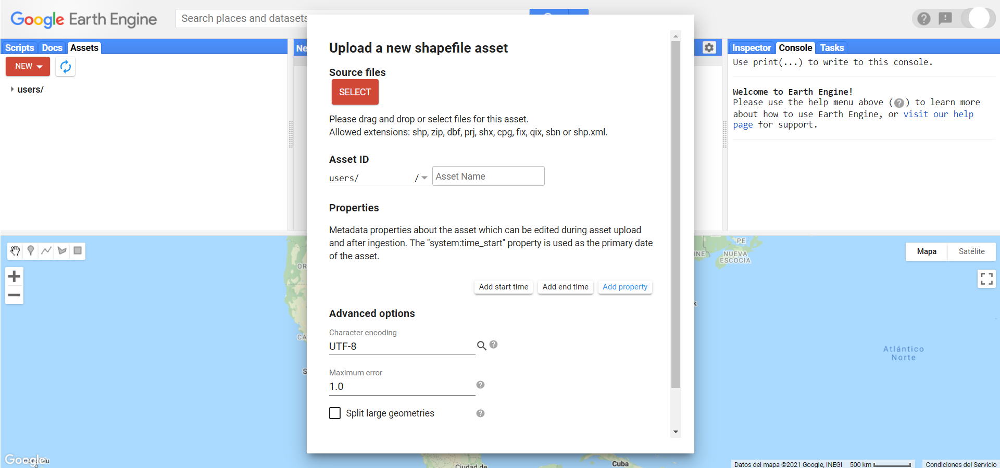
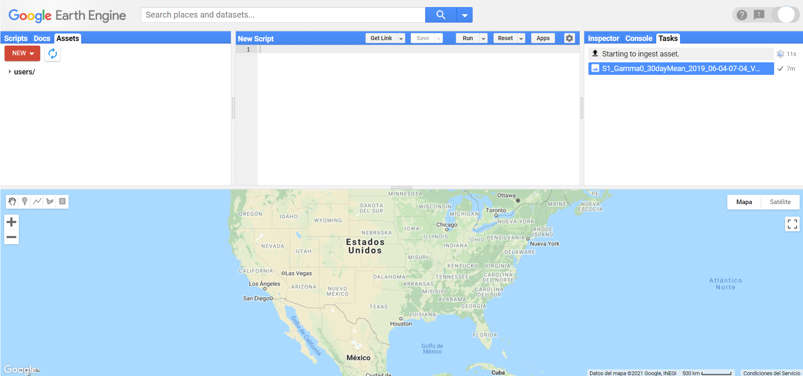
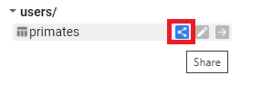
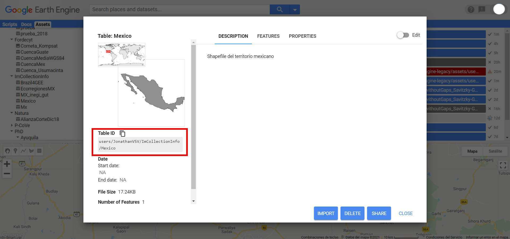
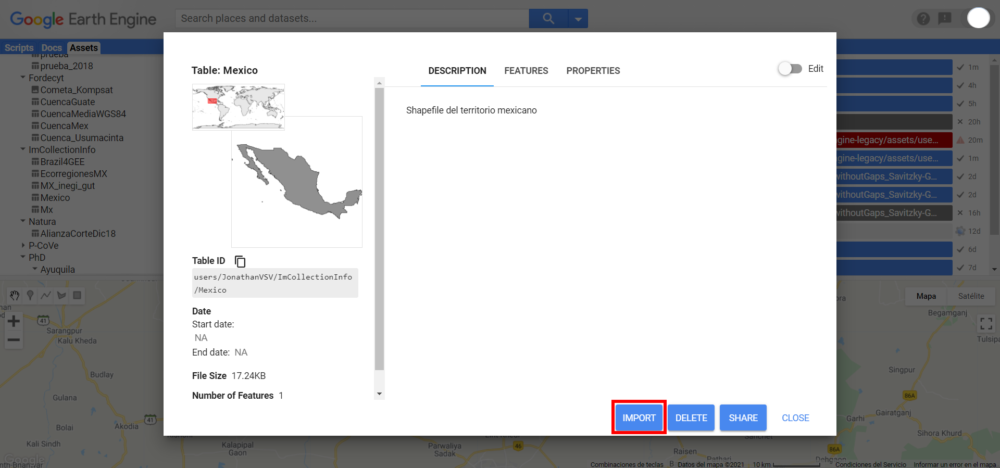

\newpage
# Importación de información a GEE

En la sección de **Assets** se pueden importar varios tipos de archivos a GEE para utilizarlos en la API: imágenes (GeoTIFF o TFRecord), archivos vector (shapefiles), archivos separados por comas (csv), colecciones de imágenes exportadas por el mismo GEE y carpetas (*folders*; `r colorize("Fig.")` \@ref(fig:f41)). Para importar cualquiera de estos tipos de archivos simplemente se tiene que ingresar a la pestaña de **Assets** en el panel izquierdo y después dar clic en **New** (nuevo) e indicar el archivo que se quiere importar a GEE (`r colorize("Fig.")` \@ref(fig:f42)).

```{r f41, echo = F, out.width="95%", fig.cap="Opciones disponibles para importar datos en GEE."}

```

```{r f42, echo = F, out.width="95%", fig.cap="Ubicación de la pestaña de importación de datos a GEE."}

```

Posteriormente se da clic en **Select** y se seleccionan los archivos que se quieren subir (`r colorize("Fig.")` \@ref(fig:f43)). Directamente en esta ventana se pueden agregar algunos campos a la información. Por último, se da clic en **Upload** (ubicado en la esquina inferior derecha de esta ventana) para subir los archivos a la cuenta de GEE (ocupando espacio en Google Drive). Recuerde que para archivos shapefile solo se aceptan archivos con las extensiones shp, zip, dbf, prj, shx, cpg, fix, qix, sbn o shp.xml.

```{r f43, echo = F, out.width="95%", fig.cap="Vista de la ventana de importación de datos."}

```

:::: {.bluebox2 data-latex=""}
::: {.awesomeblock data-latex="{5pt}{\faLightbulb}{darkblue}"}
Si se agrega algún otro archivo que tenga una extensión distinta a las aceptadas (shp, zip, dbf, prj, shx, cpg, fix, qix, sbn o shp.xml) la consola va a arrojar un error. En este caso hay que evitar seleccionar el archivo con la extensión que está provocando el error (por ejemplo, sbx).
:::
::::

Tras haber dado clic en **Upload**, el progreso en la subida del archivo a GEE se puede consultar en la pestaña de **Tasks** (`r colorize("Fig.")` \@ref(fig:f44)). Una vez terminado, se puede tener acceso al archivo dentro de la pestaña de **Assets**. A veces no aparece el archivo recién importado, por lo cual se sugiere refrescar los elementos de esta sección presionando el botón que se encuentra a la derecha de **New**, que contiene un par de flechas formando un círculo.

```{r f44, echo = F, out.width="95%", fig.cap="Ejemplo de una importación en proceso."}

```

:::: {.bluebox2 data-latex=""}
::: {.awesomeblock data-latex="{5pt}{\faLightbulb}{darkblue}"}
Al igual que en la pestaña donde se organizan los repositorios y los códigos, en la pestaña de **Assets** se puede organizar la información en carpetas.
:::
::::

Para subir un nuevo archivo hay que dar clic en el botón **New**, seleccionar el tipo de archivo y seguir las instrucciones:

1. Para los archivos ráster, solo hace falta seleccionar el archivo correspondiente y dar clic en **Upload**.
2. Para los archivos tipo .shp es necesario subir los archivos auxiliares (dbf, prj, shx, cpg, fix, qix, sbn o shp.xml) con el mismo nombre. Para los archivos .zip es necesario que contengan los archivos auxiliares. 
3. Para los archivos .csv es necesario que exista una columna de longitud y otra de latitud, las coordenadas deben ser decimales y estar en EPSG:4326 (WGS 84). El nombre de esas columnas se debe indicar en **Advanced options** / X column (longitud) - Y column (latitud). Además, se debe tener absoluta claridad del tipo de delimitador (ejemplo: coma, punto y coma, u otro) y este debe ser especificado en **Advanced options** / CSV delimited.

:::: {.bluebox2 data-latex=""}
::: {.awesomeblock data-latex="{5pt}{\faLightbulb}{darkblue}"}
El usuario puede compartir sus archivos con otros usuarios de GEE como lector o editor. Esta opción está disponible al darle clic en el símbolo de compartir a la derecha de cada archivo (aparece una vez que se coloca el puntero sobre el nombre del archivo; `r colorize("Fig.")` \@ref(fig:f45)).
:::
::::

```{r f45, echo = F, out.width="50%", fig.cap="Ubicación del botón para compartir información importada en GEE."}

```

Por último, hay dos maneras de utilizar cualquier información importada a GEE, pero primero hay que darle clic a la información importada en la sección de **Assets**, tras lo cual aparecerá la siguiente ventana (`r colorize("Fig.")` \@ref(fig:f46)). 

```{r f46, echo = F, out.width="95%", fig.cap="Ejemplo de la ventana de información importada en GEE y ubicación de la ruta de la misma."}

```

La primera manera consiste en copiar la ruta de la información y utilizarla en cualquier código para definir un objeto (similar a lo que se hizo en ejercicios anteriores con información hospedada en la nube de GEE; `r colorize("Fig.")` \@ref(fig:f46)).

La segunda consiste en acceder al código en el que estamos interesados en utilizar la información, buscar la información que se desea importar en la pestaña de **Assets**, darle clic, y al aparecer la misma ventana que en el ejemplo anterior, darle clic en el botón de Import (`r colorize("Fig.")` \@ref(fig:f47)). De esa manera se importa la información en el código en el que se esté trabajando y se le asigna por defecto un nombre.

```{r f47, echo = F, out.width="95%", fig.cap="Ejemplo de la ventana de información importada en GEE y ubicación del botón para importarla a un código previamente abierto."}

```
