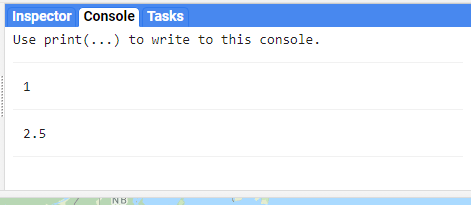
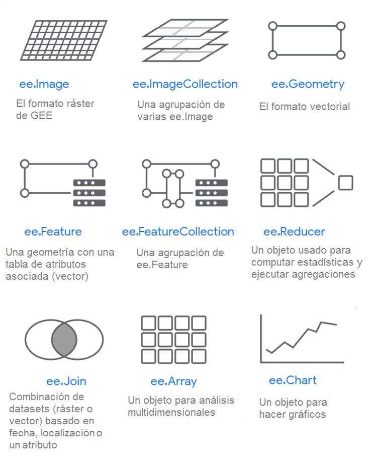

\newpage
# Tipos de objetos

Dentro de GEE existe una amplia diversidad de tipos de objetos, por ejemplo: objetos de tipo numérico, listas, cadenas de caracteres, entre otros. Sin embargo, esta variedad de objetos se puede agrupar en dos grandes rubros: objetos del lado del cliente y objetos del servidor, según el lado donde se va a llevar a cabo el procedimiento deseado.

## Objetos del cliente y del servidor

Existen dos lados de la programación de la API de GEE: el del servidor y el del cliente o usuario (`r colorize("Fig.")` \@ref(fig:f51)). Así, un objeto puede ser convertido entre los dos tipos. Por ejemplo, mientras que del lado del cliente una cadena de caracteres puede ser definida simplemente como: `'cadena'`, para convertirla en objeto del lado del servidor deben utilizarse las funciones del servidor, es decir: `ee.String('cadena')`. Adicionalmente, algunas operaciones se pueden hacer utilizando ambos tipos de sintaxis. Por ejemplo, una suma se puede realizar del lado del cliente mediante `1 + 2`, mientras que del lado del servidor se utilizará `ee.Number(1).add(ee.Number(2))`.

En la mayoría de los casos se va a utilizar la programación del lado del servidor, ya que es la que permite hacer todo el procesamiento en GEE. Por ejemplo, para el caso de las condiciones se sugiere utilizar en lugar de `if` y `else`, la función `r colorize2("ee.Algorithms.If")`. Sin embargo, cabe aclarar que algunas funciones solo funcionan del lado del cliente. Por ejemplo, las funciones de la interfaz del usuario, utilizadas para exportar la información a algún archivo `r colorize2("ee.Export")` (ya sea un ráster, un vector o una tabla), agregar una capa a la pantalla del mapa `r colorize2("Map.addLayer")` o crear gráficos, así como imprimir información en la consola `r colorize2("print")`. El siguiente diagrama permite visualizar el lado del usuario y del servidor en el funcionamiento de GEE.

```{r f51, echo = F, out.width="95%", fig.cap="Representación de los dos lados de programación en GEE: del cliente y el servidor."}
knitr::include_graphics("Img/daigFunc.png")
```

## Tipos de objetos del lado del cliente

### Cadenas de texto {-}

Se refiere a objetos de cadenas de símbolos de tipo alfanumérico. Estos se definen como cualquier cadena de caracteres (número, letras o símbolos) que se encuentren entre un par de comillas ya sean dobles `“ ”` o sencillas `’ ’`. Por ejemplo (`r colorize("Fig.")` \@ref(fig:f52)):

<!-- \index{Ejercicio 5.1} -->

<!-- ::: {.exercise} -->
`r colorize("Ejercicio 0")`

```{js ej1, echo = T}
// Cadena de texto de solo letras
var cadena = 'Esto es una cadena de caracteres';

// Cadena de texto de solo números
var telefono = '1234567890';  
                     
// Cadena de texto de letras, números y símbolos
var direccion = 'calle cuarta casa # 16';
```
<!-- ::: -->
\newpage
`r colorize("Ejercicio 0.1")`

```{js, echo = T}
// Cadena de texto concatenada
var direccion = direccion + ' su número telefónico es:' + telefono;
```

:::: {.bluebox2 data-latex=""}
::: {.awesomeblock data-latex="{5pt}{\faLightbulb}{darkblue}"}
Los números en una cadena de texto no serán interpretados como valores numéricos sino como texto.
:::
::::

```{r f52, echo = F, out.width="95%", fig.cap="Salida de la consola de objetos de tipo cadena de caracteres."}
knitr::include_graphics("Img/ej0.png")
```

### Números {-}

Se refiere a objetos numéricos que indican un valor. Para números decimales se utiliza el punto decimal y no la coma decimal. Por ejemplo (`r colorize("Fig.")` \@ref(fig:f53)):

`r colorize("Ejercicio 1")`

```{js, echo = T}
// Número entero
var numero = 1; 
 
// Número decimal con punto decimal  
var numero2 = 2.5;  
```
```{r f53, echo = F, out.width="95%", fig.cap="Salida de la consola de objetos de tipo número."}

```

:::: {.bluebox2 data-latex=""}
::: {.awesomeblock data-latex="{5pt}{\faLightbulb}{darkblue}"}
Para los objetos numéricos no se usan las comillas.
:::
::::

### Listas {-}

Las listas se refieren a objetos que contienen varias entradas, las cuales pueden ser numéricas (números), cadenas de texto (texto) o incluso otras listas. Las listas se definen mediante el uso de corchetes `[]` y cada entrada es separada mediante una coma `,` . Por ejemplo (`r colorize("Fig.")` \@ref(fig:f54)):

`r colorize("Ejercicio 2")`

```{js, echo = T}
// Lista numérica
var lista = [1, 2, 3, 4, 5, 6, 7, 8];   
  
// Lista de texto            
var listaA = ['primero', 'segundo', 'tercero']; 
   
// Lista de texto y números  
var listaB = ['primero', 'segundo', 'tercero', 4]; 

// Lista de listas  
var listaC = [lista, listaA, listaB]; 
```

Todas las listas automáticamente asignan, en orden, un número a cada elemento dentro de ellas, siempre empezando desde 0. Se puede consultar un solo elemento dentro de una lista, indicando el número de su posición dentro de ella. 
\newpage
`r colorize("Ejercicio 2.1")`

```{js, echo = T}
// Primer objeto de la lista llamada 'lista'
print(lista[0]); 

// Segundo objeto de la lista llamada 'listaA'
print(listaA[1]);

// Tercer objeto de la lista llamada 'listaB'
print(listaB[2]);

// Lista completa con todos sus elementos
print(listaC);    
```
```{r f54, echo = F, out.width="60%", fig.cap="Salida de la consola de varios objetos de tipo lista."}
knitr::include_graphics("Img/ej2.png")
```


### Diccionarios {-}

Los diccionarios son objetos que contienen claves (entradas) y valores asociados a estas claves (definiciones). Los diccionarios se crean mediante el uso de llaves `{}` donde se indica cada clave seguida de dos puntos `:` y su definición, ya sea un valor, cadena de caracteres o lista asociada a esa clave. Para ingresar varias entradas, estas deben ir separadas por una coma.

Las claves o entradas siempre serán leídas como cadenas de texto. Se recomienda que no haya espacios dentro de ellas, en su lugar se aconseja usar guion bajo (`_`) o la notación de *lowerCamelCase*. Al hacer `r colorize2("print")` se ordenarán alfabéticamente las claves (`r colorize("Fig.")` \@ref(fig:f55)).

`r colorize("Ejercicio 3")` 

```{js, echo = T}
// Se declara un nuevo diccionario.
// La primera entrada es el texto 'clave1' que está definido con el valor
// de 1 (tipo número) la segunda entrada es el texto 'clave2', y su 
// definición es la letra 'A' (tipo cadena de texto)
var dicc = {   
  clave1: 1,      
  clave2: 'A'  
};            
      
```

Hay dos formas de consultar los valores dentro de un diccionario (Fig. 5.5): 

  * Llamar directamente el nombre de la clave deseada dentro de  comillas en un par de corchetes `['']`.
  * Utilizar la notación de `.` seguida del nombre de la clave. 

Por ejemplo:

`r colorize("Ejercicio 3.1")`

```{js, echo = T}
// Notación de lista, se mostrará en la consola la definición de 
// 'clave1', es decir el valor 1 
print(dicc['clave1']); 

// Notación de lista, se mostrará en la consola la definición de 
// 'clave2', es decir la letra 'A'
print(dicc['clave2']);  

// Notación con punto, se mostrará en la consola la definición de 
// 'clave1', es decir el valor 1 
print(dicc.clave1);  

// Notación con punto, se mostrará en la consola la definición de 
// 'clave2', es decir la letra 'A'
print(dicc.clave2);  
```
```{r f55, echo = F, out.width="60%", fig.cap="Salida de la consola de varios objetos de tipo diccionario."}
knitr::include_graphics("Img/ej3.png")
```
:::: {.bluebox2 data-latex=""}
::: {.awesomeblock data-latex="{5pt}{\faLightbulb}{darkblue}"}
Para los diccionarios se recomienda utilizar la notación de `.` seguida del nombre de la clave, ya que es la recomendada por GEE.
:::
::::

### Funciones {-}
\index{function}
Se refiere a objetos que contienen algún proceso que se realizará a alguna variable. Siempre comienzan con la palabra `function` (función) seguida por el objeto al que se le aplicará la función. Este objeto debe escribirse entre paréntesis y entre llaves se coloca el procedimiento que va a realizar la función. Por último, debe regresar un objeto mediante la función `return`. Por ejemplo:

```{js, echo = T}
// MaskIm es una nueva función, y su argumento de entrada es objeto
var maskIm = function(objeto){ 
  // Se define qué objeto es una imagen ráster y se guarda en la 
  // variable image
  var image = ee.Image(objeto);
   
  // Se selecciona solamente la banda de nombre 'pixel_qa' de la imagen
  // image
  var qaImage = image.select('pixel_qa');
       
  // Se crea una nueva imagen binaria donde será 1 los píxeles con valor 
  // igual a 322, y 0 los demás
  var clearData = qaImage.eq(322);      
      
  // Se crea una máscara con la imagen binaria, y se entrega la imagen 
  // original enmascarada
  return image.updateMask(clearData);      
 };
```

Aunque las funciones son propiamente objetos del lado del cliente, deben contener únicamente métodos del lado del servidor para que funcionen apropiadamente al trabajar en GEE. Esto permite que GEE interprete cualquier serie de procesos de manera adecuada en sus servidores. Esto quedará más claro después de repasar la siguiente sección.

:::: {.bluebox2 data-latex=""}
::: {.awesomeblock data-latex="{5pt}{\faLightbulb}{darkblue}"}
Las funciones que se ejecuten sobre una colección de imágenes o vectores solo funcionan si regresan un objeto de tipo `r colorize2("ee.Feature")`, `r colorize2("ee.FeatureCollection")`, `r colorize2("ee.Image")` o `r colorize2("ee.ImageCollection")`, por lo cual, a veces, se deben realizar ciertas conversiones para evitar un error.
:::
::::

## Tipo de objetos del lado del servidor

Los objetos del lado del servidor, además de permitir llevar a cabo procesos en los servidores de GEE, tienen asociados una serie de métodos particulares por tipo de objeto. Esto quiere decir que al convertir un objeto del lado del cliente al del servidor, automáticamente se abre la posibilidad de utilizar los métodos precargados en GEE para ese tipo de objeto. Toda la información que se encuentra disponible en GEE corresponderá a objetos del servidor, entre los que destacan los objetos de tipo imagen (ráster), vector, colecciones de imágenes y colecciones de vectores. 

:::: {.bluebox2 data-latex=""}
::: {.awesomeblock data-latex="{5pt}{\faLightbulb}{darkblue}"}
Para saber cuáles objetos son del servidor, resulta útil recordar que todos ellos cuentan con el prefijo `ee.` (del servidor de Earth Engine) seguido del nombre del tipo de objeto con inicial mayúscula.
:::
::::

Los objetos del lado del servidor se pueden conceptualizar como contenedores que le indican al servidor qué tipo de objeto es el que se está enviando. Además, cuando se trabaja del lado del servidor, los objetos necesariamente son enviados al servidor para ser evaluados. A continuación se describen los tipos de objetos que más se usan (`r colorize("Fig.")` \@ref(fig:f56)).

:::: {.bluebox2 data-latex=""}
::: {.awesomeblock data-latex="{5pt}{\faLightbulb}{darkblue}"}
En algunos casos, los objetos que se obtienen a partir de ciertos métodos retornan un objeto de tipo indefinido (tipo objeto, `ee.Object`) como por ejemplo, al usar, en casos particulares, los métodos `r colorize2(".first")` o `r colorize2(".get")`, por lo cual se recomienda meter este objeto indefinido en un contenedor que indique el tipo de objeto del servidor. De no hacerlo, GEE mostrará un error `...is not a function`.
:::
::::

:::: {.bluebox2 data-latex=""}
::: {.awesomeblock data-latex="{5pt}{\faLightbulb}{darkblue}"}
Todos los métodos disponibles en GEE clasificados por tipo de objeto del servidor se pueden consultar en la sección de **Client libraries** en el siguiente enlace: https://developers.google.com/earth-engine/apidocs. En **Client libraries** se indican cuáles argumentos acepta cada método o función, así como el tipo de objeto de la salida.
:::
::::

(ref:foo) https://developers.google.com/earth-engine/guides/objects_methods_overview. 

```{r f56, echo = F, out.width="95%", fig.cap="Diagrama con algunos de los objetos del lado del servidor más utilizados en GEE. Tomado de (ref:foo)"}

```

### ee.String {-}
\index{ee.String}
Este tipo de objeto es equivalente a la cadena de texto pero del lado del servidor, ya que permite enviar un objeto como cadena de caracteres al servidor. Por ejemplo (`r colorize("Fig.")` \@ref(fig:f57)):

`r colorize("Ejercicio 4")`

```{js, echo = T}
// Esta es una cadena de texto del lado del cliente
var cadena2 = 'Esto es una cadena de caracteres';
// En este paso se convierte el texto del lado del cliente a un ee.String
// del lado del servidor
var cadenaServ = ee.String(cadena2);                         
```
```{r f57, echo = F, out.width="95%", fig.cap="Salida de la consola de un objeto de tipo cadena de caracteres del lado del servidor."}
knitr::include_graphics("Img/ej4.png")
```

### ee.Number {-}
\index{ee.Number}
Permite enviar un número como objeto al servidor. Por ejemplo (`r colorize("Fig.")` \@ref(fig:f58)):

`r colorize("Ejercicio 5")`

```{js, echo = T}
// Se define un número como ee.Number del servidor
var numServ = ee.Number(1900);                              
```
```{r f58, echo = F, out.width="95%", fig.cap="Salida de la consola de un objeto de tipo número del lado del servidor."}
knitr::include_graphics("Img/ej5.png")
```

### ee.List {-}
\index{ee.List}
Este tipo de objetos corresponden a listas del lado del servidor. Por ejemplo (`r colorize("Fig.")` \@ref(fig:f59)):

`r colorize("Ejercicio 6")`

```{js, echo = T}
// Se construye una nueva lista con diferentes tipos de objetos del lado 
// del usuario y servidor
var lista = ['hola','12','5%', ee.String('servidor'), ee.Number(64), 8.32];

// Se define una lista como ee.List del servidor 
var listaServ = ee.List(lista);             
```

Para acceder a un elemento de tipo `r colorize2("ee.List")` se utiliza el método `r colorize2(".get")` (`r colorize("Fig.")` \@ref(fig:f59)). 

`r colorize("Ejercicio 6.1")`

```{js, echo = T}
// Se llama solamente al primer objeto de la ee.List del servidor
print(listaServ.get(0));   

// Se llama solamente al segundo objeto de la ee.List del servidor
print(listaServ.get(1)); 
```
```{r f59, echo = F, out.width="70%", fig.cap="Salida de la consola de un objeto de tipo lista del lado del servidor."}
knitr::include_graphics("Img/ej6.png")
```

### ee.Dictionary {-}
\index{ee.Dictionary}
Permite enviar un objeto como diccionario al servidor. Por ejemplo (`r colorize("Fig.")` \@ref(fig:f510)).

`r colorize("Ejercicio 7")`

```{js, echo = T}
// Se construye un diccionario de usuario con diferentes tipos de objetos
// del lado del usuario y servidor
var dicc = {                                                 
  'texto de usuario':'usuario',
  'string del servidor': ee.String('texto de servidor # 2'),
  'numero de usuario': 4,
  'numero de servidor': ee.Number(3.1416),
  'lista de usuario': [1, 'ejemplo'],
  'lista de servidor': ee.List([ee.String('texto de servidor # 3'), 
    ee.Number(1.44)])
}; 

// Se define el diccionario de usuario anterior como ee.Dictionary del 
// servidor 
var diccServ = ee.Dictionary(dicc);     
```

Se puede consultar utilizando también el método `r colorize2(".get")` y el nombre de la clave (`r colorize("Fig.")` \@ref(fig:f510)). 

`r colorize("Ejercicio 7.1")`

```{js, echo = T}
// Se muestra el valor que contiene la clave 'lista_de_servidor'
print(diccServ.get('lista_de_servidor'));

// Se muestra el valor que contiene el elemento 'numero_de_usuario   
print(diccServ.get('numero_de_usuario'));        
```

Por último, si se desea obtener las claves disponibles en un `r colorize2("ee.Dictionary")` se utiliza el método `r colorize2(".keys")`. Este método devuelve una lista. De igual forma, si se desea obtener los valores disponibles en un `r colorize2("ee.Dictionary")` se utiliza el método `r colorize2(".values")`, el cual devuelve una lista (`r colorize("Fig.")` \@ref(fig:f510)).

`r colorize("Ejercicio 7.2")`

```{js, echo = T}
// Muestra una lista con todas las claves del ee.Dictionary
print('claves',diccServ.keys());    

// Muestra una lista con todos los valores del ee.Dictionary
print('valores',diccServ.values());  
```
```{r f510, echo = F, out.width="95%", fig.cap="Salida de la consola de varios objetos de tipo diccionario del lado del servidor."}

```

### ee.Date {-}
\index{ee.Date}
Esta es la forma en la que GEE trabaja con fechas. Hay varias formas de construir una fecha específica (`r colorize("Fig.")` \@ref(fig:f511)):

1.	Se puede usar un texto de usuario indicando la fecha en el siguiente formato: 'AAAA-MM-DD', esta fecha obligatoriamente debe:
    *	Usar la función `r colorize2("ee.Date")`.
    *	Indicar la fecha en el orden de Año Mes Día (AAAA-MM-DD).
    *	Usar guiones como separadores `-`.
    *	Tener meses numéricos de dos dígitos (01, 02, 03, 04, 05, 06, 07, 08, 09, 10, 11, 12).
    *	Tener días de dos dígitos (01, 02, 03 … 09, 10, 11 … 30).
    *	Estar entre comillas.
2.	Usar números de usuario, en este caso se debe:
    *	Usar el método  `r colorize2("ee.DatefromYMD")`.
    *	Ingresar dentro del paréntesis el año, el mes y el día (en ese orden), separados por comas.
3.	Usar un texto de usuario especificando el formato, para esto se debe:
    *	Usar el método `r colorize2("ee.Date.parse")`.
    *	Especificar el formato de la fecha con la siguiente clave (AAAA = año, MM = mes, D = día).
    *	Especificar el tipo de separador.
    *	Especificar el orden en el que se ingresará el texto.
    *	Especificar la cantidad de dígitos esperada para cada ítem (año, mes y día).
    *	El formato debe estar entre comillas.
    *	Luego de especificar el formato, se ingresa dentro de comillas el texto a convertir a `r colorize2("ee.Date")` (entre el formato y el texto debe ir una coma).

`r colorize("Ejercicio 8")`
```{js, echo = T}
// Fecha como un texto de cliente
var fechaString = '2001-10';

// Convierte la fecha de texto de cliente a ee.Date del servidor    
var fecha = ee.Date(fechaString);  

// Crea una ee.Date a partir de definir año, mes y día con números del 
// cliente           
var fecha2 = ee.Date.fromYMD(2015,03,28); 
   
// Crea una fecha a partir de un formato especificado y un texto que 
// cumple con dicho formato, nótese que se especifica el orden del día 
// año y mes, se especifica cada separador, y si se usan meses como texto
// deben ser las 3 primeras iniciales del mes en inglés
var fecha3 = ee.Date.parse('DD_YYYY/MMM', '14_1827/jul'); 
```
:::: {.bluebox2 data-latex=""}
::: {.awesomeblock data-latex="{5pt}{\faLightbulb}{darkblue}"}
Internamente los objetos ee.Date transforman el formato de fecha a formato UNIX (también llamado EPOCH o POSIX, que se define como la cantidad de segundos transcurridos desde la medianoche UTC del 1 de enero de 1970. Véase en la Fig. 5.11.
:::
::::
```{r f511, echo = F, out.width="95%", fig.cap="Salida de la consola de un objeto de tipo fecha del lado del servidor."}
knitr::include_graphics("Img/ej8.png")
```

### ee.Image {-}
\index{ee.Image}
La definición de objetos `r colorize2("ee.Image")` (imagen) habilita los métodos disponibles en GEE para el procesamiento de imágenes. Este va a ser el tipo de objetos para trabajar con cualquier elemento de tipo ráster en GEE. Más adelante se explica con mayor detalle.

### ee.ImageCollection {-}
\index{ee.ImageCollection}
Las colecciones de imágenes (*image collections*) están formadas por imágenes individuales (`r colorize2("ee.Image")`). Más adelante se explica este tipo de objetos con mayor detalle.

### ee.Feature {-}
\index{ee.Feature}
Este va a ser el tipo de objetos para trabajar con cualquier objeto de tipo vector o tabla. Más adelante se explica este tipo de objeto con mayor detalle.

### ee.FeatureCollection {-}
\index{ee.FeatureCollection}
Las colecciones de vectores (*feature collections*) están formadas por varios vectores (`r colorize2("ee.Feature")`). Más adelante se explican estos objetos con mayor detalle.

### ee.Algorithms {-}
\index{ee.Algorithms}
Este tipo de objetos contienen algoritmos precargados en GEE. Estos algoritmos tienen una gran variedad de aplicaciones, desde operaciones sencillas como una evaluación lógica, por ejemplo, `r colorize2("ee.Algorithms.If")`, hasta algoritmos de segmentación temporal de una serie de imágenes, por ejemplo, `r colorize2("ee.Algorithms.TemporalSegmentation.Ccdc")`.

### ee.Array {-}
\index{ee.Array}
Este tipo de objetos corresponden a arreglos multidimensionales, los cuales se pueden interpretar como matrices de más de dos dimensiones (por ejemplo, filas y columnas). Su uso más común se da en el análisis de series de tiempo o con ordenaciones espectrales. Este tipo de objetos cuentan con una serie de métodos, que se pueden consultar bajo la biblioteca de `r colorize2("ee.Array")` (ver liga anterior).

### ee.Classifier {-}
\index{ee.Classifier}
Este tipo de objetos corresponden a algoritmos de clasificación supervisada de datos que se encuentran precargados en GEE. Por ejemplo, se encuentra el algoritmo de random forest, disponible mediante la función `r colorize2("ee.Classifier.smileRandomForest")` o MaxEnt, disponible mediante la función `r colorize2("ee.Classifier.amnhMaxent")`, entre otros.

### ee.Clusterer {-}
\index{ee.Clusterer}
Este tipo de objetos corresponden a algoritmos de clasificación no supervisada de datos que se encuentran precargados en GEE. Por ejemplo, se encuentra el algoritmo de k-means, disponible mediante la función `r colorize2("ee.Clusterer.wekaKMeans")` o Cobweb, disponible mediante la función `r colorize2("ee.Clusterer.wekaCobweb")`.

### ee.Filter {-}
\index{ee.Filter}
Este tipo de objetos se utilizan para filtrar colecciones, ya sean de vectores o de imágenes. También permiten definir filtros de distintos tipos, ya sean espaciales, temporales o en función de características de las imágenes o vectores (por ejemplo, metadatos). Por último, contienen métodos para combinar filtros.

### ee.Geometry {-}
\index{ee.Geometry}
Este tipo de objetos corresponden a distintos tipos de geometrías, que incluyen líneas, polígonos y puntos. Además, en GEE se encuentran varios métodos precargados que se pueden aplicar a este tipo de objetos como, `r colorize2("ee.Geometry.MultiPolygon.Simplify")` para simplificar polígonos múltiples o `r colorize2("ee.Geometry.Polygon.area")` para calcular el área de un polígono, por ejemplo.

### ee.Join {-}
\index{ee.Join}
Este conjunto de métodos permite realizar uniones entre colecciones de vectores o imágenes, utilizando los campos de estos como las claves para realizar las uniones. Por ejemplo, se pueden unir dos colecciones de vectores mediante `r colorize2("ee.Join.merge")` o unir los campos de una primera colección con los de una segunda mediante `r colorize2("ee.Join.inner")`.

### ee.Reducer {-}
\index{ee.Reducer}
Los reductores permiten agregar datos basados en una regla o utilizando una operación matemática determinada. Este tipo de métodos son los utilizados para generar, por ejemplo, una sola imagen a partir de varias imágenes que comparten una misma extensión espacial. El tipo de reductor define el tipo de agregación que se desea aplicar, por ejemplo, se puede reducir con una sencilla estadística (mínimo, máximo, media, moda, mediana, etc.) o con reductores más complejos (histogramas, enlistar, regresión lineal). Las reducciones se pueden realizar sobre las bandas de las imágenes o los atributos de los vectores.

### ee.Terrain {-}
\index{ee.Terrain}
Este conjunto de métodos permite calcular algunas operaciones topográficas, a partir de un modelo digital de elevación (DEM). Por ejemplo, en GEE se encuentran los métodos `r colorize2("ee.Terrain.aspect")` para calcular el aspecto o `r colorize2("ee.Terrain.slope")` para calcular la pendiente.

:::: {.bluebox2 data-latex=""}
::: {.awesomeblock data-latex="{5pt}{\faLightbulb}{darkblue}"}
Los argumentos de cualquier método del servidor se pueden pasar de dos maneras: 1) siguiendo el orden por defecto de los argumentos del método y separando cada argumento por una coma, o 2) como un diccionario (dentro de llaves `{}`) indicando el nombre del argumento como la clave, seguido de dos puntos y el valor del argumento. En este último caso, también se separa cada argumento con una coma.
:::
::::
