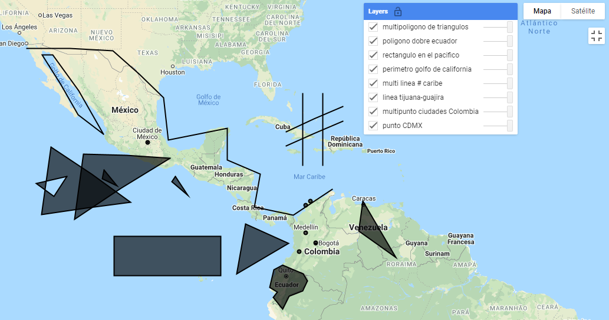
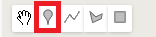
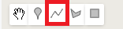
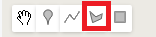
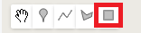
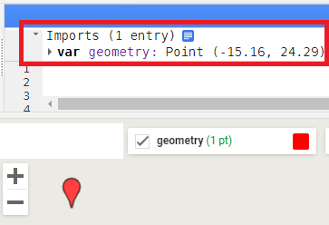
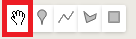
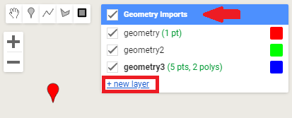
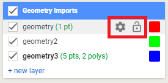
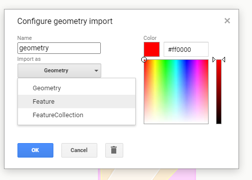

\newpage
# ee.Geometry

Las geometrías (`ee.Geometry`) son objetos que permiten leer y manejar formas geométricas asociadas a un sistema de coordenadas geográficas. En GEE existen diversos tipos de geometrías que incluyen punto, multipunto, línea, multilínea, perímetro, polígono y multipolígono. Las geometrías en GEE corresponden, por defecto, a geometrías geodésicas.

## Información y metadatos

La información que contienen los objetos de tipo geometría corresponden a puntos, líneas o polígonos definidos por una lista de coordenadas geográficas. Por lo tanto, dependiendo del tipo de geometría, se pueden consultar algunas características de estos como el área de un polígono mediante `.area`, el tipo de la geometría, mediante `.type` o las coordenadas mediante `.coordinates`. 

## Creación de geometrías

GEE utiliza el objeto `ee.Geometry` para leer y manejar formas geométricas, estas incluyen geometrías sin área, como son: 

*	Punto (`ee.Geometry.Point`): una coordenada en X & Y.
*	Multipunto (`ee.Geometry.MultiPoint`): una lista de puntos. 
*	Línea (`ee.Geometry.LineString`): una línea. 
*	Multilínea (`ee.Geometry.MultiLineString`): una lista de líneas. 
*	Perímetro (`ee.Geometry.línearRing`): un perímetro (una línea cerrada).

Ejercicio 9

```{js echo = T}
// Un punto definido con su coordenada  
var punto = ee.Geometry.Point(-99.14, 19.47); 

// Un MultiPunto definido a partir de una lista de coordenadas de puntos
var MultiPunto = ee.Geometry.MultiPoint([     
  -74.072, 4.754,                              
  -75.545, 6.285,                             
  -76.533, 3.461,
  -74.819, 10.997,
  -75.501, 10.393]);

// Una línea definida a partir de una lista de las coordenadas de sus 
// vértices
var linea = ee.Geometry.LineString([ 
  -117.08, 32.04,                    
  -104.25, 31.74,                    
  -96.69, 25.58,
  -95.99, 19.74,
  -87.2, 21.39,
  -87.2, 16.91,
  -82.28, 14.88,
  -83.15, 10.07,
  -77.35, 8.86,
  -71.55, 12.66]); 

// Una Multilínea definida a partir de una lista de líneas ee.LineString, 
// que a su vez están definidas por una lista de las coordenadas de
// sus vértices
var MultiLinea = ee.Geometry.MultiLineString([ 
   ee.Geometry.LineString(                     
     [-76.017, 26.173, -76.017, 16.173]),      
  ee.Geometry.LineString(                      
    [-73.017, 26.173, -73.017, 16.173]),       
  ee.Geometry.LineString(                      
    [-78.434, 20.926, -70.04, 24.401]),
  ee.Geometry.LineString(
    [-78.434, 18.926, -70.04, 22.401])]);

// Un perímetro definido a partir de una lista  de las coordenadas 
// de los vértices
var perimetro = ee.Geometry.LinearRing([ 
  -105.732, 20.627,                      
  -109.336, 26.544,                      
  -113.291, 31.274,
  -114.829, 31.274,
  -109.468, 23.317]);
```

También hay geometrías que tienen el componente de área, como son:

*	Rectángulo (`ee.Geometry.Rectangle`): un rectángulo.
*	Polígono (`ee.Geometry.Polygon`): un polígono.
*	Multipolígono (`ee.Geometry.MultiPolygon`): una lista de polígonos.

Ejercicio 9.1

```{js echo = T}
// Un rectángulo definido por las coordenadas de los vértices opuestos
var rectangulo = ee.Geometry.Rectangle( 
  -104.12, 5.73,
  -88.21, -0.15); 

// Un polígono definido por las coordenadas de sus vértices
var poligono = ee.Geometry.Polygon( 
  -80.348, -3.36,
  -80.348, -3.36,
  -78.985, -5.113,
  -78.019, -3.228,
  -75.997, -2.394,
  -75.25, -0.901,
  -75.865, 0.11,
  -78.941, 1.428,
  -80.26, 0.725,
  -80.919, -1.911,
  -79.776, -2.614
  );

// Un multipolígono definido por una lista de polígonos
var Multipoligono = ee.Geometry.MultiPolygon([
    // El primer polígono está definido a partir de dos perímetros
    ee.Geometry.Polygon(  
// El primer perímetro define el polígono                
      [ee.Geometry.LinearRing(-113.53, 18.81, -101.66, 10.83,-114.9, 8.93),    
      // El segundo perímetro define los huecos dentro del polígono
ee.Geometry.LinearRing(-111.15, 14.52, -113.09, 11.61, -115.7,13.58)]),
    // El segundo polígono es una lista de coordenadas que forman un 
    // triángulo
    [-95.77, 17.2,
     -108.7, 17.8,
     -110.0, 8.32],
    // El tercer polígono es una lista de coordenadas que forman un 
    // triángulo
    [-105.6, 15.5,                
     -105.9, 14.2,
     -103.7, 13.2],
    // El cuarto polígono es una lista de coordenadas que forman un 
    // triángulo
    [-94.98, 14.6,         
     -95.50, 13.8,
     -93.13, 11.8],
    // El quinto polígono es una lista de coordenadas que forman un 
    // triángulo
    [-84.52, 7.62,         
     -85.84, 0.17,
     -78.10, 4.74],
    // El sexto polígono es una lista de coordenadas que forman un 
    // triángulo
    [-67.03, 11.0,         
     -67.64, 6.49,
     -62.11, 2.63]]);
```
```{r, echo = F, out.width="30%", fig.cap="Resultado del ejercicio 9."}

```

Adicionalmente, se pueden crear geometrías directamente dibujando con el cursor en el mapa. Para ello se utilizan las herramientas de la esquina superior izquierda del panel del mapa (Fig. 6.1):

```{r, echo = F, out.width="30%", fig.cap="Herramienta de geometrías en la pantalla de mapa."}
knitr::include_graphics("Img/geometrias.png")
```
Para crear puntos (Fig. 6.2): 
```{r, echo = F, out.width="20%", fig.cap="Herramienta para crear puntos."}

```
Para crear líneas (Fig. 6.3): 
```{r, echo = F, out.width="20%", fig.cap="Herramienta para crear líneas."}

```
Para crear polígonos (Fig. 6.4): 
```{r, echo = F, out.width="20%", fig.cap="Herramienta para crear polígonos."}

```
Para crear rectángulos (Fig. 6.5): 
```{r, echo = F, out.width="20%", fig.cap="Herramienta para crear rectángulos."}

```

Todas las geometrías creadas con estas herramientas se importarán automáticamente al código y se podrán ver sobre las líneas del código (Fig. 6.6):

```{r, echo = F, out.width="50%", fig.cap="Visualización de la sección de Imports dentro de la pantalla de código."}

```

A estas se les puede cambiar el nombre dando clic en el nombre de la geometría importada.
Usando la mano se pueden mover y modificar las geometrías dibujadas (Fig. 6.7).

```{r, echo = F, out.width="20%", fig.cap="Herramienta para desplazarse en la pantalla de mapas."}

```

Todas las geometrías dibujadas se importarán como una sola colección, pero si se quiere tener geometrías separadas en diferentes colecciones se debe dar clic en `new layer`. Este menú aparecerá cuando se pase el cursor sobre la pestaña de geometrías dibujadas (Fig. 6.8).

```{r, echo = F, out.width="60%", fig.cap="Herramienta de geometrías en la pantalla de mapas."}

```

Pasando el cursor sobre cada una de las geometrías (en la pestaña de geometrías dibujadas) se podrá bloquear la capa para evitar modificaciones (con el candado), o cambiar la configuración (en el engranaje; Fig. 6.9).

```{r, echo = F, out.width="40%", fig.cap="Ubicación de las herramientas de candado y engranaje."}

```

Al dar clic en el engranaje se abrirá un menú donde se podrá cambiar el nombre de la geometría al escribir en la caja de texto nombrada "Name" (por defecto es 'geometry'), elegir el tipo de geometría en el recuadro de "Import as" (geometría `ee.Geometry`, vector `ee.Feature` o colección de vectores `ee.FeatureCollection`), cambiar el color de la geometría dibujada eliminar la geometría (al ingresar el código hexadecimal en la caja nombrada Color o al dar clic sobre un color del recuadro de colores) o añadir manualmente propiedades (al dar clic en el texto azul que dice "+ Property"; Fig. 6.10).

```{r, echo = F, out.width="80%", fig.cap="Ejemplo de modificación de las propiedades de las geometrías."}

```

:::: {.bluebox2 data-latex=""}
::: {.awesomeblock data-latex="{5pt}{\faLightbulb}{darkblue}"}
Recordar que las geometrías no pueden contener propiedades o atributos, así que la opción de agregar propiedades únicamente estará disponible para objetos de tipo vector (`ee.Feature`) o colecciones de vectores (`ee.FeatureCollection`)
:::
::::

## Métodos comunes

La mayoría de los métodos que se pueden utilizar sobre una geometría suelen ser los mismos que sobre vectores, así que dichos métodos sólo se describirán en la sección de vectores.
