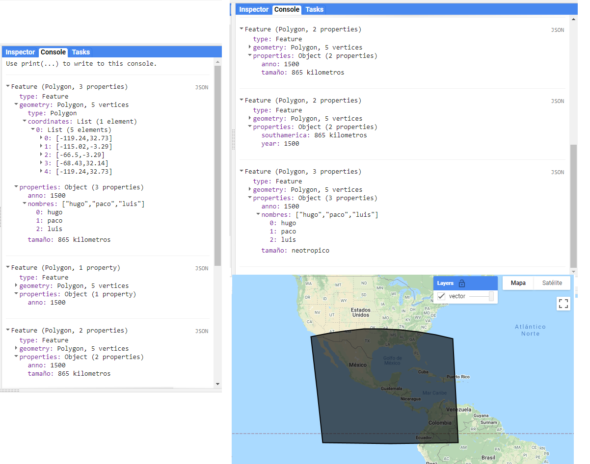
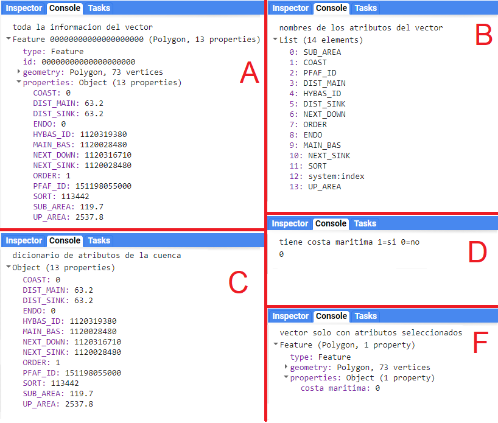

\newpage
# ee.Feature
\index{ee.Feature}
Los vectores (`r colorize2("ee.Feature")`) en GEE son los objetos predeterminados para leer información vectorial o de tablas.
Es importante recalcar que una `r colorize2("ee.Feature")` es un vector individual, de modo que solo puede contener una sola geometría (polígono, línea, punto, multipunto, multipolígono).

## Información y metadatos

Un vector estará compuesto por una geometría (punto, línea, polígono, multipolígono) y los atributos asociados a esa geometría (estos atributos son llamados propiedades y están almacenados en un diccionario; ver Olaya [2020] para una descripción más detallada de un vector). Para obtener información geométrica de los vectores se pueden utilizar los mismos métodos que un objeto `r colorize2("ee.Geometry")`, mientras que para conocer características de las propiedades se puede utilizar el método `r colorize2(".propertyNames")`.

## Visualización de vectores
\index{Map.addLayer}
Las geometrías y vectores pueden ser visualizados en el mapa de GEE. El aspecto predeterminado de los vectores presenta  líneas sólidas negras y un relleno semiopaco gris. Sin embargo, se puede especificar el color dentro de un diccionario en la función `r colorize2("Map.addLayer")`, como código hexadecimal.

:::: {.bluebox2 data-latex=""}
::: {.awesomeblock data-latex="{5pt}{\faLightbulb}{darkblue}"}
Los cambios de los parámetros de visualización de los vectores no pueden hacerse en las herramientas de capa del mapa, solo pueden hacerse desde el editor de código. Para consultar el código hexadecimal del color deseado se puede acceder al siguiente enlace: https://htmlcolorcodes.com/es/
:::
::::

```{js echo = T}
// Especificar el color de la capa 
Map.addLayer(vector , {}, 'capa por default');
Map.addLayer(vector, {color: '2AF116'}, 'capa color verde');
```

## Creación de vectores

Para crear un vector desde cero es necesario definir una geometría y opcionalmente un diccionario de propiedades (atributos) asociados a esa geometría. Por ejemplo (`r colorize("Fig.")` \@ref(fig:f71)):

`r colorize("Ejercicio 10")`

```{js echo = T}
// Crear un polígono
var poligono = ee.Geometry.Polygon([
  -119.24, 32.73,
  -115.02, -3.29,
  -66.5, -3.29,
  -68.43, 32.14
]);

// Crear un vector a partir del polígono y un diccionario de atributos.
var vector = ee.Feature(
  // Polígono del vector
  poligono,                      
  // Diccionario de atributos con 3 atributos
  {anno: 1500,                    
  tamaño: '865 kilometros',
  nombres:['hugo','paco','luis']});
```
  
## Métodos comunes

### Selección de propiedades {-}
\index{select}
Una vez revisados los nombres de las propiedades de un vector, se pueden seleccionar ciertos atributos mediante el método `r colorize2(".select")`. Para seleccionar una única propiedad solo se requiere indicar el nombre de esta (entre comillas dentro de una lista), mientras que si se desea seleccionar varias propiedades, estas deben indicarse dentro de una lista separadas por comas. 

Adicionalmente, se pueden renombrar las propiedades del vector. Para ello se inserta primero una lista que contenga las propiedades a las que se les desea cambiar el nombre, seguida de una segunda lista con los nuevos nombres. Por ejemplo (`r colorize("Fig.")` \@ref(fig:f71)):

`r colorize("Ejercicio 10")`

```{js echo = T}
print(vector.select(['anno']));
print(vector.select(['anno','tamaño']));
print(vector.select(['anno','tamaño'],['year','southamerica']));
```

### Adición de nuevas propiedades o modificación de propiedades preexistentes {-}
\index{set}
Usando el método `r colorize2(".set")` se pueden modificar las propiedades preexistentes o escribir nuevas propiedades sobre el vector. En este caso, primero se indica el nombre de la clave, seguido del valor correspondiente a la clave indicada. Por ejemplo (`r colorize("Fig.")` \@ref(fig:f71)):

`r colorize("Ejercicio 10.1")`

```{js echo = T}
var vector1 = vector.set('tamaño','neotropico');
```

```{r f71, echo = F, out.width="95%", fig.cap="Visualización del vector creado, así como las salidas de la consola que muestran la selección de algunas propiedades o adición de una propiedad."}

```

### Extracción y edición de propiedades de vectores {-}
\index{get}
\index{select}
\index{propertyNames}
\index{toDictionary}
En este ejercicio primero se selecciona un vector para ejemplificar el uso de algunos métodos de los objetos `r colorize2("ee.Feature")`. Para ello, se extrae el primer vector de una colección de vectores utilizando el método `r colorize2(".first")`. Este procedimiento se verá con mayor detalle en el siguiente capítulo, en los métodos de las colecciones de vectores. A continuación, se consultarán algunas propiedades y atributos del vector seleccionado (`r colorize("Fig.")` \@ref(fig:f72)). 

1.	Usamos el método `r colorize2(".propertyNames")` para obtener una lista de los nombres de los atributos del vector.
2.	Usamos el método `r colorize2(".toDictionary")` para generar un diccionario con todos los atributos (claves) y sus valores del vector.
3.	Usamos el método `r colorize2(".get")` para obtener el valor del atributo 'COAST' del vector.
4.	Usando el método `r colorize2(".select")` podemos seleccionar solamente una lista de atributos definidos, y si colocamos una segunda lista entonces los atributos de la primera lista serán renombrados con los nombres de la segunda.

`r colorize("Ejercicio 11")`

```{js echo = T}
// Llamamos una capa de cuencas de alta resolución de GEE
// y se selecciona el primer vector de la colección
var cuenca = ee.Feature(
  ee.FeatureCollection('WWF/HydroSHEDS/v1/Basins/hybas_12')
  .first());

// Extraemos los nombres de los atributos del vector como una lista
var propiedades = cuenca.propertyNames();

// Extraemos los atributos del vector como un diccionario
var atributos = cuenca.toDictionary();

// Extraemos el atributo 'COAST'
var costa = cuenca.get('COAST');

// Extraemos el atributo 'COAST' y lo renombramos como 'costa maritima'
var renombre = cuenca.select(['COAST'],['costa maritima']);
```
```{r f72, echo = F, out.width="95%", fig.cap="Salida de la consola de las propiedades del vector de cuenca, así como de la selección de algunas de sus propiedades."}

```

### Intersección con otros vectores {-}
\index{intersection}
Se pueden realizar cortes de un vector para quedarse con el área específica que intersecta otro vector utilizando el método `r colorize2(".intersection")`. Por ejemplo (`r colorize("Fig.")` \@ref(fig:f73)):

`r colorize("Ejercicio 12")`

```{js echo = T}
// Crear dos vectores rectangulares
var rectangulo1 = ee.Feature(ee.Geometry.Rectangle(-92.0,10.6,-82.0,20.7));
var rectangulo2 = ee.Feature(ee.Geometry.Rectangle(-86.03,15.6,-100.0,40.7));

// Intersección
var interseccion = rectangulo1.intersection(rectangulo2);
```

:::: {.bluebox2 data-latex=""}
::: {.awesomeblock data-latex="{5pt}{\faLightbulb}{darkblue}"}
Al realizar una intersección, el vector resultante heredará los atributos del vector al que se le aplicó dicho método (es decir, el objeto que queda del lado izquierdo del método `r colorize2(".intersection")`).
:::
::::

### Creación de un buffer {-}
\index{buffer}
Para realizar un buffer a partir de un vector se utiliza el método `r colorize2(".buffer")`, en el cual hay que indicar el valor en metros del tamaño del buffer y el error máximo aceptado (`r colorize("Fig.")` \@ref(fig:f73)).

`r colorize("Ejercicio 12.1")`

```{js echo = T}
// Crear un vector de un  punto
var punto = ee.Feature(ee.Geometry.Point(-105.24, -2.73));

// Calcular un buffer de 500 km alrededor del punto
var bufferPol = punto.buffer(500000, 0.1);
```

### Cálculo de área {-}
\index{area}
Para calcular el área de un vector se utiliza el método `r colorize2(".area")`. En este caso hay que definir el valor máximo de error aceptado. El área siempre se calcula en metros cuadrados (`r colorize("Fig.")` \@ref(fig:f73)).

`r colorize("Ejercicio 12.2")`

```{js echo = T}
// Calcular el área del buffer
var area = bufferPol.area(0.1);
```

### Cálculo de perímetro {-}
\index{perimeter}
Podemos calcular el perímetro de un vector usando el método `r colorize2(".perimeter")`, que hace el cálculo en metros (`r colorize("Fig.")` \@ref(fig:f73)).

`r colorize("Ejercicio 12.3")`

```{js echo = T}
// Calcular el perímetro del buffer
var perimetro = interseccion.perimeter();
```

### Disolución de polígonos {-}
\index{dissolve}
El método `r colorize2(".dissolve")` une todas las geometrías que se intersectan de un vector en un solo polígono y si no se intersectan, genera un multipolígono (`r colorize("Fig.")` \@ref(fig:f73)).

`r colorize("Ejercicio 12.4")`

```{js echo = T}
// Crear un vector de multipolígono
var multi = ee.Feature(ee.Geometry.MultiPolygon(
            [[[[-137, 20],
               [-128, 9],
               [-116, 15],
               [-124, 25]]],
             [[[-123, 28],
               [-129, 30],
               [-139, 5]]],
             [[[-113, 19],
               [-143, 18],
               [-123, 4]]],
             [[[-133, 1],
               [-118, 2],
               [-116, 24]]],
             [[[-109, 5],
               [-103, 10],
               [-147, 9]]],
             [[[-110, 14],
               [-160, 12],
               [-161, 7]]],
             [[[-117, -1],
               [-117, -2],
               [-136, -9]]],
             [[[-121, -1],
               [-123, -1],
               [-126, -18]]]]));
// Disolver sus geometrías
var disuelto = ee.Feature(multi.dissolve(0.1));
```

### Unión de vectores {-}
\index{union}
El método `r colorize2(".union")` permite fusionar las geometrías de dos vectores en una sola geometría de un vector. Las geometrías que están intersectadas serán disueltas y las que no lo estén se convertirán en un multipolígono (`r colorize("Fig.")` \@ref(fig:f73)).

`r colorize("Ejercicio 12.5")`

```{js echo = T}
// Unir geometrías del buffer y un rectángulo 
var union = rectangulo2.union(bufferPol)
```
```{r f73, echo = F, out.width="95%", fig.cap="Visualización de la unión de diferentes geometrías, así como la salida de la consola de la intersección, área y perímetro calculados."}
knitr::include_graphics("Img/ej12.png")
```
