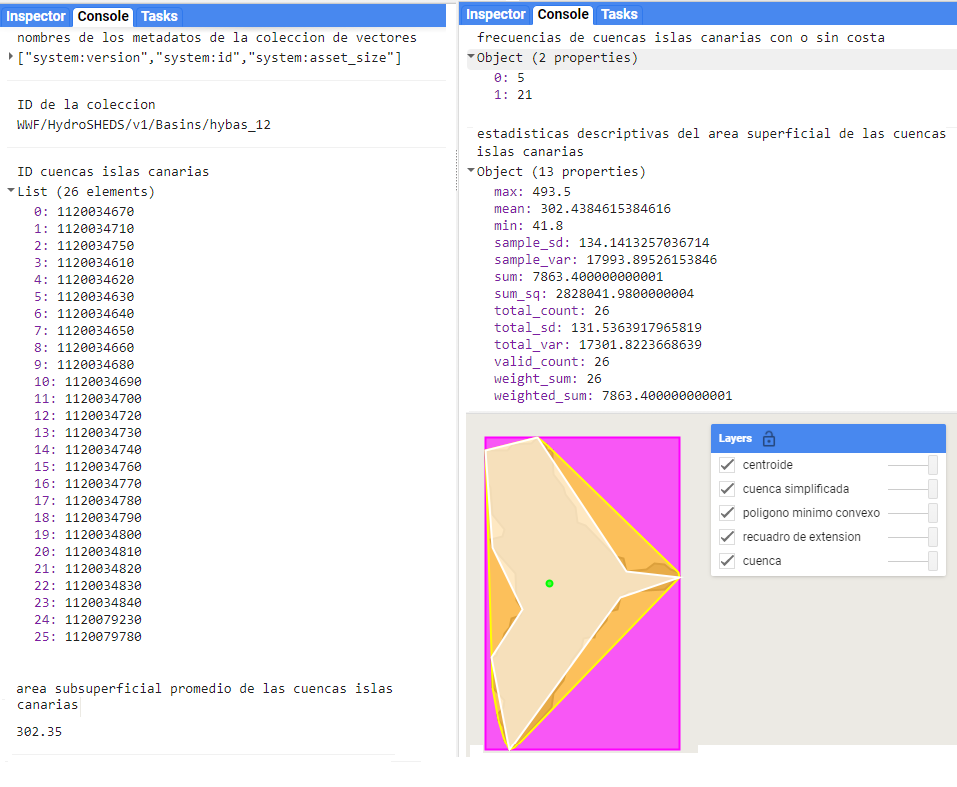

\newpage
# ee.FeatureCollection
\index{ee.FeatureCollection}
Las colecciones de vectores (`ee.FeatureCollection`) son objetos de GEE que contienen un conjunto de vectores, de modo que pueden contener objetos `ee.Feature` con geometrías diferentes (polígono, línea, punto, multipunto, multipolígono). La mayoría de los acervos de información vectorial disponibles en GEE van a ser definidos como colecciones de vectores. Para el manejo de varios vectores se recomienda utilizar esta estructura, en lugar de listas u otro tipo de objetos, ya que esto facilita ejecutar operaciones sobre todo el conjunto de vectores. Por ejemplo (`r colorize("Fig.")` \@ref(fig:f81)):
 
:::: {.bluebox2 data-latex=""}
::: {.awesomeblock data-latex="{5pt}{\faLightbulb}{darkblue}"}
GEE ofrece un catálogo de colecciones de vectores que se puede buscar en la barra de búsqueda. Estas colecciones de vectores se llaman tablas (*tables*).
:::
::::

Ejercicio 13

```{js echo = T}
// En el buscador se busca una tabla de países 'countries', y se escribe 
// el ID de la tabla, en este caso es una colección de vectores del 
// departamento de estado de Estados Unidos, que contiene las divisiones 
// políticas de los países del mundo  
var paises = ee.FeatureCollection('USDOS/LSIB_SIMPLE/2017');
```
```{r f81, echo = F, out.width="80%", fig.cap="Visualización de la colección de vectores con los límites internacionales, así como su salida en la consola."}
knitr::include_graphics("Img/ej13.png")
```

:::: {.bluebox2 data-latex=""}
::: {.awesomeblock data-latex="{5pt}{\faLightbulb}{darkblue}"}
La búsqueda de información vectorial en los acervos de GEE es más difícil que la búsqueda de imágenes. Eso ocurre porque a pesar de que hay mucha información vectorial disponible (compartida por usuarios), sólo está indexada la información compartida por Google.
:::
::::


## Información y metadatos
\index{size}
\index{limit}
Las colecciones de vectores contienen los metadatos e información de todos los vectores que contienen. Gracias a ello se puede utilizar esta información para filtrar y utilizar únicamente los vectores que cumplen con ciertos criterios. Algunos de los métodos que permiten examinar una colección de vectores incluyen `.size` y `.limit` (`r colorize("Fig.")` \@ref(fig:f82)).

:::: {.bluebox2 data-latex=""}
::: {.awesomeblock data-latex="{5pt}{\faLightbulb}{darkblue}"}
Al usar `print` con las colecciones de vectores, la consola puede mostrar máximo de 5000 vectores. En caso que uno necesite usar `print` en una colección de más de 5000 vectores, será necesario filtrar la colección previamente. Otra opción es limitar la cantidad de vectores que se vayan a mostrar. Para ello se puede usar el método `.limit` el cual permite especificar la cantidad de vectores que queremos ver (siempre que sean <= 5000; `r colorize("Fig.")` \@ref(fig:f82)).
:::
::::

Ejercicio 14

```{js echo = T}
// Llamamos una capa de cuencas de alta resolución de GEE
var cuencas = ee.FeatureCollection("WWF/HydroSHEDS/v1/Basins/hybas_12");

// Cantidad de vectores en la colección (1034083)
var cantidad =cuencas.size(); 
// Seleccionamos solo los primero 50 vectores
var primeras50cuencas= cuencas.limit(50); 
// Este comando resultará en un error porque excede los 5000 vectores
print(cuencas); 

// Esta capa contiene todos los vectores 1034083. Nótese que en el mapa 
// sí se pueden proyectar más de 5000 vectores, aunque esta capa es un 
// poco pesada 
Map.addLayer(cuencas,{},'todas las cuencas');
// Esta capa solo contiene las primeras 1000 cuencas y carga mucho más 
// rápido (Noroccidente de áfrica)
Map.addLayer(cuencas.limit(1000),{color:'00ff00'},'1000 cuencas filtradas');
``` 
```{r f82, echo = F, out.width="80%", fig.cap="Visualización de las primeras 1000 cuencas, así como su salida en la consola."}

```

## Creación de colecciones de vectores

Una colección de vectores se define a partir del método `ee.FeatureCollection` y puede contener geometrías, vectores, o inclusive otra colección de vectores. Una colección de vectores puede contener un solo vector o una sola geometría y sus elementos pueden tener o no atributos. Por ejemplo (`r colorize("Fig.")` \@ref(fig:f83), \@ref(fig:f84)): 

Ejercicio 15

```{js echo = T}
// Crear una colección de vectores con un solo punto, sin atributos 
var coleccion = ee.FeatureCollection(ee.Geometry.Point(16.37, 48.225));
```
```{r f83, echo = F, out.width="60%", fig.cap="Visualización de una colección de vectores con un único objeto de geometría de tipo punto."}

```

Ejercicio 16 
```{js echo = T}
//  Información adicional para el ejemplo, creación de 
// distintos vectores (ee.Feature),
//  cada cual con diferentes tipos de geometrías y distintos
// atributos.
//  esto para mostrar que una ee.FeatureCollection, no 
// requiere que todos sus elementos (ee.Feature)
//  tengan los mismos atributos, ni geometrías


var Punto = ee.Feature(ee.Geometry.Point(-99.1362, 19.4352),
    {pais:'Mexico',capital:'cdmx'});

var Multipunto = ee.Feature(
ee.Geometry.MultiPoint([-90.496, 14.605,                               
    					-88.717, 17.245,                              
    					-87.157, 14.094,
    					-89.2275, 13.6937,
    					-86.273, 12.115
    					-84.097, 9.958
    					-79.527, 8.983]),
    { pais: ['Guatemala', 
      	'Belice', 
      	'Honduras', 
      	'El Salvador', 
      	'Nicaragua', 
      	'Costa Rica', 
      	'Panama'],
      capital: 	['cdad. de Guatemala', 
      		'Belmopan', 
      		'Tegucigalpa', 
      		'San Salvador', 
      		'Managua', 
      		'San Jose', 
      		'cdad. de Panama']});

var linea = ee.Feature(ee.Geometry.LineString([-66.865, 10.479,                    
 							-74.072,4.732]),
    	{pais: 'Venezuela - Colombia', 
capital: 'Caracas - Bogota'}); 

var Multilinea = ee.Feature(ee.Geometry.MultiLineString([  
   	ee.Geometry.LineString([-76.803, 18.021, -82.362, 23.121]),      
  	ee.Geometry.LineString([-72.31, 18.69, -69.98, 18.44]),        
  	ee.Geometry.LineString([-66.103, 18.4597, -61.8558, 17.1315]),
  	ee.Geometry.LineString([-55.165, 5.861, -58.149, 6.822])]),
    {pais:	['Jamacia - Cuba',
    		'Haiti - Republica Dominicana',
    		'Puerto Rico - Antigua y Barbuda',
    		'Surinam - Guyana'],
    capital:['Kingston - La Habana',
    		'Puerto Principe - Santo Domingo',
    		'San Juan - saint John',
    		'Paramaribo - Georgetown']});

var perimetro = ee.Feature(ee.Geometry.LinearRing([-79.354,27.32,
  								   -79.332, 23.661,
  								   -74.19, 21.161,
       							   -72.235, 23.165,
  								   -78.039, 27.859]),
    	{pais:'Bahamas',
capital: 'Nasau'});

var rectangulo = ee.Feature(ee.Geometry.Rectangle(-127.97, 50.25,
  								  -68.2, 27.63),
    	{pais:'eeuu', 
capital:'Washington'}); 

var poligono = ee.Feature(ee.Geometry.Polygon(-80.348, -3.36, -80.348, -3.36,
  -							    78.985, -5.11, -78.019, -3.228,
 							    -75.99, -2.394, -75.25, -0.901,
  							    -75.865, 0.11, -78.941, 1.428,
  							    -80.26, 0.725, -80.919, -1.911,
  							    -79.776, -2.614),
{pais:'Ecuador', 
capital:'Quito'});

var Multipoligono = ee.Feature(ee.Geometry.MultiPolygon([
                ee.Geometry.Polygon([-61.955, 10.146,         
      								    -61.713, 10.967,
      								    -60.593, 10.881,
    									   -60.68, 10.081]),
    						ee.Geometry.Polygon([-61.779, 12.269,     
      								   -61.504, 12.205,
      								   -61.57, 11.968,
      								   -61.845, 12.044]),
    						ee.Geometry.Polygon([-59.703, 13.042,         
      							 	   -59.417, 13.032,
      								   -59.45, 13.32,
      								   -59.736, 13.342]),
    						ee.Geometry.Polygon([-61.526, 15.671,          
      								   -61.087, 15.512,
      								   -61.274, 15.194,
      								   -61.438, 15.279])]),
    	{pais:['Trinidad y Tobago',
    		'Granada',
    		'Barbados',
    		'Dominica'],
    	capital:['Puerto España',
    		  'Chantimelle',
    		  'Bridgetown',
    		  'Roseau']});
```

```{js echo = T}
// Crear una lista que incluya todos los vectores
var coleccionVectores = ee.FeatureCollection([Multipoligono,
  poligono,
  rectangulo,
  perimetro,
  Multilínea,
  linea,
  Multipunto,
  Punto]);
```

```{r f84, echo = F, out.width="80%", fig.cap="Visualización de una colección de vectores son objetos con diferentes geometrías, así como su salida en la consola."}

```

## Visualización de colecciones de vectores
\index{Map.addLayer}
Al igual que los vectores, las colecciones de vectores se pueden agregar a la pantalla de mapas mediante la función `Map.addLayer` (`r colorize("Fig.")` \@ref(fig:f85)).

Ejercicio 17

```{js echo = T}
var ecoregiones = ee.FeatureCollection("RESOLVE/ECOREGIONS/2017");

// Especificar el color de la capa 
Map.addLayer(ecoregiones, {}, 'capa por default');
Map.addLayer(ecoregiones, {color: '2AF116'}, 'capa color verde');
```
\index{draw}
Adicionalmente, sólo para las colecciones de vectores se pueden especificar parámetros adicionales con el método `.draw` (el cual transforma la colección de vectores en una imagen y permite así especificar tamaño del punto `pointRadius` y grosor `strokeWidth` de la línea). Esto se logra con el método `.draw` (`r colorize("Fig.")` \@ref(fig:f85)).

Ejercicio 17.1

```{js echo = T}
Map.addLayer(ecoregiones.draw({color: 'FF6969', strokeWidth:10 }), {},
  'capa color rosa, y línea gruesa');
```
\index{paint}
Si queremos visualizar sólo los contornos de los vectores puede usar el siguiente código, el cual dibuja con el método `.paint` los contornos de los vectores sobre una imagen vacía (`ee.Image`), y luego se visualiza esa imagen (`r colorize("Fig.")` \@ref(fig:f85)): 

Ejercicio 17.2

```{js echo = T}
// Crear una imagen vacía
var vacia = ee.Image().byte();

// Sobre la imagen vacía, dibujar los bordes de los vectores
var contornos = vacia.paint({
  // Definir los vectores a dibujar
  featureCollection: ecoregiones,  
  // Definir un atributo de los vectores para agrupar vectores por color 
  // según este atributo (puede omitirse)
  color:'BIOME_NUM',  
  // Definir el grosor (si no se especifica este parámetro se dibujarán los   
  // vectores con color sólido)       
  width: 3                          
});

// Mostrar la imagen con los vectores dibujados y especificar la paleta de
// color (la cual en este caso es de un solo color, por lo tanto, todos los
// contornos serán del mismo color)
Map.addLayer(contornos, {palette: '6e00ff', max: 14}, 
  'bordes morados'); 

// Mostrar la imagen con los vectores dibujados y especificar la paleta de
// color en una lista [rojo, verde, azul]. Esto permite que los vectores 
// se dibujen de diferentes colores según el atributo 'color' de la 
// variable 'contorno'
Map.addLayer(contornos, {palette: ['FF0000', '00FF00', '0000FF'], 
  max: 14}, 'bordes de colores'); 
```

```{r f85, echo = F, out.width="60%", fig.cap="Diferentes formas de visualizar colecciones de vectores."}
knitr::include_graphics("Img/ej17.png")
```

## Métodos comunes

### Filtración de una colección de vectores {-}
\index{filterBounds}
Filtrar una colección de vectores permite seleccionar únicamente los vectores deseados y se puede filtrar por fecha o por localización. De todas formas, si se necesitan filtros más avanzados se pueden configurar. Para filtrar por localización se usa el método `.filterBounds`, el cual permite seleccionar todos los vectores de la colección que se intersecten con la geometría indicada por el usuario. En el ejercicio se va a filtrar espacialmente una colección de vectores que contiene las áreas protegidas del mundo para seleccionar únicamente las áreas que se intersecten con un rectángulo que abarca el país de Costa Rica (`r colorize("Fig.")` \@ref(fig:f86)).

Ejercicio 18

```{js echo = T}
// Table dentro de GEE que contiene vectores de áreas protegidas globales
var areasProtegidas = ee.FeatureCollection('WCMC/WDPA/current/polygons'); 

// Dibujar una geometría (puede ser cualquier tipo de geometría), en este
// caso escogimos un rectángulo sobre Costa Rica)
var RecCostaRica = ee.Geometry.Rectangle(-86.16, 11.235, -82.601, 8.073);

// Áreas protegidas que se intersectan con el rectángulo dibujado
var filtro = areasProtegidas.filterBounds(RecCostaRica);
```
\index{filterMetadata}
Para filtrar por atributos de los vectores se puede realizar mediante el método `.filterMetadata`. De esta forma, todos los vectores de la colección que cumplan con una condición deseada serán seleccionados. Para usar `.filterMetadata` se debe indicar dentro del paréntesis (separado por comas): el nombre entre comillas del atributo a evaluar y el tipo de comparación a hacer, de acuerdo con ciertos operadores lógicos. Los operadores lógicos aceptados en este método son: 

*	`equals` (igual a), 
*	`less_than` (menor que),
*	 `greater_than` (mayor que),
*	 `not_equals` (no igual a o diferente de), 
*	`not_less_than` (no menor que),
*	 `not_greater_than` (no mayor que), 
*	`starts_with` (empieza con),
*	 `ends_with` (termina con), 
*	`not_starts_with` (no empieza con),
*	 `not_ends_with` (no termina con), 
*	`contains` (contiene), 
*	`not_contains` (no contiene).

y finalmente el valor con el que se hará la comparación.

En el siguiente ejercicio vamos a filtrar la colección de áreas protegidas según el atributo 'ISO3' que es un código de 3 letras para cada país del mundo, en el caso de Costa Rica su código es 'CRI' (`r colorize("Fig.")` \@ref(fig:f86)).

Ejercicio 18.1

```{js echo = T}
// En este caso cada vector de la colección de áreas protegidas, tiene un 
// atributo llamado 'ISO3', basándonos en ese atributo, vamos a buscar 
// todos los vectores que tengan (para ese atributo) un valor exactamente 
// igual ('equals') a 'CRI' (abreviación de Costa Rica)
var AreasProCRI = areasProtegidas.filterMetadata('ISO3','equals','CRI'); 
```
\index{filterDate}
\index{set}
El método para filtrar por fecha es `.filterDate`, sin embargo, este sólo se puede utilizar si los vectores tienen un atributo llamado 'system:time_start' y en ese atributo se encuentre la fecha en formato 'AAAA-MM-DD'. En caso que los vectores no tengan ese atributo pero sí tengan un atributo de fecha, entonces será necesario renombrar dicho atributo de fecha a 'system:time_start' para ello se puede usar el método `.set` y el método `.map` (el método `.map` se explicará con mayor detalle más adelante en esta sección).

### Funciones de usuario {-}
\index{function}
En el siguiente ejercicio vamos a crear una función para extraer de cada vector de la colección, el valor de año del atributo 'STATUS_YR', y guardarlo en un nuevo atributo llamado 'system:time_start'. Una vez se haya realizado este proceso, procederemos a filtrar las áreas protegidas establecidas entre el 2020 y 2021 (`r colorize("Fig.")` \@ref(fig:f86)).

Ejercicio 18.2

```{js echo = T}
// Map es un método que nos permite ejecutar una operación sobre todos 
// los vectores de la colección
var Areasfecha = AreasProCRI.map( function(vector){ 
  // Fecha extrae el valor del atributo 'STATUS_YEAR'
  var fecha = vector.get('STATUS_YR');   
  // Cada vector se entrega con una nueva propiedad 'system:time_start' 
  // que tiene fecha
  return vector.set('system:time_start',fecha)
}); 

// Ahora ya se puede aplicar el filtro de fecha filtrando solo las áreas 
// protegidas de Costa Rica declaradas en el año 2020
var filtroFechas = Areasfecha.filterDate(2020,2021); 
```
\index{filter}
\index{ee.Filter.and}
\index{ee.Filter.gte}
\index{ee.Filter.stringContains}
\index{ee.Filter.rangeContains}
Los filtros compuestos permiten combinar los filtros disponibles bajo la biblioteca de `ee.Filter`. En el ejercicio 18.3 se mostrará cómo construir un un filtro combinado para filtrar vectores que cumplan con todas las condiciones. El ejercicio consta de los siguientes pasos:

1.	El método `.filter` es para indicar que vamos a realizar un filtro.
2.	`ee.Filter.and` es para indicar que se deben cumplir todas las condiciones para filtrar.
3.	`ee.Filter.gte` es para seleccionar mediante la condición mayor o igual a (*greater than or equal*).
4.	Después se utiliza una coma para indicar otro filtro.
5.	`ee.Filter.stringContains` es un filtro para seleccionar de acuerdo a criterios de cadenas de texto que se encuentren como atributos de los vectores.
6.	Después se usa otra coma para indicar otro filtro.
7.	`ee.Filter.rangeContains` es para seleccionar todo lo que se encuentre en un rango de valores (`r colorize("Fig.")` \@ref(fig:f86)).
    

Ejercicio 18.3

```{js echo = T}
// Se declara que se ejecutará un filtro
var areasProMar = areasProtegidas.filter( 
  // ee.Filter.and indica que se crea un filtro compuesto en donde se 
  // deben cumplir TODAS las siguientes condiciones para seleccionar un 
  // vector
  ee.Filter.and(    
  //  Un filtro donde se indica el atributo a utilizar ('MARINE'). Este 
  // es un un atributo donde 1 es área costera, y 2 son áreas marinas.
  //  Por lo tanto al llamar `ee.Filter.gte` con el valor 1, se 
  // seleccionarán todas las áreas con un valor de 1 o 2, que indican
  // áreas que están protegiendo un área marina.
  ee.Filter.gte('MARINE',1),   
  //  Se filtran las áreas protegidas que en su atributo 'NAME' (el 
  // nombre del área protegida), contengan la  palabra manglar es así
  // para seleccionar solo las áreas protegidas que en su nombre incluya 
  // la palabra manglar.
  ee.Filter.stringContains('NAME', 'Manglar'),
  //  'GIS_M_AREA' es un atributo de las áreas protegidas que indica el 
  // área marina protegida calculada con un SIG.	10 es el valor mínimo 
  // del rango de área marina que queremos filtrar. 100 es el valor 
  // máximo del rango de área marina que queremos filtrar.
  ee.Filter.rangeContains('GIS_M_AREA', 10,100))); 
```

```{r f86, echo = F, out.width="80%", fig.cap="Visualización de los resultados de diferentes filtros sobre una colección de áreas protegidas."}
knitr::include_graphics("Img/ej18.png")
```

### Selección de atributos {-}
\index{select}
Al igual que con los vectores se puede utilizar el método `.select` para seleccionar un conjunto de atributos de los vectores en la colección. De igual manera que con los vectores individuales, para seleccionar un único atributo sólo se requiere indicar su nombre, mientras que si se desean seleccionar varios atributos, estos deben indicarse dentro de una lista. Por ejemplo:

```{js echo = T}
ee.FeatureCollection.select(['atributo']);
```

### Creación de puntos aleatorios {-}
\index{randomPoints}
GEE ofrece la herramienta para generar una colección de puntos aleatorios en una región especificada, mediante el método `.randomPoints`. En ella, especifica el área de interés y la cantidad de puntos deseados (`r colorize("Fig.")` \@ref(fig:f87)).

Ejercicio 19

```{js echo = T}
// Determinar una región específica donde se quiere lanzar puntos 
// aleatorios
var region = ee.Geometry.Rectangle(-61.36, 31.2, -16.54, 1.93);

// Crear 1000 puntos aleatorios en la región especificada
var puntos = ee.FeatureCollection.randomPoints(region,1000);
```
```{r f87, echo = F, out.width="80%", fig.cap="Visualización de los puntos aleatorios creados dentro de un área de interés."}

```

### Obtención del primer vector {-}
\index{first}
En algunas ocasiones resulta útil obtener el primer vector de una colección de vectores para ver si se llevó a cabo el procedimiento deseado sobre la colección. Para ello, se utiliza el método `.first`, que devuelve el primer vector que se encuentra en la colección y permite agregarlo en la pantalla de mapas para analizarla más a detalle. Al usar este método sobre una colección de vectores (`ee.FeatureCollection`), el resultado devuelto será un vector (`ee.Feature`, `r colorize("Fig.")` \@ref(fig:f88)).

Ejercicio 20

```{js echo = T}
// Llamamos una capa de cuencas de alta resolución de GEE
var CUENCAS_MUNDIAL = ee.FeatureCollection(
  "WWF/HydroSHEDS/v1/Basins/hybas_12");
 
// Filtramos la colección solo al primer vector y lo convertimos de una
// colección de un solo elemento (ee.FeatureCollection) a un vector 
// independiente (ee.Feature)
var cuenca = ee.Feature(CUENCAS_MUNDIAL.first()); 
```

### Extracción de metadatos de una colección de vectores {-}
\index{propertyNames}
Para extraer los nombres de los metadatos de una colección de vectores se usa el método `.propertyNames`, mientras que para extraer algún metadato en particular de una colección de vectores, se debe utilizar el método de `.get`, indicando dentro de los paréntesis el nombre de la propiedad (`r colorize("Fig.")` \@ref(fig:f88)). 

:::: {.bluebox2 data-latex=""}
::: {.awesomeblock data-latex="{5pt}{\faLightbulb}{darkblue}"}
Los metadatos de una colección de vectores no son los mismos que los de los vectores que la conforman.
:::
::::

Ejercicio 20.1

```{js echo = T}
// Mostrar un metadato de la colección de vectores
var IDcoleccion = CUENCAS_MUNDIAL.get('system:id') 
// Se muestran los metadatos de la  colección de vectores
var metadatosCOL = CUENCAS_MUNDIAL.propertyNames()
```

### Extracción de listas con atributos de vectores {-}
\index{aggregate}
Para obtener una lista con los atributos de los vectores que conforman una colección de vectores se utiliza el método `.aggregate`. Este método tiene varias formas de obtener y resumir los atributos de una colección: extraer una propiedad de los vectores (`.aggregate_array`), extraer y calcular la media por propiedad (`.aggregate_mean`), extraer y calcular un histograma (`.aggregate_histogram`), o extraer y obtener estadísticas descriptivas de las propiedades (`.aggregate_stats`; `r colorize("Fig.")` \@ref(fig:f88)).

Ejercicio 20.2

```{js echo = T}
// Rectángulo que abarca las islas canarias
var canaria = ee.Geometry.Rectangle(-18.89,27.46, -13.26,29.93); 
// Arroja una lista con todos los ID de las cuencas de esta zona
var IDcuencasCana = CUENCAS_MUNDIAL.filterBounds(canaria)
.aggregate_array('HYBAS_ID');

// Arroja el dato del área subsuperficial promedio de las cuencas de 
// esta zona
var areaCuencasCana = CUENCAS_MUNDIAL.filterBounds(canaria)
.aggregate_mean('SUB_AREA');

// Arroja el dato de frecuencias de cada uno de los posibles valores de
// COAST (1=si tiene costa, 0 =no tiene costa)
var costaCana = CUENCAS_MUNDIAL.filterBounds(canaria)
.aggregate_histogram('COAST'); 

// Arroja las estadísticas descriptivas del área superficial de las
// cuencas de la zona
var estadisticas = CUENCAS_MUNDIAL.filterBounds(canaria)
.aggregate_stats('UP_AREA'); 
```
```{r f88, echo = F, out.width="80%", fig.cap="Ejemplos de la salida en la consola de diferentes propiedades de los vectores que forman una colección de vectores de cuencas."}

```

### Ejecución de una función sobre todos los vectores una colección {-}
\index{map}
\index{function}
Para aplicar una operación en todos los vectores de una colección se usa el método `.map`.

:::: {.bluebox2 data-latex=""}
::: {.awesomeblock data-latex="{5pt}{\faLightbulb}{darkblue}"}
Para poder ejecutar el método `.map` es necesario  definir antes una función (del usuario). Para definir una función es necesario tener en cuenta varias cosas: 

1.  Usar el comando `function`.
2.	Definir un nombre cualquiera, que representara el objeto de entrada de la función (insumo). 
3.	Definir un diccionario dentro del cual se especifiquen los procedimientos a realizar sobre el insumo.
4.	Antes de cerrar el diccionario especificar el producto de salida (resultado de la función) usando el comando `return`.
:::
::::

En el siguiente ejercicio se mostrará cómo aplicar una función que permite crear un buffer sobre todos los vectores de una colección de vectores. En este ejercicio se creará un conjunto de puntos aleatorios para Perú, sobre los cuales se crearán los buffers y se agregarán algunos atributos. Para ello, se realizarán los siguientes pasos (`r colorize("Fig.")` \@ref(fig:f89)): 

* Llamamos a una colección con los límites políticos de los países.
*	Seleccionamos a 'Peru'.
*	Generamos 100 puntos aleatorios en Perú. 
* Le añadimos a cada punto un nuevo atributo llamado 'aleatorio'.
*	Definimos una función del usuario en la que para cada punto se genera un buffer con tamaño aleatorio.
*	Ejecutamos la función sobre todos los puntos aleatorios. 
*	Usando el método `.map` ejecutamos la función `bufferAleatorio` sobre todos los puntos aleatorios.

Ejercicio 21
\index{ceil}
\index{multiply}
\index{randomPoints}
```{js echo = T}
// Se llama una tabla de GEE con colección de vectores de países 
var paises = ee.FeatureCollection("USDOS/LSIB/2017"); 

//  Seleccionamos el vector cuyo atributo 'COUNTRY_NAME' es igual 
// ('equals') a 'Peru'.Filtrando así solo a Perú 
var peru = paises.filterMetadata('COUNTRY_NA','equals','Peru'); 

// Creamos una colección de vectores de 100 puntos aleatorios en Perú, y 
// usando el método .randomColumn le asignamos a cada punto un nuevo 
// atributo llamado 'aleatorio' cuyo valor es aleatorio (entre 0-1)
var puntos =ee.FeatureCollection.randomPoints(peru, 100)
  .randomColumn('aleatorio');  

//  Definimos una función del usuario (con el método `function`) llamada 
//  'bufferAleatorio' en la que el dato de entrada (insumo) será un 
//  vector (y el nombre genérico que le asignamos al insumo es (punto)):
//  Abrimos un diccionario donde especificaremos los procedimientos a 
//  realizarle al vector (punto).
var bufferAleatorio = function(punto){   
  //  Extraemos el número aleatorio del vector que se encuentra en el 
  //  atributo 'aleatorio'.
  var numero = punto.get('aleatorio');  
 
  //  Convertimos el número extraído en el paso anterior en un 
  // `ee.Number` del servidor.
    var NumServidor = ee.Number(numero);   

  //  Multiplicamos ese `ee.Number` por 100 000.
  var multiplicar = NumServidor.multiply(100000); 
 
  //  Redondeamos el resultado de la multiplicación en el número entero 
  //  mayor o igual más cercano.
  var redondear = multiplicar.ceil(); 
  
  //  Creamos un buffer (area) alrededor del vector de entrada de 
  // longitud definida según el número redondeado (redondear).
  var area = punto.buffer(redondear);

  //  Le asignamos al buffer (area) un nuevo atributo llamado 'radio del
  //  buffer' con el número redondeado (metros usados para calcular el 
  // buffer).
  var tamaño = area.set('radio del buffer',redondear);  

  //  Le asignamos al buffer (tamaño) otro atributo llamado 'area', en 
  // donde calculamos el área del buffer usando el método `.area`.
  var circulo = tamaño.set('area',tamaño.area());  

  //  Usando el método return especificamos que el buffer (circulo) con 
  // los dos nuevos atributos será el resultado de esta función. 
  return circulo;
};

// Ejecutamos la función 'bufferAleatorio' sobre todos los vectores de la
// colección, cada punto de la colección entonces entrará como insumo de 
// la función bufferAleatorio
var circulos = puntos.map(bufferAleatorio); 
```

```{r f89, echo = F, out.width="80%", fig.cap="Visualización de varios buffers, así como la salida de la consola."}

```

### Reducción de una colección de vectores {-}
\index{reduce}
\index{function}
Las colecciones también permiten agregar atributos de sus vectores en los metadatos de la colección, esta agregación se llama Reducir (reduce). Los reductores de atributos, tomarán el valor del atributo de todos los vectores y los convertirán en un solo valor para toda la colección. Depende del usuario escoger la operación matemática que se utilizará para la reducción, ya sea promedio, mínimo, máximo, mediana, entre otros. Estos reductores entregarán como resultado un diccionario. En el siguiente ejercicio se calculará el área de un conjunto de cuencas en Hawái y se comparará con el área reportada para cada cuenca de acuerdo a la USGS (United States Geological Survey). Por último, se calculará el error cuadrático medio de la diferencia para la colección de vectores. Para ello, se realizarán los siguientes pasos (`r colorize("Fig.")` \@ref(fig:f810)):
\index{reduceColumns}
\index{ee.Reducer}
\index{area}
\index{get}
\index{parse}
\index{subtract}
\index{pow}
\index{sqrt}
\index{ee.Reducer.mean}
\index{reduceColumns}
\index{ee.Number}
*	Importamos una capa de cuencas, la filtramos con un rectángulo sobre Hawái.
*	Definimos una función del usuario (`function`) llamada 'areaDife' en la que el dato de entrada (insumo) será un vector (y el nombre genérico que le asignamos al insumo es ('cuenca')).
  -	Abrimos un diccionario donde especificaremos los procedimientos a realizarle al vector (cuenca).
  -	Calculamos el área del vector (con el método `.area`), y lo dividimos por 1 000 000 para convertir a km2.
  -	Con `.get` extraemos el valor del atributo 'areasqkm' (el cual es una cadena de texto).
  -	Con `.parse` convertimos el valor extraído anteriormente a un número del servidor (`ee.Number`).
  -	Usando el método `.subtract` restamos el área calculada con el método `.area` menos el área reportada según el atributo del vector.
  -	Usando el método `return` especificamos que el vector sea devuelto con un nuevo atributo llamado 'diferencia' (el cual contiene el valor de la resta elevado al cuadrado usando el método `.pow`).
*	Ejecutamos la función 'areaDife' sobre todos los vectores de la colección `cuencasHawaii`.
*	Usando el método `.reduceColumns` declaramos que usaremos un reductor sobre toda la colección enfocándonos en un atributo de los vectores.
*	Con `ee.Reducer.mean` declaramos que el reductor a utilizar será uno de promedio, por lo que el resultado será el  promedio del atributo 'diferencia'.
*	Con `.get` extraemos el valor del reductor que por defecto se llama 'mean'.
*	Con `.sqrt` calculamos la raíz cuadrada del promedio calculado.

Ejercicio 22
\index{multiply}
\index{divide}
\index{subtract}
```{js echo = T}
// Importar una capa de cuencas
var cuencasHawaii = ee.FeatureCollection('USGS/WBD/2017/HUC06')
  .filterBounds(ee.Geometry.Rectangle(-160.969, 23.104, -154.136, 18.733));

// Definir una función que ejecute la diferencia entre el área reportada 
// en el atributo vector y la calculada en GEE
var areaDife = function(cuenca) {
 
  var area = cuenca.area().divide(1000000);
  var dife = area.subtract(ee.Number.parse(cuenca.get('areasqkm')));
  return cuenca.set('diferencia', dife.pow(2));
};

// Calcular el error cuadrático medio de toda la colección.
var RECM = ee.Number(
  cuencasHawaii.map(areaDife)
  .reduceColumns(ee.Reducer.mean(), ['diferencia'])
  .get('mean')).sqrt();
```
```{r f810, echo = F, out.width="80%", fig.cap="Vista en la consola del error cuadrático medio calculado entre el área calculada directamente en GEE y el reportado por la fuente de datos utilizada."}

```

También, se puede usar una colección de vectores para reducir la información de una imagen. Este procedimiento se revisa con mayor detalle en el capítulo 11. Sin embargo, por el momento se ejemplifica cómo obtener el valor de la suma de algunas variables climáticas (datos de WorldClim) en formato ráster para dos cuencas en Puerto Rico (objetos de tipo vector). En este caso se realizará el siguiente procedimiento (`r colorize("Fig.")` \@ref(fig:f811)):

*	Filtrar las cuencas de Puerto Rico.
* Obtener la suma de los valores de todos los píxeles que caigan en cada cuenca

Ejercicio 23
\index{filterBounds}
\index{reduceRegions}
\index{ee.Reducer.sum}
```{js echo = T}
// Importar una imagen de clima de WorldClim
var clima = ee.Image("WORLDCLIM/V1/BIO");

//  Importar una capa de cuencas y filtramos las cuencas con un rectángulo 
//  sobre Puerto Rico.
var cuencasPuertorRico = ee.FeatureCollection('USGS/WBD/2017/HUC06')
  .filterBounds(ee.Geometry.Rectangle(-79.906, 25.196, -59.6, 9.776));
//  Usando el método `.reduceRegions` declaramos que usaremos un reductor 
//  espacial en el área de las cuencas de Puerto Rico.
//  Con `ee.Reducer.sum` especificamos que se desea obtener la suma
//    de los valores de los atributos de todos los píxeles que caigan en 
//    cada vector.
var cuencaClima = clima.reduceRegions(cuencasPuertorRico, ee.Reducer.sum());
```
```{r f811, echo = F, out.width="80%", fig.cap="Visualización y salida de la consola de la consulta realizada sobre una imagen de variables climáticas utilizando la extensión espacial de una colección de vectores."}

```

### Conversión de vector a imagen {-}
\index{reduceToImage}
\index{ee.Reducer.first}
Para rasterizar un vector se usa el método `.reduceToImage`. Este método asigna bajo cada vector los píxeles del valor del atributo especificado. Para usar `.reduceToImage` indicamos el atributo que corresponderá al valor de los píxeles del ráster como 'area'. Por último, con el método `ee.Reducer.first` especificamos que el primer valor que encuentre en ese atributo sea asignado al valor del píxel (`r colorize("Fig.")` \@ref(fig:f812)).

Ejercicio 24
\index{ee.Filter.notNull}
```{js echo = T}
// Definir un área en la Antártida
var rectangulo = ee.Geometry.Rectangle(-158.63,-81.47,-40.51,-59.12);

// Importar una colección de vectores de GEe con datos de glaciares
var hielo = ee.FeatureCollection("GLIMS/current").filterBounds(rectangulo);

// Crear una imagen ráster de las áreas de los glaciares.
var areaGlaciar = hielo
// Seleccionar vectores cuyo atributo área no esté vacío
  	.filter(ee.Filter.notNull(['area'])) 
	
// Rasterizar  
.reduceToImage({
	// Atributo del vector para rasterizar
    properties: ['area'], 
    // Tomar el primer valor
    reducer: ee.Reducer.first()  
	});
```

```{r f812, echo = F, out.width="80%", fig.cap="Visualización de la transformación de una colección de vectores a imagen."}
knitr::include_graphics("Img/ej24.png")
```

### Unión de colecciones de vectores {-}
\index{ee.Join}
Para unir diferentes colecciones de vectores, mediante los valores de sus atributos se usan las funciones de `ee.Join`. El resultado de estas funciones suele constar de una colección de vectores que contendrá los atributos de otra colección de vectores. Para determinar el tipo de relación entre los atributos de los vectores de ambas colecciones se utilizar un filtro (`ee.Filter`).

Adicionalmente, se debe definir el tipo de unión a realizar entre los vectores. Los diferentes tipos de uniones se pueden consultar en la biblioteca `ee.Join`. En el siguiente ejercicio realizaremos un tipo de unión espacial de tipo `saveALL`, pero lo usaremos con dos filtros diferentes (uno de intersección y otro de distancia).

En este ejercicio se busca encontrar cuáles áreas protegidas se encuentran a menos de 10 km de una planta de energía y ver cuáles áreas protegidas tienen una planta de energía dentro de sus límites (`r colorize("Fig.")` \@ref(fig:f813)).

Ejercicio 25
\index{ee.Filter.withinDistance}
\index{ee.Filter.intersects}
\index{ee.Join.saveAll}
\index{apply}
\index{ee.Filter.eq}
```{js echo = T}
// Importar una colección de vectores: área protegidas de Guatemala
var APGuatemala = ee.FeatureCollection("WCMC/WDPA/current/polygons")
  .filter(ee.Filter.eq('PARENT_ISO', 'GTM'));

// Importar otra colección de vectores plantas de energía
var plantas = ee.FeatureCollection('WRI/GPPD/power_plants');

// Define un filtro espacial con distancia de 10 km. El .geo se utiliza 
// para indicar que se comparan geometrías
var distFiltro = ee.Filter.withinDistance({
  distance: 10000,
  // Geometría de la primera colección
  leftField: '.geo', 
  // Geometría de la segunda colección
  rightField: '.geo', 
  maxError: 10
});

// Define un filtro espacial de intersección el .geo se utiliza para 
// indicar que se compararán geometrías
var interFiltro = ee.Filter.intersects({
  // Geometría de la primera colección
  leftField: '.geo', 
  // Geometría de la segunda colección
  rightField: '.geo', 
  maxError: 0.1
});

// Definir la forma de unión el Join
var Union = ee.Join.saveAll({
  matchesKey: 'plantas_energia_PA',
  measureKey: 'metros'
});

// Ejecutar la unión por distancia
var AP_cerca_PE = Union.apply(APGuatemala, plantas, distFiltro);

// Ejecutar la unión por intersección
var AP_dentro_PE = Union.apply(APGuatemala, plantas, interFiltro);
```

```{r f813, echo = F, out.width="80%", fig.cap="Visualización y salida de la consola del resultado de una unión de dos colecciones de vectores mediante sus propiedades."}

```

### Exportación de colecciones de vectores {-}
\index{Export.table}
GEE permite exportar vectores a la sección de **Assets**, al **Google Drive** o al **Google Cloud**. Consideramos que las dos primeras son las que serán más utilizadas, ya que son gratuitas y permiten fácilmente exportar datos. En cambio, la opción de **Google Cloud** es para exportar información a Google Cloud, que suele implicar un costo extra y un registro en dicha plataforma (que no es el mismo registro que GEE).

Para exportar vectores es necesario usar la función `Export.table` y especificar si va a ser para drive (`.toDrive`) o para los **Assets** (`.toAsset`). Sus argumentos en común son: 

* `Collection` (colección): obligatoriamente una colección de vectores `ee.FeatureCollection`. Si se quiere exportar un solo vector se deberá convertir en una colección de un solo elemento. 
* `Description` (descripción): es una cadena de texto de usuario (no debe contener espacios, ni símbolos; sólo letras, números y guion bajo `_` ). Esta cadena de texto es una descripción que el usuario quiera darle a la tarea de exportar.

:::: {.bluebox2 data-latex=""}
::: {.awesomeblock data-latex="{5pt}{\faLightbulb}{darkblue}"}
Es importante recordar que no se podrán exportar vectores a los **Assets** sin geometrías, ni vectores con geometría `NULL`. Siempre que se quiera exportar una colección de vectores a la sección de **Assets** será necesario especificar alguna geometría por vector de la colección.
:::
::::

Los argumentos específicos para exportar a drive `Export.table.toDrive` son: 

*	`Folder` (carpeta): cadena de texto del usuario que será el nombre de la carpeta donde se guardará el vector dentro del drive. Si no se especifica este argumento se guarda en el drive sin carpeta, aunque si se especifica un nombre de una carpeta que no existe, dicha carpeta se creará automáticamente.
*	`FileNamePrefix` (prefijo del archivo): el prefijo a utilizar para nombrar al vector guardado en drive.
*	`FileFormat` (formato del archivo): el tipo de formato en el que se exportará la colección de archivos. GEE permite las siguientes opciones:

    -	'CSV', valor por defecto, vectores separados por comas. Este formato consta de valores separados por comas, en el que cada coma indica una columna distinta. Este formato es el más utilizado para exportar colecciones de vectores sin geometrías (es decir una simple tabla de atributos).
    -	'GeoJSON' (*Geographic JavaScript Object Notation*). Formato basado en el lenguaje JSON ("JavaScript Object Notation") para almacenar datos vectoriales y sus atributos.
    -	'KML' (*Keyhole Markup Language*). Formato utilizado sobre todo por Google para almacenar datos espaciales y tablas de atributos asociados a ellos.
    -	'KMZ' (*KML zipped*). Formato que consta de de un KML comprimido. 
    -	'SHP' (*Shapefile*). Formato utilizado por ESRI para almacenar vectores y tablas de atributos asociados a ellos.
    -	'TFRecord' (*Tensorflow Record*). Formato utilizado por Tensorflow para almacenar datos tanto vectoriales como ráster. 
    
El argumento adicional para exportar a los **Assets** `Export.table.toAssets` es 'AssetID', que corresponde el nombre que le pondremos al nuevo archivo (`r colorize("Fig.")` \@ref(fig:f814)).

Ejercicio 26
\index{Export.table.toAsset}
\index{Export.table.toDrive}
```{js echo = T}
// Determinamos un área de estudio con un polígono
var poligono = ee.Geometry.Polygon(
        [-79.59, 7.00,
          -85.02, 8.14,
          -88.04, 10.68,
          -93.69, 9.44,
          -98.51, 4.69,
          -94.24, -2.93,
          -92.70, 0.56,
          -89.13, 0.82,
          -87.57, -1.55,
          -82.31, -0.08,
          -79.64, 3.24]);

// Creamos la colección de vectores de puntos de ejemplo
var puntos = ee.FeatureCollection.randomPoints(poligono, 4000);

// Exportamos a los assets dentro de la nube
Export.table.toAsset({
  collection: punto,
  description: 'exportar_puntos_asset',
  assetId: 'puntos_exportados'
});

// Exportamos al drive personal
Export.table.toDrive({
  collection:punto, 
  description:'exportar_puntos_drive',
  folder:'carpeta_clase_GEE',
  fileNamePrefix:'puntos_ejemplo',
  fileFormat:'SHP'
});
```

```{r f814, echo = F, out.width="80%", fig.cap="Visualización de la información a exportar, así como su salida en la pestaña de Tasks (tareas)"}

```

Es importante recordar que es necesario dar clic al botón de **Run** en la pestaña de **Tasks** (tareas) para que se lleva a cabo la exportación (`r colorize("Fig.")` \@ref(fig:f815)).

```{r f815, echo = F, out.width="60%", fig.cap="Ubicación del botón 'Run' para ejecutar una tarea de exportación."}
knitr::include_graphics("Img/boton_run.png")
```
