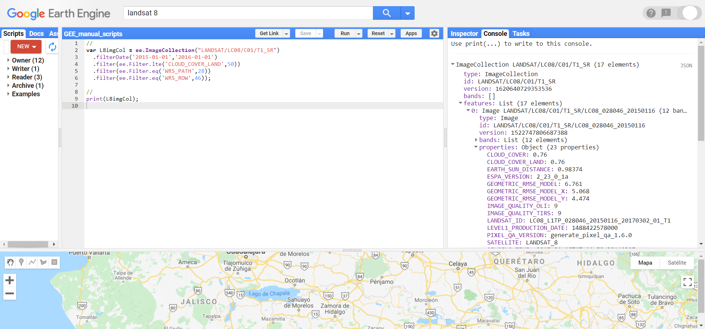
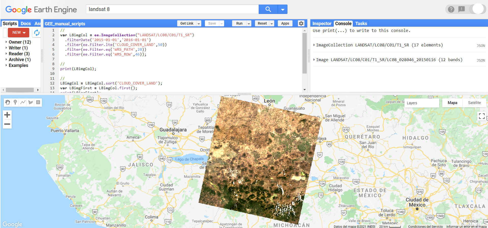
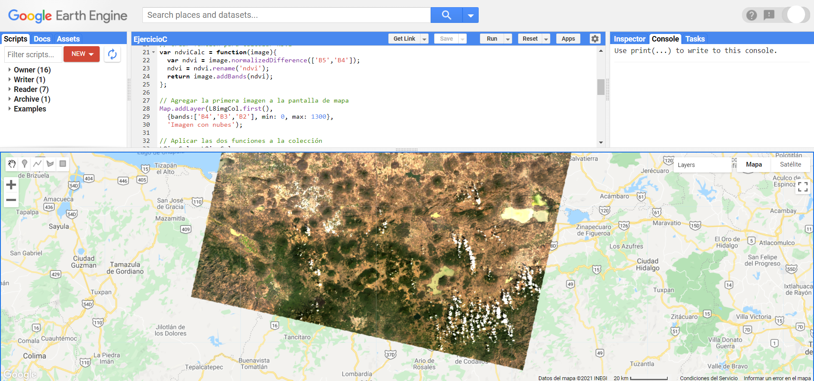
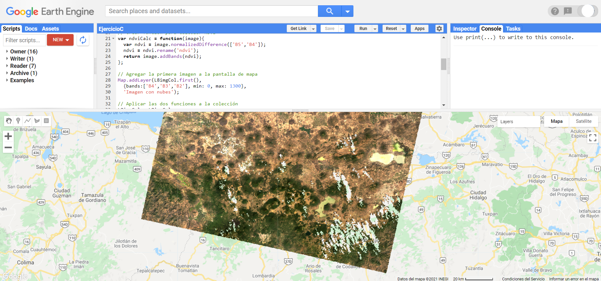
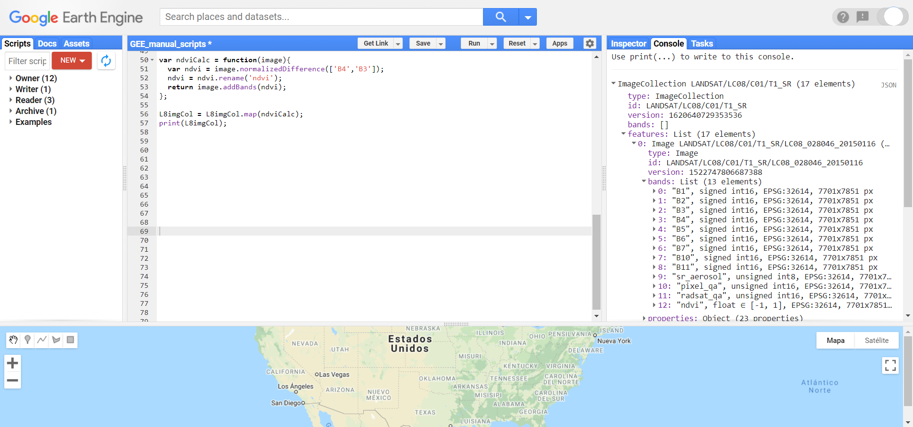
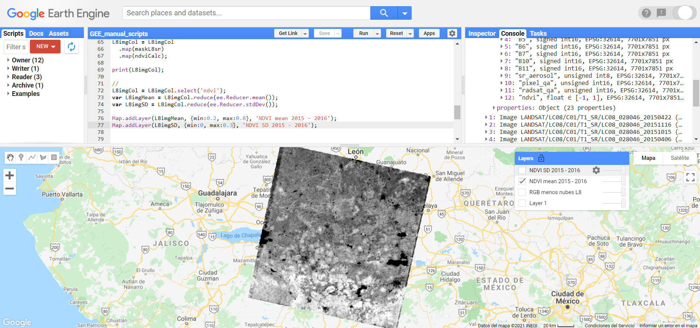
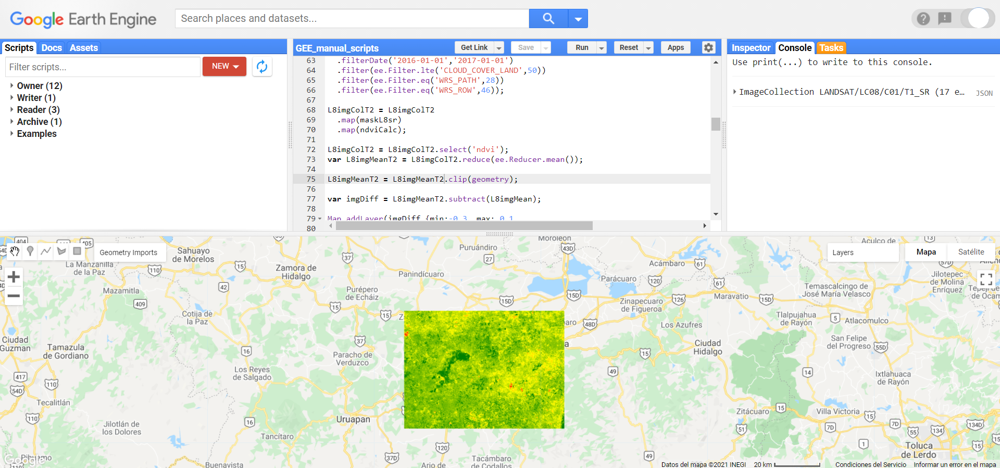

\newpage
# Colecciones de imágenes

Las colecciones de imágenes (`ee.ImageCollection`) son objetos de GEE que contienen un conjunto de imágenes. La mayoría de los acervos de imágenes disponibles en GEE van a ser definidos como este tipo de objetos. Para el manejo de varias imágenes se recomienda utilizar esta estructura, en lugar de listas u otro tipo de objetos.

Ejercicio 28

```{js, echo = T}
// Cargar la colección de Sentinel-2 reflectancia de la superficie
var S2 = ee.ImageCollection("COPERNICUS/S2_SR");
```

## Información adicional para los ejemplos

Como información adicional para esta sección se definirá una geometría de un área de interés.

```{js, echo = T}
// Definición de un área de interés
var roi = ee.Geometry.Polygon(
        [[[-101.80582759131487, 20.274503120947937],
          [-101.80582759131487, 19.35462236718103],
          [-100.61930415381487, 19.35462236718103],
          [-100.61930415381487, 20.274503120947937]]], null, false);
```

## Información y metadatos

Las colecciones de imágenes contienen los metadatos e información de todas las imágenes que contienen. De tal manera, se puede utilizar esta información para filtrar las imágenes y utilizar únicamente las que cumplen con ciertos criterios. Es importante recalcar que los metadatos y propiedades de una colección de imágenes no corresponde a las propiedades de las imágenes que la componen. Para consultar las propiedades de una colección de imágenes se usa el método `.propertyNames`.

Ejercicio 28.1

```{js, echo = T}
// Obtener las propiedades de la colección deimágenes
var S2Prop = S2.propertyNames();
```

:::: {.bluebox2 data-latex=""}
::: {.awesomeblock data-latex="{5pt}{\faLightbulb}{darkblue}"}
No se puede escribir o cambiar los objetos que se encuentran directamente hospedados en GEE. Por ejemplo, si se quiere mapear una función que sobreescriba alguna característica de las colecciones de imágenes en GEE, se debe hacer una copia de éstas para que se pueda sobreescribir la propiedad de interés.
:::
::::

## Creación de colecciones de imágenes

En ciertas ocasiones, el usuario puede estar interesado en crear nuevas colecciones de imágenes, a partir de resultados generados dentro del mismo GEE. En este caso, se pueden crear nuevas colecciones de imágenes mediante el método `ee.ImageCollection.fromImages`, indicando como argumentos la lista de las imágenes a partir de la que se quiere crear dicha colección.

Ejercicio 28.2

```{js, echo = T}
// Filtrar colección de Sentinel-2 por fechas
var im1 = S2.filterDate('2019-01-01','2019-05-01')
  // Aplicar filtro espacial
 .filterBounds(roi)
 // Obtener la primera imagen
 .first();

// Crear otra imagen de igual manera que la imagen anterior pero con 
// fechas distintas
var im2 = S2.filterDate('2020-01-01','2020-05-01')
 .filterBounds(roi)
 .first();

// Crear colección a partir de dos imágenes
var imColl = ee.ImageCollection.fromImages([im1, im2]);
```

## Visualización de colecciones de imágenes

De igual manera que los vectores y las colecciones de vectores, las colecciones de imágenes se pueden visualizar en la pantalla de mapas mediante la función `Map.addLayer`. Usualmente, al agregar una colección de imágenes a la pantalla de mapas, se van a mostrar los elementos con fecha de registro más reciente. Por ejemplo, en este caso muestra la imagen más reciente por cada escena dentro de la colección.

Ejercicio 28.3

```{js, echo = T}
// Filtrar colección de Sentinel-2 utilizando fechas
var imCol3 = S2.filterDate('2019-01-01','2019-05-01')
  // Aplicar filtro espacial
 .filterBounds(roi);

// Agregar colección de imágenes a la pantalla de mapas
Map.addLayer(imCol3, {bands: ['B4','B3','B2'], min:200, max: 2000}, 
  'S2 Mich');
```

## Funciones comunes

### Filtración de colecciones de imágenes

Las colecciones de imágenes se pueden filtrar a partir de los metadatos de las imágenes que contiene. De tal manera, se puede filtrar por: superposición con algún polígono de interés, fecha de registro, metadatos de las escenas (path, row, porcentaje de nubosidad), entre otras. Para filtrar una colección de imágenes se van a utilizar los objetos `ee.Filter`. Existen diversos tipos de filtros, algunos ya se encuentran precargados, pero otros se pueden definir manualmente. Por ejemplo, para filtrar por fecha se puede utilizar `.filterDate`:

Ejercicio 28.4

```{js, echo = T}
// Filtrar colección de imágenes por fecha
var imCol4 = S2.filterDate('2019-01-01','2019-05-01');
```

Por otro lado para filtrar espacialmente con la extensión de un polígono se puede realizar mediante `.filterBounds`:

```{js, echo = T}
// Filtrar colección de acuerdo a sobrelape con polígono de región de 
// interés
imCol4 = imCol4.filterBounds(roi);
```

Si se desea filtrar por alguna característica de los metadatos de las imágenes se puede hacer mediante `.filter` y después definiendo el filtro del metadato con `ee.Filter`. Otra forma de realizar este proceso es mediante `.filterMetadata`. Las siguientes dos líneas son equivalentes ya qye obtienen el mismo resultado.

```{js, echo = T}
// Obtener el nombre de las propiedades de una imágen de la colección de 
// imágenes
var imProperties = im1.propertyNames();

// Filtrar a partir de las propiedades de las imágenes
imCol4 = imCol4.filter(ee.Filter.lt('CLOUD_COVERAGE_ASSESSMENT', 50));
imCol4 = imCol4.filterMetadata('CLOUD_COVERAGE_ASSESSMENT','less_than', 50);
```

:::: {.bluebox2 data-latex=""}
::: {.awesomeblock data-latex="{5pt}{\faLightbulb}{darkblue}"}
Recordar que para filtar una colección de imágenes utilizando metadatos se debe filtrar de acuerdo a las propiedades de las imágenes, no de la colección. 
:::
::::

:::: {.bluebox2 data-latex=""}
::: {.awesomeblock data-latex="{5pt}{\faLightbulb}{darkblue}"}
Para trabajar con una colección de imágenes se sugiere que primero se apliquen los filtros espaciales y temporales (`.filter`), así como la selección de las bandas a utilizar (`.select`), antes de realizar operaciones sobre todas las imágenes de la colección (`.map`).
::: 
::::

### Selección de bandas

Al igual que con las imágenes, se puede utilizar el método `.select` para seleccionar un conjunto de bandas de todas las imágenes que se encuentran en la colección. De igual manera que con las imágenes individuales, para seleccionar una única banda sólo se requiere indicar el nombre de la banda, mientras que si se desea seleccionar varias bandas, éstas deben indicarse dentro de una lista. Por ejemplo:

Ejercicio 28.5

```{js, echo = T}
// Obtener el nombre de las bandas de una imagen de una colección de 
// imágenes
var imBandNames = im1.bandNames();

// Seleccionar ciertas bandas de todas las imágenes que conforman la 
// colección
var imCol5 = imCol4.select(['B4','B3','B2']);

```

:::: {.bluebox2 data-latex=""}
::: {.awesomeblock data-latex="{5pt}{\faLightbulb}{darkblue}"}
Recordar que para seleccionar ciertas bandas en una colección de imágenes, éstas corresponden a bandas de las imágenes, no de la colección. Esto es útil para revisar los nombres de las bandas.
:::
::::

### Ordenación de una colección

El método `.sort` permite ordenar una colección de imágenes por alguna propiedad de las imágenes. Por defecto, las colecciones de imágenes están ordenadas cronológicamente. Sin embargo, se puede cambiar este orden para que las ordene por alguna característica de las imágenes, por ejemplo, por orden de menor a mayor cobertura de nubes. Por default, el método `.sort` ordena la colección de imágenes en orden ascendente, de acuerdo al valor de la característica indicada. Sin embargo, si se desea ordenar de manera descendente, esto se puede indicar utilizando el argumento `ascending: false`. En el siguiente ejemplo, primero se ordena la colección en orden ascendente y en el segundo, descendente.

Ejercicio 28.6

```{js, echo = T}
// Cambiar el orden de la colección en función de la propiedad de las 
// imágenes de cobertura de nubes en sentido descendente
imCol5 = imCol5.sort({property: 'CLOUD_COVERAGE_ASSESSMENT', 
  ascending: false});
```

### Obtención de la primera imagen

En algunas ocasiones resulta útil obtener la primera imagen de una colección de imágenes para ver si se llevó a cabo el procedimiento deseado sobre la colección. Para ello, se utiliza el método `.first` que devuelve la primera imagen que se encuentra en la colección y permite visualizarla en la pantalla de mapas para analizarla más a detalle.

Ejercicio 28.7

```{js, echo = T}
// Obtener la primera imagen de una colección
var primera = imCol3.first()
```

### Extracción de listas con atributos de imágenes

Para obtener una lista con los atributos de las imágenes que conforman una colección de imágenes se utiliza el método `.aggregate`. Este método tiene varias formas de obtener y resumir los atributos de los vectores que conforman una colección: extraer una propiedad de los vectores (`.aggregate_array`), extraer y calcular la media por propiedad (`.aggregate_mean`), extraer y calcular un histograma (`.aggregte_histogram`), o extraer y obtener estadísticas descriptivas de las propiedades (`.aggregate_stats`).

Ejercicio 28.8

```{js, echo = T}
// Obtener una lista de con los valores de la propiedad de cobertura de 
// nubes de todas las imágenes de la colección
var listMetadatos = imCol5.aggregate_array('CLOUD_COVERAGE_ASSESSMENT');
```

### Conteo de observaciones por pixel

Para conocer el número de valores sin enmascarar por píxel en la colección de imágenes se utiliza el método `.count`. El resultado de este procedimiento consta de una imagen con las mismas bandas que las imágenes a partir de las cuales se calculó el número de observaciones por píxel. 

```{js, echo = T}
// Obtener el número de observaciones válidas para un píxel dentro de una 
// colección de imágenes
var conteoImgs = imCol5.count();
```

### Conocer tamaño de la colección

Para conocer el tamaño de la colección en número de imágenes incluidas se utiliza el método `.size`.

```{js, echo = T}
// Obtener el número de observaciones válidas para un píxel dentro de una 
// colección de imágenes
var numImgs = imCol5.size();
```

### Unión de más de una colección

Para unir una colección de imágenes con otra, se utiliza el método `.merge`. Un caso típico de tal operación sería unir dos colecciones de Landsat, por ejemplo, Landsat 7 y 8.

:::: {.bluebox2 data-latex=""}
::: {.awesomeblock data-latex="{5pt}{\faLightbulb}{darkblue}"}
Las colecciones Landsat 7 y 8 no tienen las mismas bandas, ni los nombres de las bandas corresponden entre sí. Por ejemplo, la banda 1 de Landsat 7 corresponde al espectro del azul ("blue"), mientras que en Landsat 8, la banda 1 corresponde al azul de costa ("coastal blue"). En este caso, conviene primero filtrar y renombrar las bandas a unir para asegurarse que el nombre de las bandas a unir en una colección corresponda con las de la otra.
:::
::::

La unión de una colección de Sentinel-2 se podría hacer de la siguiente manera:

Ejercicio 28.9

```{js, echo = T}
// Aplicar un filtro por fechas a la colección de Sentinel-2
var imCol6 = S2.filterDate('2019-01-01','2019-05-01')
  // Aplicar filtro espacial
  .filterBounds(roi);

// Hacer lo mismo que en el caso anterior, pero cambiando las fechas
var imCol7 = S2.filterDate('2020-06-01','2020-11-01')
  .filterBounds(roi);

// Unir las dos colecciones de imágenes en una sola  
var imCol8 = imCol6.merge(imCol7);
```

### Ejecución de una función sobre todas las imágenes de una colección

Para realizar alguna operación sobre todas las imágenes de una `ee.ImageCollection` se utiliza el método `.map`. Esto va a aplicar el procedimiento o función que se defina en el interior de ella a cada imagen dentro de la colección. Por ejemplo, si quisiéramos agregar una banda con un índice de vegetación a todas las imágenes, se podría hacer de la siguiente manera:

Ejercicio 28.10

```{js, echo = T}
// Definir una función que calcule el ndvi de una imagen
var ndviCalc = function(image){
  // Calcular el ndvi utilizando las bandas del NIR, B8 y R, B4
  var ndvi = image.normalizedDifference(['B8','B4']);
  // Regresar la imagen con la nueva banda de ndvi
  return image.addBands(ndvi);
};

// Aplicar la función sobre todas las imágenes de una colección
var imCol9 = imCol4.map(ndviCalc);
```

:::: {.bluebox2 data-latex=""}
::: {.awesomeblock data-latex="{5pt}{\faLightbulb}{darkblue}"}
Nótese que el método `.map` es distinto de la función `Map` que permite agregar objetos a la pantalla de mapas. Recordar que Javascript es un lenguaje sensible a mayúsculas y minúsculas.
:::
::::

:::: {.bluebox2 data-latex=""}
::: {.awesomeblock data-latex="{5pt}{\faLightbulb}{darkblue}"}
GEE recomienda el uso de `.map` para realizar operaciones de tipo ciclo, en lugar de otras funciones de ciclo (por ejemplo, `for`).
:::
::::
:::: {.bluebox2 data-latex=""}
::: {.awesomeblock data-latex="{5pt}{\faLightbulb}{darkblue}"}
El método `.map` requiere del uso de funciones del lado del servidor, así que se recomienda evitar el uso de funciones del lado del cliente como `print`, `Map`, `Export` y `Chart`.
:::
::::

### Reducción de una colección de imágenes

Los reductores permiten crear un compuesto (una sola imagen), a partir de una colección de imágenes. Estos son muy útiles para hacer mosaicos multitemporales u obtener información de la colección de imágenes. Para reducir una colección de imágenes se utilizará el método `.reduce` e indicando la función a utilizar mediante un objeto tipo `ee.Reducer`. De tal manera, se puede indicar si el resultado corresponderá a la media `ee.Reducer.mean`, mediana, `ee.Reducer.median`, moda, `ee.Reducer.mode`, mínimo, `ee.Reducer.min`, máximo, `ee.Reducer.max` o inclusive la media de un intervalo determinado de observaciones, `ee.Reducer.intervalMean`. Otra forma de realizar estas mismas reducciones es utilizando directamente las funciones `.min, .max, .mean, .mode, .median`. Las siguientes dos líneas realizan exactamente el mismo proceso:

Ejercicio 28.11

```{js, echo = T}
// Calcular el valor promedio de reflectancia para cada una de las bandas 
// de las imágenes que conforman la colección
var imRedMean = imCol9.mean();

// Realizar lo mismo pero utilizando explicitamente la definición del 
// reductor
var imRedMean2 = imCol9.reduce(ee.Reducer.mean());
```

:::: {.bluebox2 data-latex=""}
::: {.awesomeblock data-latex="{5pt}{\faLightbulb}{darkblue}"}
Al aplicar una reducción a una colección de imágenes, el nombre de las bandas será el mismo que el de las bandas de cada imagen con un sufijo que indica la función utilizada para hacer la reducción. Por ejemplo, al utilizar `ee.Reducer.mean` sobre una colección de imágenes cuyas bandas se llaman 'B1' y 'B2', las bandas de la imagen producto de la reducción se llamarán 'B1_mean' y 'B2_mean'.
:::
::::

### Creación de compuestos y mosaicos

Si se desean hacer mosaicos a partir de varias imágenes se puede realizar en GEE mediante dos funciones: `.mosaic` y `.qualityMosaic`. La principal diferencia entre estas dos funciones radica en que la primera simplemente pega las imágenes de acuerdo al orden que tienen en la colección (es decir, la última hasta arriba). Por el contrario, el método de `.qualityMosaic` permite priorizar el píxel que quedará en el mosaico final a partir del valor más alto de alguna banda. Esto puede ser útil para realizar, por ejemplo, un mosaico del píxel con mayor valor de NDVI. En el caso de `.qualityMosaic` hay que indicar la banda que se utilizará como la banda de calidad para crear el mosaico.

Ejercicio 28.12

```{js, echo = T}
// Crear un mosaico de las imágenes contenidas en una colección. 
// Generalmente en áreas de sobrelape se tomarán los valores de las 
// imágenes más recientes
var imRedMosaic = imCol9.mosaic();

// Crear un mosaico utilizando como banda de calidad 'nd' que en este caso
//corresponde al ndvi
// Esta función permite obtener mosaicos, por ejemplo, del valor del píxel
//de mayor verdor o mayor valor de ndvi
var imRedQualMosaic = imCol9.qualityMosaic('nd');
```

#### Ejercicio: Filtro de colección de imágenes y visualización (Ejercicio B)

Para filtrar la colección de reflectancia de la superficie de imágenes de Landsat 8 de mayor calidad ("tier 1") por fecha, porcentaje de cobertura de nubes de las imágenes, así como por su “path” y “row” se puede realizar en un solo paso aplicando múltiples filtros. En este caso, primero se indica la ruta de la colección que se desea utilizar. Para encontrar esta ruta se puede buscar la colección de interés en la barra de `Search`, después se le da clic y del lado izquierdo aparecerá la ruta de la colección. Por otro lado, en esta misma ventana, en la pestaña de ‘BANDS’ se puede consultar las bandas y los nombres de las bandas que contiene cada imagen. Por su parte, en la pestaña de ‘IMAGE PROPERTIES’ se pueden consultar los metadatos que contienen las imágenes de esta colección.

```{r, echo = F, out.width="100%", fig.cap="Consulta de propiedades de las imágenes contenidas en una colección de imágenes."}
knitr::include_graphics("Img/Ruta_coleccion.png")
```

Una vez que se conoce la ruta de la colección de interés, se llama dicha colección. Después se especifican los filtros. En este caso, primero se filtra por fecha, en formato YYYY-MM-DD (año, mes, día), seguido de filtros de los metadatos de las imágenes:

*	‘CLOUD_COVER_LAND’,
*	‘WRS_PATH’, 
*	‘WRS_ROW’. 

Para realizar este filtro se deben escribir exactamente igual el nombre de las propiedades (por ejemeplo, CLOUD_COVER_LAND) y en la definición del filtro se debe explicitar si se desea utilizar los valores que sean iguales (`eq`), distintos (`neq`), mayores (`gt`), menores (`lt`), mayores o igual (`gte`) o menores o iguales(`lte`).

```{js, echo = T}
// Filtrado de la colección
var L8imgCol = ee.ImageCollection("LANDSAT/LC08/C01/T1_SR")
  .filterDate('2015-01-01','2016-01-01')
  .filter(ee.Filter.lte('CLOUD_COVER_LAND',50))
  .filter(ee.Filter.eq('WRS_PATH',28))
  .filter(ee.Filter.eq('WRS_ROW',46));
```

Para explorar algunas características de la colección de imágenes filtradas podemos escribir el siguiente comando para ver sus características en la consola.

```{js, echo = T}
print(L8imgCol);
```

Una vez pasado el comando anterior, en la consola se puede consultar cuántas imágenes cumplieron con los filtros indicados. En este ejemplo, la colección filtrada incluye 17 imágenes. Después, se pueden consultar las características de las imágenes. Para ello, en la consola se le da:

*	Un clic a la colección en la consola .
*	Luego un clic a features.
*	Después un clic a cualquier imagen (`Image`) .
*	Por último a Properties. Ahí se pueden ver los metadatos de cada imagen y por lo tanto, los campos de información que se pueden utilizar para filtrar una colección de imágenes, basado en los metadatos de las imágenes. Esta información es la misma que se puede obtener en la barra de búsqueda.

```{r, echo = F, out.width="100%", fig.cap="Ejemplo de una consulta de información de la colección de imágenes en la consola."}

```

A continuación se ordena la colección de manera ascendente de acuerdo a la propiedad de ‘CLOUD_COVER_LAND’. Se selecciona la primera imagen, es decir, la de menor cobertura de nubes. Nótese que en este paso al definir la variable `L8imgFirst`, ya únicamente seleccionamos una sola imagen, por lo tanto, éste va a ser un objeto `ee.Image`.

```{js, echo = T}
// Ordenar imágenes y obtener la primera
L8imgCol = L8imgCol.sort('CLOUD_COVER_LAND');
var L8imgFirst = L8imgCol.first(); 
print(L8imgFirst);
```

Además, se puede agregar esta imagen a la ventana de mapas para visualizar su información. Esto se puede realizar de dos maneras. En el primer caso, se agrega la información sin pasar más argumentos. En el segundo caso, se indican las bandas y el orden que se desea cargar, así como los valores mínimos y máximos del histograma y un nombre para la capa.

```{js, echo = T}
// Agregar a la pantalla de mapa
Map.addLayer(L8imgFirst);
Map.addLayer(L8imgFirst,{bands: ['B4','B3','B2'], min: 95, max: 1288}, 
  'RGB menos nubes L8');
```

```{r, echo = F, out.width="100%", fig.cap="Visualización de la primera imagen de la colección de imágenes."}

```

#### Ejercicio: Enmascaramiento de nubes, cálculo de índices y reducción (Ejercicio C)

Utilizando la colección que ya se filtró en el ejercicio anterior se hará un mapeo y una reducción. En este ejercicio se obtendrá el ndvi promedio entre 2015 y 2016.

Para calcular el ndvi promedio lo primero que hay que hacer es aplicar la máscara de nubes que viene en la misma colección de imágenes de Landsat 8. Al aplicar esta máscara se eliminarán los píxeles cuya información provenga de nubes o sombras. Después, se definirá una función para calcular el ndvi de cada imagen contenida en la colección de imágenes. Para ello se utiliza el método `.normalizedDifference`, indicando las bandas del infrarrojo cercano (NIR) y rojo (R). También, se utilizará el método `.rename` para cambiar el nombre dado por defecto a la nueva banda calculada. Posteriormente, se agrega esta banda a la imagen con el método `.addBands` y se utiliza el método `.map` para aplicarla a cada una de las imágenes.

En este procedimiento, primero se define la función para enmascarar las nubes. Para ello, se indican los bits que corresponden a nubes y a sombras, es decir, los bits 5 y 3 respectivamente. Después se selecciona la banda que contiene la información de la máscara de nubes, la cual en landsat 8 se llama ‘pixel_qa’. Se selecciona esta banda y se evalúa que en los dos bits antes mencionados el valor sea igual a cero, es decir, que sea un píxel clasificado como despejado. En este procedimiento se indica que la consulta de los valores se debe hacer por bits (`.bitwiseAnd`) y que las dos evaluaciones deben de ser cero (`.and`). Posteriormente, se define una máscara en función de esos valores y se actualiza la máscara (`.updateMask`).

```{js, echo = T}
// Crear función para enmascarar nubes
function maskL8sr(image) {
  var cloudShadowBitMask = (1 << 3);
  var cloudsBitMask = (1 << 5);
  var qa = image.select('pixel_qa');
  var mask = qa.bitwiseAnd(cloudShadowBitMask).eq(0)
                 .and(qa.bitwiseAnd(cloudsBitMask).eq(0));
  return image.updateMask(mask);
}
```

Se define la función para calcular el NDVI de todas las imágenes.

```{js, echo = T}
// Crear función para calcular NDVI
var ndviCalc = function(image){
  var ndvi = image.normalizedDifference(['B5','B4']);
  ndvi = ndvi.rename('ndvi');
	return image.addBands(ndvi);
};
```

Para ver una muestra de cómo se ve la primer imagen con y sin la máscara de nubes, primero se agregará la imagen con nubes a la pantalla de mapa.

```{js, echo = T}
// Agregar la primera imagen a la pantalla de mapa
Map.addLayer(L8imgCol.first(), 
  {bands:['B4','B3','B2'], min: 0, max: 1300},
  'Imagen con nubes');
```

```{r, echo = F, out.width="100%", fig.cap="Ejemplo de una imagen con nubes."}

```

A continuación se aplican las dos funciones utilizando `.map` y sobreescribir el objeto L8imgCol. 

```{js, echo = T}
// Aplicar las dos funciones a la colección
L8imgCol = L8imgCol
  .map(maskL8sr)
  .map(ndviCalc);
print(L8imgCol);
```

Se muestra la primera imagen sin nubes.

```{js, echo = T}
// Visualizar la primera imagen
Map.addLayer(L8imgCol.first(), 
  {bands:['B4','B3','B2'], min: 0, max: 1300},
  'Imagen sin nubes');
```

```{r, echo = F, out.width="100%", fig.cap="Ejemplo de una imagen donde se enmascararon las nubes."}

```

En la consola se puede observar que todas las imágenes ahora contienen una nueva banda llamada 'ndvi'.

```{r, echo = F, out.width="100%", fig.cap="Consulta de información en la consola para verificar que la colección de imágenes contiene la banda NDVI."}

```

Posteriormente, se reduce la colección de imágenes para formar una sola imagen que represente el valor promedio de NDVI en el periodo de la colección (2015 - 2016). Para ello se utiliza el método `.reduce`. También se calculará la desviación estándar de los valores de NDVI. Estas dos imágenes se guardarán en dos nuevos objetos.

```{js, echo = T}
// Seleccionar la banda ndvi y hacer dos reducciones
L8imgCol = L8imgCol.select('ndvi');
var L8imgMean = L8imgCol.reduce(ee.Reducer.mean());
var L8imgSD = L8imgCol.reduce(ee.Reducer.stdDev());
```

A continuación, agregamos los dos resultados a la pantalla de mapas.

```{js, echo = T}
// Visualizar las imágenes
Map.addLayer(L8imgMean, {min:-0.14, max:0.15}, 'NDVI mean 2015 - 2016');
Map.addLayer(L8imgSD, {min:0, max:0.13}, 'NDVI SD 2015 - 2016');
```

El resultado se ve así:

```{r, echo = F, out.width="100%", fig.cap="Visualización de la imagen de NDVI promedio."}

```

Además, se puede conocer el número de observaciones sin enmascarar por píxel utilizando el método `count`. Debido a que ya se enmascararon las nubes en todas las imágenes de la colección, esta imagen contendrá el número de observaciones sin nube por píxel. Esta información nos permite conocer a partir de cuántas observaciones por píxel se calcularon las imágenes anteriores, es decir, las imágenes con del promedio y desviación estándar de NDVI.

```{js, echo = T}
// Obtener la imagen del número de observaciones por píxel sin enmascarar 
var numObsPixel = L8imgCol.count();

Map.addLayer(numObsPixel,
  {min: 1, max: 17},
  'Número de observaciones sin enmascarar por píxel');
```

La imagen con el número de observaciones por píxel sin enmascarar se ve así:

```{r, echo = F, out.width="100%", fig.cap="Visualización de la imagen con el número de observaciones sin enmascarar por píxel."}
knitr::include_graphics("Img/imCount.png")
```

:::: {.bluebox2 data-latex=""}
::: {.awesomeblock data-latex="{5pt}{\faLightbulb}{darkblue}"}
Se pueden prender y apagar las capas de la pantalla de mapas utilizando el menú que se despliega al posicionar el puntero sobre el letrero de layers y prendiendo y apagando las capas con las palomitas a la izquierda de cada capa.
:::
::::

El último paso será cortar la imagen a una extensión de interés. En este caso primero se define un área de interés mediante coordenadas: 

```{js  echo = T}
// Cargar el polígono del área de interés
var geometry = ee.Geometry.Polygon(
        [[[-101.82737418916153, 19.836437094032178],
          [-101.82737418916153, 19.368119068204525],
          [-101.15171500947403, 19.368119068204525],
          [-101.15171500947403, 19.836437094032178]]], null, false);
```

Para después cortar las dos imágenes y mostrarlas en la pantalla de mapas.

```{js  echo = T}
// Cortar la imágenes
L8imgMean = L8imgMean.clip(geometry);
L8imgSD = L8imgSD.clip(geometry);

// Visualizarlas
Map.addLayer(L8imgMean, {min:0.2, max:0.8}, 'NDVI mean 2015 - 2016 clip');
Map.addLayer(L8imgSD, {min:0, max:0.3}, 'NDVI SD 2015 - 2016 clip');
```

#### Ejercicio: Cáculo de diferencia de dos imágenes y exportación de resultado.(Ejercicio D)

Se utilizarán las funciones previamente definidas para generar un mosaico igual al ya generado, pero ahora con fechas de 2016-01-01 al 2017-01-01. Primero se filtra la colección de imágenes y se mapean las funciones para enmascarar las nubes y agregar el NDVI a las imágenes.

```{js, echo = T}
// Filtrado en tiempo 2
var L8imgColT2 = ee.ImageCollection("LANDSAT/LC08/C01/T1_SR")
  .filterDate('2016-01-01','2017-01-01')
  .filter(ee.Filter.lte('CLOUD_COVER_LAND',50))
  .filter(ee.Filter.eq('WRS_PATH',28))
  .filter(ee.Filter.eq('WRS_ROW',46));

L8imgColT2 = L8imgColT2
  .map(maskL8sr)
  .map(ndviCalc);
```

Después, se seleccionan únicamente las bandas de NDVI y se reduce la colección de imágenes para generar una imagen del valor promedio de NDVI. Posteriormente, se recorta la imagen a la extensión del polígono del área de interés. A esta imagen se le restarán los valores de la imagen del 2015-01-01 al 2016-01-01. De esta manera, los valores más negativos representarán valores más bajos de NDVI en el año 2 respecto al año 1.

```{js, echo = T}
// Seleccionar NDVI y reducción
L8imgColT2 = L8imgColT2.select('ndvi');
var L8imgMeanT2 = L8imgColT2.reduce(ee.Reducer.mean());

// Cortar imagen a área de interés
L8imgMeanT2 = L8imgMeanT2.clip(geometry);

// Restar media T1 a T2
var imgDiff = L8imgMeanT2.subtract(L8imgMean);  
```

Posteriormente se agrega el resultado a la pantalla de mapas.

```{js, echo = T}
// Visualizar imagen resultante
Map.addLayer(imgDiff,{min:-0.3, max: 0.1, 
  palette:['FF0000', 'FFFF00', '008000'] }, 
  'Diferencia NDVI 2015 vs 2016');
```

```{r, echo = F, out.width="100%", fig.cap="Imagen de diferencia de NDVI entre dos años."}

```

Por último, para exportar el resultado se ingresan varios parámetros a la función que incluyen: la imagen a exportar, el nombre para guardar el archivo, la escala de la imagen (tamaño de píxel en metros), formato a utilizar y si se desea guardar dentro de un folder del Google Drive. Estos argumentos, al igual que otras funciones en GEE se pasan dentro de un diccionario.

```{js echo = T}
// Exportar imagen a Google Drive
Export.image.toDrive({
  image: imgDiff,
  description: 'DiferenciaNDVI_2016-2017',
  scale: 30,
  fileFormat: 'GeoTIFF',
  folder: 'DiferenciaNDVIL8'
}); 
```
