\newpage
# ee.Image
\index{ee.Image}
Las imágenes (`r colorize2("ee.Image")`) en GEE generalmente se encuentran disponibles en colecciones de imágenes, aunque también existen fuentes de datos particulares que constan de una sola imagen. Las imágenes corresponden a información en formato ráster que cuenta con una resolución espacial, espectral y radiométrica particular (ver Olaya [2020] para una descripción más detallada de un ráster). 
Los metadatos de cada imagen en GEE se encuentran como propiedades de esta. A diferencia de las imágenes que posiblemente el usuario esté acostumbrado a manejar, GEE permite que cada banda tenga una resolución de píxel o tipo de datos distinta (Integer, Float, 16 bits, etc.). Esto no afecta el uso de estas imágenes, pero es importante considerarlo si se van a exportar imágenes cuyas bandas tienen distinta resolución espacial (por ejemplo, Sentinel-2), ya que al exportar una imagen multibanda, todas sus bandas deben tener la misma resolución y tipo de datos. Al final de este capítulo se presenta un ejercicio integrador de varios de los procedimientos revisados aquí.

Para ejemplificar esta sección se cargará una imagen global de la altura del dosel para áreas con cobertura arbórea en el 2005 (`r colorize("Fig.")` \@ref(fig:f91)).

`r colorize("Ejercicio 27")`

```{js echo = T}
// Cargar la imagen global de la altura del dosel para áreas con cobertura 
// arbórea en el 2005
var CHM = ee.Image('NASA/JPL/global_forest_canopy_height_2005');
```

```{r f91, echo = F, out.width="95%", fig.cap="Ejemplo de la  información desplegada en la consola al imprimir una imagen."}
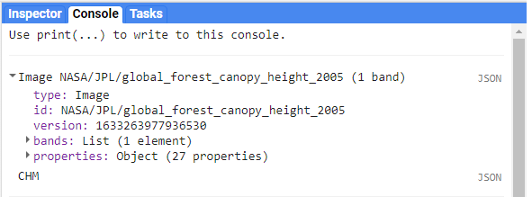
```

Para realizar los ejercicios de este apartado, se cargarán dos fuentes de información adicionales para aplicar algunos de los métodos disponibles para imágenes. La primera consta de una simple geometría de una región de interés, mientras que la segunda es un vector que contiene el polígono de la superficie de México.

```{js echo = T}
// Cargar un polígono con el área de interés
var roi1 = ee.Geometry.Polygon(
        [[[-101.90832388457699, 20.455157626721274],
          [-101.90832388457699, 19.422397223570666],
          [-100.56799185332699, 19.422397223570666],
          [-100.56799185332699, 20.455157626721274]]], null, false);

// Cargar la colección de atributos de los polígonos de la superficie de 
// los países
var MX = ee.FeatureCollection('USDOS/LSIB_SIMPLE/2017')
  // Filtrar por la propiedad country_co para elegir México
  .filter(ee.Filter.eq('country_co','MX'));
```

Adicionalmente, se cargará la primera imagen de una colección de imágenes (Landsat 7). Este procedimiento se verá más a detalle en el siguiente capítulo sobre colecciones de imágenes. Por el momento, cabe aclarar que el método `r colorize2(".first")` permite extraer la primera imagen de una colección de imágenes, tras lo cual el objeto resultante es una imagen (`r colorize2("ee.Image")`). Ya que las imágenes multiespectrales solo se encuentran dentro de colecciones de imágenes, el uso de esta imagen de Landsat 7 nos permitirá ejemplificar algunos de los métodos más utilizados sobre este tipo de objetos.

```{js echo = T}
// Obtener la primera imagen Landsat 7 de una colección de imágenes.
// Cargar colección de imágenes de Landsat 7          
var landsat7im = ee.ImageCollection('LANDSAT/LE07/C01/T1_SR')
  // Filtrar por fecha
  .filterDate('2020-01-01','2020-02-01')
  // Filtrar imágenes para mantener únicamente las que se sobrepongan con 
  // el área de interés
  .filterBounds(roi1)
  // Obtener la primera imagen de la colección
  .first();
```

## Información y metadatos
\index{propertyNames}
\index{projection}
Para consultar las propiedades de una imagen (metadatos) se puede utilizar el siguiente comando: `r colorize2(".propertyNames")` (`r colorize("Fig.")` \@ref(fig:f92)). Otros comandos que facilitan la consulta de algunos elementos particulares son: `r colorize2(".bandNames")`, `r colorize2(".projection")`, `r colorize2(".projection().nominalScale")`, para conocer el nombre de las bandas de la imagen, su proyección y el tamaño de píxel en m que presenta, respectivamente.

`r colorize("Ejercicio 27.1")`

```{js echo = T}
// Obtener las propiedades de la imagen
CHM.propertyNames();
```

```{r f92, echo = F, out.width="60%", fig.cap="Propiedades de una imagen desplegadas en la consola."}
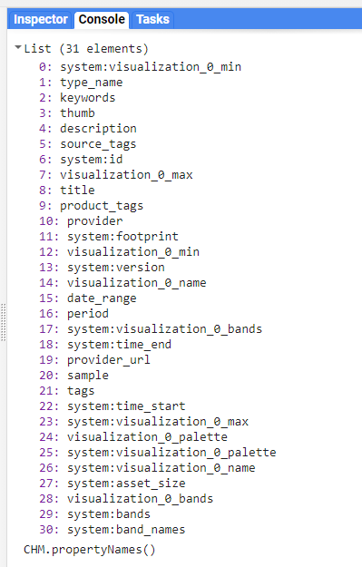
```

:::: {.bluebox2 data-latex=""}
::: {.awesomeblock data-latex="{5pt}{\faLightbulb}{darkblue}"}
El sistema de coordenadas de referencia de trabajo para todas las capas es EPSG:4326. Si se requiere cambiar de proyección se puede utilizar el método `r colorize2(".reproject")`, aunque no se recomienda hacerlo, a menos que sea estrictamente necesario.
:::
::::
\index{bandNames}
Por otro lado, la información almacenada en un ráster, usualmente está organizada en distintas bandas. Para consultar los nombres de las bandas de una imagen se utiliza el método `r colorize2(".bandNames")` (`r colorize("Fig.")` \@ref(fig:f93)). 

\newpage
`r colorize("Ejercicio 27.2")`

```{js echo = T}
// Obtener los nombres de las bandas de la imagen
CHM.bandNames();
```

```{r f93, echo = F, out.width="80%", fig.cap="Nombre de las bandas de la imagen CHM."}
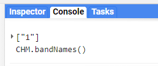
```

## Visualización de una imagen
\index{Map.addLayer}
De igual manera que los vectores y las colecciones de vectores, las imágenes se pueden agregar a la pantalla de mapa mediante la función `r colorize2("Map.addLayer")` (`r colorize("Fig.")` \@ref(fig:f94)).

`r colorize("Ejercicio 27.3")`

```{js echo = T}
// Cargar la imagen a la pantalla de mapa
Map.addLayer(CHM, 
  // Definir los valores mínimos y máximos de la imagen para su 
  // visualización
  {min: 0, max: 32}, 
  // Definir el nombre con el que se desea cargar la imagen a la pantalla 
  // de mapa
  'primera imagen');
```
```{r f94, echo = F, out.width="95%", fig.cap="Visualización de la capa de la altura del dosel."}
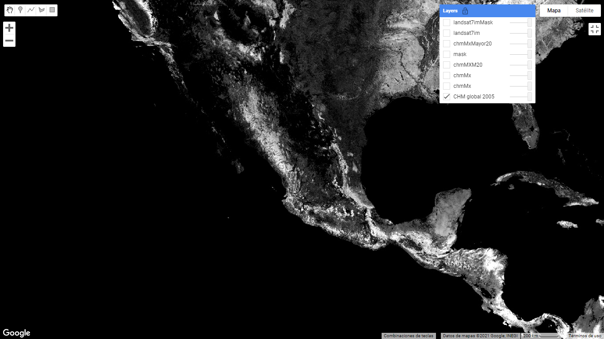
```

:::: {.bluebox2 data-latex=""}
::: {.awesomeblock data-latex="{5pt}{\faLightbulb}{darkblue}"}
La información ráster en GEE se almacena en un esquema piramidal, es decir, que existen varias copias de la imagen, en la que cada una corresponde a una escala distinta. Al visualizar una imagen en la pantalla de mapa, la imagen mostrada será la de la escala que se encuentre más cercana al nivel del zoom de la pantalla de mapa. Por ello, en algunas ocasiones al usar el Inspector y mover el zoom, el valor de un píxel puede cambiar, ya que se están consultando valores de distintas imágenes (cada una asociada a una escala distinta). Para mayores detalles visitar: https://developers.google.com/earth-engine/guides/scale
:::
::::

## Métodos comunes

### Selección de bandas {-}
\index{select}
Una vez revisados los nombres de las bandas de una imagen, se pueden seleccionar algunas de ellas mediante el método `r colorize2(".select")`. Para seleccionar una única banda solo se requiere indicar el nombre de la banda, mientras que si se desea seleccionar varias bandas, estas deben indicarse dentro de una lista. Por ejemplo (`r colorize("Fig.")` \@ref(fig:f95)):

`r colorize("Ejercicio 27.4")`

```{js, echo = T}
// Seleccionar la banda 1 de la imagen (que es la única)
var banda1 = CHM.select('1');

// Seleccionar solo las primeras cuatro bandas de la imagen
var landsat7imBands = landsat7im.select(['B1','B2','B3','B4']);
```

### Adición de nuevas propiedades o modificación de propiedades preexistentes {-}
\index{set}
Usando el método `r colorize2(".set")` se pueden modificar las propiedades preexistentes, o escribir nuevas propiedades sobre la imagen. En este caso, primero se indica el nombre de la clave, seguido de su valor correspondiente. Por ejemplo (`r colorize("Fig.")` \@ref(fig:f95)):

`r colorize("Ejercicio 27.5")`

```{js, echo = T}
// Agregar una nueva propiedad
var CHMprop1 = CHM.set('miPropiedad','miImagen');

// Modificar una propiedad preexistente
var CHMprop2 = CHM.set('title','miTítulo');
```

(ref:sub2) `bands`
(ref:sub3) `properties`

```{r f95, echo = F, out.width="80%", fig.cap="Salida de la consola tras haber seleccionado algunas bandas o agregar propiedades. Nótense los valores en las entradas de (ref:sub2) y (ref:sub3)."}
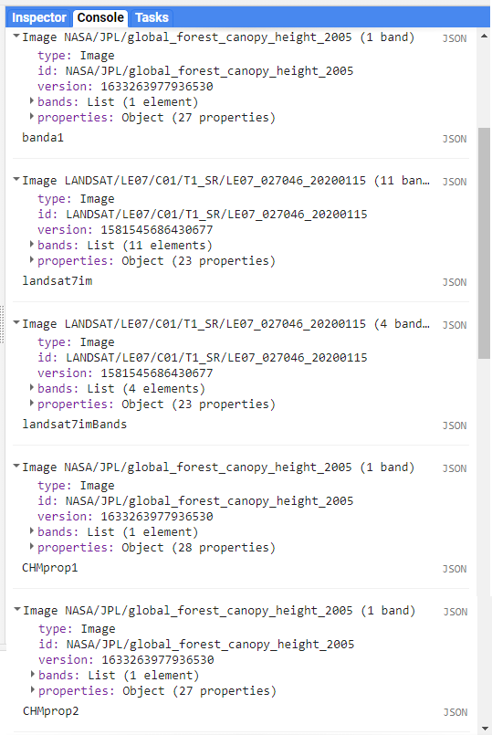
```


:::: {.bluebox2 data-latex=""}
::: {.awesomeblock data-latex="{5pt}{\faLightbulb}{darkblue}"}
Nótese que se puede sobreescribir la misma variable, pero hay que tener cuidado porque la información anterior se pierde.
:::
::::

### Sustitución de nombres de bandas {-}
\index{rename}
Por defecto, el nombre de las bandas de las imágenes suele corresponder a la letra 'B' más un número que indica el número de banda. Por ejemplo, 'B1', 'B2', 'B3', etc. En algunos casos, el usuario puede preferir sustituir estos nombres con letras que indiquen la longitud de onda que contiene cada banda. Para ello, se puede utilizar el método `r colorize2(".rename")`. En caso de que la imagen de interés conste de una sola banda y un solo nombre, se puede indicar directamente el nuevo nombre, si no, se debe pasar una lista con el nuevo nombre para cada banda. Por ejemplo (`r colorize("Fig.")` \@ref(fig:f95)):

`r colorize("Ejercicio 27.6")`

```{js, echo = T}
// Cambiar el nombre de la banda 
banda1 = banda1.rename('chm');

var landsat7imBandsRename = landsat7imBands.rename(['B','G','R','NIR']);
```

### Realización de cortes {-}
\index{clip}
Para obtener el área de una imagen únicamente de una región de interés se puede utilizar el método `r colorize2(".clip")`. Por ejemplo (`r colorize("Fig.")` \@ref(fig:f96)):

`r colorize("Ejercicio 27.7")`

```{js, echo = T}
// Cortar la imagen a la extensión del polígono de México
var chmMx = banda1.clip(MX);
```

Esto permite trabajar únicamente con la región de interés (en el ejemplo anterior, especificada en el objeto roi).

:::: {.bluebox2 data-latex=""}
::: {.awesomeblock data-latex="{5pt}{\faLightbulb}{darkblue}"}
Se sugiere evitar el uso del método `r colorize2(".clip")` a menos que sea estrictamente necesario, ya que aumenta el tiempo de procesamiento. En muchos casos se puede indicar el área de interés hasta el último paso del procesamiento, que suele implicar la exportación del resultado fuera de GEE (ver última sección de este capítulo: Exportación de una imagen).
:::
::::

### Cálculo de operaciones matemáticas {-}
\index{subtract}
\index{add}
\index{divide}
\index{multiply}
Dentro de GEE se puede realizar cualquier operación matemática entre bandas o entre imágenes. Los operadores para realizar esta operaciones son: `r colorize2(".subtract")`, `r colorize2(".add")`, `r colorize2(".divide")`, `r colorize2(".multiply")` para restar, sumar, dividir y multiplicar, respectivamente (`r colorize("Fig.")` \@ref(fig:f96)). 

`r colorize("Ejercicio 27.8")`

```{js, echo = T}
// Multiplicar la imagen por 100 para obtener el valor en cm
var chmCmMx = chmMx.multiply(100);
```

```{r f96, echo = F, out.width="95%", fig.cap="Visualización de la capa de altura del dosel en México."}
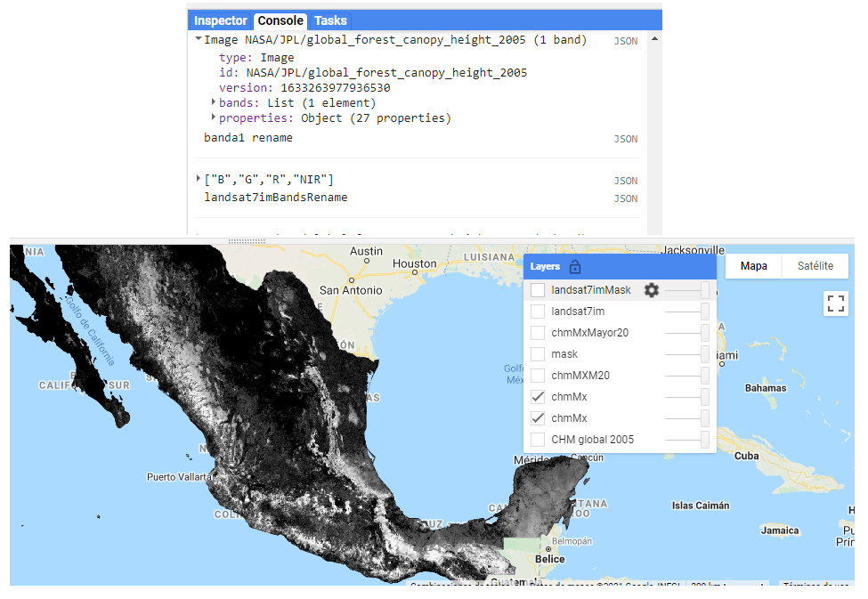
```

Además, GEE cuenta con un método de `r colorize2(".normalizedDifference")` para calcular un índice normalizado a partir de las bandas que se indiquen. Por ejemplo, para calcular el índice de vegetación de diferencia normalizada (NDVI, por sus siglas en inglés), primero se indica la banda del infrarrojo y luego la del rojo. Si se quiere realizar un índice un poco más complicado se puede calcular mediante el método `r colorize2(".expression")`. En este método se indica primero la fórmula del cálculo que se va a realizar (en formato de cadena de texto) y posteriormente se indica en un diccionario la equivalencia de los términos utilizados en la fórmula y los nombres de las bandas de la imagen. Las siguientes dos formas de calcular el NDVI obtienen el mismo resultado:
\index{normalizedDifference}
\index{expression}
```{js, echo = T}
// Calcular el ndvi con la imagen de landsat 7 obtenida previamente
var ndvi= landsat7imBands.expression( '(NIR - R) / (NIR + R)', {
  'NIR' = landsat7imBands.select('B4'),
  'R' = landsat7imBands.select('B3')
})
  // Renombrar la banda como 'ndvi'
  .rename('ndvi');
  
var ndvi2 = landsat7imBands.normalizedDifference('B4','B3')
  // Renombrar la banda como 'ndvi'
  .rename('ndvi');
```

:::: {.bluebox2 data-latex=""}
::: {.awesomeblock data-latex="{5pt}{\faLightbulb}{darkblue}"}
Si no se cambia el nombre de la banda producida por `r colorize2(".normalizedDifference")`, por defecto, esta va a recibir el nombre de 'nd'.
:::
::::

Dentro de `r colorize2("expression")` se pueden utilizar operadores como la notación estándar matemática (`+`, `-`, `/`, `*`), el módulo (`%`), el exponente (`**`), así como los operadores relacionales (`>`, `<`, `>=`, `<=`, `!=`, `==`), lógicos (`&&`, `||`, `!`, `^`) y ternarios _if then else_ (`?:`).

### Uso de operaciones relacionales, condicionales y booleanas {-}
\index{lt}
\index{lte}
\index{gt}
\index{gte}
\index{eq}
\index{neq}
Se pueden utilizar operadores relacionales, condicionales o booleanos sobre las imágenes para crear clases o máscaras. Para ello, se utilizan las siguientes notaciones: `r colorize2(".lt")`, `r colorize2(".lte")`, `r colorize2(".gt")`, `r colorize2(".gte")`, `r colorize2(".eq")`, `r colorize2(".neq")`, que equivalen a menor que (*less than*), menor que o igual (*less than or equal*), mayor que (*greater than*), mayor que o igual (*greater than or equal*), igual (*equal*) o no igual (*not equal*), respectivamente. Además, se pueden utilizar operadores relacionales para unir dos condiciones mediante `r colorize2(".and")` u `r colorize2(".or")`, es decir, y u o. Por ejemplo, la siguiente línea permite crear una máscara de las áreas que tengan valores menores o iguales a 0.2 y mayores o iguales a 0 (`r colorize("Fig.")` \@ref(fig:f97)):

`r colorize("Ejercicio 27.9")`
 
```{js, echo = T}
// Crear una imagen de los píxeles que cumplen con la condición de tener 
// valores mayores o iguales a 20
// Nótese que se utiliza la imagen con valores en m
var chmMXMask20 = chmMx.gte(20);
```

```{r f97, echo = F, out.width="95%", fig.cap="Resultado de la máscara booleana de altura del dosel."}
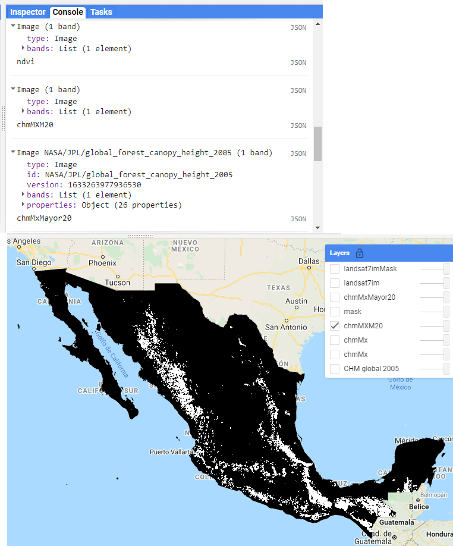
```

Otra forma de crear máscaras es indicando valores por bits. En este caso, se indica el valor del bit de interés y después se evalúa una condición sobre una banda determinada. Por ejemplo, para Landsat 8, la banda de evaluación de la calidad de la imagen corresponde a la banda 'pixel_qa'. En esta banda, el bit 5 indica una cobertura de nubes, así que primero se define una variable que indique que el bit 5 es el que será evaluado. Después se selecciona la banda 'pixel_qa' para evaluar qué píxeles tienen un valor de 0 en el bit 5 (valores a conservar) y cuáles no (valores a eliminar; `r colorize("Fig.")` \@ref(fig:f98)).
\index{bitwiseAnd}

`r colorize("Ejercicio 27.10")`

```{js, echo = T}
// Definir la regla en bits de la imagen de los valores que se desea 
// enmascarar
var nubesBit = (1 << 5);

// Seleccionar la banda de evaluación de la calidad de la imagen
var qa = landsat7im.select('pixel_qa');

// Definir una máscara donde las áreas a mantener (1) serán las áreas 
// donde el bit 5 tenga valores iguales a cero
var mask = qa.bitwiseAnd(nubesBit).eq(0);
```

```{r, echo = F, out.width="95%", fig.cap="Visualización de la máscara de Landsat 8 indicando píxeles con nubes y sin nubes."}
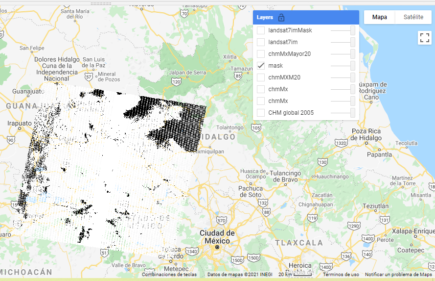
```

### Enmascaramiento {-}
\index{updateMask}
El método `r colorize2(".updateMask")` permite enmascarar los píxeles de una imagen, utilizando otra imagen como máscara que indique cuáles píxeles se deben conservar (valores de 1) y cuáles enmascarar (valores de 0). En la figura 9.9 se puede apreciar la visualización del enmascaramiento realizado a la capa que contiene la altura del dosel. Por su parte, las figuras 9.10 y 9.11 muestran la imagen Landsat 8 antes y después de realizar el enmascaramiento de nubes, respectivamente.

`r colorize("Ejercicio 27.11")`

```{js, echo = T}
// Utilizar la máscara de valores que tienen alturas >= 20 y aplicarla a 
// la imagen con los valores de alturas
var chmMxMayor20 = chmMx.updateMask(chmMXMask20);

// Aplicar la máscara a la imagen original
var landsat7imMask = landsat7im.updateMask(mask);
```

```{r, echo = F, out.width="95%", fig.cap="Resultado del enmascaramiento de la capa de altura del dosel."}
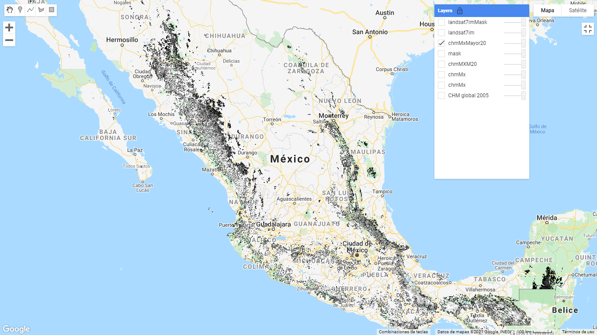
```

```{r, echo = F, out.width="95%", fig.cap="Imagen Landsat antes del enmascaramiento de nubes."}
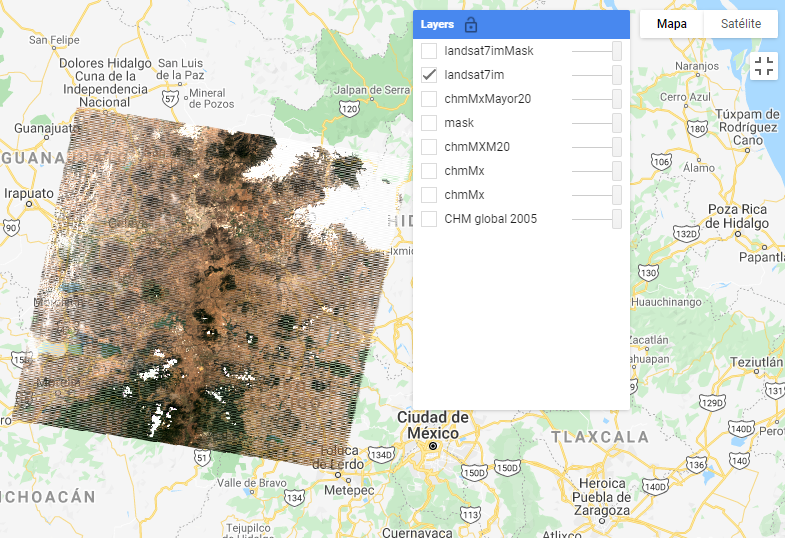
```

```{r f98, echo = F, out.width="95%", fig.cap="Imagen Landsat después del enmascaramiento de nubes. Nótese que las áreas enmascaradas ahora son transparentes."}
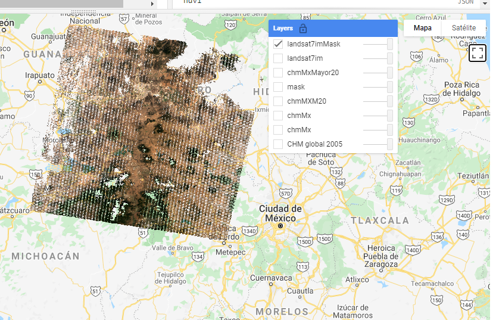
```
\index{mask}

:::: {.bluebox2 data-latex=""}
::: {.awesomeblock data-latex="{5pt}{\faLightbulb}{darkblue}"}
Aunque en GEE existe el método `r colorize2(".mask")` para enmascarar áreas de una imagen, se sugiere siempre utilizar `r colorize2(".updateMask")`. El método `r colorize2(".mask")` simplemente sustituye la máscara original de la imagen, mientras que `r colorize2(".updateMask")` combina la máscara anterior con la nueva, lo que evita desenmascarar áreas que seguramente no son de interés para el usuario.
:::
::::

### Adición de bandas {-}
\index{addBands}
El usuario puede agregar una banda al conjunto de bandas que contiene por defecto una imagen utilizando el método `r colorize2(".addBands")`. Así, se podría agregar una banda que contenga algún índice calculado con las bandas originales de la imagen. Por ejemplo:

`r colorize("Ejercicio 27.12")`

```{js, echo = T}
// Agregar la banda de alturas en cm a la banda original en m
chmMx2Bands = chmMx.addBands(chmCmMx.rename('chmCm'));

// Agregar la banda de ndvi a la imagen original
landsat7im = landsat7im.addBands(ndvi);
```

### Conversión de una imagen en un vector {-}
\index{reduceToVectors}
En algunos casos puede ser conveniente transformar una imagen en un vector, o parte de una imagen en un vector. El método para convertir una imagen en vector es `r colorize2(".reduceToVectors")` y se utiliza de la siguiente manera (`r colorize("Fig.")` \@ref(fig:f99)):

`r colorize("Ejercicio 27.13")`

```{js, echo = T}
// Convertir la máscara de valores que tienen valores de altura >= 20 a 
// vector
var chmMxMayor20Vec = chmMXMask20.reduceToVectors({
     // Usar el polígono de México para definir el área a convertir a 
     // vector
  geometry: MX,
// Definir el tipo de geometría que se desea
  geometryType: 'polygon',
// Definir el tamaño de píxel en m con el cual se va a crear el vector
  scale: 1200,
// Definir el tamaño máximo de píxeles a procesar
  maxPixels: 1e11
});
```

```{r f99, echo = F, out.width="95%", fig.cap="Visualización de la capa vector producida a partir de una imagen."}
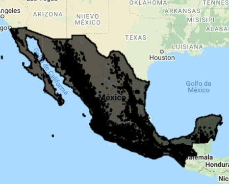
```

:::: {.bluebox2 data-latex=""}
::: {.awesomeblock data-latex="{5pt}{\faLightbulb}{darkblue}"}
En operaciones como la conversión de ráster a vector, donde se debe indicar el tamaño del píxel para realizar el proceso, el argumento de scale le indica a GEE la escala de la representación piramidal de una imagen de la cual va a tomar los valores para realizar la operación. Ver sección 9.3.
:::
::::

### Exportación de una imagen {-}
\index{Export}
En GEE se pueden exportar imágenes a los **Assets**, al **Google Drive** o al **GoogleCloud**. Debido a que el servicio más común será el de **Drive** este es el que se explicará. La función para realizar dicha exportación es `r colorize2("Export.imageToDrive")` (ver Sección 3.4). Los argumentos de esta función son: `image` (la imagen a exportar), `description` (el nombre con el que se desea guardar el archivo), `folder` (la carpeta donde se desea guardar la imagen), `scale` (la escala para exportar la imagen), `maxPixels` (el número máximo de píxeles permitido), `format` (el formato de imagen deseado), `region` (región que se desea exportar, suele corresponder al área de interés) y `crs` (sistema de coordenadas de referencia). La función es capaz de aceptar otros argumentos que se pueden consultar en la sección de **Reference** o en la pestaña de **Docs**, así como los valores por defecto de cada uno de estos parámetros. Cabe mencionar que todos los argumentos son opcionales, excepto la imagen a exportar, sin embargo, se recomienda siempre definir por lo menos los argumentos de descripción, carpeta, escala y región. En el caso de la exportación a **Assets** el argumento más importante es `assetId`, que corresponde al nombre con el que se guardará el archivo en la sección de **Assets**.

`r colorize("Ejercicio 27.14")`

```{js, echo = T}
// Exportación al drive personal
Export.image.toDrive({
  // Nombre de la imagen a exportar en GEE
  image:chmMx, 
  // Nombre con el que se va a guardar la imagen en el drive
  description:'CanopyHeightModelMX',
  // Carpeta dentro del drive en el cual se va a exportar la imagen
  folder:'carpeta_clase_GEE',
  // Tamaño en m del píxel de la imagen a exportar
  scale: 30,
  // Tamaño en m del píxel de la imagen a exportar
  maxPixels:1e12,
  // Formato en el cual se va a exportar la imagen
  fileFormat: 'GeoTIFF',
  // Región de la imagen a exportar
  region: roi1,
  // Definir sistema de coordenadas de referencia
  crs: 'EPSG:4326'
});
```

:::: {.bluebox2 data-latex=""}
::: {.awesomeblock data-latex="{5pt}{\faLightbulb}{darkblue}"}
En la experiencia de los autores, el valor máximo de píxeles que permite exportar GEE es 1e13, es decir, un uno seguido de trece ceros.
:::
::::

:::: {.bluebox2 data-latex=""}
::: {.awesomeblock data-latex="{5pt}{\faLightbulb}{darkblue}"}
El sistema de coordenadas de referencia (CRS, por sus siglas en inglés) usado en el ejemplo anterior se definió de acuerdo a un código EPSG. Estos pueden consultarse en el siguiente enlace: https://epsg.io/. Por defecto, el sistema de coordenadas de referencia de la información almacenada en GEE corresponde a coordenadas geográficas WGS84 (EPSG:4326) con un tamaño de píxel de un grado. Recuerde que para mostrar la información en la pantalla de mapa, esta se proyecta a un CRS con la clave EPSG:3857, sin embargo, dicha proyección únicamente se hace para desplegar la información, mas no transforma la información con la que el usuario está trabajando. Por lo tanto, puede haber pequeñas diferencias entre la información visualizada en la pantalla de mapa y la información exportada.
:::
::::

Es importante recordar que es necesario dar clic a las tareas en la pestaña **Tasks** para que se lleve a cabo la exportación.

#### Ejercicio A: Consulta y procesamiento de una imagen {-}

En GEE hay algunos objetos que constan de imágenes únicas, por lo tanto, se pueden utilizar directamente sobre ellas los métodos para el procesamiento de imágenes. Un ejemplo muy utilizado de este tipo de objetos es el modelo digital de elevación (DEM) producido por la misión SRTM (Shuttle Radar Topography Mission). Para buscar cuál es la localización para acceder a esta información se puede ir a la barra de búsqueda (**Search**) y escribir SRTM. Debería aparecer una ventana así (`r colorize("Fig.")` \@ref(fig:f910)):

```{r f910, echo = F, out.width="95%", fig.cap="Ejemplo de búsqueda de información en la barra de búsqueda."}
knitr::include_graphics("Img/SRTM.png")
```

Posteriormente se da clic sobre el primer resultado y debería abrirse la siguiente ventana (`r colorize("Fig.")` \@ref(fig:f911)).

```{r f911, echo = F, out.width="95%", fig.cap="Consulta de información de una imagen del repositorio de GEE."}
knitr::include_graphics("Img/SRTM_prop.png")
```

Aquí, se puede copiar la ubicación de la imagen del DEM de SRTM en los servidores de Google. Posteriormente, en la pantalla de rutinas se puede escribir la siguiente línea para guardar la imagen SRTM en un objeto nuevo llamado `dem`.

```{js, echo = T}
// Cargar la imagen con el DEM de SRTM
var dem = ee.Image('CGIAR/SRTM90_V4');
```

Posteriormente, se corta el DEM a la extensión que nos interesa. En este caso se utilizará la colección con los límites políticos del mundo que se encuentra cargada en GEE. Esta se puede buscar de igual manera que la capa de SRTM, en la barra de búsqueda. Posteriormente, se puede consultar la información que contiene la capa en la pestaña de **TABLE SCHEMA**. Por último, se aplica un filtro para seleccionar el país que nos interesa, en este caso México.
\index{filter}
\index{ee.Filter.eq}
```{js  echo = T}
// Cargar la colección de atributos con polígonos de la superficie de los 
// países
var MX = ee.FeatureCollection('USDOS/LSIB_SIMPLE/2017')
   // Filtrar para seleccionar únicamente México
  .filter(ee.Filter.eq('country_co','MX'));
```

Y se corta la imagen a la extensión del polígono de interés.
\index{clip}
```{js, echo = T}
// Cortar el DEM con el polígono de México
var demCortado = dem.clip(MX);
```

Para comparar el DEM antes y después de cortar la imagen a la extensión del polígono de interés, se cargan los dos objetos: `dem` y `demCortado`.

```{js, echo = T}
// Cargar el DEM global y el cortado (solo MX), indicando valores máximos 
// y mínimos en m
Map.addLayer(dem, {min: 0, max:4000}, 'dem');
Map.addLayer(demCortado, {min: 0, max:4000}, 'demMX');
```

Posteriormente, se define una máscara de todas las áreas que tengan una elevación menor o igual a 2500 m s.n.m. y mayor o igual a 1000 m s.n.m. Después, se aplica esta máscara al DEM cortado para mantener únicamente las áreas que cumplan con el criterio anterior.
\index{lte}
\index{and}
\index{gte}
\index{updateMask}
```{js, echo = T}
// Crear máscara de zona de interés
var mascara = demCortado.lte(2500).and(demCortado.gte(1000));
// Aplicar máscara al DEM de México
var imgEnmascarada = demCortado.updateMask(mascara);
```

A continuación, se renombrará la banda de la imagen de 'elevation' a 'elevacion' y se agrega la imagen a la pantalla de mapa.
\index{rename}
```{js, echo = T}
// Cambiar el nombre de la banda de la imagen enmascarada a elevacion
imgEnmascarada = imgEnmascarada.rename('elevacion');
// Agregar imagen enmascarada a la pantalla de mapa
Map.addLayer(imgEnmascarada,{min: 1000, max: 2500}, 'imgEnmascarada');
```

```{r, echo = F, out.width="95%", fig.cap="Visualización de las tres capas generadas: DEM sin corte, DEM con corte, DEM con corte y enmascarada."}
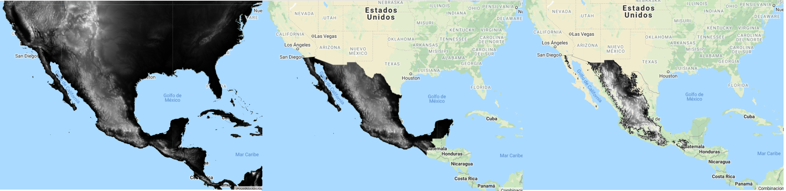
```


A continuación, se generará un gráfico para obtener un histograma de los valores de elevación del DEM. Para hacer esto, se utiliza la función `r colorize2("ui.Chart.image.histogram")` y se indica la imagen de la cual se quiere obtener el histograma (`image`), la escala en metros a la que se quiere obtener los valores del histograma (`scale`) y el número máximo de clases (`maxBuckets`). Después, se agrega este gráfico a la consola con un `r colorize2("print")` (`r colorize("Fig.")` \@ref(fig:f914)).
\index{ui.Chart.image.histogram}
```{js, echo = T}
// Crear gráfico de histograma de los valores del DEM enmascarado
var graficoHistograma = ui.Chart.image.histogram({
     // Indicar imagen de la cual se va a crear el histograma  
  image: imgEnmascarada,
  // Indicar la escala en m a la que se va a muestrear la información para  
  // obtener el histograma
  scale: 9000,
  // Indicar el número máximo de categorías (en eje x) para crear el 
  // histograma
  maxBuckets: 10
  });

print(graficoHistograma,'gráfico Histograma');
```

```{r f914, echo = F, out.width="95%", fig.cap="Histograma de valores del DEM."}
knitr::include_graphics("Img/histElevacion.png")
```

Por último, se puede exportar el resultado al **Google Drive** del usuario. En este caso se definirá un valor de `scale` de 9000 para acelerar el tiempo que requiere la exportación.
\index{Export.image.toDrive}
```{js, echo = T}
Export.image.toDrive({
  image:imgEnmascarada, 
  description:'MX_DEM1000-2500msnm',
  folder:'carpeta_clase_GEE',
  scale: 9000,
  maxPixels:1e12,
  fileFormat: 'GeoTIFF',
  region: MX,
  crs: 'EPSG:4326'
});
```


Una vez corrido el código, hay que irse a la pestaña de **Tasks** para darle clic en **Run** (correr) y comenzar a exportar la imagen al **Google Drive** (`r colorize("Fig.")` \@ref(fig:f915)). A continuación aparece una pantalla, en la cual podemos confirmar los parámetros utilizados para la exportación de la imagen, tras lo cual, se vuelve a dar clic en **Run**. Por último, el producto exportado aparecerá en la pestaña de **Tasks** con un símbolo de un engranaje girando, el cual indica que el proceso está corriendo. Además, en esta pestaña se puede consultar el tiempo de demora del trabajo de exportación. Ya que la imagen haya sido exportada al **Drive**, la tarea cambiará a color azul y el engranaje en movimiento cambiará a una palomita indicando el tiempo demorado en exportar la imagen al **Drive** (ver Fig. 2.22).

```{r f915, echo = F, out.width="95%", fig.cap="Vista de la pestaña de (ref:sub5) (tareas) para correr el trabajo de exportación."}
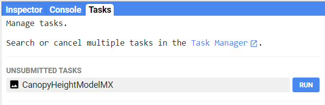
```

