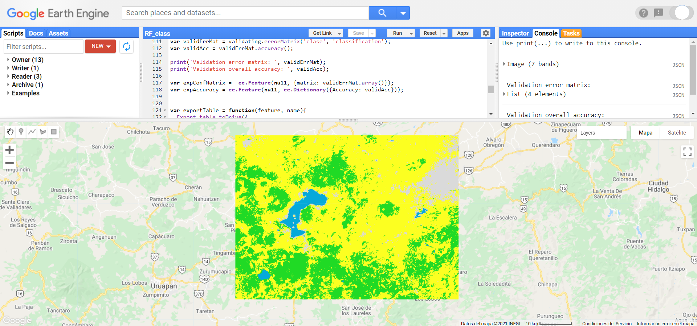
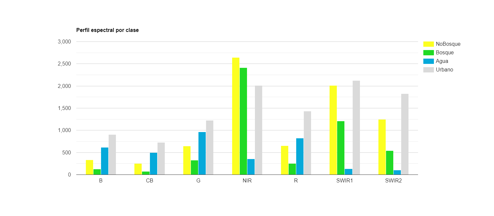

\newpage
# Clasificación supervisada

Dentro de GEE se pueden hacer clasificaciones supervisadas con algunos algoritmos populares como CART (Classification and Regression Trees), Random Forests, Naive Bayes, Gradient Tree Boost, Support Vector Machine, MaxEnt (Maximum Entropy) y Decision Trees. Como todos los demás objetos dentro de GEE tienen su propio tipo de objetos del servidor.

## Clasificadores

Los objetos `ee.Classifier` son los objetos que van a permitir trabajar con clasificadores dentro de GEE. Algunos ejemplos de estos son: `ee.Classifier.smileCART, ee.Classifier.smileRandomForest, ee.Classifier.amnhMaxent`, entre otros. De nuevo, todos los algoritmos disponibles en GEE, así como los argumentos que aceptan, se pueden consultar en la página de ayuda, en la pestaña de referencia (`Reference`) en el apartado de librerías del cliente (`Client libraries`), o también en la pestaña `Docs` bajo `ee.Classifier`.

Ejercicio 31

```{js echo = T}
var rfClassif = ee.Classifier.smileRandomForest();
```

## Realización de la fase de entrenamiento

Debido a que estos clasificadores trabajan en un esquema supervisado, requieren de la provisión de muestras de entrenamiento para entrenar al algoritmo. Esto se puede hacer directamente en la API, aunque quizás no sea lo más cómodo para el usuario. En este paso se recomienda capturar los datos de entrenamiento en algún SIG, por ejemplo, QGIS, y luego importar el archivo vector a GEE (ver sección importar datos a GEE). Una vez definido el clasificador que se va a utilizar, para entrenar al clasificador se utiliza el método `.train`. Los argumentos de esta función indican los vectores utilizados como áreas de entrenamiento, el nombre del campo que indica el esquema de clasificación dentro de la colección de vectores, así como las bandas a utilizar de la imagen.

```{js echo = T}
var trainedClassifier = rfClassif.train({
  features: training,
  classProperty: 'clase',
  inputProperties: ['CB','B','G','R','NIR','SWIR1','SWIR2']
});
```

## Obtención de la clasificación

Una vez que se tiene entrenando el clasificador, el siguiente paso consta de clasificar la imagen completa en las clases de interés. Para ello, se utiliza el método `.classify`, el cual permite hacer predicciones sobre la clase de cada píxel, a partir de los insumos indicados en la fase de entrenamiento. Por ejemplo:

```{js echo = T}
var classifiedImg = imagen.classify(trainedClassifier);
```

## Evaluación de la clasificación

La última fase de una clasificación consta de la evaluación de los resultados utilizando otro conjunto de datos que no haya sido utilizado en la fase de entrenamiento. Comúnmente a estos datos se le conoce como los datos de validación o verificación. En este caso, primero se extrae la información de las clases predichas para los datos de validación y después se compara con la información de referencia. Comúnmente, se utiliza una matriz de confusión para realizar dicha evaluación. En GEE se puede obtener esta matriz mediante el método `.errorMatrix`. Además, para calcular la precisión total de la clasificación sobre los datos de validación se utiliza el método `.accuracy`. Por ejemplo:

```{js echo = T}
var validErrMat = validacion.errorMatrix('claseRef', 'clasePred');
var validAcc = validacion.accuracy();
```

### Ejercicio: Clasificación (EjercicioF)

En este ejercicio se hará una clasificación supervisada utilizando el algoritmo Random Forests. Para ello se utilizarán siete polígonos como sitios de entrenamiento, pertenecientes a cuatro clases: Bosque, No bosque, Agua y Urbano. Estos polígonos se definirán directamente en la API a través de sus coordenadas como objetos `ee.Geometry` de tipo rectángulo. Posteriormente, cada polígono se transforma en un objeto de tipo vector (`ee.Feature`) y se le asigna la propiedad de ‘clase’ como número a través de un diccionario. Por último, se hace una colección de vectores.

```{js echo = T}
var bosque1 = ee.Geometry.Rectangle(-101.53892, 19.74148, 
  -101.51906,19.72362);
var bosque2 = ee.Geometry.Rectangle(-101.64826, 19.49264, 
  -101.62839,19.47545);
var noBosque1 = ee.Geometry.Rectangle(-101.35448, 19.65992, 
  -101.34509,19.65990);
var noBosque2 = ee.Geometry.Rectangle(-101.56907, 19.58312, 
  -101.54939,19.56435);
var urbano = ee.Geometry.Rectangle(-101.20999, 19.71300, 
  -101.19688,19.70338);
var agua1 = ee.Geometry.Rectangle(-101.60826, 19.66885, 
  -101.58569,19.64316);
var agua2 = ee.Geometry.Rectangle(-101.74686, 19.43937, 
  -101.733453,19.427012);

var poligonos = ee.FeatureCollection([
  ee.Feature(noBosque1, {'clase': 0}),
  ee.Feature(noBosque2, {'clase': 0}),
  ee.Feature(bosque1, {'clase': 1}),
  ee.Feature(bosque2, {'clase': 1}),
  ee.Feature(agua1, {'clase': 2}),
  ee.Feature(agua2, {'clase': 2}),
  ee.Feature(urbano, {'clase': 3}),
]);

Map.addLayer(poligonos, {}, 'polígonosEntrenamiento');
```

A continuación se vuelve a filtrar la colección de Landsat 8 por fecha, porcentaje de nubosidad sobre la superficie terrestre y un filtro espacial. En este caso, se usa la función `.filterBounds` que permite filtrar espacialmente la colección de acuerdo a la extensión del polígono de interés. Por último, se aplica la función para enmascarar nubes a todas las imágenes de la colección usando `.map`.

```{js echo = T}
var L8imgCol = ee.ImageCollection("LANDSAT/LC08/C01/T1_SR")
  .filterBounds(poligonos)
  .filterDate('2015-01-01','2016-01-01')
  .filter(ee.Filter.lte('CLOUD_COVER_LAND',50))
  .map(maskL8sr);
```

El siguiente paso consta de reducir la colección para generar una sola imagen con el valor promedio para todas las bandas. Después, se corta la imagen a la extensión del área de estudio. Ya que no se van a utilizar todas las bandas de la imagen para la clasificación, se indica el nombre de las bandas que se van a utilizar dentro de una lista. Por último, se van a renombrar las bandas para recordar más fácilmente el espectro de cada banda.

```{js echo = T}
var L8imgMean = L8imgCol.reduce(ee.Reducer.mean())
  .select(['B1_mean','B2_mean','B3_mean','B4_mean','B5_mean',
  'B6_mean','B7_mean'])
  .rename(['CB','B','G','R','NIR','SWIR1','SWIR2'])
  .clip(geometry);

print(L8imgMean);
```

Una vez que ya se tiene la imagen sobre la que se va a hacer la clasificación, se muestrean los valores de los píxeles que se encuentren dentro de cada polígono de los datos de entrenamiento utilizando el método `.sampleRegions`. Para esta función hay que indicar la colección de vectores que se va a utilizar, así como su propiedad que indica la clase y la escala a la que se van a muestrear los píxeles en metros. El resultado de este procedimiento corresponde a una colección de vectores, en la cual, cada vector corresponde a un píxel dentro de un polígono de entrenamiento. De tal manera, para cada vector se indica la clase a la que pertenece, así como el valor en cada una de las bandas en la imagen muestreada.

```{js echo = T}
var training = L8imgMean
  .sampleRegions({
    collection: poligonos,
    properties: ['clase'],
    scale: 30
  });
```

El siguiente paso es entrenar al clasificador utilizando la colección de vectores anterior. En este caso, se va a utilizar el algoritmo Random Forests (Breiman, 2001). Para llamar este algoritmo se utiliza `ee.Classifier.smileRandomForest`. En este caso, se utilizarán 30 árboles de clasificación. Posteriormente, se entrena este algoritmo mediante el método `.train`. Los argumentos para `.train` se pasan como un diccionario, el cual indica la colección de vectores a utilizar para el entrenamiento, el nombre de la clase objetivo y el nombre de las propiedades de la imagen, es decir, el nombre de las bandas.

```{js echo = T}
var trainedClassifier = ee.Classifier.smileRandomForest(30).train({
  features: training,
  classProperty: 'clase',
  inputProperties: ['CB','B','G','R','NIR','SWIR1','SWIR2']
});
```

:::: {.bluebox2 data-latex=""}
::: {.awesomeblock data-latex="{5pt}{\faLightbulb}{darkblue}"}
Usando al final el método `.setOutputMode` se puede cambiar la forma que el clasificador entrega los resultados para ello dentro de los paréntesis del método toca escribir entre comillas cualquiera de las siguientes opciones:

  *	Classification (por defecto): devuelve una variable nominal (clases).
  *	Regresión: devuelve una variable numérica.
  *	Probabilidad: devuelve la probabilidad de que la clasificación sea correcta.
  *	Multiprobabilidad: devuelve un arrreglo de probabilidades para cada una de las clases.
  *	Raw: devuelve un arreglo con la representación interna del proceso de clasificación. Por ejemplo los votos crudos de un modelo de múltiples árboles de decisión.
  *	Raw_regression: devuelve un arreglo con la representación interna del proceso de regresión. Por ejemplo, las preedicciones crudas de los multiples arboles de regresión.
  Resulta importante recordar que dependiendo del clasificador, algunas de estas opciones de resultado estarán disponibles o no.
:::
::::
 
Una vez entrenado el clasificador, se puede clasificar la imagen completa utilizando el método `.classify`. Como argumentos se indica el clasificador entrenado que se desea utilizar. El resultado de `.classify` va a ser un objeto de tipo `ee.Image` que contiene la clase predicha en el campo 'classification'. Por último, se visualiza en la pantalla de mapas para ver los resultados.

```{js echo = T}
var classifiedImg = L8imgMean.classify(trainedClassifier);

Map.addLayer(classifiedImg,{min:0, max:3, 
  palette:['#fcff21','#20da25','#05a9da','#dadada']},
  'Clasificación RF L8');
```

```{r, echo = F, out.width="100%", fig.cap="Visualización de la clasificación."}

```

Posteriormente, se puede hacer un gráfico para analizar el perfil espectral de las clases de interés. Para hacer esto, primero se agrega la banda con la clasificación a la imagen que contiene la media de la reflectancia de la superficie (`L8imgMean`). Después, se utiliza la función `ui.Chart.image.byClass` para crear un gráfico por clase. Como argumentos a esta función se indica el nombre de la banda que contiene las categorías de la clasificación ('classification'), el reductor que se va a utilizar para resumir los valores por clase (`ee.Reducer.mean`), las regiones de las cuales se va a obtener esta información (polígonos), las etiquetas de las clases ['NoBosque','Bosque','Agua','Urbano'], la escala en m de trabajo para aplicar el reductor (240) y algunas opciones para ponerle título y asignar los colores al gráfico. Por último, hay que imprimir el gráfico con la función de `print` y el gráfico aparecerá en la consola.

```{js echo = T}
var imgConClass = L8imgMean.addBands(classifiedImg);
  
var chartClassSpec = ui.Chart.image.byClass({
  image: imgConClass,
  classBand: 'classification',
  reducer: ee.Reducer.mean(),
  region: poligonos,
  classLabels: ['NoBosque','Bosque','Agua','Urbano'],
  scale: 240
}).setOptions({
  title: 'Perfil espectral por clase',
  colors: ['#fcff21','#20da25','#05a9da','#dadada']
});

print(chartClassSpec);
```

```{r, echo = F, out.width="100%", fig.cap="Perfil espectral promedio por clase."}

```

Una vez que se tiene la clasificación del área de interés, se van a cargar los datos de verificación para calcular la matriz de error y la precisión total de la clasificación. Primero se carga la información de los polígonos de verificación.

```{js echo = T}
var bosque3 = ee.Geometry.Rectangle(-101.62016,19.61895, 
  -101.60543,19.60492);
var noBosque3 = ee.Geometry.Rectangle(-101.313746,19.716531, 
  -101.306380,19.709505);
var urbano2 = ee.Geometry.Rectangle(-101.609880,19.517665, 
  -101.602523,19.510752);
var agua3 = ee.Geometry.Rectangle(-101.272720,19.612100, 
  -101.272668,19.611594);

var poligonosVerif = ee.FeatureCollection([
  ee.Feature(noBosque3, {'clase': 0}),
  ee.Feature(bosque3, {'clase': 1}),
  ee.Feature(agua3, {'clase': 2}),
  ee.Feature(urbano2, {'clase': 3}),
]);
```

El siguiente paso es extraer la información de la imagen clasificada, de acuerdo con la extensión de los datos de verificación. Este paso es exactamente igual al que se hizo con los datos de entrenamiento, pero ahora utilizando los datos de verificación y la imagen clasificada en lugar de la imagen de reflectancia. De igual manera, el resultado de este paso es una colección de vectores.

```{js echo = T}
var validating = classifiedImg
  .sampleRegions({
  collection: poligonosVerif,
  properties: ['clase'],
  scale: 30,
});
```

A continuación, se calcula la matriz de error mediante el método `.errorMatrix` indicando en primer lugar el campo de la clase de referencia (‘clase’) y en segundo lugar el campo de la predicción (‘classification’). Después, se van a mostrar estos dos objetos en la consola mediante `print` para inspeccionar su contenido.

```{js echo = T}
var validErrMat = validating.errorMatrix('clase', 'classification');
var validAcc = validErrMat.accuracy();

print('Validation error matrix: ', validErrMat);
print('Validation overall accuracy: ', validAcc);
```

:::: {.bluebox2 data-latex=""}
::: {.awesomeblock data-latex="{5pt}{\faLightbulb}{darkblue}"}
Por defecto la imagen que se obtiene de una función `.classify` obtiene el nombre de ‘classification’, por eso la propiedad que se muestrea en el paso de `.sampleRegions` y con la que se hace la matriz de error `.errorMatrix` se llama ‘classification’.
:::
::::

Para exportar estos resultados primero hay que pasar los datos a tipo vector. Para ello, se va a crear un vector sin geometría (que es lo que indica el `null` en el primer campo del `ee.Feature`), seguido de un diccionario que contiene los datos que se desean exportar (que podrían interpretarse como una tabla de atributos). En el caso de la matriz de error, primero se debe convertir a un arreglo mediante el método `.array`. 

```{js echo = T}
var expConfMatrix =  ee.Feature(null, {matrix: validErrMat.array()});
var expAccuracy = ee.Feature(null, ee.Dictionary({Accuracy: validAcc}));
```

Posteriormente se define una función para exportar (`ExportTable`) y se utiliza para exportar la matriz de error y el valor de precisión total. Esta función toma dos argumentos, el objeto a exportar y el nombre que se le va a dar al archivo a exportar. Debido a que la función `Export.table.toDrive` sólo permite exportar objetos de tipo `ee.FeatureCollection`, se debe meter a los objetos de tipo `ee.Feature` en un contenedor `ee.FeatureCollection`. Por último, se debe indicar que el formato para guardar el archivo es uno separado por comas (CSV) y se puede indicar el folder dentro del que se quiere guardar la tabla exportada.

```{js echo = T}
var exportTable = function(feature, name){
  Export.table.toDrive({
    collection: feature,
    description: name,
    folder: 'Clasificacion_RF',
    fileFormat: 'CSV'
 });
};

exportTable(ee.FeatureCollection(expConfMatrix), 'confMatrix');
exportTable(ee.FeatureCollection(expAccuracy), 'validAcc');
```
