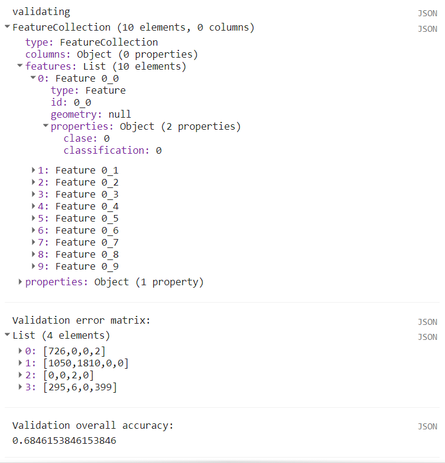

\newpage
# Clasificación supervisada

Una clasificación supervisada se refiere al proceso en el cual se obtiene un mapa temático a partir de imágenes satelitales u otro tipo de información generada mediante sensores remotos. Este tipo de procedimiento tiene el objetivo de asociarle una etiqueta a cada píxel de una imagen, que puede constar de, por ejemplo, una clase de tipo de vegetación o uso de suelo (Chuvieco, 1995). Las clasificaciones se pueden ver como una interpretación de la reflectancia de una imagen en un sistema de clases de interés y normalmente constan de procedimientos en los cuales se entrena un algoritmo a reconocer estas clases, a partir de muestras otorgadas por el usuario (Chuvieco, 1995). Generalmente, el proceso de una clasificación supervisada implica los siguientes pasos: 1) obtención de los datos de entrenamiento, 2) selección del clasificador, 3) entrenamiento del clasificador basado en los datos de entrenamiento, 4) obtención de la clasificación, 5) registro de los datos de verificación y 6) verificación de la clasificación. En este capítulo, primero se describirá cada uno de estos pasos junto con las funciones y métodos utilizados y al final se integrarán dichos pasos en un ejercicio práctico.

Dentro de GEE se pueden hacer clasificaciones supervisadas con algunos algoritmos populares como CART (Classification and Regression Trees; Breiman _et al_., 1984), Random Forests (Breiman, 2001), Naive Bayes (Webb, 2011), Gradient Tree Boost (Friedman, 2001), Support Vector Machine (Cortes y Vapnik, 1995), MaxEnt (Maximum Entropy; Phillips _et al_., 2004) y Decision Trees (Quinlan, 1986). Como todos los demás objetos dentro de GEE, tienen su propio tipo de objetos del servidor.

## Clasificadores
\index{ee.Classifier}
Los objetos `r colorize2("ee.Classifier")` son los que van a permitir trabajar con clasificadores dentro de GEE. Algunos ejemplos de estos son: `r colorize2("ee.Classifier.smileCART")`, `r colorize2("ee.Classifier")` `r colorize2(".smileRandomForest")`, `r colorize2("ee.Classifier.amnhMaxent")`, entre otros. De nuevo, todos los algoritmos disponibles en GEE, así como los argumentos que aceptan, se pueden consultar en la página de ayuda, en la pestaña de referencia (**Reference**) en el apartado de bibliotecas del cliente (**Client libraries**), o también en la pestaña **Docs** bajo `r colorize2("ee.Classifier")`. Cabe destacar que cada clasificador tiene diferentes argumentos. Por ejemplo, para el clasificador de random forests, los argumentos incluyen: el número de árboles (`numberOfTrees`), las variables utilizadas por árbol aleatorio (`variablesPerSplit`), la población mínima de hoja (`minLeafPopulation`), la fracción de los datos de entrada para entrenar y verificar el algoritmo (`bagFraction`), el número máximo de nodos (`maxNodes`) y el número para hacer replicables los resultados (`seed`). Para consultar una descripción más detallada de este algoritmo y sus argumentos ver Breiman (2001).

`r colorize("Ejercicio 32")`

```{js echo = T}
var rfClassif = ee.Classifier.smileRandomForest(500);
```

:::: {.bluebox2 data-latex=""}
::: {.awesomeblock data-latex="{5pt}{\faLightbulb}{darkblue}"}
Usando al final el método `r colorize2(".setOutputMode")` sobre un clasificador se puede cambiar la forma en la que el clasificador entrega los resultados. Para ello, dentro de los paréntesis del método hay que escribir cualquiera de las siguientes opciones:

  *	'CLASSIFICATION' (clasificación, por defecto): devuelve una variable nominal (clases).
  *	'REGRESSION' (regresión): devuelve una variable numérica.
  *	'PROBABILITY' (probabilidad): devuelve la probabilidad de que la clasificación sea correcta.
  *	'MULTIPROBABILITY' (multiprobabilidad): devuelve un arreglo de probabilidades para cada una de las clases.
  *	'RAW' (crudo): devuelve un arreglo con la representación interna del proceso de clasificación. Por ejemplo, los votos crudos de un modelo de múltiples árboles de decisión como random forests.
  *	'RAW_REGRESSION' (regresión cruda): devuelve un arreglo con la representación interna del proceso de regresión. Por ejemplo, las predicciones crudas de los múltiples árboles de regresión.
  Resulta importante recordar que, dependiendo del clasificador, algunas de estas opciones de resultado estarán disponibles o no.
:::
::::

## Realización de la fase de entrenamiento
\index{train}
Debido a que estos clasificadores trabajan en un esquema supervisado, requieren de la provisión de muestras de entrenamiento para entrenar al algoritmo. Esto se puede hacer directamente en la API, aunque quizás no sea lo más cómodo para el usuario. En este paso se recomienda capturar los datos de entrenamiento en algún SIG, por ejemplo, QGIS, y luego importar el archivo vector a GEE (ver sección de importación de información a GEE). Una vez definido el clasificador que se va a utilizar, se utiliza el método `r colorize2(".train")` para entrenarlo, utilizando las muestras provistas. Los argumentos de este método indican la colección de vectores que contiene las áreas de entrenamiento (`features`), el nombre del campo que indica el esquema de clasificación dentro de la colección de vectores (`classProperty`), así como las bandas a utilizar de la imagen (`inputProperties`).

```{js echo = T}
var trainedClassifier = rfClassif.train({
  features: training,
  classProperty: 'clase',
  inputProperties: ['CB','B','G','R','NIR','SWIR1','SWIR2']
});
```

## Obtención de la clasificación
\index{classify}
Una vez que se tiene entrenando el clasificador, el siguiente paso consta de clasificar la imagen completa en las clases de interés. Para ello, se utiliza el método `r colorize2(".classify")`, el cual permite hacer predicciones sobre la clase de cada píxel a partir de las predicciones realizadas por el algoritmo entrenado. Por ejemplo:

```{js echo = T}
var classifiedImg = imagen.classify(trainedClassifier);
```

## Evaluación de la clasificación
\index{errorMatrix}
\index{accuracy}
La última fase de una clasificación consta de la evaluación de los resultados utilizando otro conjunto de datos que no haya sido empleado en la fase de entrenamiento. A estos datos se les conoce como los datos de validación o verificación. Para evaluar una clasificación, primero se extrae la información de las clases predichas para los datos de validación y después se compara con la información de referencia. Comúnmente, se utiliza una matriz de confusión para realizar dicha evaluación, la cual se puede obtener mediante el método `r colorize2(".errorMatrix")`. Además, para calcular la precisión total de la clasificación sobre los datos de validación se utiliza el método `r colorize2(".accuracy")`. Por ejemplo:

```{js echo = T}
var validErrMat = validacion.errorMatrix('claseRef', 'clasePred');
var validAcc = validacion.accuracy();
```

#### Ejercicio E: Clasificación {-}

En este ejercicio se hará una clasificación supervisada utilizando el algoritmo random forests. Para ello se utilizarán siete polígonos como sitios de entrenamiento, pertenecientes a cuatro clases: Bosque, No bosque, Agua y Urbano. Estos polígonos se definirán directamente en la API a través de sus coordenadas como objetos `r colorize2("ee.Geometry")` de tipo rectángulo. Posteriormente, cada polígono se transforma en un objeto de tipo vector (`r colorize2("ee.Feature")`) y se le asigna la propiedad de 'clase' como número a través de un diccionario. Por último, se hace una colección de vectores (`r colorize("Fig.")` \@ref(fig:fc121)).

```{js echo = T}
// Definición de datos de entrenamiento
var bosque1 = ee.Geometry.Rectangle(-101.53892, 19.74148, 
  -101.51906,19.72362);
var bosque2 = ee.Geometry.Rectangle(-101.64826, 19.49264, 
  -101.62839,19.47545);
var noBosque1 = ee.Geometry.Rectangle(-101.35448, 19.65992, 
  -101.34509,19.64990);
var noBosque2 = ee.Geometry.Rectangle(-101.56907, 19.58312, 
  -101.54939,19.56435);
var urbano = ee.Geometry.Rectangle(-101.20999, 19.71300, 
  -101.19688,19.70338);
var agua1 = ee.Geometry.Rectangle(-101.60826, 19.66885, 
  -101.58569,19.64316);
var agua2 = ee.Geometry.Rectangle(-101.74686, 19.43937, 
  -101.733453,19.427012);

// Definición de colección de vectores
var poligonos = ee.FeatureCollection([
  ee.Feature(noBosque1, {'clase': 0}),
  ee.Feature(noBosque2, {'clase': 0}),
  ee.Feature(bosque1, {'clase': 1}),
  ee.Feature(bosque2, {'clase': 1}),
  ee.Feature(agua1, {'clase': 2}),
  ee.Feature(agua2, {'clase': 2}),
  ee.Feature(urbano, {'clase': 3}),
]);

// Agregar a pantalla de mapas
Map.addLayer(poligonos, {}, 'polígonosEntrenamiento');
```

```{r fc121, echo = F, out.width="80%", fig.cap="Visualización de los sitios de entrenamiento."}
knitr::include_graphics("Img/polyTrain.png")
```

Antes de pasar al filtrado de la colección de Landsat 8 y enmascarar las nubes, habrá que volver a definir la función `maskL8sr`, que es la misma que se definió en el capítulo 10 en el Ejercicio C: Enmascaramiento de nubes, cálculo de índices y reducción:
\index{function}
```{js, echo = T}
// Crear función para enmascarar nubes
function maskL8sr(image) {
  var cloudShadowBitMask = (1 << 3);
  var cloudsBitMask = (1 << 5);
  var qa = image.select('pixel_qa');
  var mask = qa.bitwiseAnd(cloudShadowBitMask).eq(0)
                 .and(qa.bitwiseAnd(cloudsBitMask).eq(0));
  return image.updateMask(mask);
}
```

A continuación se vuelve a filtrar la colección de Landsat 8 por fecha, porcentaje de nubosidad sobre la superficie terrestre y un filtro espacial. En este caso se usa el método `r colorize2(".filterBounds")`, que permite filtrar espacialmente la colección de acuerdo a la extensión del polígono de interés. Por último, se aplica la función para enmascarar nubes a todas las imágenes de la colección usando `r colorize2(".map")`.
\index{filterBounds}
\index{map}
```{js echo = T}
// Filtrar colección y aplicar máscara de nubes
var L8imgCol = ee.ImageCollection('LANDSAT/LC08/C01/T1_SR')
  .filterBounds(poligonos)
  .filterDate('2015-01-01','2016-01-01')
  .filter(ee.Filter.lte('CLOUD_COVER_LAND',50))
  .map(maskL8sr);
```

El siguiente paso consiste en reducir la colección para generar una sola imagen con el valor promedio para todas las bandas. Ya que no se van a utilizar todas las bandas de la imagen para la clasificación, se indica el nombre de las bandas que se van a utilizar dentro de una lista. Por último, se van a renombrar las bandas para recordar más fácilmente el espectro de cada una.
\index{reduce}
\index{ee.Reducer.mean}
```{js echo = T}
// Reducir, cortar, seleccionar y renombrar bandas
var L8imgMean = L8imgCol.reduce(ee.Reducer.mean())
  .select(['B1_mean','B2_mean','B3_mean','B4_mean','B5_mean',
  'B6_mean','B7_mean'])
  .rename(['CB','B','G','R','NIR','SWIR1','SWIR2']);
```

Posteriormente se corta la imagen para quedarnos únicamente con el área de interés. Para ello, primero se define  un área de interés y después se corta la imagen con ese objeto.
\index{clip}
```{js echo = T}
// Definir el área de interés
var geometry = ee.Geometry.Polygon(
        [[[-101.82737418916153, 19.836437094032178],
          [-101.82737418916153, 19.368119068204525],
          [-101.15171500947403, 19.368119068204525],
          [-101.15171500947403, 19.836437094032178]]]);
          
// Cortar la imagen a la geometría del área de interés
L8imgMean = L8imgMean.clip(geometry);
```

Una vez que ya se tiene la imagen sobre la que se va a hacer la clasificación, se muestrean los valores de los píxeles que se encuentren dentro de cada polígono de los datos de entrenamiento utilizando el método `r colorize2(".sampleRegions")`. Para este proceso hay que indicar la colección de vectores que se va a utilizar, así como su propiedad que indica la clase y la escala a la que se van a muestrear los píxeles en metros. El resultado de este procedimiento corresponde a una colección de vectores, en la cual cada vector corresponde a un píxel dentro de un polígono de entrenamiento. De tal manera, para cada vector se indica la clase a la que pertenece, así como el valor en cada una de las bandas en la imagen muestreada (`r colorize("Fig.")` \@ref(fig:fc122)).
\index{sampleRegions}
```{js echo = T}
// Muestrear regiones 
var training = L8imgMean
  .sampleRegions({
    // colección de vectores a utilizar
    collection: poligonos,
    // propiedad que se desea mantener en los vectores de la colección
    properties: ['clase'],
    // tamaño de píxel
    scale: 30
  });
```

El siguiente paso es entrenar al clasificador utilizando la colección de vectores anterior. En este caso, se va a utilizar el algoritmo random forests (Breiman, 2001), el cual se llama utilizando `r colorize2("ee.Classifier.smileRandomForest")`. En este ejercicio se utilizarán 30 árboles de clasificación, que es el único argumento obligatorio. Los demás argumentos opcionales pueden ser consultados en la sección de **Reference** o en la pestaña de **Docs** e incluyen parámetros como el número de variables a utilizar por división y el número máximo de nodos, entre otros.  Posteriormente, se entrena este algoritmo mediante el método `r colorize2(".train")` y se pasan algunos argumentos adicionales dentro de un diccionario, como: la colección de vectores a utilizar para el entrenamiento (`features`), el nombre de la clase objetivo (`classProperty`) y el nombre de las propiedades de la imagen (`inputProperties`), es decir, el nombre de las bandas (`r colorize("Fig.")` \@ref(fig:fc122)).
\index{ee.Classifier.smileRandomForest}
\index{train}
```{js echo = T}
// Entrenamiento del clasificador
var trainedClassifier = ee.Classifier.smileRandomForest(30).train({
  // Vectores con la información extraída en el paso anterior
  features: training,
  // Propiedad que indica la clase de cobertura
  classProperty: 'clase',
  // Nombres de las propiedades de la imagen
  inputProperties: ['CB','B','G','R','NIR','SWIR1','SWIR2']
});
```

```{r fc122, echo = F, out.width="95%", fig.cap="Salida de la consola de los primeros veinte puntos de entrenamiento con la información del ráster, así como del clasificador entrenado. Nótese que el total de puntos de validación es de más de 5000 puntos, pero se muestran solo los primeros 20 para ejemplificar el tipo de salida."}

```

:::: {.bluebox2 data-latex=""}
::: {.awesomeblock data-latex="{5pt}{\faLightbulb}{darkblue}"}
Generalmente se menciona que el utilizar un mayor número de árboles en el algoritmo Random Forest permite obtener mejores resultados, sin embargo, dependiendo del conjunto de datos utilizado existe un umbral a partir del cual aumentar el número de árboles no resulta en una mejoría significativa de la clasificación. Consultar Oshiro _et al_. (2012) para ver una evaluación del efecto del número de árboles sobre las capacidades de clasificación.
:::
::::

Posteriormente, se puede clasificar la imagen completa utilizando el método `r colorize2(".classify")` e indicando como argumento al algoritmo entrenado. El resultado de `r colorize2(".classify")` va a ser un objeto de tipo `r colorize2("ee.Image")` que contiene la clase predicha en la banda 'classification'. Por último, se visualiza el resultado en la pantalla de mapas (`r colorize("Fig.")` \@ref(fig:fc123)).
\index{classify}
```{js echo = T}
// Usar el clasificador entrenado sobre toda la imagen
var classifiedImg = L8imgMean.classify(trainedClassifier);

// Visualizar resultado
Map.addLayer(classifiedImg,{min:0, max:3, 
  palette:['#fcff21','#20da25','#05a9da','#dadada']},
  'Clasificación RF L8');
```

```{r fc123, echo = F, out.width="95%", fig.cap="Visualización de la clasificación."}
knitr::include_graphics("Img/RFClass.png")
```

Después, se puede hacer un gráfico para analizar el perfil espectral de las clases de interés. Para hacer esto, primero se agrega la banda con la clasificación a la imagen que contiene la media de la reflectancia de la superficie (`L8imgMean`). Después, se utiliza la función `r colorize2("ui.Chart.image.byClass")` para crear un gráfico por clase. Como argumentos a esta función se indica la imagen a utilizar (`image`), el nombre de la banda que contiene las categorías de la clasificación (`classBand`), el reductor que se va a utilizar para resumir los valores por clase (`reducer`), las regiones de las cuales se va a obtener esta información (`region`), las etiquetas de las clases (`classLabels`), la escala en m de trabajo para aplicar el reductor (`scale`) y algunas opciones para ponerle título y asignar los colores al gráfico (argumentos dentro de `r colorize2(".setOptions")`). Por último, hay que imprimir el gráfico con la función de `r colorize2("print")` y el gráfico aparecerá en la consola (`r colorize("Fig.")` \@ref(fig:fc124)).
\index{ui.Chart.image.byClass}
```{js echo = T}
// Agregar clasificación como banda
var imgConClass = L8imgMean.addBands(classifiedImg);

// Hacer gráfico de barras
var chartClassSpec = ui.Chart.image.byClass({
  // Imagen a utilizar para construir el gráfico
  image: imgConClass,
  // Banda que contiene las clases
  classBand: 'classification',
  // Reductor a utilizar
  reducer: ee.Reducer.mean(),
  // Regiones a partir de las cuales se va a construir el 
  // gráfico
  region: poligonos,
  // Etiquetas de las clases
  classLabels: ['NoBosque','Bosque','Agua','Urbano'],
  // Tamaño de píxel
  scale: 240
  // Definir más opciones para el gráfico
}).setOptions({
  // Título del gráfico
  title: 'Perfil espectral por clase',
  // Colores a utilizar
  colors: ['#fcff21','#20da25','#05a9da','#dadada']
});

print(chartClassSpec);
```

```{r fc124, echo = F, out.width="95%", fig.cap="Perfil espectral promedio por clase."}
knitr::include_graphics("Img/SpectralSignClass.png")
```

Una vez que se tiene la clasificación del área de interés, se van a cargar los datos de verificación para calcular la matriz de error y la precisión total de la clasificación. Primero se carga la información de los polígonos de verificación.

```{js echo = T}
// Definción de áreas de verificación
var bosque3 = ee.Geometry.Rectangle(-101.62016,19.61895, 
  -101.60543,19.60492);
var noBosque3 = ee.Geometry.Rectangle(-101.313746,19.716531, 
  -101.306380,19.709505);
var urbano2 = ee.Geometry.Rectangle(-101.609880,19.517665, 
  -101.602523,19.510752);
var agua3 = ee.Geometry.Rectangle(-101.272720,19.612100, 
  -101.272668,19.611594);

// Creación de colección de verificación
var poligonosVerif = ee.FeatureCollection([
  ee.Feature(noBosque3, {'clase': 0}),
  ee.Feature(bosque3, {'clase': 1}),
  ee.Feature(agua3, {'clase': 2}),
  ee.Feature(urbano2, {'clase': 3}),
]);
```

El siguiente paso es extraer la información de la imagen clasificada, de acuerdo con la extensión de los datos de verificación. Este paso es exactamente igual al que se hizo con los datos de entrenamiento, pero ahora utilizando los datos de verificación y la imagen clasificada en lugar de la imagen de reflectancia. De igual manera, el resultado de este paso es una colección de vectores (`r colorize("Fig.")` \@ref(fig:fc125)).
\index{sampleRegions}
```{js echo = T}
// Muestrear imagen
var validating = classifiedImg
  .sampleRegions({
  collection: poligonosVerif,
  properties: ['clase'],
  scale: 30,
});
```

A continuación, se calcula la matriz de error mediante el método `r colorize2(".errorMatrix")` indicando, en primer lugar, el campo de la clase de referencia ('clase') y, en segundo lugar, el campo de la predicción ('classification'). Posteriormente, se calcula la precisión total de clasificación a partir de esta matriz de error. Después, se van a mostrar estos dos objetos en la consola mediante `r colorize2("print")` para inspeccionar su contenido (`r colorize("Fig.")` \@ref(fig:fc125)).
\index{errorMatrix}
\index{accuracy}
```{js echo = T}
// Obtener matriz de confusión y precisión
var validErrMat = validating.errorMatrix('clase', 'classification');
var validAcc = validErrMat.accuracy();

print('Validation error matrix: ', validErrMat);
print('Validation overall accuracy: ', validAcc);
```

```{r fc125, echo = F, out.width="80%", fig.cap="Salida de la consola de los primeros diez puntos de validación, matriz de error (error matrix) y precisión total (overall accuracy). Nótese que el total de puntos de validación es de 4290, pero se muestran solo los primeros diez para ejemplificar el tipo de salida."}

```

:::: {.bluebox2 data-latex=""}
::: {.awesomeblock data-latex="{5pt}{\faLightbulb}{darkblue}"}
Por defecto, la imagen que se obtiene de un método `r colorize2(".classify")` lleva el nombre de 'classification', por eso la propiedad que se muestrea en el paso de `r colorize2(".sampleRegions")` y con la que se hace la matriz de error `r colorize2(".errorMatrix")` se llama 'classification'.
:::
::::

Para exportar estos resultados primero hay que pasar los datos a tipo vector. Para ello, se va a crear un vector sin geometría (que es lo que indica el `null` en el primer campo del `r colorize2("ee.Feature")`), seguido de un diccionario que contiene los datos que se desea exportar (que podrían interpretarse como una tabla de atributos). En el caso de la matriz de error, primero se debe convertir a un arreglo mediante el método `r colorize2(".array")`. 

```{js echo = T}
// Transformarlos en vectores
var expConfMatrix =  ee.Feature(null, {matrix: validErrMat.array()});
var expAccuracy = ee.Feature(null, ee.Dictionary({Accuracy: validAcc}));
```

Posteriormente, se define una función (`ExportTable`) para exportar la matriz de error y el valor de la precisión total. Esta función toma dos argumentos: el objeto a exportar y el nombre que se le va a dar al archivo a exportar. Debido a que la función `r colorize2("Export.table.toDrive")` solo permite exportar objetos de tipo `r colorize2("ee.FeatureCollection")`, se debe meter a los objetos de tipo `r colorize2("ee.Feature")` en un contenedor `r colorize2("ee.FeatureCollection")`. Por último, se debe indicar que el formato para guardar el archivo es uno separado por comas (CSV) y se puede indicar la carpeta dentro de la que se quiere guardar la tabla exportada.
\index{Export.table.toDrive}
```{js echo = T}
// Definir función de exportación
var exportTable = function(feature, name){
  Export.table.toDrive({
    // Colección de vectores a exportar
    collection: feature,
    // Nombre para guardar el archivo
    description: name,
    // Carpeta donde se guardará el archivo
    folder: 'Clasificacion_RF',
    // Formato del archivo
    fileFormat: 'CSV'
 });
};

// Exportar a Google Drive
// Usar la función exportTable
exportTable(ee.FeatureCollection(expConfMatrix), 'confMatrix');
exportTable(ee.FeatureCollection(expAccuracy), 'validAcc');
```
