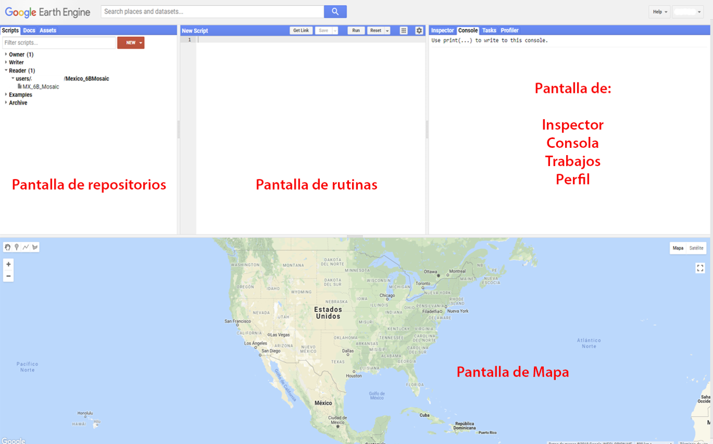

\newpage
# ¿Qué es Google Earth Engine?

Google Earth Engine es una API (Application Program Interface) que permite tener acceso y hacer uso de los servidores de Google, así como de un amplio repositorio de información geográfica, por ejemplo: acervos para todo el mundo de imágenes Landsat (1-8), MODIS, Sentinel (1-3, 5), SRTM, AVHRR, GOESS, capas como el WorldClim, límites políticos, densidad poblacional, cuencas, WWF watersheds (cuencas), entre otras.

# Ventajas

Entre las principales ventajas de utilizar esta API radica en: 

1. los datos pueden ser consultados directamente en la nube, por lo que no requieren ser descargados para trabajar con ellos (lo que ahorra tiempo y espacio de almacenamiento para el usuario).
2. el procesamiento se hace en la nube utilizando el poder de cómputo asignado para la API, el cual supera el potencial de cualquier computadora de uso personal (lo cual permite realizar operaciones que de otra manera son imposibles).
3. muchos datos se encuentran en distintos niveles de procesamiento, por lo cual, se pueden utilizar sin tener que realizar el pre procesamiento, lo cual facilita su uso (p.ej., Landsat datos crudos (raw data), o reflectancia en la superficie de la atmósfera (top of atmosphere) o reflectancia en la superficie terrestre (Surface reflectance))
4. se pueden realizar consultas basadas en los metadatos lo cual permite limitar las imágenes a utilizar por área de interés, fecha de registro, características de nubosidad, geometría del registro (azimut, ángulo de elevación, entre otros), u otras propiedades de los productos.
Otra gran ventaja de la plataforma radica en que los códigos se guardan en la sesión de cada usuario. Esto permite mantener un control de los códigos y automáticamente se genera un registro histórico (parecido al git), lo cual facilita el seguimiento y comparación de cambios entre las versiones (y permite revertir a versiones anteriores). Además, se pueden generar repositorios compartidos para generar proyectos colaborativos. En estos códigos se pueden realizar distintos tipos de procesamientos como aplicar filtros, realizar operaciones entre capas, cálculo de capas, métricas de textura, segmentación de objetos, reproyecciones, cálculo de estadísticas por regiones o de imágenes enteras, clasificaciones, entre otras.

# Javascript o Python

La API permite trabajar mediante la programación en lenguaje Javascript o Python. La primera tiene una interfaz gráfica que resulta más amigable con el usuario. Además, únicamente requiere de una conexión a internet y un navegador. Toda la información del usuario es guardada en la cuenta asociada de Google en dicha plataforma. Por el contrario, la API de Python requiere de la instalación de diversos componentes en la computadora que se va a utilizar y una conexión a internet. En esta API no se cuenta con una interfaz gráfica y todo se realiza mediante la programación de comandos. Adicionalmente, la API de Javascript es la que cuenta con mayor documentación y ayuda, por lo cual, los autores consideramos que resulta la más sencilla de utilizar. Sin embargo, para algún usuario que utilice Python, la API de este lenguaje puede resultar más sencilla de utilizar ya que no requiere de aprender un nuevo lenguaje de programación.
Javascript
La sintaxis de JavaScript tiene algunas peculiaridades que deben cumplirse para que se pueda correr el código sin problemas. Entre la sintaxis básica se puede considerar los siguientes puntos:

1. Es un lenguaje sensible a mayúsculas y minúsculas. De tal manera que a puede ser un objeto y A, otro.
2. Siempre se debe cerrar cualquier comando con un `;`.
3. Comúnmente en Javascript se utiliza el lower Camel Case para unir palabras, en lugar de guiones o guión bajo. Por ejemplo: `intervalMean` o `updateMask` .
4. Todas las variables, funciones, objetos deben ser definidos mediante la función var.
5. Para definir variables se utiliza el operador `=`.
6. Los operadores matemáticos son: `+ - * /`.
7. Para concatenar dos cadenas de caracteres se utiliza el símbolo `+`.
8. Para realizar comentarios se puede utilizar `//` para comentarios de una línea o `/* … */` para comentarios de varias líneas
9. Se puede utilizar el operador `.` para aplicar una función al objeto que lo precede. Por ejemplo, `imagen.updateMask(mascara);`
10.  No es sensible a las tabulaciones, aunque son recomendadas para un código ordenado

# Tipo de objetos

Básicos (de parte del usuario)

## Strings (cadenas de texto)

Se refiere a objetos de cadenas de símbolos de tipo carácter alfanumérico. Cualquier secuencia de caracteres puede ser un string. Estos se definen como cualquier cadena de caracteres que se encuentren entre un par de comillas bien sean dobles  “” o sencillas ‘’. Por ejemplo:

```{js, echo = T}
var cadena = “Esto es una cadena de caracteres”; //cadena de solo texto	
var telefono= ‘1234567890’; //cadena de números 
var direccion = ‘calle cuarta casa 16’; //cadena con números y texto
```

importante notar que los números en una String no serán interpretados como valores numéricos sino como un texto.

## Number (números)

Se refiere a objetos numéricos que indican un valor. Cualquier secuencia de números puede ser un Number. Para números decimales se utiliza el punto decimal y no la coma decimal. Por ejemplo:

```{js, echo = T}
var numero = 1; //número entero
var numero2 = 2.5; //número decimal
```

importante notar que al declarar un objeto como Number no se hace uso de comillas.

## Lists (listas)

Se refieren a objetos que contienen varias entradas, las cuales pueden ser numéricas (Number) o cadenas de texto (String). Las listas se definen mediante el uso de corchetes [] y cada entrada es separada mediante una coma (,). Permiten encadenar una serie de valores. Por ejemplo:

```{js, echo = T}
var lista = [1, 2, 3, 4, 5, 6, 7, 8]; //lista numérica
var listaA = [“primero”, “segundo”, “tercero”]; //lista de texto
var listaB = [“primero”, “segundo”, “tercero”, 4]; //lista con texto y número
```

Todas las listas automáticamente asignan, en orden, un número a cada elemento dentro de ellas, siempre empezando desde 0. Entonces se puede consultar un solo elemento dentro de una lista, aportando el número de su posición dentro de ella.

```{js, echo = T}
print( lista[0] ) //este elemento será: 1
print( listaA[1] ) //este elemento será: “segundo”
print( listaB[2] ) // este elemento será: “tercero”
```

## Functions

Se refieren a objetos que contienen algún proceso que se realizará a alguna variable. Siempre comienzan con la función function seguida por el objeto al que se le aplicará la función y entre corchetes se coloca el procedimiento que va a realizar la función. Por último, deben regresar un objeto mediante la función return. Por ejemplo:

```{js, echo = T}
var maskIm = function(image){
var qaImage = image.select(‘pixel_qa’);
      	var clearData = qaImage.eq(322);
      	return image.updateMask(clearData);
};
```

# Javascript API

Una vez abierto la Javascript API, se observa la siguiente pantalla

```{r out.width = "500px", echo = F}

```


**Consola**

La consola consiste en la pantalla de comunicación con el servidor. En ella se muestran los errores que se obtienen al correr un script o se pueden mostrar la información indicada por la función print.

**Pantalla de scripts**

Es el espacio donde se guardan los scripts del usuario. En ella se pueden crear repositorios, folders y scripts para organizar éstos últimos. Dentro de este espacio existen varias categorías: propietario (owner), editor (writer), lector (reader), ejemplos y archivo. Estos se pueden utilizar para determinar distintos niveles de acceso para distintos usuarios. Dentro de cada repositorio se puede asignar el control de acceso para otros usuarios.

**Docs**

Es un área donde se puede consultar todas las funciones y algoritmos que se encuentran cargadas en GEE. Además, para cada función le indica lo que hace, la entrada y salida que requiere y los argumentos de la función.

**Assets**

En este apartado el usuario puede subir su propia información para ser utilizada dentro de GEE. Se pueden subir archivos en formato raster o vector únicamente.

**Search**

Es una barra de búsqueda en la que se pueden buscar fuentes de datos o sitios.

**Map**

El mapa donde se pueden dibujar puntos, polígonos, líneas o rectángulos y muestra la información que se haya indicado mediante la función Map.addLayer.

**Layer manager**

Permite prender y apagar las capas que se estén mostrando en el área del mapa. Además, permite modificar las características necesarias para su display.

**Inspector**

Permite consultar los valores de las capas que se muestran en el mapa, al dar click sobre el punto de interés.

**Tasks**

Muestra los trabajos que se hayan exportado mediante la función Export.image o Export.table y permite correr el trabajo de exportación al sitio donde el usuario le haya indicado (drive, assets). También muestra el tiempo demorado en el trabajo, así como cuando el trabajo se ha finalizado.

**Server vs Client side**

Existen dos lados de la programación de la API de GEE: el del servidor y el del cliente. De tal manera un objeto puede ser convertido entre los dos. Por ejemplo, mientras que del lado del cliente una cadena de caracteres puede ser definida simplemente como: “cadena”, para convertirla en objeto del lado del servidor deben utilizarse las funciones del servidor, es decir: `ee.String(“cadena”)`. Muchos de los algoritmos pre cargados en GEE únicamente corren sobre objetos del lado del servidor, por lo cual, es recomendable utilizar dicha sintaxis. Adicionalmente algunas operaciones se pueden hacer utilizando ambos tipos de sintaxis. Por ejemplo, una suma se puede realizar del lado del cliente mediante `obj1 + obj2`, mientras que del lado del servidor se utilizaría `obj1.add(obj2)`.
Existen casos excepcionales en lo cuales se prefiere utilizar el lado del servidor. Algunos de estos ejemplos incluyen los ciclos, condicionales. Para el caso del cliente se puede utilizar la función for; sin embargo, se recomienda utilizar la función map para realizar este tipo de ciclos del lado del servidor. Para el caso de los condiciones se sugiere utilizar en lugar de if y else, `ee.Algorithms.If`. Por otro lado, las funciones de exportar la información a algún archivo (ya sea un raster, un vector o una tabla) para utilizarlo fuera de GEE sólo corren del lado del cliente.

# Tipo de objetos del lado del servidor

Una vez entendida la diferencia entre Server y Client side, queda claro que la mayoría de los objetos escritos tal cual en JavaScript siempre serán objetos del lado del cliente, los cuales para convertirlos al lado del servidor se requiere “cast” el objeto mediante las funciones del servidor. Algunas de las funciones que permiten trabajar del lado del servidor son:

## ee.String

Permite enviar un objeto como cadena de caracteres al servidor.

## ee.List

permite enviar un objeto como lista al servidor.

## ee.Dictionary

permite enviar un objeto como diccionario al servidor.

## ee.Image

permite enviar un objeto como imagen al servidor.

## ee.ImageCollection

permite enviar un objeto como colección de imágenes al servidor.

## ee.Feature

permite enviar un objeto como atributo al servidor.

## ee.FeatureCollection

permite enviar un objeto como colección de atributos al servidor.

Estas funciones permiten definir objetos como objetos en el lado del servidor o convertir objetos en el lado del cliente a del servidor. También, en algunos casos los objetos que se obtienen a partir de ciertas funciones retornan un objeto de tipo objeto, por lo cual, se recomienda “castear” el objeto al tipo de objeto deseado antes de proseguir con su uso.

# Trabajando con objetos de servidor

La mayoría de los objetos que se encuentran disponibles en los servidores de GEE se encuentran en forma de colecciones: `FeatureCollection` o `ImageCollection`. Estas se pueden definir como colecciones de objetos Feature o Image. Normalmente, el primer paso para trabajar con estas colecciones radica en delimitar el área y periodo de estudio, para lo cual se utilizan las funciones de filter. Por ejemplo, para delimitar un área se puede utilizar ImageCollection.filterBounds(area), mientras que para delimitar por fecha ImageCollection.filterDate(periodStart,periodEnd). Además, se pueden filtrar, de acuerdo con otros criterios contenidos en los metadatos de las imágenes. Por ejemplo, se puede definir un valor umbral de porcentaje de nubosidad de las imágenes con las que se desean trabajar o en ciertos parámetros de la geometría del registro.

Adicionalmente, si se desea calcular una nueva banda para todas las imágenes de la colección, se debe aplicar una función que agregue la nueva banda a cada imagen y aplicar dicha función a cada imagen de la colección mediante la función map.

## Reducers

Los reductores permiten crear un mosaico (una sola imagen), a partir de una colección de imágenes. Estos son muy útiles para hacer mosaicos multitemporales u obtener información de la colección de imágenes (por ejemplo, cuántas observaciones válidas tiene cada pixel en un año).

## Classifier

 Los clasificadores permiten entrenar un clasificador (p.ej., Random Forests, CART) a partir de las muestras otorgadas por el usuario. Además, una vez entrenado el algoritmo se puede utilizar para predecir las clases de una imagen a partir de la información contenida en las muestras de entrenamiento.
 
# Display de datos

## Map

La función Map.addLayer permite mostrar elementos en la parte de mapa de la API. Por lo tanto, permite mostrar objetos de tipo Feature o Image. Adicionalmente se pueden indicar otros parámetros como la forma del display de los objetos y el nombre de la capa. Por ejemplo, se puede utilizar los siguientes parámetros para mostrar una imagen

```{js, echo = T}
Map.addLayer(image, {bands: [‘B1’, ’B2’, ’B3’], min: 0, max: 2000}, ‘RGB’);
```

Para el caso de los features se puede realizar una operación similar como

```{js, echo = T}
Map.addLayer(feature, {palette: [‘FF0000’, ‘FFFF00’,’ 008000’], min: 0, max: 10}, ‘featuresColored’);
```

## Chart

La función principal para realizar gráficos es ui.Chart. Esta función tiene varios algoritmos para realizar diferentes tipos de gráficos, por ejemplo, para los objetos Feature, Image o Array.

## Export

Todo el procesamiento se puede realizar en la nube y únicamente el usuario puede exportar los resultados de interés. Sin embargo, sólo existen dos formatos válidos para exportar desde GEE: raster o vector.

Resulta obvio que el primero se va a utilizar para exportar imágenes en formato raster, sin embargo, no siempre resulta obvio ya que algunas veces se pueden convertir imágenes a formato de arreglo (array), tras lo cual hay que volver a convertir la información a formato de imagen (Image) para poder exportarla. La aplicación permite exportar únicamente en formato GTiff o TRFrecord (tensores).

Por su parte, el formato vector permite exportar información vector y tablas sin información geográfica. De nuevo, para poder exportar en el formato vector, el objeto exportado debe ser en formato atributo (feature). Para el caso de tablas sin información geográfica asociada se debe definir el objeto como un objeto atributo sin geometría (es decir, null) y en la tabla de atributos anexar la información deseada.

## Adicionales

Existen algunas características adicionales que conviene tener en cuenta para trabajar en GEE. En GEE muchas operaciones utilizan el término de scale, sin embargo, ésta no se refiere a la escala de trabajo en un sentido tradicional (p.ej., 1:50 000), sino que se refiere al tamaño de pixel expresado en m.

La proyección de trabajo para todas las capas es de EPSG:3857 WGS84 pseudomercator. Por ello, todas las capas se trabajan en esa proyección. Si se requiere cambiar de proyección se puede utilizar la función reproject.

Cuando se corre un script en la consola con el botón de Run, éste no corre directamente en los servidores de Google, sino que éstos se transcriben a código GeoJSON, se envían a los servidores de Google y se espera una respuesta.

No se puede escribir o cambiar los objetos que se encuentran directamente hospedados en GEE. Por ejemplo, si se quiere mapear una función que sobreescriba alguna característica de las colecciones de imágenes en GEE, se debe hacer una copia de éstas para que se pueda sobreescribir la característica de interés.

Las funciones, al igual que las funciones para exportar, sólo funcionan si regresan un objeto de tipo Feature o Image, por lo cual, a veces se deben realizar ciertas conversiones para evitar un error.

El límite de memoria destinado a objetos que se desean ver en consola, mediante un print, tienen un tamaño mucho menor que el que se permite al únicamente correr un objeto con export. Por lo tanto, casi siempre se desea exportar resultados, en lugar de mostrarlos en consola.

Si un proceso muestra un error de computation timed out se puede elegir alterar los valores de scale o de bestEffort o Tiles para lograr que este corra.

# Manejo de imágenes

## Características de imágenes

Las imágenes que se encuentran disponibles en GEE corresponde a información en formato raster que cuenta con una resolución espacial, espectral, radiométrica particular. Los metadatos de cada imagen se encuentran como propiedades de ésta. A diferencia de las imágenes a las que posiblemente el usuario esté acostumbrado a manejar, GEE permite el manejo de imágenes donde cada banda puede tener una resolución de pixel o tipo de datos (Integer, Float, 16 bits, etc) distinta. Esto no afecta el uso de estas imágenes pero puede ser importante a considerar para exportar imágenes cuyas bandas tienen distinta resolución espacial (p.ej., Sentinel-2).

## Visualización de imágenes

Las imágenes se pueden visualizar en el área del mapa de la API mediante la función Map.addLayer(). Esta función tiene varias opciones que permiten visualizar las imágenes. Algunos de los argumentos que se pueden indicar son: bands, min max. Estos se deben pasar dentro de un {} como un diccionario a la función: Map.addLayer({bands: [‘B1’, ’B2, ’B3’], max: 10, min: 0}). Esta función también permite asignar colores mediante el argumento de palette y utilizar el código de colores hexadecimal. Dependiendo de las bandas que se elija mostrar se puede mostrar únicamente una banda en tonos de gris o un compuesto RGB. 

## Información y metadatos

Los metadatos de la imagen se encuentran como propiedades. Para consultarlas se puede utilizar el siguiente comando: ee.Image.propertyNames(); Así se pueden consultar todas las propiedades de una imagen. Sin embargo, algunos comandos que facilitan la consulta de algunos elementos son: .bandNames(), .projection(), .projection().nominalScale(), para conocer el nombre de las bandas de la imagenes, su proyección y el tamaño de pixel en m que presenta, respectivamente.

Para seleccionar ciertas bandas de una imagen se puede realizar mediante: 

```{js, echo = T}
ee.Image.select(‘B1’)
ee.Image.select([‘B1’,’B2’,’B3’]) 
```
## Operaciones básicas

Se pueden hacer mosaicos mediante el uso de la función mosaic sobre una colección de imágenes. Por ejemplo: 

```{js, echo = T}
ee.ImageCollection.mosaic();
```

También se pueden realizar cortes de una imagen para quedarse con un área específica utilizando la 
función: 

```{js, echo = T}
ee.Image.clip();
```

## Operaciones matemáticas

Dentro de GEE se puede realizar cualquier operación matemática entre bandas o entre imágenes. Los operadores para realizar esta operaciones son: `ee.Image.subtract(), .add(), .divide(), .multiply()`. Además GEE cuenta con una función de .normalizedDifference() para calcular a partir de las bandas que de indiquen dentro de la lista como: ee.Image.normalizedDifference([‘B4’ , ‘B3’]), poniendo primero la banda del infrarrojo y luego la del rojo. Si se quiere realizar un índice un poco más complicado se puede calcular mediante la función de .expression(). En esta función se indica primero la fórmula del cálculo que se va a realizar y posteriormente se indica en un diccionario la equivalencia de los términos utilizados en la fórmula y los nombres de las bandas de la imagen: 

```{js, echo = T}
var NDVI = ee.Image.expression( ‘(NIR - R) / (NIR + R)’, {
‘NIR’ = image.select(‘B4’),
‘R’ = image.select(‘B3)
});
```

Dentro de las fórmulas utilizadas dentro de expression se puede utilizar la notación estándar matemática (`+, -, /, *`), modulo (`%`), exponente (`**`), relacionales(`>, <, >=, <=, !=, ==`), lógicos (`&&, ||, !, ^`), o if then else (`?:`).

## Operaciones relacionales, condicionales y booleanas

Se pueden utilizar operadores relacionales, condicionales, booleanos sobre las imágenes para crear clases o máscaras. Se pueden utilizar las siguientes notaciones para hacer comparaciones de los valores una imagen con cierto valor `.lt()`, `.lte()`, `.gt()`, `.gte()`, `.eq()`, `.neq()`. Además se pueden utilizar operadores relacionales para unir dos condiciones mediante `.and()` u `.or()`. Por ejemplo: 

```{js, echo = T}
ee.Image.lte(0.2).and(ee.Image.gte(0));
```

Ver where y expression

## Transformaciones espectrales

Algunas de las transformaciones espectrales que se pueden realizar en GEE incluyen: 1) el cálculo del índice de vegetación de diferencia normalizada (normalizedDifference()), el “spectral unmixing” (unmix()), y dos métodos para realizar “pansharpening” (rgbToHsv(y hsvToRgb())).

En el caso del spectral unmixing se pueden definir los “spectral endmembers” por clase y por banda y luego utilizarlos para realizar el “unmixing”. En este caso se definen las clases como listas de valores por banda y posteriormente se realiza el unmix. Por ejemplo: 

```{js, echo = T}
var veg = [50, 80, 90, 42]
var urban = [1, 20, 60, 70]
var fractions = image.unmix([veg, urban]);
```

## Convoluciones

Dentro de GEE se pueden realizar convoluciones como puede ser el aplicar algún tipo de filtro para suavisar o resaltar ciertos atributos. Esto se logra mediante la función .convolve(). Dentro de esta función se tiene que indicar un objeto de Kernel con las dimensiones y función que se desea aplicar. Por ejemplo, para aplicar un filtro Gaussiano se puede realizar mediante los siguientes comandos: 

```{js, echo = T}
ee.image.convolve(ee.Kernel.gaussian({radius: 7, sigma: 2, units: “pixels”}));
```

Dentro del kernel se puede indicar el radio a utilizar para aplicar el filtro, las unidades a utilizar (pixeles o metros) y la desviación estándar de la función gaussiana. Otro tipo de kernels se pueden utilizar en GEE entre los que se incluyen: `ee.Kernel.circle()`, `ee.Kernel.diamond()`, `ee.Kernel.euclidean()`, `ee.Kernel.rectangle()`, `ee.Kernel.cross()`, entre otros.

Dentro de los kernels la opción de normalizar viene por default, en el cual la suma de todos los valores dentro del kernel (ya sean pixeles completos o no) suman 1. También se puede utilizar el argumento de magnitud para multiplicar cada valor dentro del kernel por este valor. 
Para definir kernels propios se puede realizar mediante la función `ee.Kernel.fixed()`.

## Operaciones morfológicas

Se pueden realizar algunas operaciones morfológicas como calcular la media, moda, mínimo y máximo focales. Dentro de estas funciones también se debe definir el kernel que se va a utilizar para calcular estos valores. Por ejemplo, 

```{js, echo = T}
ee.image.focal_mode({kernel: ee.Kernel.circle({radius: 3), iterations: 1})
```

## Gradientes

Esto no le entendí muy bien qué es

## Detección de bordes

Dentro de GEE existen algunos algoritmos pre construidos diseñados para la detección de bordes como: Canny edge detector, hough transform

## Textura

Dentro de GEE también existen funciones para calcular la textura GLCM de las imágenes. Estas variables incluyen 8 posibles texturas a calcular: contraste, disimilitud, homogeneidad, entropia, segundo momento angular, media, varianza y correlación. Estas variables se pueden calcular mediante el siguiente comando en el cual se indica el tamaño de ventana en pixeles a utilizar:

```{js, echo = T}
ee.image.glcmTexture({size: 4});
```

Por otro lado también se pueden calcular medidas de asociaciones espaciales entre los valores de los pixeles de una imagen utilizando Geary’s C. 

# Métodos basados en objetos

## Mapeo de costos acumulativos

El calculo de mapas de costo se puede realizar en GEE mediante la función: 

```{js, echo = T}
cost.cumulativeCost({
source: image,
maxDistance: 20 * 1000 // 20 km
});
```
# Colecciones de imágenes

## Características

Las colecciones de imágenes son objetos de GEE que contienen un conjunto de imágenes. Estas colecciones de imágenes se pueden crear mediante la asignación de un conjunto de imágenes en particular mediante la función: 

```{js, echo = T}
ee.ImageCollection.fromImages(). 
```

También se pueden unir dos colecciones de imágenes mediante la función: 

```{js, echo = T}
ee.ImageCollection.merge(ee.ImageCollection);
```

En GEE este tipo de objetos va a ser el que va a contener los acervos de imágenes disponibles. Para el manejo de varias imágenes se recomienda utilizar esta estructura, en lugar de listas u otro tipo de objetos.

## Información y metadatos

Las colecciones de imágenes contienen los metadatos e información de todas las imágenes que contienen. De tal manera, se puede utilizar esta información para filtrar y utilizar únicamente las imágenes que cumplen con ciertos criterios.

## Filtros

Los filtros permiten filtrar las colecciones de imágenes a partir de sus metadatos. De tal manera, se puede filtrar por: superposición con algún polígono de interés, fecha de registro, características de las escenas (path, row, porcentaje de nubosidad), entre otras. 

Para filtrar una colección de imágenes se van a utilizar los objetos ee.Filter. Existen diversos tipos de filtros, algunos ya se encuentran precargados, pero otros se pueden definir manualmente. Por ejemplo, para filtrar por fecha se pueden utilizar:

```{js, echo = T}
ee.ImageCollection.filterDate(‘2015-01-01’,’2016-01-01’);
```

Por otro lado para filtrar espacialmente se puede realizar mediante:

```{js, echo = T}
ee.ImageCollection.filterBounds(polygon1); 
```

Si se desea filtrar por alguna característica de los metadatos se puede hacer mediante:

```{js, echo = T}
ee.ImageCollection.filter(ee.Filter.lte(‘CLOUD_COVER’, 20));
```

En este caso se debe escribir exactamente igual el campo de los metadatos (CLOUD_COVER) y en la definición del filtro se debe explicitar si se desea utilizar los valores que sean iguales (eq), distintos (neq), mayores (gt), menores (lt), mayores o igual (gte) o menores o iguales(lte).
De igual manera se pueden seleccionar únicamente algunas bandas de las imágenes mediante:

```{js, echo = T}
ee.ImageCollection.select([‘B1’,’B2’]);
```

Por último, se puede filtrar por todos los criterios anteriores mediante: 

```{js, echo = T}
ee.ImageCollection.filterDate(‘2015-01-01’,’2016-01-01’)
  .filterBounds(polygon1)
  .filter(ee.Filter.lte(‘CLOUD_COVER’, 20))
  .select([‘B1’,’B2’]);
```

## Mapeo

Para realizar alguna operación sobre todas las imágenes de una ImageCollection se utilizar la función map(). Esto va a aplicar la función que se defina en el interior de ella a cada imagen dentro de la colección. Por ejemplo, si quisieramos agregar una banda con un índice de vegetación a todas las imágenes se podría hacer de la siguiente manera:

```{js, echo = T}
ee.ImageCollection.map(function(image){
	return image.addBands(image.normalizedDifference(‘NIR’,’R’));
});
```

Este tipo de operación es la sugerida para realizar operaciones de tipo ciclo.

## Reducción

Las colecciones de imágenes también se pueden reducir para obtener mosaicos multitemporales. Para ello se utilizará la función reduce e indicando el método a utilizar mediante un objeto tipo `ee.Reducer`. De tal manero, se puede indicar si el resultado corresponderá a la media  `ee.Reducer.mean()`, mediana  `ee.Reducer.median()`, moda  `ee.Reducer.mode()`, min  `ee.Reducer.min()`, máximo `ee.Reducer.max()` o inclusive la media de un intervalo determinado de observaciones `ee.Reducer.intervalMean()` Esto se puede realizar mediante el siguiente procedimiento:

```{js, echo = T}
ee.ImageCollection.reduce(ee.Reducer.mean());
```

## Compuestos y mosaicos

Si se desean hacer mosaicos a partir de varias imágenes se puede realizar en GEE mediante dos funciones: ee.ImageCollection.mosaic() y ee.ImageCollection.qualityMosaic(). La principal diferencia entre estas dos funciones radica en que la primera simplemente pega las imágenes de acuerdo al orden que tienen en la colección (es decir, la última hasta arriba). Por el contrario, la función de qualityMosaic() permite priorizar el pixel que quedará en el mosaico final a partir del valor más alto de alguna banda. Esto puede ser útil para realizar por ejemplo un mosaico del pixel con mayor valor de NDVI.

## Iteraciones

Hay ocasiones donde se desea realizar una operación cíclica; sin embargo, esta operación requiere algún objeto de una iteración anteriore. Por ejemplo, podríamos querer calcular la diferencia de valores de NDVI de una imagen en un tiempo dado contra la imagen de un periodo de tiempo anterior. En este caso, la función que permite realizar este tipo de operaciones es .iterate();
Debido a que el objeto que regresa iterate es indeterminado, se debe castear como lista y después se puede castear como ee.ImageCollection.
Esto hay que desarrollarlo porque está más complejo

## Google Earth Engine Apps (experimental)

## Google Earth Engine cuenta con un módulo para facilitar la implementación de Apps a partir de códigos realizados por el usuario.

## Machine learning y TensorFlow
