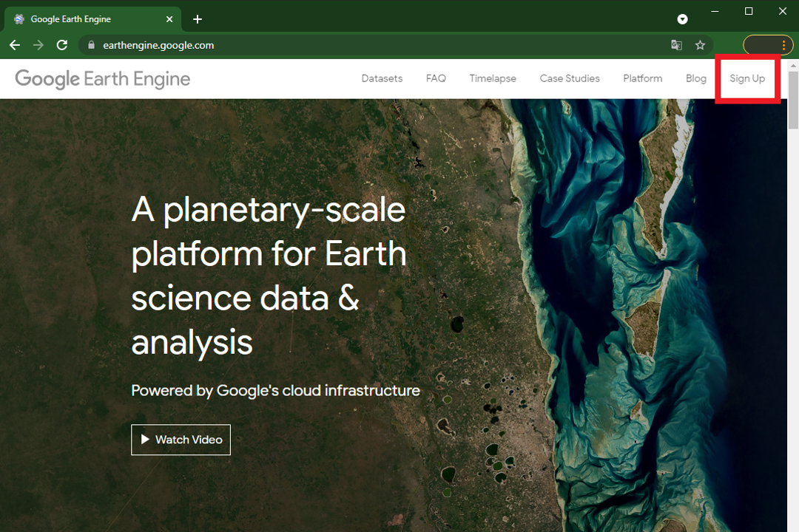
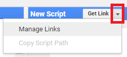
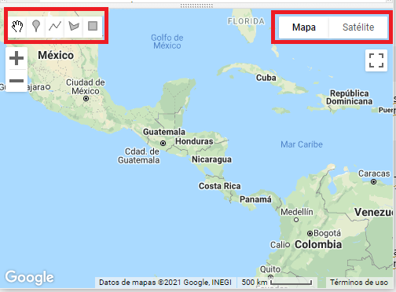
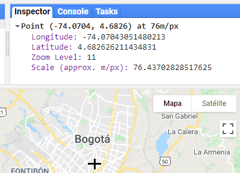
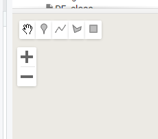
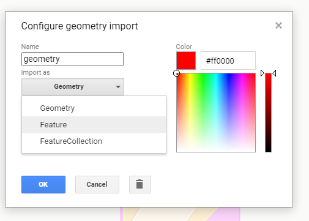
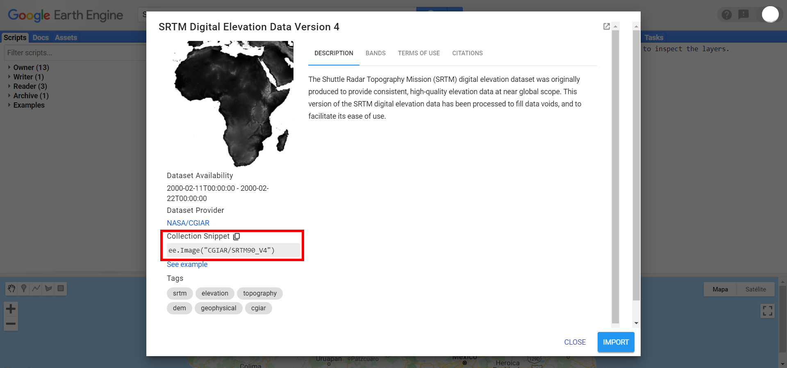
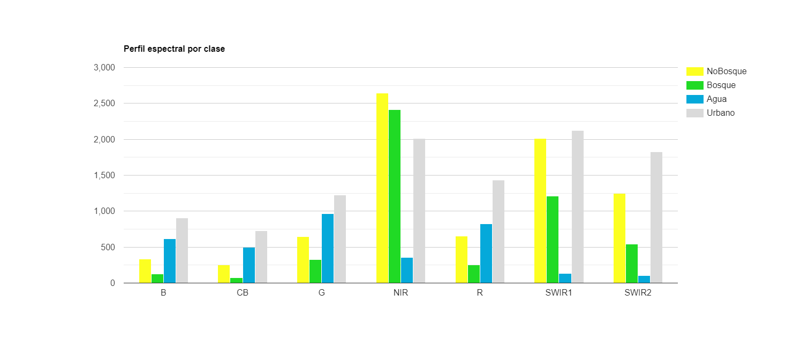

```{r setup, include=FALSE}
# Set global options for chunks
knitr::opts_chunk$set(out.width = "500px", dpi=150)
```

```{=latex}
% Para cambiar los parámetros por default de las cajas de tips o notas
\setlength{\aweboxleftmargin}{0.1\linewidth}.
\setlength{\aweboxcontentwidth}{0.85\linewidth}
\setlength{\aweboxvskip}{6mm}
\setlength{\aweboxrulewidth}{5pt}
\definecolor{abvrulecolor}{RGB}{48,90,255}
```

\newpage
# Introducción

## ¿Qué es Google Earth Engine?

Google Earth Engine (GEE) es una plataforma desarrollada por Google, que permite realizar procesamientos geoespaciales a gran escala, utilizando bases de datos inmensas. Uno de los principales intereses de esta plataforma es reducir el tiempo invertido en pre-procesamiento y facilitar los análisis realizados con información geoespacial.

## Propósito del libro

La idea del presente manual es fungir como una guía introductoria que ayude a los nuevos usuarios de Google Earth Engine (GEE) a entender su estructura, funcionamiento y capacidades. Esto facilitará el uso de esta poderosa herramienta gratuita, dirigida sobre todo para fines de investigación. Existen algunos artículos previos que han presentado las características básicas de GEE, sin embargo, la mayoría están escritas en inglés (Gorelick et al, 2017; Amani et al., 2020, aunque ver Perilla y Mas, [2020]). Por otro lado, la documentación propia de GEE ya existe en inglés, sin embargo, el hacer el esfuerzo de presentar un manual en español, es para lograr ampliar el público objetivo y aumentar su alcance hacia países hispanoparlantes. Es importante aclarar que esta guía es introductoria solamente, por lo tanto, hay muchos temas y cosas que se pueden lograr con GEE que quedan fuera del alcance de este documento (por ejemplo, análisis de series de tiempo o creación de aplicaciones). Así mismo, GEE está en constante actualización, por lo que hemos tratado de hacerlo enfocándonos en el corazón del funcionamiento de GEE (que es lo que menos cambia en el tiempo). Sin embargo, aconsejamos siempre tratar de buscar información adicional y actualizada.
Realmente para aprender a usar GEE (como todos los programas de programación) es a través de un proceso de prueba y error, desarrollando códigos propios. Los autores esperamos que esta herramienta ayude a los nuevos usuarios a comenzar a utilizar GEE y ayudarlos a alcanzar sus objetivos particulares de investigación.

## Organización del libro

El manual está organizado en doce capítulos que cubren diferentes aspectos de esta API (Application Programming Interface, o interfaz de programación de aplicaciones). El primer capítulo describe algunos aspectos generales de GEE. El siguiente capítulo detalla los pasos a seguir para poder usar GEE, así como los elementos básicos de dicha herramienta. Posteriormente, se describen algunas funciones básicas para ayudar al usuario a interactuar con la API, así como las diferencias entre la programación del lado del servidor y del usuario. 
A continuación, en cinco capítulos, se describen los tipos de objetos más frecuentemente utilizados en GEE: geometrías, vectores, colecciones de vectores, imágenes y colecciones de imágenes, así como algunos de los métodos más utilizados para cada uno de estos objetos. Posteriormente, se describe con detalle cómo subir información a GEE para poder utilizarla en dicha API. Después, se describen algunos métodos más avanzados para utilizar en conjunto información vectorial y ráster. El último capítulo describe cómo realizar una clasificación supervisada en GEE. 

Durante todo el manual se incluyen ejemplos que ayudarán a entender la sintaxis y experimentar con distintos tipos de datos, provenientes de distintas fuentes. De manera particular, para los capítulos sobre imágenes y colecciones de imágenes se incluyen ejemplos más prácticos sobre aplicaciones más reales. Por último, este manual cuenta con una serie de ejercicios complementarios y explicativos los cuales pueden ser implementados directamente en línea. El enlace para acceder a este material se encontrará más adelante.

## ¿Cómo Funciona Google Earth Engine (GEE)?

### Antecedentes

Desde hace varios años existen varias misiones espaciales que registran datos de la Tierra a través de distintos satélites, los cuales se almacenan en acervos de imágenes. Aunque esta información ha sido muy útil para el desarrollo científico, siempre había existido el problema de la “Big-Data” (bases de datos enormes). Es decir, que dichos acervos de imágenes cuentan con millones de imágenes disponibles, lo cual resultaba imposible de procesar y analizar en su totalidad. Esta situación evitaba la posibilidad de aprovechar el potencial total de esta información.

GEE nace entonces de la necesidad de aprovechar esa “Big-Data”, ofreciendo una herramienta que pueda lidiar tecnológicamente con la parte más complicada del manejo de la información, permitiendo entonces que los usuarios se concentren en la generación de resultados y nuevos desarrollos científicos.

Para lograr este objetivo, se creó una infraestructura con tres elementos claves, que son los que permiten el funcionamiento de GEE: el catálogo de información, la capacidad computacional y las APIs.


#### Catálogo de información

GEE, recopiló la información geoespacial de diferentes fuentes alrededor del mundo y creó copias de esos datos en su propio datacenter logrando así almacenar más de 20 petabytes (20 000 000 de gigabytes) de información en un solo lugar.

GEE ofrece un amplio repositorio de información geográfica global, cuya información ya se encuentra cargada en su catálogo, facilitando un sencillo acceso a diferentes Datasets. Entre la información que se puede consultar directamente en GEE se encuentran: acervos para todo el mundo de imágenes Landsat (1-8), MODIS, Sentinel (1-3, 5), SRTM, AVHRR, GOESS, ALOS, mosaicos anuales de PALSAR/PALSAR 2 y algunos productos derivados de estas imágenes u otros insumos como información climática global (WorldClim), capas de cambios en la cobertura forestal (Global Forest Cover Change), información de la altura del dosel global (Global Forest Canopy height), mapas de densidad de carbono globales (Global Aboveground and Belowground Biomass Carbon Density Map), datos de precipitación globales (CHIRPS), límites políticos (FAO GAUL: Global Administrative Unit Layers 2015, Country Boundaries), polígonos de áreas protegidas mundiales (WDPA: World Database on Protected Areas (polygons)), densidad poblacional (GPWv411: Population Density (Gridded Population of the World Version 4.11)), cuencas (WWF HydroSHEDS Hydrologically Conditioned DEM, 3 Arc-Seconds), entre otras.

```{r, echo = F}
knitr::include_graphics("Img/Datasets.png")
```

::: {.tipblock data-latex=""}
Para consultar toda la información que esta disponible en GEE se puede consultar la siguiente liga: https://developers.google.com/earth-engine/datasets
:::

#### Capacidad computacional

De manera paralela al catálogo de información, GEE puso a disposición un conjunto de servidores (los cuales en 2010 tenían una capacidad más o menos equivalente a 10000 computadores personales) para poder realizar rápida y eficazmente cálculos y computaciones sobre esos datos.

::: {.tipblock data-latex=""}
Se estima que GEE era capaz (en 2010) de en cuestión de días, ejecutar funciones que en un computador personal habría tomado 15 años.
:::

#### API

GEE es una API (Application Program Interface). Esto significa que es una interfaz que permite la comunicación entre nosotros (los usuarios) y los servidores de Google, proporcionando el acceso y uso de la capacidad computacional de Google para nuestros análisis. GEE tiene el objetivo de facilitar la creación de programas. Por ello, cuenta con una serie de funciones, métodos y algoritmos preprogramados que se pueden llamar con una simple línea de código.

GEE ofrece dos APIs una en JavaScript la cual se accede en línea y es la más conocida, más actualizada, más amigable con los usuarios, con más documentación disponible, y sobre la cual estaremos hablando; y una API en Python, la cual se puede trabajar desde la consola de Python y permite -hasta cierto punto- usar complementariamente librerías de Python, permitiendo así procesamientos más complejos, o funcionalidades que la API de Java no permite. La API de Python tiene las desventajas que tiene menos documentación, y tiene algunas diferencias (que pueden resultar poco intuitivas) a la hora de programar.

## Ventajas de la API de Java

Entre las principales ventajas de utilizar la API de Javascript radica en:

1. Los datos pueden ser consultados directamente en la nube, por lo que no requieren ser descargados para trabajar con ellos (lo que ahorra tiempo y espacio de almacenamiento para el usuario). En cambio, si se quiere usar alguna librería de Python será necesaria la descarga de la información.
2.El procesamiento se hace en la nube, a través de internet, utilizando el poder de cómputo asignado para la API, lo cual reduce el gasto de memoria RAM (solo necesita una conexión estable y el consumo de RAM depende del consumo del navegador). En la API de Python hay mayor consumo de memoria RAM (para ejecutar la consola de python y sus librerías) y requiere igualmente una conexión estable a internet.
3. Su interfaz es mucho más amigable con los usuarios, ofreciendo una plataforma más interactiva para programar, y más sencilla para enseñar.
4. Se pueden realizar fácilmente consultas de las colecciones de imágenes y sus metadatos, antes de decidir importarlos. La API de Python no permite realizar ese tipo de consultas fácilmente, de modo que hay que tener previamente absoluta claridad sobre la colección de imágenes que se va a utilizar.
5. Otra gran ventaja de la plataforma radica en que los códigos se guardan en la sesión de cada usuario. Esto permite mantener un control de los códigos y automáticamente se genera un registro histórico (parecido al git), lo cual facilita el seguimiento y comparación de cambios entre las versiones (y permite revertir a versiones anteriores). Además, se pueden generar repositorios compartidos para generar proyectos colaborativos.

## Ejemplos de aplicaciones realizadas con GEE

GEE  se ha utilizado para una diversidad muy grande de estudios enfocados en estudiar la superficie terrestre mediante sensores remotos, especialmente imágenes multiespectrales (por ejemplo, Landsat, Sentinel-2, MODIS) y en algunos casos imágenes de radar de apertura sintética (por ejemplo, Sentinel-1). Algunos ejemplos incluyen:

* Realizar análisis de series de tiempo para detectar cambios de cobertura (Arévalo et al., 2020; Hamunyela et al., 2020).
* Evaluar los cambios de la cobertura boscosa global, en alta resolución, para más de una década (Hansen et al., 2013).
* Estimar de variables biofísicas de la superficie terrestre (Campos-Taberner et al., 2018).
* Enmascarar nubes de imágenes (Mateo-García et al., 2018).
* Monitorear asentamientos humanos (Trianni et al., 2014).
* Analizar la disponibilidad de imágenes y observaciones despejadas (Solórzano et al., 2020a; Solórzano et al., 2020b).
* Mapear campos de cultivo (Xiong et al., 2017; Dong et al., 2016)
* Identificar plantaciones de palma de aceite (Lee et al., 2016).
* Mapear cicatrices de incendios (Arruda et al., 2021).
* Evaluar grado sequía de la superficie terrestre (Sazib et al., 2018).
* Mapear características de humedales (Slagter et al., 2018).
* Caracterizar islas de calor (Ravanelli et al., 2018), entre muchas otras. 

Además, es una herramienta cuyo uso ha ido en aumento gracias a sus enormes capacidades de procesamiento y su corto tiempo para realizar análisis con información geoespacial (Kumar et al., 2018).

::: {.tipblock data-latex=""}
GEE sugiere que para citar su herramienta en cualquier tipo de trabajo se haga referencia a Gorelick et al. (2017).
:::

\newpage
# Primeros pasos

## Registro para el uso de GEE Javascript API

Lo primero que hay que hacer para poder utilizar la API Javascript de Google Earth Engine es ingresar a su sitio web para registrarse como usuario. Para ello, hay que acceder a la siguiente liga:

**https://earthengine.google.com/**

Después, le damos click en la esquina superior derecha donde dice **Sign Up**. 

```{r, echo = F}

```

Luego se ingresan todos los datos que pide el formulario. Recordar que para utilizar GEE requerimos de una cuenta de Google para poder utilizar la API.

::: {.tipblock data-latex=""}
Se recomienda dar de alta una cuenta de Google que tenga suficiente espacio disponible en Google Drive, ya que será la forma más fácil de exportar los resultados generados en GEE.
:::

```{r, echo = F}
knitr::include_graphics("Img/formulario.png")
```

Una vez realizado el registro, hay que esperar un tiempo (puede ser desde minutos a días) hasta que llegue una confirmación por parte de GEE a nuestro correo informando que ya se puede hacer uso de la API.

```{r, echo = F}

```

Una vez que tengamos dicha confirmación, podemos acceder a la API accediendo a la siguiente liga:

**https://code.earthengine.google.com/**

y se accede con la cuenta de Google con la que nos registramos.
Una vez registrados, se podrá acceder al material de todos los ejercicio entrando a la siguiente liga: https://code.earthengine.google.com/?accept_repo=users/JonathanVSV/GEE_manual 

Una vez dentro de la API, es importante crear un Home folder que es donde se guardará toda la información del usuario. En esta sección es donde definiremos nuestro nombre de usuario.

```{r, echo = F}
knitr::include_graphics("Img/homeFolder.png")
```

## Elementos básicos de la interfaz gráfica

Una vez abierta la Javascript API, se observa la siguiente pantalla.

```{r, echo = F}
knitr::include_graphics("Img/GEE_inicio_API.png")
```

Los elementos de la API se enlistan a continuación:

**Pantalla de Repositorios**

Es el espacio donde se guardan y ordenan los scripts del usuario. En ella se pueden crear repositorios y folders para organizar los archivos de código, como se muestra a continuación.

```{r, echo = F}
knitr::include_graphics("Img/left_panel.png")
```

Dentro de este espacio existen varias categorías, las primeras tres se pueden utilizar para determinar distintos niveles de acceso para diversos usuarios:
1. Propietario (Owner): en esta sección se guardan los códigos creados por el mismo usuario. 
2. Editor (Writer): en este apartado se guardan códigos que pueden ser creados por otros usuarios, pero para los cuales tenemos autorización de modificarlos.
3. Lector (Reader): en esta parte aparecen códigos que otros usuarios nos han compartido acceso, pero no tenemos autorización de modificarlos.
4. Ejemplos (Examples): se pueden consultar ejemplos de código para hacer algunas tareas específicas. Por ejemplo, existe un apartado específico para consultar las distintas maneras de enmascarar nubes utilizando diferentes colecciones de imágenes (por ejemplo: Landsat 4-7, Landsat 8, Sentinel-2, MODIS). 
5. Archivo (Archive): se pueden guardar archivos de código que ya no se utilicen, pero que no se desean eliminar.

::: {.tipblock data-latex=""}
El usuario puede compartir repositorios con otros usuarios de GEE como lector o editor. De esta manera, todos los archivos que se encuentren dentro de un repositorio serán compartidos con los usuarios indicados. Esta opción está disponible al darle click en el símbolo del engranaje a la derecha de cada repositorio (aparece una vez que se coloca el puntero sobre el nombre del repositorio). 
:::

```{r, echo = F}

```

```{r, echo = F}
knitr::include_graphics("Img/engranaje.png")
```

**Docs**

Es un área donde se pueden consultar todos los métodos y algoritmos que se encuentran preprogramados y cargados en GEE. Además, para cada método se indica lo que hace, la entrada que requiere y el tipo de objeto que se obtiene como salida, así como los argumentos del método. Estos métodos se encuentran agrupados por objetos del servidor (los objetos se explican más adelante). Adicionalmente, tiene un buscador, donde se pueden consultar también los métodos.

```{r, echo = F}
knitr::include_graphics("Img/docs.png")
```

```{r, echo = F}
knitr::include_graphics("Img/doc_ejemplo.png")
```

**Assets**

En este apartado el usuario puede subir y guardar su propia información para ser utilizada dentro de GEE. Se pueden subir archivos en formato raster, vector (.shp con sus archivos auxiliares, o un .zip) o separado por comas, únicamente.

```{r, echo = F}
knitr::include_graphics("Img/assets.png")
```

```{r, echo = F}
knitr::include_graphics("Img/newAssets.png")
```

**Pantalla de rutinas**

Esta ventana es donde se va a escribir el código en JavaScript. En la parte superior de esta pantalla se encuentran varios botones. El primero, Get link sirve para compartir el código que se tenga abierto mediante una liga. Además, al darle click en la flecha de despliegue (en la opción Manage Links ) se puede hacer un manejo de las ligas que se tengan activas, así como borrar ligas que ya no se utilicen.

```{r, echo = F}
knitr::include_graphics("Img/editor.png")
```

Esta ventana es donde se va a escribir el código en JavaScript. En la parte superior de esta pantalla se encuentran varios botones. El primero, `Get link` sirve para compartir el código que se tenga abierto mediante una liga. Además, al darle click en la flecha de despliegue (en la opcion _Manage Links_ ) se puede hacer un manejo de las ligas que se tengan activas, así como borrar ligas que ya no se utilicen.

```{r, echo = F}

```

A su derecha se encuentra el botón de Save el cual permite guardar el código con el que se esté trabajando. Además, al darle click en la flecha de despliegue se puede usar la opción Save as para crear una copia del código con otro nombre.

```{r, echo = F}
knitr::include_graphics("Img/save.png")
```

A continuación está el botón de Run que sirve para correr el código que se muestra en la pantalla de rutinas, de principio a fin. Al darle click en este botón se envía el código a los servidores de Google y se realiza el procedimiento indicado.

```{r, echo = F}
knitr::include_graphics("Img/run.png")
```

A su derecha se encuentra el botón de Reset el cual sirve para borrar todo el código que se tenga escrito en la pantalla de rutinas.

Después se encuentra el botón de Apps que sirve para crear Apps a partir del código que se encuentra en la pantalla.

Por último, en el botón del engranaje se encuentran opciones para prender y apagar líneas de código como subrayar sugerencias en la pantalla de rutinas o autocompletar símbolos como ’, ", ( y {.

::: {.tipblock data-latex=""}
Cuando se corre un código en la consola con el botón de Run, este no corre directamente en los servidores de Google, sino que éstos se transcriben a código GeoJSON, se envían a los servidores de Google y se espera una respuesta.
:::

::: {.tipblock data-latex=""}
Para buscar un texto específico dentro del código, se debe dar click en la pantalla de rutinas y presionar ctrl+F (algunos atajos pueden variar según la configuración del teclado). Esta pantalla permite buscar una cadena de caracteres determinada dentro del código. Además, al volver a presionar ctrl+F, también se activa el recuadro de sustitución, el cual resulta de gran ayuda para sustituir una cadena de caracteres determinada por otra. Para consultar el listado completo de atajos se puede presionar ctrl+shift+H.
:::

**Search**

Es una barra de búsqueda en la que se pueden buscar fuentes de datos o sitios. Resulta útil para encontrar la ruta de algún dataset o una colección en particular, así como para consultar sus metadatos, bandas y características.

```{r, echo = F}
knitr::include_graphics("Img/search.png")
```

Es una barra de búsqueda en la que se pueden buscar fuentes de datos o sitios. Resulta útil para encontrar la ruta de algun Dataset o colección en particular, así como para consultar sus metadatos, bandas y características. 

**Map**

En esta pantalla de mapas se pueden:

1. Dibujar y visualizar puntos, polígonos, líneas o rectángulos. 
2. Mostrar la información que se haya indicado mediante la función Map.addLayer.
3. Añadir un mapa base (Google maps , o Google earth).

```{r, echo = F}

```

**Layer manager**

Permite prender y apagar las capas que se estén mostrando en el área del mapa. Además, permite modificar las características necesarias para su visualización (por ejemplo, transparencia, color, distribución del histograma, compuesto de color, etc). Este menú aparece una vez que se cargan capas a la pantalla de mapas.

```{r, echo = F}
knitr::include_graphics("Img/layer.png")
```

**Consola**

La consola consiste en la pantalla de comunicación con el servidor. En ella se muestran los errores que se obtienen al correr un código o se pueden mostrar la información indicada por la función `print`.

```{r, echo = F}
knitr::include_graphics("Img/rigthPanel.png")
```

**Inspector**

Permite consultar los valores de las capas que se muestran en el mapa, al dar click sobre el punto de interés.

```{r, echo = F}

```

**Tasks**

En esta pestaña se muestran los trabajos que se hayan exportado mediante la función Export y permite correr el trabajo de exportación al sitio donde el usuario le haya indicado (drive, assets). Además, en esta pestaña se:

1. Muestran las tareas para ejecutar (con el botón de run, el cual permite especificar detalles de la exportación).
2. Presentan las tareas en ejecución (color gris).
3. Señala el tiempo demorado en el trabajo.
4. Indica cuando el trabajo se ha finalizado (color azul).
5. Cuando hay un error en algún objeto exportado, en esta ventana se verá el trabajo marcado en rojo, indicando el error. Por último, al dar click sobre el signo de interrogación que aparece al colocar el cursor sobre algún trabajo, permite obtener mayor información del trabajo, por ejemplo, el error que arrojó el servidor al tratar de realizar una exportación o la ubicación del archivo exportado.

```{r, echo = F}
knitr::include_graphics("Img/task.png")
```

## Programación en GEE

La programación dentro de la API de GEE es una orientada a objetos, siguiendo la sintaxis del lenguaje de programación Javascript. Los objetos se pueden interpretar como contenedores de información sobre los cuales se van a aplicar diferentes funciones para crear nuevos objetos o sobreescribir objetos preexistentes.

### Simbología

*	‘ ’ : comillas simples
*	“ ” : comillas dobles
* [ ] : corchetes
*	{ } : llaves
*	( ) : paréntesis
*	- : guion
*	_ : guion bajo
*	, : coma


### Lenguaje Javascript en GEE

La sintaxis de JavaScript tiene algunas peculiaridades que deben cumplirse para que se pueda correr el código sin problemas. Entre la sintaxis básica se pueden considerar los siguientes puntos _(de igual forma iremos tocando la gramatica del código a lo largo de los ejemplos)_:

La sintaxis de JavaScript tiene algunas peculiaridades que deben cumplirse para que se pueda correr el código sin problemas en GEE. Entre algunos elementos de la sintaxis básica se encuentran los siguientes puntos (de igual forma iremos tocando la gramática del código a lo largo de los ejemplos):

1.	Es un lenguaje sensible a las mayúsculas y minúsculas. De tal manera que puede haber dos objetos diferentes uno llamado `a` y otro diferente llamado `A`.
2.	Siempre se debe cerrar cualquier comando con un `;` (aunque de no hacerlo el código funcionará igualmente).
3.	Comúnmente en Javascript se utiliza el lowerCamelCase (unir palabras pero cada una comenzando con su respectiva mayúscula) para unir palabras, en lugar de guiones `-` o guión bajo `_`. Por ejemplo: intervalMean o updateMask.
4.	Todas las variables, funciones, objetos deben ser definidos mediante la función var.
5.	Para definir variables se utiliza el operador `=`.
6.	Los operadores matemáticos son: `+ - * /`.
7.	Para concatenar dos cadenas de caracteres se utiliza el símbolo `+`.
8.	Para realizar comentarios se puede utilizar `//` para comentarios de una línea, o también `/* … */` para comentarios de varias líneas
9.	Se suele utilizar el operador `.` (punto) para aplicar una función al objeto que lo precede. Por ejemplo, `ee.Image.updateMask(mascara)` (se aplica la función `updateMask` al objeto `ee.Image`);. A este tipo de funciones se les llama MÉTODOS. En este manual, todos los métodos aplicados a algún objeto se escribirán precedidos por el operador `.`  para evitar errores de sintaxis.
10.	Son igualmente válidas las comillas sencillas `''` como las comillas dobles `""`, pero no deben mezclarse ambos tipos de comillas en una misma línea.


::: {.tipblock data-latex=""}
El término correcto para llamar a las funciones aplicadas con el operador `.` es el de método (method), lo cual quiere decir que son funciones ligadas a un tipo de objeto. Por ejemplo, en `ee.Image.updateMask`, la función updateMask es un método ligado a un objeto de tipo imagen (`ee.Image`). Por el contrario, las funciones en un sentido estricto se aplican a un objeto mediante la sintaxis: `function(objeto){}`. Distintos tipos de objetos tienen diferentes métodos ligados a ellos.
:::


\newpage 
# Interfaz de usuario: Visualización de datos, gráficos y exportación

Dentro de GEE, hay un grupo de funciones que permiten interactuar con los objetos y obtener información sobre sus características o propiedades. A este conjunto de funciones le llamaremos funciones de interfaz de usuario ya que permiten obtener información sobre los objetos, visualizarlos o exportarlos para trabajar con ellos en un entorno distinto a GEE. Estas funciones resultan muy útiles para ayudar al usuario a entender los procesos que está programando, así como verificar que los procesos realicen la tarea deseada. Dentro de este grupo de funciones se distinguen cuatro grupos de funciones que se detallan en las siguientes secciones.

## Impresión en consola

El método más sencillo de la API es imprimir objetos en la consola. Esto se realiza mediante la función print. Al llamar esta función e indicar cualquier objeto como argumento, éste se evalúa y se imprime su estructura en la consola. Esta función permite obtener información básica de los objetos como su tipo de objeto, número de registros, características y propiedades de los elementos que lo conforman. Además, esta función resulta muy útil para eliminar errores de programación (bugs) en los códigos.

```{js, echo = T}
print(Objeto);
print('Hola Mundo');
```

::: {.tipblock data-latex=""}
Vamos a utilizar mucho la función print() esta función, permite visualizar en la consola diversos objetos. Por ejemplo, si se quiere ver en la consola la palabra “Hola Mundo” se usa el comando `print('Hola Mundo')`
:::

## Interacción con la pantalla de mapas

Este grupo de funciones permiten agregar objetos del lado del servidor a la pantalla de mapas, así como controlar algunos parámetros de dicha pantalla. Todas las funciones encargadas del manejo de la pantalla de mapas se encuentran dentro de la función `Map`.

::: {.tipblock data-latex=""}
Para revisar todas las funciones disponibles para la interfaz del usuario, ver la sección de **Code Editor**  en la siguiente liga: https://developers.google.com/earth-engine/apidocs. Además, en esta sección se indican los argumentos que acepta cada función, así como el tipo de objeto de la salida.
:::

**Map.addLayer**

La función `Map.addLayer` permite mostrar elementos en la parte de mapa de la API. Por lo tanto, permite mostrar objetos de tipo `ee.Feature` o `ee.Image` (estos objetos se presentan con mayor detalle más adelante). Adicionalmente, se pueden indicar otros parámetros como la forma de visualización de los objetos y el nombre de la capa. Los argumentos de la función `Map.addLayer` incluyen el objeto a añadir a la pantalla de mapas, seguido de un diccionario con información para el despliegue de la capa y por último, se puede indicar el nombre de la capa con el que se desea mostrar la capa en la pantalla de mapas.

Al utilizar `Map.addLayer` sobre una imagen se pueden indicar los siguientes argumentos: bands, min o max. Estos se deben pasar dentro de un par de llaves `{}` como un diccionario. Esta función también permite (para imágenes `ee.Image`) asignar colores mediante el argumento de palette:. Dependiendo de las bandas que se elija mostrar se puede mostrar únicamente una banda en tonos de gris o un compuesto RGB. Por ejemplo, para cargar una imagen a la pantalla de mapas:

```{js, echo = T}
Map.addLayer(image, {bands: ['B1', 'B2', 'B3'], min: 0, max: 2000, palette: ['FF0000', 'FFFF00',' 008000']}, 'RGB');
```

::: {.tipblock data-latex=""}
En algunas ocasiones, al intentar cargar objetos en la pantalla de mapas, que sean producto de procesamientos demandantes, la consola puede mostrar un error indicando que se superó el tiempo de espera o de el límite de memoria disponible. En estos casos, se sugiere exportar el resultado, en lugar de tratar de cargarlo en la pantalla de mapas y después visualizarlo de manera local en algún SIG o software similar (por ejemplo, QGIS).
:::

Para el caso de los vectores (`ee.Feature`) se puede realizar una operación similar (pero el único argumento válido es color) como:

```{js, echo = T}
Map.addLayer(feature, {color: 'FF0000'}, 'featuresColored');
```

::: {.tipblock data-latex=""}
El código de los colores pasados al argumento de _palette_ o color corresponden a códigos hexadecimales
:::

**Map.centerObject**

Esta función permite centrar la pantalla de mapas en algún objeto o coordenada (longitud, latitud). Además, se puede indicar el zoom con el cual se quiere centrar el objeto.

```{js, echo = T}
Map.setCenter(-39.86, 20.52, 5)
```

## Creación de gráficos

Este grupo de funciones permiten realizar gráficos de diferentes tipos, sin embargo, existen diferentes opciones de gráficos para distintos tipos de objetos. Todas estas funciones se encuentran agrupadas dentro de la función principal `ui.Chart`. Los objetos básicos que permite graficar GEE son: vectores (`ee.Feature`), colecciones de vectores (`ee.FeatureCollection`), imágenes (`ee.Image`), colecciones de imágenes (`ee.ImageCollection`), arreglos (`ee.Array`) y listas (`ee.List`). Por otro lado, para indicar los colores a utilizar en el gráfico o el título del mismo se puede utilizar el método `.setOptions` sobre el objeto de tipo gráfico.

**Chart.feature**

Este conjunto de funciones permite obtener distintos tipos de gráficos a partir de un vector o una colección de vectores. Algunas de los métodos disponibles incluyen: 

* `ui.Chart.feature.byFeature`.
* `ui.Chart.feature.byProperty`
* `ui.Chart.feature.groups`. 
* `ui.Chart.feature.histogram`. 

Por ejemplo:

```{js, echo = T}
ui.Chart.feature.byProperty({
  feature: coleccionAtributos, 
  xProperties: 'Clase',
})

```

**Chart.image**

Este conjunto de funciones permiten obtener distintos tipos de gráficos a partir de una imagen o colección de imágenes. Algunas de las funciones que se encuentran disponibles incluyen: 
*	`ui.Chart.image.byClass`
*	`ui.Chart.image.byRegion`
*	`ui.Chart.image.doySeries`
*	`ui.Chart.image.histogram`
*	`ui.Chart.image.seriesByRegion`, entre otras.


Por ejemplo, para graficar una serie de tiempo a partir de una colección de imágenes se utiliza la función `ui.Chart.image.seriesByRegion``. Este tipo de gráficos permiten graficar las series de tiempo de algunas áreas determinadas utilizando una colección de imágenes.

```{js, echo = T}
ui.Chart.image.seriesByRegion({
  imageCollection: coleccionImagenes, 
  regions: areas.filter(ee.Filter.eq('Tipo','Bosque')),
  reducer: ee.Reducer.mean(), 
  band: 'NDVI', 
  scale: 30, 
  seriesProperty: 'Tipo'
})
  .setOptions({
    title: 'Bosque',
    colors: ['#EE3A19']
  });
```

::: {.tipblock data-latex=""}
El nombre de las funciones para generar gráficos en GEE dan una idea del tipo de gráfica que se puede generar con dicha función y el tipo de insumos que requiere cada tipo de gráfico.
:::
                                              
## Exportación de objetos fuera de GEE

Este grupo de funciones permiten exportar algún resultado fuera de GEE para ser manejado en otro programa (por ejemplo, un SIG). Todas estas funciones se encuentran dentro de la función Export. Sin embargo, sólo existen cuatro formatos válidos para exportar desde GEE: raster, vector, mapa y video.

**Export.image**

En el caso de las imágenes (raster), la función para exportarlas es `Export.image`. Dentro de GEE hay 3 opciones para exportar los resultados de una imagen: 

*	`Export.image.toAsset`
*	`Export.image.toDrive` 
*	`Export.image.toCloudStorage`

El primero permite exportar la imagen (raster) como una imagen (raster) a la sección de Assets, es decir, la sección donde el usuario puede subir su información a GEE. Esta opción es útil para cuando el resultado se va a utilizar en otro procedimiento de GEE. La segunda opción permite exportarlo al Google Drive de la cuenta con la que se tiene acceso a GEE. Esta opción es útil para trabajar con las imágenes (rasters )en algún entorno local como algún SIG. La última opción permite exportar la imagen al Google Cloud Storage para utilizarla en algún otro proceso a realizar en Google Cloud. La opción que creemos es más común para cualquier usuario será la de `Export.image.toDrive`.

::: {.tipblock data-latex=""}
Solo se pueden exportar imágenes en formato raster, sin embargo, no siempre resulta obvio, ya que algunas veces se pueden convertir imágenes a formato de arreglo (`ee.Array`), tras lo cual hay que volver a convertir la información a formato de imagen (ee.Image) para poder exportarla. La aplicación permite exportar únicamente en formato GeoTiff o TRFrecord (tensores).
:::

Un ejemplo de cómo exportar una imagen se presenta a continuación.

```{js echo = T}
Export.image.toDrive({
  image: imgDiff,
  description: 'DiferenciaNDVI_2016-2017',
  scale: 30,
  fileFormat: 'GeoTIFF',
  folder: 'DiferenciaNDVIL8'
}); 
```

::: {.tipblock data-latex=""}
En GEE muchas operaciones utilizan el término de scale, sin embargo, este no se refiere a la escala de trabajo en un sentido tradicional (por ejemplo, 1:50000), sino que se refiere al tamaño de pixel expresado en metros.
:::

::: {.tipblock data-latex=""}
En algunas ocasiones, al intentar exportar una imagen muy grande (mayor a 10 000 000 de pixeles), la consola puede mostrar un error indicando que el objeto a exportar tiene un número muy alto de pixeles. En este caso, se debe aumentar el número de pixeles máximo permitido para la exportación. Esto se logra indicando el argumento maxPixels dentro del diccionario que se pasa a `Export.image.toDrive`. Por ejemplo, maxPixels: 1e10, lo cual permite exportar una imagen con hasta 1 x 10^10 pixeles.
:::

**Export.table**

Por su parte, el formato vector permite exportar información vector y tablas sin información geográfica. De nuevo, para poder exportar en el formato vector, el objeto exportado debe estar en formato colección de vectores (`ee.FeatureCollection`). Al igual que en el caso de las imágenes, dentro de GEE hay 3 opciones para exportar objetos de tipo vector: 

*	`Export.table.toAsset`.
*	`Export.table.toDrive`.
*	`Export.table.toCloudStorage`. 

Para el caso de las tablas, sin información geográfica asociada, se debe definir el objeto como un objeto vector sin geometría (es decir, `null`) y en la tabla de atributos anexar la información deseada. Un ejemplo del uso de esta función se presenta a continuación:

```{js echo = T}
Export.table.toDrive({
    collection: feature,
    description: 'nombreArchivo',
    folder: 'mifolder',
    fileFormat: 'CSV'
 });
```

**Export.video**

Esta opción permite exportar una colección de imágenes como video ya sea al almacenamiento de la nube de Google o al Drive

*	`Export.video.toCloudStorage`.
*	`Export.video.toDrive`.

Esta función puede resultar atractiva para observar los cambios de un área de interés, a través del tiempo. Para exportar una colección de imágenes a vídeo se puede realizar de la siguiente manera:

```{js echo = T}
Export.video.toDrive({
    collection: coleccionImgs,
    description: 'videoTimelapse',
    folder: 'mifolder',
    framesPerSecond: 24
 });
```

\newpage
# Tipos de objetos

Dentro de GEE existe una diversidad amplia de tipos de objetos, por ejemplo, objetos de tipo numérico, listas, cadenas de caracteres, entre otras. Sin embargo, esta variedad de tipos de objetos se puede agrupar en dos grandes rubros, en objetos del lado del cliente y del servidor, de acuerdo al lado donde se va a llevar a cabo el procedimiento deseado.

## Objetos del cliente y del servidor

Existen dos lados de la programación de la API de GEE: el del servidor y el del cliente o usuario. De tal manera, un objeto puede ser convertido entre los dos tipos. Por ejemplo, mientras que del lado del cliente una cadena de caracteres puede ser definida simplemente como: `“cadena”`, para convertirla en objeto del lado del servidor deben utilizarse las funciones del servidor, es decir: `ee.String(“cadena”)`. Muchos de los algoritmos precargados en GEE únicamente aceptan como argumentos objetos del lado del servidor, por lo cual, es recomendable utilizar dicha sintaxis. Adicionalmente, algunas operaciones se pueden hacer utilizando ambos tipos de sintaxis. Por ejemplo, una suma se puede realizar del lado del cliente mediante `1 + 2`, mientras que del lado del servidor se utilizará `ee.Number(1).add(ee.Number(2))`.

En la mayoría de los casos se va a utilizar la programación del lado del servidor, ya que es la que permite hacer todo el procesamiento en GEE. Por ejemplo, para el caso de las condiciones se sugiere utilizar en lugar de `if` y `else`, la función `ee.Algorithms.If`. Sin embargo, cabe aclarar que algunas funciones sólo corren del lado del cliente. Por ejemplo, las funciones de la interfaz del usuario, utilizadas para exportar la información a algún archivo (ya sea un raster, un vector o una tabla) `ee.Export...`, agregar una capa a la pantalla del mapa `Map.addLayer` o crear gráficos, así como imprimir información en la consola `print`. El siguiente diagrama permite visualizar el lado del usuario y del servidor en el funcionamiento de GEE.

```{r, echo = F}
knitr::include_graphics("Img/daigFunc.png")
```

## Tipos de objetos del lado del cliente

**Cadenas de texto**

Se refiere a objetos de cadenas de símbolos de tipo alfanumérico. Cualquier secuencia de caracteres puede ser un texto. Estos se definen como cualquier cadena de caracteres que se encuentren entre un par de comillas bien sean dobles `“”` o sencillas `’’`. Por ejemplo:

Ejercicio 0

```{js, echo = T}
// Cadena de texto de solo letras
var cadena = “Esto es una cadena de caracteres”;

// Cadena de texto de solo numeros
var telefono= '1234567890';  
                     
// Cadena de texto de letras, números y símbolos
var direccion = 'calle cuarta casa # 16';
```

Ejercicio 0.1

```{js, echo = T}
// Cadena de texto concatenada
var direccion = direccion + ' su número telefónico es:' + telefono;
```

::: {.tipblock data-latex=""}
Resulta importante notar que los números en una cadena de texto no serán interpretados como valores numéricos sino como texto.
:::

**Números**

Se refiere a objetos numéricos que indican un valor. Cualquier secuencia de números puede ser un número. Para números decimales se utiliza el punto decimal y no la coma decimal. Por ejemplo:

Ejercicio 1

```{js, echo = T}
// Número entero
var numero = 1; 
 
// Número decimal con punto decimal  
var numero2 = 2.5;  
```

Nótese que al declarar un objeto como número no se hace uso de comillas.

**Listas**

Las listas se refieren a objetos que contienen varias entradas, las cuales pueden ser numéricas (números), cadenas de texto (texto) o incluso otras listas. Las listas se definen mediante el uso de corchetes `[]` y cada entrada es separada mediante una coma `,` . Permiten encadenar una serie de valores. Por ejemplo:

Ejercicio 2

```{js, echo = T}
// Lista numérica
var lista = [1, 2, 3, 4, 5, 6, 7, 8];   
  
// Lista de texto            
var listaA = [“primero”, “segundo”, “tercero”]; 
   
// Lista de texto y números  
var listaB = [“primero”, “segundo”, “tercero”, 4]; 

// Lista de listas  
var listaC = [lista, listaA, listaB]; 
```

Todas las listas automáticamente asignan, en orden, un número a cada elemento dentro de ellas, siempre empezando desde 0. Entonces se puede consultar un solo elemento dentro de una lista, aportando el número de su posición dentro de ella. 

Ejercicio 2.1:

```{js, echo = T}
// Primer objeto de la lista llamada "lista"
print(lista[0]); 

// Segundo objeto de la lista llamada "listaA"
print(listaA[1]);

// Tercer objeto de la lista llamada "listaB"
print(listaB[2]);

// Lista completa con todos sus elementos
print(listaC);    
```

**Diccionarios (Dictionaries)**

Los diccionarios son objetos que contienen claves (entradas) y valores asociados a estas claves (definiciones). Los diccionarios se definen mediante el uso de llaves {} donde se define cada clave seguida de dos puntos `:` y la definición del valor, cadena de caracteres, o lista asociada a esa clave. Para ingresar varias entradas, estas deben ir separadas por una coma. Las claves o entradas siempre serán leídas como cadenas de texto. Se recomienda que no tengan espacios dentro de ellas, si es necesario es mejor usar guión bajo `_`. Al hacer `print` se ordenarán alfabéticamente las claves.

Ejercicio 3 

```{js, echo = T}
// Se declara un nuevo diccionario
// la primera entrada es el texto "clave1" que está definido con el valor
// de 1 (tipo número) 
// la segunda entrada es el texto "clave2", y su definición es la letra 
//"A" (tipo cadena de texto)
var dicc = {   
  clave1: 1,      
  clave2: "A"  
};            
      
```

Para consultar los valores dentro de un diccionario se puede hacer llamando directamente el nombre de la clave deseada dentro de un par de corchetes. Adicionalmente, para los diccionarios se recomienda utilizar la notación de `.` seguida del nombre de la clave. La notación con punto, es recomendada por GEE. Por ejemplo:

Ejercicio 3.1

```{js, echo = T}
// Notación de lista, se mostrará en la consola la definición de 
// "clave1", es decir el valor 1 
print(dicc["clave1"]); 

// Notación de lista, se mostrará en la consola la definición de 
// "clave2", es decir la letra "A"
 
print(dicc["clave2"]);  
// Notación con punto, se mostrará en la consola la definición de 
// "clave1", es decir el valor 1 
print(dicc.clave1);  

// Notación con punto, se mostrará en la consola la definición de 
// "clave2", es decir la letra "A"
print(dicc.clave2);  
```

**Funciones (Functions)**

Se refieren a objetos que contienen algún proceso que se realizará a alguna variable. Siempre comienzan con la función function seguida por el objeto al que se le aplicará la función, este objeto entre paréntesis, y entre llaves se coloca el procedimiento que va a realizar la función. Por último, deben regresar un objeto mediante la función return. Las funciones serán revisadas a mayor profundidad después. Por ejemplo:

```{js, echo = T}
// MaskIm es una nueva función, y su 
// argumento de entrada es "objeto"
var maskIm = function(objeto){ 

// Se define qué "objeto" es una imagen 
// raster, y se guarda en la variable image
var image = ee.Image(objeto)     
 
// Se selecciona solamente la banda de nombre
// "pixel_qa" de la imagen image
var qaImage = image.select('pixel_qa');
     
// Se crea una nueva imagen binaria donde 
// será 1 los pixeles con valor igual a 322, y 0 los demás
var clearData = qaImage.eq(322);      
    
// Se crea una máscara con la imagen binaria,
// y se entrega la imagen original enmascarada
return image.updateMask(clearData);      
 };
```

Aunque las funciones son propiamente objetos del lado del cliente, deben contener únicamente funciones del lado del servidor para que funcionen apropiadamente al trabajar en GEE. Esto permite definir cualquier serie de procesos como una función y que GEE la interprete de manera adecuada en sus servidores. Esto quedará más claro después de repasar la siguiente sección.

::: {.tipblock data-latex=""}
Las funciones que se ejecuten sobre una colección de imágenes o vectores, sólo funcionan si regresan un objeto de tipo `ee.Feature`, `ee.FeatureCollection`, `ee.Image` o `ee.ImageCollection`, por lo cual, a veces se deben realizar ciertas conversiones para evitar un error.
:::

## Tipo de objetos del lado del servidor

Los objetos del lado del servidor, además de permitir llevar a cabo procesos en los servidores de GEE, tienen asociados una serie de funciones particulares por tipo de objeto. Esto quiere decir que al convertir un objeto del lado del cliente al del servidor, automáticamente se abre la posibilidad de utilizar los métodos pre cargadas en GEE para ese tipo de objeto. Por otro lado, toda la información que se encuentra disponible en GEE corresponderá a objetos del servidor, entre los que destacan los objetos de tipo imagen (raster), vector, colecciones de imágenes y colecciones de vectores. 

::: {.tipblock data-latex=""}
Para recordar cuáles objetos son del servidor, resulta útil recordar que todos ellos cuentan con el prefijo `ee.` (del servidor de Earth Engine), seguido del nombre del tipo de objeto con inicial mayúscula.
:::

Los objetos del lado del servidor se pueden conceptualizar como contenedores que le indican al servidor qué tipo de objeto es el que se está enviando. Además, cuando se trabaja del lado del servidor, los objetos necesariamente son enviados al servidor para ser evaluados. A continación se describen los tipos de objetos más comúnmente utilizados.

::: {.tipblock data-latex=""}
En algunos casos, los objetos que se obtienen a partir de ciertas funciones retornan un objeto de tipo indefinido (tipo objeto, `ee.Object`), por ejemplo, en casos particulares al usar los métodos `.first` ó `.get`, por lo cual, se recomienda meter este objeto en un contenedor que indique el tipo de objeto. Este tipo de errores suelen mostrar un mensaje `“...is not a function”`.
:::

::: {.tipblock data-latex=""}
Para revisar todos los métodos disponibles en GEE clasificados por tipo de objeto del servidor visitar la sección de Client libraries en la siguiente liga: https://developers.google.com/earth-engine/apidocs 
Además, en esta sección se indican los argumentos que acepta cada función, así como el tipo de objeto de la salida.
:::

**ee.String()**

Es el tipo de objeto equivalente a la cadena de texto pero del lado del servidor, ya que permite enviar un objeto como cadena de caracteres al servidor. Además, al definir un objeto de este tipo, se puede utilizar cualquier método indicado para objetos de tipo `ee.String` en la API (ver liga anterior).

Ejercicio 4:

```{js, echo = T}
// Esta es una cadena de texto del lado del cliente
var cadena2 = "Esto es una cadena de caracteres";
// En este paso se convierte el texto del lado del cliente a un ee.String del
// lado del servidor
var cadenaServ = ee.String(cadena2);                         
```

**ee.Number()**

Permite enviar un número como objeto al servidor. Además, al definir un objeto de este tipo, se puede utilizar cualquier método indicado para objetos de tipo `ee.Number` en la API (ver liga anterior).

Ejercicio 5:

```{js, echo = T}
// Se define un número como `ee.Number` del servidor
var numServ = ee.Number(1900);                              
```

**ee.List()**

Permite enviar un objeto como lista al servidor. Al definir un objeto de este tipo, se puede utilizar cualquier método indicado para objetos `ee.List` (ver liga anterior).

Ejercicio 6:

```{js, echo = T}
// Se construye una nueva lista con diferentes tipos de objetos
// del lado del usuario y servidor
var lista = ['hola','12','5%', ee.String('servidor'), ee.Number(64), 8.32];

// Se define una lista como ee.List del servidor 
var listaServ = ee.List(lista);             
```

Para acceder a un elemento de tipo `ee.List` se utiliza el método `.get`. 

Ejercicio 6.1:

```{js, echo = T}
// Se llama solamente al primero objeto de la ee.List del servidor
print(listaServ.get(0));   

// Se llama solamente al segundo objeto de la ee.List del servidor
print(listaServ.get(1)); 
```

**ee.Dictionary**

Permite enviar un objeto como diccionario al servidor. Además, al definir un objeto de este tipo, se puede utilizar cualquier método indicado para objetos `ee.Dictionary` (ver liga anterior).

Ejercicio 7

```{js, echo = T}
// Se construye un diccionario de usuario con diferentes tipos de objetos 
// del lado del usuario y servidor
var dicc = {                                                 
  'texto de usuario':'usuario',
  'string del servidor': ee.String('texto de servidor # 2'),
  'numero de usuario': 4,
  'numero de servidor': ee.Number(3.1416),
  'lista de usuario': [1, 'ejemplo'],
  'lista de servidor': ee.List([ee.String('texto de servidor # 3'), ee.Number(1.44)])
}; 

// Se define el diccionario de usuario anterior 
// como ee.Dictionary del servidor 
var diccServ = ee.Dictionary(dicc);     
```

Se puede consultar utilizando también el método `.get` y el nombre de la clave. 

Ejercicio 7.1

```{js, echo = T}
// Se muestra el valor que contiene la clave "lista_de_servidor"
print(diccServ.get('lista_de_servidor'));

// Se muestra el valor que contiene el elemento "numero_de_usuario"       
print(diccServ.get('numero_de_usuario'));        
```

Por último, si se desea obtener las claves disponibles en un `ee.Dictionary` se utiliza el método `.keys`. Esta función devuelve una lista. De igual forma, si se desea obtener los valores disponibles en un `ee.Dictionary` se utiliza el método `.values`, la cual devuelve una lista.

Ejercicio 7.2

```{js, echo = T}
// Muestra una lista con todas las claves del ee.Dictionary
print('claves',diccServ.keys());    

// Muestra una lista con todos los valores del ee.Dictionary
print('valores',diccServ.values());  
```

**ee.Date**

Esta es la forma en la que GEE permite trabajar con fechas. Permite enviar un objeto como fecha al servidor. Además, al definir un objeto de este tipo, se puede utilizar cualquier método indicado para objetos de tipo `ee.Date` (ver liga anterior).
Hay varias formas de construir una fecha específica:

1.	Se puede usar un texto de usuario indicando la fecha en el siguiente formato: “YYYY-MM-DD”, esta fecha obligatoriamente debe:
  *	Usar la función `ee.Date`.
  *	Estar en orden Año Mes Día (AAAA-MM-DD).
  *	Usar guiones como separadores -.
  *	Tener meses numéricos (01, 02, 03, 04, 05, 06, 07, 08, 09, 10, 11, 12).
  *	Tener días de dos dígitos (01, 02, 03 … 09, 10, 11, … 30).
  *	Estar entre comillas.
2.	Se pueden usar números de usuario, en este caso se debe:
  *	Usar el método  `ee.DatefromYMD`.
  *	Ingresar dentro del paréntesis el año, el mes y el día (en ese orden), separados por comas.
3.	Se puede usar un texto de usuario especificando el formato, para esto se debe:
  *	Usar el método `ee.Date.parse`.
  *	Especificar el formato de la fecha con la siguiente clave (YYYY=año, MM=mes, D=día).
  *	Especificar el tipo de separador.
  *	Especificar el orden en el que se ingresará el texto.
  *	Especificar la cantidad de dígitos esperada para cada ítem (año, mes y día).
  *	El formato debe estar entre comillas.
  *	Luego de especificar el formato, se ingresa dentro de comillas el texto a convertir a `ee.Date` (entre el formato y el texto debe ir una coma).

Ejercicio 8:

```{js, echo = T}
// Fecha como un texto de cliente
var fechaString = '2001-10';

// Convierte la fecha de texto de cliente a ee.Date del servidor    
var fecha = ee.Date(fechaString);  

// Crea una ee.Date a partir de definir año, mes y dia con números del cliente           
var fecha2 = ee.Date.fromYMD(2015,03,28); 
   
// Crea una fecha a partir de un formato especificado y un texto que cumple
// con dicho formato, nótese que se especifica el orden del dia año y mes, 
// se especifica cada separados, y si se usan meses como texto deben ser 
// las 3 primeras iniciales del mes en inglés
var fecha3 = ee.Date.parse('DD_YYYY/MMM', '14_1827/jul'); 
```

```{r, echo = F}
knitr::include_graphics("Img/objetosServ.png")
```

**ee.Image**

Permite leer un objeto individual tipo raster en el servidor. Además, al definir un objeto de este tipo, se pueden utilizar cualquier método para objetos `ee.Image`. Este va a ser el tipo de objetos para trabajar con cualquier elemento de tipo raster en GEE. Más adelante se explican con mayor detalle.

**ee.ImageCollection**

Al definir un objeto de este tipo, se pueden utilizar cualquier método para objetos de tipo `ee.ImageCollection`. Las colecciones de imágenes están formadas por imágenes. Más adelante se explican con mayor detalle.

**ee.Feature**

Permite leer un objeto como vector en el servidor. Además, al definir un objeto de este tipo, se pueden utilizar cualquier método para objetos `ee.Feature`. Este va a ser el tipo de objetos para trabajar con cualquier objeto de tipo vector o tabla. Más adelante se explican con mayor detalle.

**ee.FeatureCollection**

Permite enviar un objeto como colección de vectores al servidor. Además, al definir un objeto de este tipo, se pueden utilizar cualquier método para objetos `ee.FeatureCollection`. Las colecciones de features están formadas por varios vectores. Más adelante se explican con mayor detalle.

**ee.Algorithms**

Este tipo de objetos contienen algoritmos precargados en GEE. Estos algoritmos tienen una gran variedad de aplicaciones, desde operaciones sencillas como una evaluación lógica, por ejemplo, `ee.Algorithms.If`, hasta algoritmos de segmentación temporal de una serie de imágenes, por ejemplo, `ee.Algorithms.TemporalSegmentation.Ccdc`.

**ee.Array**

Este tipo de objetos corresponden a arreglos multidimensionales. Los arreglos se pueden interpretar como matrices de más de dos dimensiones (por ejemplo, filas y columnas). Su uso más común se da en el análisis de series de tiempo o con ordenaciones espectrales. Este tipo de objetos cuentan con una serie de métodos, los cuales se pueden consultar bajo la librería de `ee.Array` (ver liga anterior).

**ee.Classifier**

Este tipo de objetos corresponden a algoritmos de clasificación supervisada de datos que se encuentran precargados en GEE. Por ejemplo, se encuentra el algoritmo de random forest, disponible mediante la función `ee.Classifier.smileRandomForest` o MaxEnt, disponible mediante la función `ee.Classifier.amnhMaxent`, entre otros.

**ee.Clusterer**

Este tipo de objetos corresponden a algoritmos de clasificación no supervisada de datos que se encuentran precargados en GEE. Por ejemplo, se encuentra el algoritmo de k-means, disponible mediante la función `ee.Clusterer.wekaKMeans` o Cobweb, disponible mediante la función `ee.Clusterer.wekaCobweb`.

**ee.Filter**

Este tipo de objetos normalmente se utilizan para filtrar colecciones ya sean de vectores o de imágenes. Este tipo de objetos permite definir filtros de distintos tipos, ya sean espaciales, temporales o en función de características de las imágenes o vectores (por ejemplo, metadatos). Por otro lado, también contienen métodos para combinar filtros.

**ee.Geometry**

Este tipo de objetos corresponden a distintos tipos de geometrías, que incluyen líneas, polígonos y puntos. Además, en GEE se encuentran varios métodos pre cargadas que se pueden aplicar a este tipo de objetos, por ejemplo, `ee.Geometry.MultiPolygon.Simplify` para simplificar polígonos múltiples o calcular el área `ee.Geometry.Polygon.area`.

**ee.Join**

Este conjunto de métodos permite realizar uniones entre colecciones de vectores, utilizando los campos de éstos como las claves para realizar las uniones. Por ejemplo, se pueden unir dos colecciones de vectores mediante `ee.Join.merge` o unir los campos de una primera colección con los de una segunda mediante `ee.Join.inner`.

**ee.Reducer**

Los reductores permiten agregar datos basados en una regla o utilizando una función determinada. Este tipo de métodos son los utilizados para generar, por ejemplo, una sola imagen a partir de varias imágenes que comparten una misma extensión espacial. El tipo de reductor define el tipo de agregación que se aplique, Por ejemplo, se puede reducir con una sencilla estadística (mínimo, máximo, media, moda, mediana, etc.) o reductores más complejos (histogramas, enlistar, regresión lineal). También pueden reducirse datos con dimensión temporal (colección de imágenes de diferentes fechas), dimensión espacial, según las bandas de las imágenes, o incluso según los atributos de los vectores.

**ee.Terrain**

Este conjunto de métodos permite calcular algunas operaciones topográficas, a partir de un modelo digital de elevación (DEM). Por ejemplo, en GEE se encuentran las funciones `ee.Terrain.aspect` para calcular el aspecto o `ee.Terrain.slope` para calcular la pendiente.

::: {.tipblock data-latex=""}
Resulta útil recordar que normalmente los argumentos de cualquier función del servidor se pasan como un diccionario (dentro de llaves {} ).
:::

\newpage
# Geometrías

Las Geometrías son objetos que permiten leer y manejar formas geométricas asociadas a un sistema de coordenadas geográficas. En GEE existen diversos tipos de geometrías que incluyen punto, multipunto, línea, multilínea, perímetro, polígono y multipoligono. Los geometrías en GEE corresponden, por default, a geometrías geodésicas.

## Información y metadatos

La información que contienen los objetos de tipo geometría corresponden a puntos, líneas o polígonos definidos por una lista de coordenadas geográficas. Por lo tanto, dependiendo del tipo de geometría se pueden consultar algunas características de éstos como el área de un polígono mediante `.area`, el tipo de la geometría, mediante `.type` o las coordenadas mediante `.coordinates`. 

## Creación de geometrías

GEE utiliza el objeto `ee.Geometry` para leer y manejar formas geométricas, estos incluyen geometrías sin área, como son: 
*	Punto (`ee.Geometry.Point`): una coordenada en X & Y.
*	Multipunto (`ee.Geometry.MultiPoint`): una lista de puntos. 
*	Línea (`ee.Geometry.LineString`): una línea. 
*	Multi línea (`ee.Geometry.MultiLineString`): una lista de líneas. 
*	Perímetro (`ee.Geometry.línearRing`): un perímetro (una línea cerrada).

Ejercicio 9

```{js echo = T}
// Un punto definido con su coordenada  
var punto = ee.Geometry.Point(-99.14, 19.47); 

// Un Multi Punto definido a partir de una LISTA de coordenadas de puntos
var MultiPunto = ee.Geometry.MultiPoint([     
  -74.072, 4.754,                              
  -75.545, 6.285,                             
  -76.533, 3.461,
  -74.819, 10.997,
  -75.501, 10.393]);

// Una línea definida a partir de una LISTA de las coordenadas de sus vértices
var linea = ee.Geometry.LineString([ 
  -117.08, 32.04,                    
  -104.25, 31.74,                    
  -96.69, 25.58,
  -95.99, 19.74,
  -87.2, 21.39,
  -87.2, 16.91,
  -82.28, 14.88,
  -83.15, 10.07,
  -77.35, 8.86,
  -71.55, 12.66]); 

// Una Multi-línea definida a partir de una LISTA de líneas ee.LineString, 
// que a su vez están definidas por una lista de las coordenadas de
// sus vértices
var MultiLinea = ee.Geometry.MultiLineString([ 
   ee.Geometry.LineString(                     
     [-76.017, 26.173, -76.017, 16.173]),      
  ee.Geometry.LineString(                      
    [-73.017, 26.173, -73.017, 16.173]),       
  ee.Geometry.LineString(                      
    [-78.434, 20.926, -70.04, 24.401]),
  ee.Geometry.LineString(
    [-78.434, 18.926, -70.04, 22.401])]);

// Un perímetro definido a partir de una LISTA  de las coordenadas 
// de los vértices
var perimetro = ee.Geometry.LinearRing([ 
  -105.732, 20.627,                      
  -109.336, 26.544,                      
  -113.291, 31.274,
  -114.829, 31.274,
  -109.468, 23.317]);
```

También hay geometrías que tienen el componente de área, como son:
*	Rectángulo (`ee.Geometry.Rectangle`): un rectángulo.
*	Polígono (`ee.Geometry.Polygon`): un polígono.
*	Multi polígono (`ee.Geometry.MultiPolygon`): una lista de polígonos.

Ejercicio 9.1

```{js echo = T}
// Un rectángulo definido por las coordenadas de los vértices opuestos
var rectangulo = ee.Geometry.Rectangle( 
  -104.12, 5.73,
  -88.21, -0.15); 

// Un polígono definido por las coordenadas de sus vértices
var polígono = ee.Geometry.Polygon( 
  -80.348, -3.36,
  -80.348, -3.36,
  -78.985, -5.113,
  -78.019, -3.228,
  -75.997, -2.394,
  -75.25, -0.901,
  -75.865, 0.11,
  -78.941, 1.428,
  -80.26, 0.725,
  -80.919, -1.911,
  -79.776, -2.614
  );

// Un multi polígono definido por una LISTA de polígonos
var Multipolígono = ee.Geometry.MultiPolygon([
    // El primer polígono está definido a partir de dos perímetros
    ee.Geometry.Polygon(  
// El primer perímetro define el polígono                                                               
      [ee.Geometry.LinearRing(-113.53, 18.81, -101.66, 10.83,-114.9, 8.93),    
      // El segundo perímetro define los huecos dentro del polígono
ee.Geometry.LinearRing(-111.15, 14.52, -113.09, 11.61, -115.7,13.58)]),
    // El segundo polígono es una LISTA de coordenadas que forman un triángulo
    [-95.77, 17.2,
     -108.7, 17.8,
     -110.0, 8.32],
    // El tercer polígono es una LISTA de coordenadas que forman un triángulo
    [-105.6, 15.5,                
     -105.9, 14.2,
     -103.7, 13.2],
    // El cuarto polígono es una LISTA de coordenadas que forman un triángulo
    [-94.98, 14.6,         
     -95.50, 13.8,
     -93.13, 11.8],
    // El quinto polígono es una LISTA de coordenadas que forman un triángulo
    [-84.52, 7.62,         
     -85.84, 0.17,
     -78.10, 4.74],
    // El sexto polígono es una LISTA de coordenadas que forman un triángulo
    [-67.03, 11.0,         
     -67.64, 6.49,
     -62.11, 2.63]]);
```

Adicionalmente se pueden crear geometrías directamente dibujando con el mouse en el mapa, para ello se utilizan las herramientas de la esquina superior izquierda del panel del mapa:

```{r, echo = F}

```

Para crear puntos: 
```{r, echo = F}
knitr::include_graphics("Img/punto.png")
```

Para crear líneas: 
```{r, echo = F}
knitr::include_graphics("Img/linea.png")
```

Para crear polígonos: 
```{r, echo = F}
knitr::include_graphics("Img/poligono.png")
```

Para crear rectángulos: 
```{r, echo = F}
knitr::include_graphics("Img/rec.png")
```

Todas las geometrías creadas con estas herramientas se importarán automáticamente al código y se podrán ver sobre las líneas del código.

```{r, echo = F}
knitr::include_graphics("Img/import.png")
```

Estas se les puede cambiar el nombre dando click en el nombre de la geometría importada.

Usando la mano se pueden mover y modificar las geometrías DIBUJADAS.

```{r, echo = F}
knitr::include_graphics("Img/mano.png")
```

Todas las geometrías dibujadas se importarán como una sola colección, pero si se quiere tener geometrías separadas en diferentes colecciones se debe dar click en new layer. Este menú aparecerá cuando se pase el mouse sobre la pestaña de geometrías dibujadas.

```{r, echo = F}
knitr::include_graphics("Img/nuevaGeo.png")
```

Pasando el mouse sobre cada una de las geometrías (en la pestaña de geometrías dibujadas), se podrá bloquear la capa para evitar modificaciones (con el candado), o cambiar la configuración (en el engranaje).

```{r, echo = F}
knitr::include_graphics("Img/dibujarGeo.png")
```

Al dar click en el engranaje se abrirá un menú donde se podrá: cambiar el nombre de la geometría (por default es geometry) cambiar el tipo de geometria (geometria, vector o colección de vectores) vector y colección de vectores permiten añadir manualmente propiedades cambiar el color de la geometría dibujada eliminar la geometría.

```{r, echo = F}

```
:::

## Funciones comunes

La mayoría de los métodos que se pueden utilizar sobre una geometría suelen utilizarse sobre vectores, así que dichos métodos sólo se describirán en la sección de vectores.

\newpage
# Vectores (ee.Features)

Los vectores (`ee.Feature`) en GEE son los objetos predeterminados para leer información vectorial o de tablas. 

## Información y metadatos

Un vector estará compuesto por una geometría (punto, línea, polígono, multi-polígono), y los atributos asociados a esa geometría (estos atributos son llamados propiedades y están almacenados en un diccionario). Para obtener información geométrica de los vectores se pueden utilizar los mismas métodos que un objeto `ee.Geometry`. Para conocer características de las propiedades se puede utilizar el método `.propertyNames`.

## Visualización de vectores

Las geometrías, vectores pueden ser visualizados en el mapa de GEE. La configuración predeterminada para estos elementos es verlos con líneas sólidas negras y un relleno semi-opaco gris. Sin embargo se puede especificar el parámetro color, dentro de un diccionario en la función `Map.addLayer`, sólo que el color debe ingresarse como código hexadecimal.

::: {.tipblock data-latex=""}
Los cambios de los parámetros de visualización de los vectores no pueden hacerse en las herramientas de capa del mapa layers, solo puede hacerse desde el editor de código. Para consultar el código hexadecimal del color deseado se puede acceder a la siguiente liga: https://htmlcolorcodes.com/es/
:::

```{js echo = T}
// Especificar el color de la capa 
Map.addLayer(vector , {}, 'capa por default');
Map.addLayer(vector, {color: '2AF116'}, 'capa color verde');
```

## Creación de Vectores (ee.Features)

Para crear un vector desde cero es necesario definir una geometría y opcionalmente un diccionario de propiedades (atributos) asociados a esa geometría. Por ejemplo:

Ejercicio 10:

```{js echo = T}
// Crear un polígono
var poligono = ee.Geometry.Polygon([
  -119.24, 32.73,
  -115.02, -3.29,
  -66.5, -3.29,
  -68.43, 32.14
]);

// Crear un vector a partir del polígono y un diccionario de atributos.
var vector = ee.Feature(
  // Polígono del vector
  poligono,                      
  // Diccionario de atributos con 3 atributos
  {anno: 1500,                    
  tamaño: '865 kilometros',
  nombres:['hugo','paco','luis']});
```
  
## Funciones comunes

### Selección de propiedades

Una vez revisado los nombres de las propiedades de un vector, se pueden seleccionar ciertos atributos mediante el método `.select`. Para seleccionar una única propiedad sólo se requiere indicar el nombre de ésta (entre comillas dentro de una lista), mientras que si se desea seleccionar varias propiedades, éstas deben indicarse dentro de una lista separados por comas. 

Adicionalmente, se pueden renombrar las propiedades del vector. Para ello se inserta primero una lista que contenga las propiedades a las que se les desea cambiar el nombre, seguida de una segunda lista con los nuevos nombres. Por ejemplo:

Ejercicio 10

```{js echo = T}
print(vector.select(['anno']));
print(vector.select(['anno','tamaño']));
print(vector.select(['anno','tamaño'],['year','southamerica']));
```

### Adición de nuevas propiedades o modificación de propiedades preexistentes

Además, usando el método `.set` se pueden modificar las propiedades preexistentes, o escribir nuevas propiedades sobre el vector. En este caso, primero se indica el nombre de la clave, seguido del valor correspondiente a la clave indicada. Por ejemplo:

Ejercicio 10.1

```{js echo = T}
var vector1 = vector.set('tamaño','neotropico');
```

### Extracción y edición de propiedades de vectores

Para extraer ciertas propiedades de un vector se puede utilizar el método `.get`, especificando la propiedad deseada. En este ejercicio seleccionamos el primer vector (con `.first`) de una colección de vectores de cuencas (las colecciones de vectores se explican después)

1.	Usando el método `.propertyNames` obtenemos una lista de los nombres de los atributos del vector.
2.	Usando el método `.toDictionary` generamos un diccionario con todos los atributos(claves) y sus valores del vector.
3.	Usamos el método `.get` para obtener el valor del atributo ‘COAST’.
4.	Usando el método `.select` podemos seleccionar solamente una lista de atributos definidos, y si colocamos una segunda lista entonces los atributos de la primera lista serán renombrados con los nombres de la segunda.

Ejercicio 11

```{js echo = T}
// Llamamos una capa de cuencas de alta resolución de GEE
var cuenca = ee.Feature(ee.FeatureCollection("WWF/HydroSHEDS/v1/Basins/hybas_12").first());

// Extraemos los nombres de los atributos del vector como una lista
var propiedades = cuenca.propertyNames();

// Extraemos los atributos del vector como un diccionario
var atributos = cuenca.toDictionary();

// Extraemos el atributo ‘COAST’
var costa = cuenca.get('COAST');

// Extraemos el atributo ‘COAST’
var renombre = cuenca.select(['COAST'],['costa maritima']);
```

### Intersección con otros vectores 

Se pueden realizar cortes de un vector para quedarse con el área específica que intersecta otro vector utilizando el método `.intersection`. En este caso, hay que especificar un número de error máximo aceptado. Por ejemplo:

Ejercicio 12

```{js echo = T}
// Crear dos vectores rectangulares
var rectangulo1 = ee.Feature(ee.Geometry.Rectangle(-92.0,10.6,-82.0,20.7));
var rectangulo2 = ee.Feature(ee.Geometry.Rectangle(-86.03,15.6,-100.0,40.7));

// Interseccion
var interseccion = rectangulo1.intersection(rectangulo2);
```

### Creación de un buffer 

Para realizar un buffer a partir de un vector, en GEE se utiliza el método `.buffer`, en el cual hay que indicar el valor en metros del tamaño del buffer y el error máximo aceptado.

Ejercicio 12.1

```{js echo = T}
// Crear un vector de un  punto
var punto = ee.Feature(ee.Geometry.Point(-105.24, -2.73));

// Calcular un buffer de 500 km alrededor del punto
var bufferPol = punto.buffer(500000, 0.1);
```

### Cálculo de área

Para calcular el área de un vector se utiliza el método `.area`. En este caso también hay que definir el valor máximo de error aceptado.  El área siempre se calcula en metros cuadrados

Ejercicio 12.2

```{js echo = T}
// Calcular el area del buffer
var area = bufferPol.area(0.1);
```

### Cálculo de perímetro 

Podemos calcular el perímetro de un vector usando el método `.perimeter`, este método calcula el perímetro en metros del vector indicado.

Ejercicio 12.3

```{js echo = T}
// Calcular el perimetro del buffer
var perimetro = interseccion.perimeter();
```

### Disolución de polígonos

El método `.dissolve` une todas las geometrías que se intersectan de un vector en un solo polígono, y si no se intersectan devuelve un multi-polígono.

Ejercicio 12.4

```{js echo = T}
// Crear un vector de multipoligono
var multi = ee.Feature(ee.Geometry.MultiPolygon(
            [[[[-137, 20],
               [-128, 9],
               [-116, 15],
               [-124, 25]]],
             [[[-123, 28],
               [-129, 30],
               [-139, 5]]],
             [[[-113, 19],
               [-143, 18],
               [-123, 4]]],
             [[[-133, 1],
               [-118, 2],
               [-116, 24]]],
             [[[-109, 5],
               [-103, 10],
               [-147, 9]]],
             [[[-110, 14],
               [-160, 12],
               [-161, 7]]],
             [[[-117, -1],
               [-117, -2],
               [-136, -9]]],
             [[[-121, -1],
               [-123, -1],
               [-126, -18]]]]));
// Disolver sus geometrías
var disuelto = ee.Feature(multi.dissolve(0.1));
```
### Unión de vectores

El método `.union` permite fusionar las geometrías de dos vectores en una sola geometría de un vector. Las geometrías que están intersectadas serán disueltas y las que no serán convertidas en un multi-polígono.

Ejercicio 12.5

```{js echo = T}
// Unir geometrías del buffer y un rectángulo 
var union = rectangulo2.union(buff
```

\newpage
# Feature Collections

Las colecciones de vectores son objetos de GEE que contienen un conjunto de vectores. La mayoría de los acervos de información vectorial disponibles en GEE van a ser definidos como colecciones de vectores. Para el manejo de varios vectores se recomienda utilizar esta estructura, en lugar de listas u otro tipo de objetos. Esto facilita ejecutar operaciones sobre todo el conjunto de vectores.
 
::: {.tipblock data-latex=""}
GEE ofrece un catálogo de colecciones de vectores, se pueden buscar en la barra de búsqueda. Estas colecciones de vectores de GEE se llaman tables.
:::

Ejercicio 13

```{js echo = T}
// En el buscador se busca una tabla de paises 'countries', y se escribe el
// ID de la tabla, en este caso es una colección de vectores del departamento 
// de estado de Estados unidos, que contiene las divisiones políticas de los 
// países del mundo  
var países = ee.FeatureCollection('USDOS/LSIB_SIMPLE/2017');
```

::: {.tipblock data-latex=""}
La búsqueda de información vectorial en los acervos de GEE es más difícil (que búsqueda de imágenes), y a pesar que puede haber mucha información vectorial disponible (compartida por usuarios), encontrarla no es fácil ya que solo está indexada la información vectorial compartida por Google
:::

## Información y metadatos

Las colecciones de vectores contienen los metadatos e información de todos los vectores que contienen. De tal manera, se puede utilizar esta información para filtrar y utilizar únicamente los vectores que cumplen con ciertos criterios.

::: {.tipblock data-latex=""}
Al usar `print` con las colecciones de vectores, la consola tiene un límite de mostrar maximo 5000 vectores. En caso que uno necesite usar `print` en una colección de más de 5000 vectores, será necesario filtrar la colección previamente. Otra opción es limitar la cantidad de vectores que se vayan a mostrar en la consola. Para ello se puede usar el método `.limit` el cual se le especifica la cantidad de vectores que queremos ver (siempre que sean <= 5000)
:::

Ejercicio 14

```{js echo = T}
// Llamamos una capa de cuencas de alta resolución de GEE
var cuencas = ee.FeatureCollection("WWF/HydroSHEDS/v1/Basins/hybas_12");

// Cantidad de vectores en la colección (1034083)
var cantidad =cuencas.size(); 
// Seleccionamos solo los primero 50 vectores
var primeras50cuencas= cuencas.limit(50); 
// Este comando resultará en un error, porque excede los 5000 vectores
print(cuencas); 
// Esta capa contiene todos los vectores 1034083. Nótese que en el mapa 
// Si se pueden proyectar más de 5000 vectores, notese tambien que cargar
// Esta capa es un poco lento y pesado
Map.addLayer(cuencas,{},'todas las cuencas');
// Esta capa solo contiene las primeras 1000 cuencas, y carga mucho más rápido //(NorOccidente de África)
Map.addLayer(cuencas.limit(1000),{color:'00ff00'},'1000 cuencas filtradas');
``` 

## Creación de colecciones de vectores (ee.FeatureCollection)

Una colección de vectores, puede contener como elementos (no hace falta que los elementos de la colección tengan o no atributos): 

*	Vectores.
*	Geometrías.
*	Otras colecciones de vectores.

Una colección de vectores, se define a partir del método `ee.FeatureCollection` y debe contener geometrías, vectores, o colección de vectores. Una colección de geometrías  puede contener un solo vector o una sola geometría.

Ejercicio 15

```{js echo = T}
// Crear una colección de vectores con un solo punto, sin atributos 
var colección = ee.FeatureCollection(ee.Geometry.Point(16.37, 48.225));
```

Una colección de vectores puede construirse con vectores de geometrías diferentes, en el siguiente ejemplo se crearán diferentes vectores a partir de geometrías variadas y todos con una serie de atributos asociados

## Información adicional para el ejemplo (crear vectores con diferentes geometrías y atributos)
```{js echo = T}
var Punto = ee.Feature(ee.Geometry.Point(-99.1362, 19.4352),
    {pais:'Mexico',capital:'cdmx'});

var Multipunto = ee.Feature(
ee.Geometry.MultiPoint([-90.496, 14.605,                               
    					-88.717, 17.245,                              
    					-87.157, 14.094,
    					-89.2275, 13.6937,
    					-86.273, 12.115
    					-84.097, 9.958
    					-79.527, 8.983]),
    { pais: ['Guatemala', 
      	'Belice', 
      	'Honduras', 
      	'El Salvador', 
      	'Nicaragua', 
      	'Costa Rica', 
      	'Panama'],
      capital: 	['cdad. de Guatemala', 
      		'Belmopan', 
      		'Tegucigalpa', 
      		'San Salvador', 
      		'Managua', 
      		'San Jose', 
      		'cdad. de Panama']});

var línea = ee.Feature(ee.Geometry.LineString([-66.865, 10.479,                    
 							-74.072,4.732]),
    	{pais: 'Venezuela - Colombia', 
capital: 'Caracas - Bogota'}); 

var Multilínea = ee.Feature(ee.Geometry.MultiLineString([  
   	ee.Geometry.LineString([-76.803, 18.021, -82.362, 23.121]),      
  	ee.Geometry.LineString([-72.31, 18.69, -69.98, 18.44]),        
  	ee.Geometry.LineString([-66.103, 18.4597, -61.8558, 17.1315]),
  	ee.Geometry.LineString([-55.165, 5.861, -58.149, 6.822])]),
    {pais:	['Jamacia - Cuba',
    		'Haiti - Republica Dominicana',
    		'Puerto Rico - Antigua y Barbuda',
    		'Surinam - Guyana'],
    capital:['Kingston - La Habana',
    		'Puerto Principe - Santo Domingo',
    		'San Juan - saint John',
    		'Paramaribo - Georgetown']});

var perímetro = ee.Feature(ee.Geometry.línearRing([-79.354,27.32,
  								   -79.332, 23.661,
  								   -74.19, 21.161,
       							   -72.235, 23.165,
  								   -78.039, 27.859]),
    	{pais:'Bahamas',
capital: 'Nasau'});

var rectangulo = ee.Feature(ee.Geometry.Rectangle(-127.97, 50.25,
  								  -68.2, 27.63),
    	{pais:'eeuu', 
capital:'Washington'}); 

var polígono = ee.Feature(ee.Geometry.Polygon(-80.348, -3.36, -80.348, -3.36,
  -							    78.985, -5.11, -78.019, -3.228,
 							    -75.99, -2.394, -75.25, -0.901,
  							    -75.865, 0.11, -78.941, 1.428,
  							    -80.26, 0.725, -80.919, -1.911,
  							    -79.776, -2.614),
{pais:'Ecuador', 
capital:'Quito'});

var Multipolígono = ee.Feature(ee.Geometry.MultiPolygon([ee.Geometry.Polygon([-61.955, 10.146,         
      								    -61.713, 10.967,
      								    -60.593, 10.881,
    									   -60.68, 10.081]),
    						ee.Geometry.Polygon([-61.779, 12.269,     
      								   -61.504, 12.205,
      								   -61.57, 11.968,
      								   -61.845, 12.044]),
    						ee.Geometry.Polygon([-59.703, 13.042,         
      							 	   -59.417, 13.032,
      								   -59.45, 13.32,
      								   -59.736, 13.342]),
    						ee.Geometry.Polygon([-61.526, 15.671,          
      								   -61.087, 15.512,
      								   -61.274, 15.194,
      								   -61.438, 15.279])]),
    	{pais:['Trinidad y Tobago',
    		'Granada',
    		'Barbados',
    		'Dominica'],
    	capital:['Puerto España',
    		  'Chantimelle',
    		  'Bridgetown',
    		  'Roseau']});
```

Ejercicio 16

```{js echo = T}
// Crear una LISTA que incluya todos los vectores
var coleccionVectores = ee.FeatureCollection([   Multipolígono,
  polígono,
  rectangulo,
  perímetro,
  Multilínea,
  línea,
  Multipunto,
  Punto]);
```

## Visualización de colecciones de vectores

De igual manera que los vectores, las colecciones de vectores se pueden agregar a la pantalla de mapas mediante la función `Map.addLayer`.

Ejercicio 17

```{js echo = T}
var ecoregiones = ee.FeatureCollection("RESOLVE/ECOREGIONS/2017");

// Especificar el color de la capa 
Map.addLayer(ecoregiones, {}, 'capa por default');
Map.addLayer(ecoregiones, {color: '2AF116'}, 'capa color verde');
```

Adicionalmente y SOLO PARA colecciones de vectores se pueden especificar parámetros adicionales con el método `.draw` (el cual transforma la colección de vectores en una imagen y permite así especificar tamaño del punto pointRadius y grosor strokeWidth de la línea). Esto se logra con el método `.draw`.

Ejercicio 17.1

```{js echo = T}
Map.addLayer(ecoregiones.draw({color: 'FF6969', strokeWidth:10 }), {}, 'capa color rosa, y linea gruesa');
```

Si uno quiere visualizar solo los contornos de los vectores puede usar el siguiente código, que lo que hace es dibujar con el método `.paint`, solo los contornos de los vectores sobre una imagen vacía, y luego proyecta esa imagen (si sabemos que no es intuitivo): 

Ejercicio 17.2

```{js echo = T}
// Crear una imagen vacía
var vacia = ee.Image().byte();

// Sobre la imagen vacía, dibujar los bordes de los vectores
var contornos = vacia.paint({
  // Definir los vectores a dibujar
  featureCollection: ecoregiones,  
  // Definir un atributo de los vectores,para agrupar vectores por color 
  // según este atributo (puede omitirse)
  color:'BIOME_NUM',  
  // Definir el grosor (si no se especifica este parámetro se dibujarán los   
  // vectores con color sólido)       
  width: 3                          
});

// Mostrar la imagen con los vectores dibujados, y especificar la paleta de 
// color (la cual en este caso es de un solo color por lo tanto todos los 
// contornos serán del mismo color)
Map.addLayer(contornos, {palette: '6e00ff', max: 14}, 'bordes morados'); 

// Mostrar la imagen con los vectores dibujados, y especificar la paleta de 
// color en una lista [rojo, verde, azul], esto permite que los vectores se 
// dibujen de diferentes colores según el atributo 'color' de la variable 
//'contorno'
Map.addLayer(contornos, {palette: ['FF0000', '00FF00', '0000FF'], max: 14}, 'bordes de colores'); 
```

## Funciones comunes

### Filtración de una colección de vectores 

Filtrar una colección de vectores permite seleccionar los vectores deseados. Hay filtros comunes como filtrar por fecha o por localización, pero de todas formas si se necesitan filtros más avanzados se pueden configurar.

Para filtrar por localización se hace usando el método `.filterBounds` esto permite insertar una geometría, y todos los vectores de la colección que se intersectan con dicha geometría serán seleccionados.

En el ejercicio vamos a crear un rectángulo más o menos sobre costa rica y filtrar las áreas protegidas que se intersectan con ese rectángulo 

Ejercicio 18

```{js echo = T}
// Table dentro de GEE que contiene vectores de áreas protegidas globales
var areasProtegidas = ee.FeatureCollection('WCMC/WDPA/current/polygons'); 

// Dibujar una geometría (puede ser cualquier tipo de geometría }, en este 
// caso escogimos un rectángulo, más o menos sobre Costa Rica)
var RecCostaRica = ee.Geometry.Rectangle(-86.16, 11.235, -82.601, 8.073);

//áreas protegidas que se intersectan con el rectángulo dibujado
var filtro = areasProtegidas.filterBounds(RecCostaRica);
```

Filtrar por atributos se puede filtrar los vectores usando el método `.filterMetadata` esto permite filtrar los vectores según un atributo de los mismos, y todos los vectores de la colección que se cumplan con la condición serán seleccionados. Para usar `.filterMetadata` se debe dentro del paréntesis indicar (separado por comas): el nombre entre comillas del atributo a evaluar, el tipo de comparación a hacer los valores aceptados son: 

*	“equals”, 
*	“less_than”,
*	 “greater_than”,
*	 “not_equals”, 
*	“not_less_than”,
*	 “not_greater_than”, 
*	“starts_with”,
*	 “ends_with”, 
*	“not_starts_with”,
*	 “not_ends_with”, 
*	“contains”, 
*	“not_contains”.

y finalmente el valor con el que se hará la comparación.

En el siguiente ejercicio vamos a filtrar la colección de áreas protegidas según el atributo ‘ISO3’ que es un código de 3 letras para cada país del mundo, en el caso de Costa Rica su código es ‘CRI’.

Ejercicio 18.1

```{js echo = T}
// En este caso cada vector de la colección de areas protegidas, tiene un 
// atributo llamado 'ISO3', basándonos en ese atributo, vamos a buscar todos 
// los vectores que tengan (para ese atributo) un valor exactamente igual a 
//'CRI' (abreviación de Costa Rica)
var AreasProCRI = areasProtegidas.filterMetadata('ISO3','equals','CRI'); 
```

El filtro para filtrar por fecha es `.filterDate` ,solo aplica en caso que los vectores tengan un atributo llamado ‘system:time_start’ y en ese atributo se encuentre la fecha en formato ‘AAAA-MM-DD’. En caso que los vectores no tengan ese atributo pero sí tengan un atributo de fecha, entonces será necesario renombrar dicho atributo de fecha a ‘system:time_start’ para ello se puede usar el método `.set` y el método `.map` (el método `.map` se explicara mejor luego).

### Funciones de usuario function(){}

En el siguiente ejercicio vamos a crear una función para extraer de cada vector de la colección, el valor de año del atributo 'STATUS_YR', y guardarlo en un nuevo atributo llamado ‘system:time_start’. Una vez estén todos los vectores listos. Procederemos a filtrar las áreas protegidas establecidas entre el 2020 y 2021.

Ejercicio 17.2

```{js echo = T}
// Map es una función que nos permite ejecutar una operación sobre todos los 
// vectores de la colección
var Areasfecha = AreasProCRI.map( function(vector){ 
  // Fecha extrae el valor del atributo 'STATUS_YEAR'
  var fecha = vector.get('STATUS_YR');   
  // Cada vector se entrega con una nueva propiedad 'system:time_start' que 
  // tiene fecha
  return vector.set('system:time_start',fecha)
}); 

// Ahora ya se puede aplicar el filtro de fecha filtrando solo las áreas 
// protegidas de Costa Rica declaradas en el año 2020
var filtroFechas = Areasfecha.filterDate(2020,2021); 
```

Finalmente están los filtros compuestos. Estos filtros usan los filtros disponibles bajo la librería de `ee.Filter`.
En el ejercicio 18.3 se mostrará solo un ejemplo de este filtro, para filtrar vectores que cumplan con todas las condiciones. Para ello usamos:

1.	!l método `.filter` declarando que vamos a realizar un filtro
2.	`ee.Filter.and` indica que todos los filtros siguientes deben cumplirse para seleccionar un vector
3.	`ee.Filter.gte` es un filtro para seleccionar todo lo que sea mayor o igual a
  a.	‘MARINE’ es un atributo donde 1 es área costera, y 2 son áreas marinas
  b.	Por lo tanto todas las áreas con un valor de 1 o 2 estarán protegiendo área marina.
4.	, una coma para indicar otro filtro
5.	`ee.Filter.stringContains` es un filtro para seleccionar todo lo que tenga una cadena de texto que contenga:
  a.	‘NAME’ es un atributo del nombre del área protegida.
  b.	‘Manglar’ es para seleccionar solo las áreas protegidas que en su nombre incluya la palabra manglar.
6.	, otra coma para indicar otro filtro
7.	`ee.Filter.rangeContains` es un filtro para seleccionar todo lo que se encuentre en un rango de valores.
  a.	‘GIS_M_AREA’ es un atributo de las áreas protegidas que indica el área marina calculada con un SIG.
  b.	10 es el valor mínimo del rango de área marina que queremos filtrar.
  c.	100 es el valor máximo del rango de área marina que queremos filtrar.

Ejercicio 18.3

```{js echo = T}
// Se declara que se ejecutará un filtro compuesto
var areasProMar = areasProtegidas.filter( 
  // Se crea un filtro compuesto en donde se deben cumplir las siguientes   
  // Condiciones
  ee.Filter.and(    
  // Un filtro donde se filtran los vectores que en el atributo marino tengan 
  // Un valor de 1 o más (áreas protegidas con territorio marino)
  ee.Filter.gte('MARINE',1),   
  // Se filtran las áreas protegidas que en su nombre contengan la palabra   
  // manglar
  ee.Filter.stringContains('NAME', 'Manglar'),
  // Se filtran las áreas que tengan un área marina protegida de entre 50 y 
  // 100 km2
  ee.Filter.rangeContains('GIS_M_AREA', 10,100))); 
```

### Selección de atributos

Al igual que con los vectores, se puede utilizar el método `.select` para seleccionar un conjunto de atributos de los vectores en la colección. De igual manera que con los vectores individuales, para seleccionar una única banda sólo se requiere indicar el nombre del atributo, mientras que si se desea seleccionar varios atributos, éstos deben indicarse dentro de una lista. Por ejemplo:

```{js echo = T}
ee.FeatureCollection.select(['atributo']);
```

### Creación de puntos aleatorios

GEE ofrece la herramienta para generar una colección de vectores, compuesta por puntos aleatorios en una región especificada. Para ello se utiliza el método `.randomPoints` luego se especifica un área donde dibujar los puntos, y la cantidad de puntos deseados.

Ejercicio 19

```{js echo = T}
// Determinar una región específica donde se quiere lanzar puntos aleatorios
var region = ee.Geometry.Rectangle(-61.36, 31.2, -16.54, 1.93);

// Crear 1000 puntos aleatorios en la región especificada
var puntos = ee.FeatureCollection.randomPoints(region,1000);
```

### Obtención del primer vector

En algunas ocasiones resulta útil obtener el primer vector de una colección de vectores para ver si se llevó a cabo el procedimiento deseado sobre la colección. Para ello, se utiliza el método `.first` que devuelve el primer vector que se encuentra en la colección y permite agregarlo en la pantalla de mapas para analizarla más a detalle.

Ejercicio 20

```{js echo = T}
// Llamamos una capa de cuencas de alta resolución de GEE
var CUENCAS_MUNDIAL = ee.FeatureCollection("WWF/HydroSHEDS/v1/Basins/hybas_12");
 
// Filtramos la colección solo al primer vector, l}y lo convertimos de una 
// colección de un solo elemento (ee.FeatureCollection) a un vector 
// independiente (ee.Feature)
var cuenca = ee.Feature(CUENCAS_MUNDIAL.first()); 
```

### Extracción de metadatos de una colección de vectores

Para extraer los nombres de los metadatos de una colección de vectores se usa el método `.propertyNames`. Para algún metadato en particular de una colección de vectores se puede utilizar el método de `.get`, indicando dentro de los paréntesis el nombre de la propiedad que se desea extraer. 

::: {.tipblock data-latex=""}
Los metadatos de una colección de vectores no son los mismos que los de los vectores que la conforman.
:::

Ejercicio 20.1

```{js echo = T}
// Se muestran los metadatos de la  colección de vectores
var metadatosCOL = CUENCAS_MUNDIAL.propertyNames()
// Mostrar un metadato de la colección de vectores
var IDcoleccion = CUENCAS_MUNDIAL.get('system:id') 
```

### Extracción de listas con atributos de vectores

Para obtener una lista con los atributos de los vectores que conforman una colección de vectores se utiliza el método `.aggregate`. Este método tiene varias formas de obtener y resumir los atributos de los vectores que conforman una colección: extraer una propiedad de los vectores (`.aggregate_array`), extraer y calcular la media por propiedad (`.aggregate_mean`), extraer y calcular un histograma (`.aggregte_histogram`), o extraer y obtener estadísticas descriptivas de las propiedades (`.aggregate_stats`).

Ejercicio 20.2

```{js echo = T}
// Rectángulo que abarca las islas canarias
var canaria = ee.Geometry.Rectangle(-18.89,27.46, -13.26,29.93); 
// Arroja una lista con todos los ID de las cuencas de esta zona
var IDcuencasCana = CUENCAS_MUNDIAL.filterBounds(canaria)
.aggregate_array('HYBAS_ID');

// Arroja el dato del área subsuperficial promedio de las cuencas de 
// esta zona
var areaCuencasCana = CUENCAS_MUNDIAL.filterBounds(canaria)
.aggregate_mean('SUB_AREA');

// Arroja el dato de frecuencias de cada uno de los posibles valores de
// COAST (1=si tiene costa, 0 =no tiene costa)
var costaCana = CUENCAS_MUNDIAL.filterBounds(canaria)
.aggregate_histogram('COAST'); 

// Arroja las estadísticas descriptivas del área superficial de las
// cuencas de la zona
var estadisticas = CUENCAS_MUNDIAL.filterBounds(canaria)
.aggregate_stats('UP_AREA'); 
```

### Ejecución de una función sobre todos los vectores una colección (.map)

Se pueden ejecutar operaciones dentro de una colección de vectores, que se ejecuten para cada vector de la colección. Para aplicar una operación en todos los vectores de una colección se usa el método `.map`.

::: {.tipblock data-latex=""}
Para poder ejecutar el método `.map` es necesario antes definir una función (del usuario)
para definir una función es necesario tener en cuenta varias cosas: 
1.  Usar el comando function.
2.	Luego de function y dentro de paréntesis () definir un nombre cualquiera, que representara el objeto de entrada de la función (insumo). 
3.	Luego definir un diccionario dentro del cual se especifiquen los procedimientos a realizar sobre el insumo.
4.	Finalmente antes de cerrar el diccionario especificar el producto de salida (resultado de la función) usando el comando return.
:::

*	En el siguiente ejercicio llamamos a una colección con los límites políticos de los países
*	Seleccionamos el vector cuyo atributo ‘COUNTRY_NAME’ es igual a ‘Peru’
*	Generamos 100 puntos aleatorios en Peru y usando el método `.randomColumn` le añadimos a cada punto un nuevo atributo llamado ‘aleatorio’ que contiene un número aleatorio entre 0-1
*	Definimos una función del usuario (con el método function) llamada ‘bufferAleatorio’ en la que el dato de entrada (insumo) será un vector (y el nombre genérico que le asignamos al insumo es (punto)).
  -	Abrimos un diccionario donde especificaremos los procedimiento a realizarle al vector (punto).
  -	Extraemos el número aleatorio del vector que se encuentra en el atributo ‘aleatorio’.
  -	Convertimos el número extraído en el paso anterior en un `ee.Number` del servidor.
  -	Multiplicamos ese `ee.Number` por 100000
  -	Cedondeamos el resultado de la multiplicación en el número entero mayor o igual  más cercano 
  -	Creamos un buffer alrededor del vector de entrada de longitud definida según el número redondeado
  -	Le asignamos al buffer un nuevo atributo llamado ‘radio del buffer’ con el número redondeado (metros usados para calcular el buffer)
  -	Le asignamos al buffer otro atributo llamado ‘area’, en donde calculamos el área del buffer usando el método `.area`.
  -	Usando el método return especificamos que el buffer con los dos nuevos atributos será el resultado de esta función
*	usando el método `.map` ejecutamos la función ‘bufferAleatorio’ sobre todos los puntos aleatorios 

Ejercicio 21

```{js echo = T}
// Se llama una tabla de GEE con colección de vectores de paises 
var paises = ee.FeatureCollection("USDOS/LSIB/2017"); 

// Se hace un filtro para seleccionar solo a Perú 
var peru = paises.filterMetadata('COUNTRY_NA','equals','Peru'); 

// Creamos una colección de vectores de 100 puntos aleatorios en Perú, y 
// usando la función .randomColumn le asignamos un valor aleatorio (entre 0-1) 
// a cada punto de la colección
var puntos =ee.FeatureCollection.randomPoints(peru, 100).randomColumn('aleatorio');  

// Definimos una función llamada buffer cuyo insumo de entrada es un objeto 
// que llamamos 'punto'
var bufferAleatorio = function(punto){   
  // Aca si tomamos el objeto de entrada 'vector' y le extraemos el valor del 
  // atributo 'aleatorio' (que es un número del usuario)  
  var numero = punto.get('aleatorio');  
 
  // Convertimos el número de usuario en un `ee.Number` del servidor
  var NumServidor = ee.Number(numero);   

  // Multiplicamos dicho número por 100000
  var multiplicar = NumServidor.multiply(100000); 
 
  // Aproximamos el resultado de la multiplicación al numero entero mas 
  // cercano (igual o mayor)
  var redondear = multiplicar.ceil(); 
  
  // Ejecutamos la función .buffer para el objeto llamado 'vector' y el tamaño 
  // está determinado por el número en 'redondear'
  var area = punto.buffer(redondear);

  // Le añadimos un atributo en donde especificamos el tamaño del radio del 
  // buffer en metros
  var tamaño = area.set('radio del buffer',redondear);  

  // Le añadimos otro ar}tributo llamado 'area' el cual, está definido 
  // calculando el area (con la funcion.area) en metros cuadrados del buffer 
  var circulo = tamaño.set('area',tamaño.area());  

  // El resultado de la función es entonces el objeto círculo que es un vector   
  // poligonal 
  return circulo;
};

// Ejecutamos la función 'bufferAleatorio' sobre todos los vectores de la 
// colección, cada punto de la colección entonces entrará como insumo de la 
// función bufferAleatorio
var circulos = puntos.map(bufferAleatorio); 
```

### Reducción de una colección de vectores

Las colecciones también permiten agregar atributos de sus vectores en los metadatos de la colección, esta agregación se llama Reducir.

Los reductores de atributos, tomarán el valor del atributo de todos los vectores y los convertirán en un solo valor para toda la colección (depende el usuario, escoger promedio, mínimo, máximo, mediana, etc). Estos reductores entregarán como resultado un diccionario.

*	Importamos una capa de cuencas, la filtramos con un rectángulo sobre Hawaii
*	Definimos una función del usuario (con el método function) llamada ‘areaDife’ en la que el dato de entrada (insumo) será un vector (y el nombre genérico que le asignamos al insumo es (cuenca)).
  -	Abrimos un diccionario donde especificaremos los procedimiento a realizarle al vector (cuenca).
  -	Calculamos el área del vector (con el método `.area`), y dividimos en 1000000 para convertir a km2.
  -	Con `.get` extraemos el valor del atributo 'areasqkm' (el cual es una cadena de texto).
  -	Con `.parse` convertimos el valor extraído anteriormente a un número del servidor (`ee.Number`).
  -	Usando el método `.subtract` restamos el área calculada con el método `.area` menos el área reportada según el atributo del vector.
  -	Usando el método return especificamos que el vector cuenca con un nuevo atributo llamado ‘diferencia’ (el cual contiene el valor de la resta elevado al cuadrado usando el método `.pow`), será el resultado de esta función
*	Ejecutamos la función ‘areaDife’ sobre todos los vectores de la colección ‘cuencasHawaii’.
*	Usando el método `.reduceColumns` declaramos que usaremos un reductor sobre toda la colección enfocándonos en un atributo de los vectores.
*	Con `ee.Reducer.mean` declaramos que el reductor que emplearemos (para toda la colección) es, reducir con el promedio del atributo (de cada vector) ‘diferencia’.
*	Con `.get` extraemos el valor del reductor que por default se llama ‘mean’.
*	Con `.sqrt` calculamos la raíz cuadrada del promedio calculado.

Ejercicio 22

```{js echo = T}
// Importar una capa de cuencas
var cuencasHawaii = ee.FeatureCollection('USGS/WBD/2017/HUC06')
  .filterBounds(ee.Geometry.Rectangle(-160.969, 23.104, -154.136, 18.733));

// Definir una función que ejecute la diferencia entre el área reportada en 
// el atributo vector y la calculada en GEE
var areaDife = function(cuenca) {
 
  var area = cuenca.area().divide(1000000);
  var dife = area.subtract(ee.Number.parse(cuenca.get('areasqkm')));
  return cuenca.set('diferencia', dife.pow(2));
};

// Calcular el error cuadrático medio de toda la colección.
var RECM = ee.Number(
  cuencasHawaii.map(areaDife)
  .reduceColumns(ee.Reducer.mean(), ['diferencia'])
  .get('mean')).sqrt();
```

También, se puede usar colección de vectores para reducir las información raster de una imagen por ejemplo se puede tomar una imagen de precipitación y ver cual es el valor de diferentes variables climáticas, para cada vector.
*	Usando `.rename` renombramos todas las bandas de la capa WorldClim  (cuyos nombres van desde bio01 hasta bio19)
*	Filtramos las cuencas con un rectángulo sobre Puerto Rico
*	Usando el método `.reduceRegions` declaramos que usaremos un reductor espacial en el área de las cuencas de Puerto Rico.
  -	Con `ee.Reducer.sum` especificamos que el tipo de reductor que usaremos es la suma de los valores de los atributos de todos los pixeles que caigan en cada vector.

Ejercicio 23

```{js echo = T}
// Importar una imagen de clima de WorldClim y renombrar sus bandas
var clima = ee.Image("WORLDCLIM/V1/BIO").rename([
  'Annual_mean_temperature',
  'Mean_diurnal_range',
  'Isothermality',
  'Temperature_seasonality',
  'Max_temperature_of_warmest_month',
  'Min_temperature_of_coldest_month',
  'Temperature_annual_range',
  'Mean_temperature_of_wettest_quarter',
  'Mean_temperature_of_driest_quarter',
  'Mean_temperature_of_warmest_quarter',
  'Mean_temperature_of coldest_quarter',
  'Annual_precipitation',
  'Precipitation_of_wettest month',
  'Precipitation_of_driest month',
  'Precipitation_seasonality',
  'Precipitation_of_wettest_quarter',
  'Precipitation_of_driest_quarter',
  'Precipitation_of_warmest_quarter',
  'Precipitation_of_coldest_quarter']);

// Importar una capa de cuencas filtrada a Puerto Rico
var cuencasPuertorRico = ee.FeatureCollection('USGS/WBD/2017/HUC06')
  .filterBounds(ee.Geometry.Rectangle(-79.906, 25.196, -59.6, 9.776));

var cuencaClima = clima.reduceRegions(cuencasPuertorRico, ee.Reducer.sum());
```

### Conversión de vector a imagen

Para rasterizar un vector se usa el método `.reduceToImage`. Este método asigna bajo cada vector pixeles del valor del atributo especificado. Para usar `.reduceToImage` especificamos que el atributo que usaremos como valor de los pixeles del raster es ‘área’, y con el método `ee.Reducer.first` especificamos que el primer valor que encuentre en ese atributo será el valor del pixel.

Ejercicio 24

```{js echo = T}
// Definir un área en la antartida
var rectangulo = ee.Geometry.Rectangle(-158.63,-81.47,-40.51,-59.12);

// Importar una colección de vectores de GEe con datos de glaciares
var hielo = ee.FeatureCollection("GLIMS/current").filterBounds(rectangulo);

// Crear una imagen raster de las áreas de los glaciares.
var areaGlaciar = hielo
// Seleccionar vectores cuyo atributo área no esté vacío
  	.filter(ee.Filter.notNull(['area'])) 
	
// Rasterizar  
.reduceToImage({
	// Atributo del vector para rasterizar
    properties: ['area'], 
    // Tomar el primer valor
    reducer: ee.Reducer.first()  
	});
```

### Unión de colecciones de vectores

Para unir colecciones de vectores se usan los `ee.join`, que permiten unir vectores de dos colecciones basados en valores de sus atributos que estén relacionados entre ellos. Usando un `.filter` se determina el tipo de relación entre los atributos de los vectores de ambas colecciones.

Adicionalmente se debe definir el tipo de unión join los cuales pueden ser consultados en la librería `ee.Join` en el siguiente ejercicio usaremos el mismo tipo de tipo de unión espacial saveALL pero lo usaremos con 2 filtros diferentes (uno de intersección y otro de distancia).

En estos casos se busca encontrar cuáles áreas protegidas se encuentran a menos de 10 km de una planta de energía, y ver cuáles áreas protegidas tienen una planta de energía dentro de sus límites.

Ejercicio 25

```{js echo = T}
// Importar una colección de vectores: área protegidas de guatemala
var APGuatemala = ee.FeatureCollection("WCMC/WDPA/current/polygons")
  .filter(ee.Filter.eq('PARENT_ISO', 'GTM'));

// Importar otra colección de vectores plantas de  energía
var plantas = ee.FeatureCollection('WRI/GPPD/power_plants');

// Define un filtro espacial con distancia de 10 km. El .geo se utiliza para 
// indicar que se comparan geometrías
var distFiltro = ee.Filter.withinDistance({
  distance: 10000,
  // Geometría de la primera colección
  leftField: '.geo', 
  // Geometría de la segunda colección
  rightField: '.geo', 
  maxError: 10
});

// Define un filtro espacial de intersección el .geo se utiliza para indicar 
// que se compararán geometrías
var interFiltro = ee.Filter.intersects({
  // Geometría de la primera colección
  leftField: '.geo', 
  // Geometría de la segunda colección
  rightField: '.geo', 
  maxError: 0.1
});

// Definir la forma de unión el Join
var Union = ee.Join.saveAll({
  matchesKey: 'plantas_energia_PA',
  measureKey: 'metros'
});

// Ejecutar la unión por distancia
var AP_cerca_PE = Union.apply(APGuatemala, plantas, distFiltro);

// Ejecutar la unión por intersección
var AP_dentro_PE = Union.apply(APGuatemala, plantas, interFiltro);
```

### Exportación de colecciones de vectores

En GEE se permite exportar vectores a los assets, al drive o al GoogleCloud. GoogleCloud como es un servicio de cobro no lo vamos a explicar. 

::: {.tipblock data-latex=""}
Es importante recordar que no se podrán exportar vectores A LOS ASSETS sin geometrías, ni vectores con geometría `NULL`, siempre que se quiera exportar será necesario especificar alguna geometría por vector de la colección. Para exportar vectores es necesario usar la función `Export.table` y especificar si va a ser para drive `.toDrive` o para los assets `.toAsset`.
:::

Sus argumentos en común son: collection: obligatoriamente una colección de vectores `ee.FeatureCollection`, si se quiere un solo vector se deberá convertir en una colección de un solo elemento description: es una cadena de texto de usuario (no debe contener espacios, ni símbolos; sólo letras, números y guión bajo `_` ). Esta cadena de texto es una descripción que el usuario quiera darle a la tarea de exportar.

Los argumentos adicionales específicos para exportar a drive `Export.table.toDrive` son: 
*	folder: cadena de texto del usuario que será el nombre de la carpeta donde se guardará el vector dentro del drive (si no se especifica se guarda en el drive sin carpeta),(si se especifica un nombre de una carpeta que no existe, la creará automáticamente) 
*	fileNamePrefix: el nombre que le pondremos al vector guardado en drive
*	fileFormat: el tipo de formato en el que se exportará la colección de archivos se permiten:
  -	“CSV”, valor por default
  -	“GeoJSON”,
  -	“KML”, 
  -	“KMZ”, 
  -	“SHP”, 
  -	“TFRecord”
Los argumentos adicionales específicos para exportar a los assets `Export.table.toAssets` son: 
*	assetID: el nombre que le pondremos al nuevo asset.

Ejercicio 26

```{js echo = T}
// Determinamos un área de estudio con un polígono
var poligono = ee.Geometry.Polygon(
        [-79.59, 7.00,
          -85.02, 8.14,
          -88.04, 10.68,
          -93.69, 9.44,
          -98.51, 4.69,
          -94.24, -2.93,
          -92.70, 0.56,
          -89.13, 0.82,
          -87.57, -1.55,
          -82.31, -0.08,
          -79.64, 3.24]);

// Creamos la colección de vectores de puntos de ejemplo
var puntos = ee.FeatureCollection.randomPoints(poligono, 4000);

// Exportamos a los assets dentro de la nube
Export.table.toAsset({
  collection: punto,
  description: 'exportar_puntos_asset',
  assetId: 'puntos_exportados'
});

// Exportamos al drive personal
Export.table.toDrive({
  collection:punto, 
  description:'exportar_puntos_drive',
  folder:'carpeta_clase_GEE',
  fileNamePrefix:'puntos_ejemplo',
  fileFormat:'SHP'
});
```

Al final es importante recordar que es necesario dar click a las tareas en la pestaña Tasks.


\newpage
# Imagen

Las imágenes generalmente se encuentran disponibles en colecciones de imágenes en GEE, aunque también existen fuentes de datos particulares que constan de una sola imagen. Las imágenes corresponden a información en formato raster que cuenta con una resolución espacial, espectral y radiométrica particular. Los metadatos de cada imagen se encuentran como propiedades de ésta. A diferencia de las imágenes a las que posiblemente el usuario esté acostumbrado a manejar, GEE permite el manejo de imágenes donde cada banda puede tener una resolución de pixel o tipo de datos distinta (Integer, Float, 16 bits, etc.). Esto no afecta el uso de estas imágenes pero puede ser importante a considerar para exportar imágenes cuyas bandas tienen distinta resolución espacial (por ejemplo, Sentinel-2).

A continuación se carga una imagen global de la altura del dosel para áreas con cobertura arbórea en el 2005.

Ejercicio 27

```{js echo = T}
// Cargar la imagen global de la altura del dosel para áreas con cobertura arbórea en el 2005
var CHM = ee.Image("NASA/JPL/global_forest_canopy_height_2005");
```

## Información adicional para los ejemplos

Para realizar los ejercicios de este apartado, se cargarán dos fuentes de información para aplicar algunos de los métodos disponibles para imágenes. La primera consta de una simple geometría de una región de interés, mientras que la segunda, es un vector que contiene el polígono de la superficie de México.

```{js echo = T}
// Cargar un polígono con el área de interés
var roi1 = ee.Geometry.Polygon(
        [[[-101.90832388457699, 20.455157626721274],
          [-101.90832388457699, 19.422397223570666],
          [-100.56799185332699, 19.422397223570666],
          [-100.56799185332699, 20.455157626721274]]], null, false);

// Cargar la colección de atributos de los polígonos de la superficie de los países
var MX = ee.FeatureCollection("USDOS/LSIB_SIMPLE/2017")
  // Filtrar por la propiedad country_co para elegir México
  .filter(ee.Filter.eq('country_co','MX'));
```

Adicionalmente, se cargará la primera imagen de una colección de imágenes (Landsat 7). Este procedimiento se verá más a detalle en el siguiente capítulo sobre colecciones de imágenes. Esta imagen de Landsat 7 nos permitirá ejemplificar algunos de los métodos que se ven más a detalle en los siguientes párrafos.

```{js echo = T}
// Obtener la primera imagen Landsat 7 de una colección de imágenes.
// Cargar coleccción de imágenes de Landsat 7          
var landsat7im = ee.ImageCollection("LANDSAT/LE07/C01/T1_SR")
  // Filtrar por fecha
  .filterDate('2020-01-01','2020-02-01')
  // Filtrar imágenes para mantener únicamente las que se sobrelapen con el área de interés
  .filterBounds(roi1)
  // Obtener la primera imagen de la colección
  .first();
```

## Información y metadatos

Los metadatos de la imagen se encuentran como propiedades. Para consultarlas se puede utilizar el siguiente comando: `.propertyNames`. Otros comandos que facilitan la consulta de algunos elementos particulares son: `.bandNames`, `.projection`, `.projection().nominalScale`, para conocer el nombre de las bandas de la imágenes, su proyección y el tamaño de pixel en m que presenta, respectivamente.

Ejercicio 27.1

```{js echo = T}
// Obtener las propiedades de la imagen
CHM.propertyNames();
```

::: {.tipblock data-latex=""}
La proyección de trabajo para todas las capas es de EPSG:3857 WGS84 pseudomercator. Si se requiere cambiar de proyección se puede utilizar el método `.reproject`, aunque no se recomienda utilizarla, a menos que sea estrictamente necesario.
:::

Por otro lado, la información almacenada en un raster, usualmente está organizada en distintas bandas. Para consultar los nombres de las bandas de una imagen se utiliza el método `.bandNames`. 

Ejercicio 27.2

```{js echo = T}
// Obtener los nombres de las bandas de la imagen
CHM.bandNames();
```

## Visualización de una imagen

De igual manera que los vectores y las colecciones de vectores, las imágenes se pueden agregar a la pantalla de mapas mediante el método `Map.addLayer`.

Ejercicio 27.3

```{js echo = T}
// Cargar la imagen a la pantalla de mapas
Map.addLayer(CHM, 
  // Definir los valores mínimos y máximos de la imagen para su visualización
  {min: 1000, max: 2500}, 
  // Definir el nombre con el que se desea cargar la imagen a la pantalla 
  // de mapas
  'primera imagen');
```

## Funciones comunes

### Selección de bandas

Una vez revisado los nombres de las bandas de una imagen, se pueden seleccionar ciertas bandas mediante el método `.select`. Para seleccionar una única banda sólo se requiere indicar el nombre de la banda, mientras que si se desea seleccionar varias bandas, éstas deben indicarse dentro de una lista. Por ejemplo:

Ejercicio 27.4

```{js, echo = T}
// Seleccionar la banda 1 de la imagen (que es la única)
var banda1 = CHM.select('1');

// Seleccionar sólo las primeras tres bandas de la imagen
var landsat7imBands = landsat7im.select(['B1','B2','B3','B4']);v
```

### Adición de nuevas propiedades o modificación de propiedades preexistentes

Además, usando el método `.set` se pueden modificar las propiedades preexistentes, o escribir nuevas propiedades sobre la imagen. En este caso, primero se indica el nombre de la clave, seguido del valor correspondiente a la clave indicada. Por ejemplo.

Ejercicio 27.5

```{js, echo = T}
// Agregar una nueva propiedad
var CHMprop1 = CHM.set('miPropiedad','miImagen');

// Modificar una propiedad preexistente
var CHMprop2 = CHM.set(title,'miTítulo');
```

### Sustitución de nombres de bandas

Por default, el nombre de las bandas de las imágenes suelen corresponder a la letra ‘B’ más un número que indica el número de banda. Por ejemplo, ‘B1’, ‘B2’,‘B3’, etc. En algunos casos, el usuario puede preferir sustituir estos nombres con letras que indiquen la longitud de onda que contiene cada banda. En estos casos, se puede utilizar el método `.rename` para cambiar los nombres de las bandas. En caso de constar de una sola banda y un solo nombre se puede indicar directamente el nuevo nombre, sino, se debe pasar una lista con el nuevo nombre para cada banda. Por ejemplo:

Ejercicio 27.6

```{js, echo = T}
// Cambiar el nombre de la banda 
banda1 = banda1.rename("chm");
```

::: {.tipblock data-latex=""}
Nótese que se puede reescribir la misma variable, pero hay que tener cuidado porque la información reescrita se pierde
:::

### Realización de cortes

Se pueden realizar cortes de una imagen para quedarse con un área específica (indicada por una geometría o un vector) utilizando el método `.clip`. Por ejemplo:

Ejercicio 27.7

```{js, echo = T}
// Cortar la imagen a la extensión del polígono de México
var chmMx = banda1.clip(MX);
```

Esto permite trabajar únicamente con la región de interés (en el ejemplo anterior, especificada en el objeto roi).

::: {.tipblock data-latex=""}
Se sugiere evitar el uso del método `.clip` a menos que sea estrictamente necesario, ya que aumenta el tiempo de procesamiento.
:::

### Cálculo de operaciones matemáticas

Dentro de GEE se puede realizar cualquier operación matemática entre bandas o entre imágenes. Los operadores para realizar esta operaciones son: `.subtract, .add, .divide, .multiply`. Además, GEE cuenta con una función de `.normalizedDifference` para calcular un índice normalizado, a partir de las bandas que se indiquen como: `.normalizedDifference`. Por ejemplo, para calcular el NDVI primero se indica la banda del infrarrojo y luego la del rojo. Si se quiere realizar un índice un poco más complicado se puede calcular mediante el método de `.expression`. En esta función se indica primero la fórmula del cálculo que se va a realizar (en formato cadena de texto) y posteriormente se indica en un diccionario la equivalencia de los términos utilizados en la fórmula y los nombres de las bandas de la imagen:

Ejercicio 27.8

```{js, echo = T}
// Multiplicar la imagen por 100 para obtener el valor en cm
var chmCmMx = chmMx.multiply(100);

// Calcular el ndvi con la imagen de landsat 7 obtenida previamente
var ndvi= landsat7imBands.expression( '(NIR - R) / (NIR + R)', {
  'NIR' = landsat7imBands.select('B4'),
  'R' = landsat7imBands.select('B3')
})
  // Renombrar la banda como ‘ndvi’
  .rename('ndvi');
```

::: {.tipblock data-latex=""}
Si no se cambia el nombre de la banda producida por `.normalizedDifference`, por default, ésta va a recibir el nombre de nd.
:::

Dentro de las fórmulas utilizadas dentro de expression se puede utilizar la notación estándar matemática (`+, -, /, *`), módulo (`%`), exponente (`**`), relacionales(`>, <, >=, <=, !=, ==`), lógicos (`&&, ||, !, ^`), o if then else (`?:`).

### Uso de operaciones relacionales, condicionales y booleanas

Se pueden utilizar operadores relacionales, condicionales, booleanos sobre las imágenes para crear clases o máscaras. Se pueden utilizar las siguientes notaciones para hacer comparaciones de los valores una imagen con cierto valor `.lt, .lte, .gt, .gte, .eq, .neq`, que equivalen a menor que (less than), menor que o igual (less than or equal), mayor que (greater than), mayor que o igual (greater than or equal), igual (equal) o no igual (not equal), respectivamente. Además se pueden utilizar operadores relacionales para unir dos condiciones mediante `.and` u `.or`, es decir, y u o. Por ejemplo, la siguiente línea permite crear una máscara de las áreas que tengan valores menores o iguales a 0.2 y mayores o iguales a 0:

Ejercicio 27.9
 
```{js, echo = T}
// Crear una imagen de los pixeles que cumplen con la condición de tener valores mayores o iguales a 20
// Nótese que se utiliza la imagen con valores en m
var chmMXMask20 = chmMx.gte(20);
```

Otra forma de crear máscaras es indicando valores por bits. En este caso, se indica el valor del bit de interés y después se evalúa una condición sobre una banda determinada. Por ejemplo, para Landsat 8, la banda de evaluación de la calidad de la imagen corresponde a la banda ‘pixel_qa’. En esta banda, el bit 5 indica cobertura de nubes, así que primero se define una variable que indique que el bit 5 es el que será evaluado. Después se selecciona la banda ‘pixel_qa’ para después evaluar una condición sobre ella. En este caso, se crea una máscara que tenga valores a conservar (1) en áreas donde el bit 5 sea 0; por el contrario, contendrá valores a eliminar (0) en áreas donde el bit 5 no sea 0.

Ejercicio 27.10

```{js, echo = T}
// Definir la regla en bits de la imagen de los valores que se desean enmascarar
var nubesBit = (1 << 5);

// Seleccionar la banda de evaluación de la calidad de la imagen
var qa = landsat7im.select('pixel_qa');

// Definir una máscara donde las áreas a mantener (1) serán las áreas donde el bit 5 tenga valores iguales a cero
var mask = qa.bitwiseAnd(nubesBit).eq(0);
```

### Enmascaramiento

El método `.updateMask` permite enmascarar los pixeles de una imagen, utilizando otra imagen como máscara que indique cuáles pixeles se deben conservar (valores de 1) y cuáles enmascarar (valores de 0).

Ejercicio 27.11

```{js, echo = T}
// Utilizar la máscara de valores que tienen alturas >= 20 y aplicarla a la imagen con los valores de alturas
var chmMxMayor20 = chmMx.updateMask(chmMXMask20);
// Aplicar la máscara a la imagen original
var landsat7imMask = landsat7im.updateMask(mask);
```

::: {.tipblock data-latex=""}
Aunque en GEE existe el método `.mask` para enmascarar áreas de una imagen, se sugiere siempre utilizar `.updateMask`. El método `.mask` simplemente sustituye la máscara original de la imagen, mientras que `.updateMask` combina la máscara anterior con la nueva. Por ello, el usar `.updateMask` evita desenmascarar áreas que podrían no ser de interés para el usuario.
:::

### Adición de bandas

El usuario puede estar interesado en agregar una banda al conjunto de bandas que contiene por default una imagen. Por ejemplo, se podría agregar una banda que contenga algún índice calculado con las bandas originales de la imagen. Esto se puede lograr utilizando el método `.addBands`. Por ejemplo:

Ejercicio 27.12

```{js, echo = T}
// Agregar la banda de alturas en cm a la banda original en m
chmMx2Bands = chmMx.addBands(chmCmMx.rename('chmCm'));

// Agregar la banda de ndvi a la imagen original
landsat7im = landsat7im.addBands(ndvi);
```

### Conversión de imagen a vector

En algunos casos puede ser conveniente transformar de una imagen a un vector, o parte de una imagen a un vector. Por ejemplo, para obtener un gráfico de series de tiempo (`ui.Chart.image.series`). El método para convertir una imagen en vector es `.reduceToVectors` y se utiliza de la siguiente manera:

Ejercicio 27.13

```{js, echo = T}
// Convertir la máscara de valores que tienen valores de altura >= 20 a vector
var chmMxMayor20Vec = chmMXMask20.reduceToVectors({
     // Usar el polígono de México para definir el área a convertir a vector
  geometry: MX,
// Definir el tipo de geometría que se desea
  geometryType: 'polygon',
// Definir el tamaño de pixel en m con el cual se va a crear el vector
  scale: 1200,
// Definir el tamaño máximo de pixeles a procesar
  maxPixels: 1e11
});
```

### Exportación de una imagen

En GEE se permite exportar imágenes a los assets, al drive o al googleCloud. Debido a que el servicio más común será el de drive es el que se explicará. La función para realizar dicha exportación es `Export.imageToDrive`. Los argumentos de esta función son: la imagen a exportar, el nombre con el que se desea guardar el archivo, el folder donde se desea guardar la imagen, la escala para exportar la imagen, el número máximo de pixeles permitido y el formato de imagen deseado. La función es capaz de aceptar otros argumentos que pueden consultar en la sección de Reference (pestaña docs buscar export).

Ejercicio 27.14

```{js, echo = T}
// Exportación al drive personal
Export.image.toDrive({
  // Nombre de la imagen a exportar en GEE
  image:chmMx, 
  // Nombre con el que se va a guardar la imagen en el drive
  description:'CanopyHeightModelMX',
  // Folder dentro del drive en el cual se va a exportar la imagen
  folder:'carpeta_clase_GEE',
  // Tamaño en m del pixel de la imagen a exportar
  scale: 30,
  // Tamaño en m del pixel de la imagen a exportar
  maxPixels:1e12,
  // Formato en el cual se va a exportar la imagen
  fileFormat: 'GeoTIFF'
});
```

Al final es importante recordar que es necesario dar click a las tareas en la pestaña Tasks

#### Ejercicio: Consulta y procesamiento de imagen (Ejercicio A)

En GEE hay algunos objetos que constan de imágenes únicas, por lo tanto, se pueden utilizar directamente los métodos para el procesamiento de imágenes. Un ejemplo muy utilizado de este tipo de objetos es el modelo digital de elevación (DEM) producido por la misión SRTM. Para buscar cuál es la localización para acceder a esta información se puede ir a la barra de búsqueda (Search) y escribir SRTM. Debería aparecer una ventana así:

```{r, echo = F}
knitr::include_graphics("Img/SRTM.png")
```

Posteriormente se da click sobre el primer resultado y debería abrirse la siguiente ventana.

```{r, echo = F}

```

En dicha ventana, se puede copiar la ubicación de la imagen del DEM de SRTM en los servidores de Google. Posteriormente, en la pantalla de rutinas se puede escribir la siguiente línea para guardar la imagen SRTM en un objeto nuevo llamado dem.

```{js, echo = T}
// Cargar la imagen con el DEM de SRTM
var dem = ee.Image("CGIAR/SRTM90_V4");
```

Posteriormente, se puede cortar el DEM a la extensión que nos interesa. En este caso se utilizará la colección con los límites políticos del mundo que se encuentra cargada en GEE. Ésta se puede buscar de igual manera que la capa de SRTM en la barra de búsqueda. Posteriormente, se puede consultar la información que contiene la capa en la pestaña de ‘TABLE SCHEMA’. Por último, se aplica un filtro para seleccionar el país que nos interesa, en este caso México.

```{js  echo = T}
// Cargar la colección de atributos con polígonos de la superficie de los países
var MX = ee.FeatureCollection("USDOS/LSIB_SIMPLE/2017")
   // Filtrar para seleccionar únicamente México
  .filter(ee.Filter.eq('country_co','MX'));
```

Y se corta la imagen a la extensión del polígono de interés.

```{js, echo = T}
// Cortar el DEM con el polígono de México
var demCortado = dem.clip(MX);
```

Para comparar el DEM antes y después de cortar la imagen a la extensión del polígono de interés, se pueden cargar los dos objetos: dem y demCortado.

```{js, echo = T}
// Cargar el DEM global y el cortado (sólo MX), indicando valores máximos y mínimos en m
Map.addLayer(dem, {min: 0, max:4000}, 'dem');
Map.addLayer(demCortado, {min: 0, max:4000}, 'demMX');
```

Posteriormente, se define una máscara de todas las áreas que tengan una elevación menor o igual a 2500 m s.n.m. y mayor o igual a 1000 m s.n.m. Después, se aplica esta máscara al DEM cortado para mantener únicamente las áreas que cumplan con el criterio anterior.

```{js, echo = T}
// Crear máscara de zona de interés
var mascara = demCortado.lte(2500).and(demCortado.gte(1000));
// Aplicar máscara al DEM de México
var imgEnmascarada = demCortado.updateMask(mascara);
```

A continuación, se renombrará la banda de la imagen de ‘elevation’ a ‘elevación’ y se agrega la imagen a la pantalla de mapas.

```{js, echo = T}
// Cambiar el nombre de la banda de la imagen enmascarada a elevacion
imgEnmascarada = imgEnmascarada.rename('elevacion');
// Agregar imagen enmascarada a la pantalla de mapas
Map.addLayer(imgEnmascarada,{min: 1000, max: 2500}, 'imgEnmascarada');
```

Por último, se puede generar un gráfico para obtener un histograma de los valores de elevación del DEM. Para hacer esto, se utiliza la función `ui.Chart.image.histogram` y se indica la imagen de la cual se quiere obtener el histograma (image), la escala en metros a la que se quiere obtener los valores del histograma (scale) y el número máximo de clases (maxBuckets). Por último, se agrega este gráfico a la consola con un print.

```{js, echo = T}
// Crear gráfico de histograma de los valores del DEM enmascarado
var graficoHistorgrama = ui.Chart.image.histogram({
     // Indicar imagen de la cual se va a crear el histograma  
  image: imgEnmascarada,
  // Indicar la escala en m a la que se va a muestrear la información para  
  // obtener el histograma
  scale: 9000,
  // Indicar el número máximo de categorías (en eje x) para crear el 
  // histograma
  maxBuckets: 10
  });

print(graficoHistorgrama,'gráfico Historgrama');
```

```{r, echo = F}
knitr::include_graphics("Img/histElevacion.png")
```

\newpage
# Colecciones de imágenes

Las colecciones de imágenes son objetos de GEE que contienen un conjunto de imágenes. La mayoría de los acervos de imágenes disponibles en GEE van a ser definidos como colecciones de imágenes (`ee.ImageCollection`). Para el manejo de varias imágenes se recomienda utilizar esta estructura, en lugar de listas u otro tipo de objetos.

Ejercicio 28

```{js, echo = T}
// Cargar la colección de Sentinel-2 reflectancia de la superficie
var S2 = ee.ImageCollection("COPERNICUS/S2_SR");
```

## Información adicional para los ejemplos

Como información adicional para esta sección se definirá una geometría de un área de interés para utilizarla en los siguientes métodos y ejemplificar su uso.

```{js, echo = T}
// Definición de un área de interés
var roi = ee.Geometry.Polygon(
        [[[-101.80582759131487, 20.274503120947937],
          [-101.80582759131487, 19.35462236718103],
          [-100.61930415381487, 19.35462236718103],
          [-100.61930415381487, 20.274503120947937]]], null, false);
```

## Información y metadatos

Las colecciones de imágenes contienen los metadatos e información de todas las imágenes que contienen. De tal manera, se puede utilizar esta información para filtrar y utilizar únicamente las imágenes que cumplen con ciertos criterios. Sin embargo, los metadatos y propiedades de una colección de imágenes no corresponde a las propiedades de las imágenes que la componen. Para consultar las propiedades de una colección de imágenes se usa el método `.propertyNames`.

Ejercicio 28.1

```{js, echo = T}
// Obtener las propiedades de la colección deimágenes
var S2Prop = S2.propertyNames();
```

::: {.tipblock data-latex=""}
No se puede escribir o cambiar los objetos que se encuentran directamente hospedados en GEE. Por ejemplo, si se quiere mapear una función que sobreescriba alguna característica de las colecciones de imágenes en GEE, se debe hacer una copia de éstas para que se pueda sobreescribir la característica de interés.
:::

## Creación de colecciones de imágenes (ee.ImageCollection)

En ciertas ocasiones, el usuario puede estar interesado en crear nuevas colecciones de imágenes, a partir de resultados generados dentro del mismo GEE. En este caso, se pueden crear nuevas colecciones de imágenes mediante el método `ee.ImageCollection.fromImages`, indicando como argumentos la lista de las imágenes a partir de la que se quiere crear dicha colección

Ejercicio 28.2

```{js, echo = T}
// Filtrar colección de Sentinel-2 por fechas
var im1 = S2.filterDate('2019-01-01','2019-05-01')
  // Aplicar filtro espacial
 .filterBounds(roi)
 // Obtener la primera imagen
 .first();

// Crear otra imagen de igual manera que la imagen anterior pero con fechas distintas
var im2 = S2.filterDate('2020-01-01','2020-05-01')
 .filterBounds(roi)
 .first();

// Crear colección a partir de dos imágenes
var imColl = ee.ImageCollection.fromImages([im1, im2]);
```

## Visualización de colecciones de imágenes

De igual manera que los vectores y las colecciones de vectores, las imágenes se pueden agregar a la pantalla de mapas mediante la función `Map.addLayer`. Usualmente, al agregar una colección de imágenes a la pantalla de mapas, ésta va a darle preferencia a mostrar los elementos con fecha de registro más reciente. Por ejemplo, en este caso muestra la imagen más reciente por cada escena dentro de la colección.

Ejercicio 28.3

```{js, echo = T}
// Filtrar colección de Sentinel-2 utilizando fechas
var imCol3 = S2.filterDate('2019-01-01','2019-05-01')
  // Aplicar filtro espacial
 .filterBounds(roi);

// Agregar colección de imágenes a la pantalla de mapas
Map.addLayer(imCol3, {bands: ['B4','B3','B2'], min:200, max: 2000}, 'S2 Mich');
```

## Funciones comunes

### Filtración de colecciones de imágenes

Los filtros permiten filtrar las colecciones de imágenes, a partir de los metadatos de las imágenes que contiene. De tal manera, se puede filtrar por: superposición con algún polígono de interés, fecha de registro, metadatos de las escenas (path, row, porcentaje de nubosidad), entre otras.

Para filtrar una colección de imágenes se van a utilizar los objetos `ee.Filter`. Existen diversos tipos de filtros, algunos ya se encuentran precargados, pero otros se pueden definir manualmente. Por ejemplo, para filtrar por fecha se puede utilizar `.filterDate`:

Ejercicio 28.4

```{js, echo = T}
// Filtrar colección de imágenes por fecha
var imCol4 = S2.filterDate('2019-01-01','2019-05-01');
```

Por otro lado para filtrar espacialmente con la extensión de un polígono se puede realizar mediante `.filterBounds`:

```{js, echo = T}
// Filtrar colección de acuerdo a sobrelape con polígono de región de interés
imCol4 = imCol4.filterBounds(roi);
```

Si se desea filtrar por alguna característica de los metadatos se puede hacer mediante `.filter` y después definiendo el filtro del metadato con `ee.Filter`. Otra forma de realizar este proceso es mediante `.filterMetadata`. Las siguientes dos líneas obtienen el mismo resultado.

```{js, echo = T}
// Obtener el nombre de las propiedades de una imágen de la colección de imágenes
var imProperties = im1.propertyNames();

// Filtrar a partir de las propiedades de las imágenes
imCol4 = imCol4.filter(ee.Filter.lt('CLOUD_COVERAGE_ASSESSMENT', 50));
imCol4 = imCol4.filterMetadata('CLOUD_COVERAGE_ASSESSMENT','less_than', 50);
```

::: {.tipblock data-latex=""}
Recordar que para filtar con metadatos, se debe filtrar de acuerdo a las propiedades de las imágenes, no de la colección. 
:::

::: {.tipblock data-latex=""}
Para trabajar con una colección de imágenes se sugiere que primero se apliquen los filtros espaciales y temporales (`.filter`), así como la selección de las bandas a utilizar (`.select`), antes de realizar operaciones sobre todas las imágenes de la colección (`.map`).
::: 

### Selección de bandas

Al igual que con las imágenes, se puede utilizar el método `.select` para seleccionar un conjunto de bandas de todas las imágenes que se encuentran en la colección. De igual manera que con las imágenes individuales, para seleccionar una única banda sólo se requiere indicar el nombre de la banda, mientras que si se desea seleccionar varias bandas, éstas deben indicarse dentro de una lista. Por ejemplo:

Ejercicio 28.5

```{js, echo = T}
// Obtener el nombre de las bandas de una imagen de una colección de imágenes
var imBandNames = im1.bandNames();
print(imBandNames, 'imBandNames');

// Seleccionar ciertas bandas de todas las imágenes que conforman la colección
var imCol5 = imCol4.select(['B4','B3','B2']);

```

::: {.tipblock data-latex=""}
Recordar que para seleccionar ciertas bandas en una colección de imágenes, éstas corresponden a bandas de las imágenes, no de la colección. Esto es útil para revisar los nombres de las bandas.
:::

### Ordenación de una colección

El método `.sort` permite ordenar una colección de imágenes por alguna propiedad de las imágenes. Por default, las colecciones de imágenes están ordenadas cronológicamente. Sin embargo, se puede cambiar este orden para que las ordene por alguna característica de las imágenes, por ejemplo, por orden de menor a mayor cobertura de nubes. Por default, el método `.sort` ordena la colección de imágenes en orden ascendente, de acuerdo al valor de la característica de las imágenes indicadas. Sin embargo, si se desea ordenar de manera descendente, esto se puede indicar utilizando el argumento ascending: false. En el siguiente ejemplo, primero se ordena la colección en orden ascendente y en el segundo, descendente.

Ejercicio 28.6

```{js, echo = T}
// Cambiar el orden de la colección en función de la propiedad de las imágenes de cobertura de nubes en sentido descendente
imCol5 = imCol5.sort({property: 'CLOUD_COVERAGE_ASSESSMENT', ascending: false});
```

### Obtención de la primera imagen

En algunas ocasiones resulta útil obtener la primera imagen de una colección de imágenes para ver si se llevó a cabo el procedimiento deseado sobre la colección. Para ello, se utiliza el método `.first` que devuelve la primera imagen que se encuentra en la colección y permite agregarla en la pantalla de mapas para analizarla más a detalle.

Ejercicio 28.7

```{js, echo = T}
// Obtener la primera imagen de una colección
var primera = imCol3.first()
```

### Extracción de listas con atributos de imágenes

Para obtener una lista con los atributos de las imágenes que conforman una colección de imágenes se utiliza el método `.aggregate`. Este método tiene varias formas de obtener y resumir los atributos de los vectores que conforman una colección: extraer una propiedad de los vectores (`.aggregate_array`), extraer y calcular la media por propiedad (`.aggregate_mean`), extraer y calcular un histograma (`.aggregte_histogram`), o extraer y obtener estadísticas descriptivas de las propiedades (`.aggregate_stats`).

Ejercicio 28.8

```{js, echo = T}
// Obtener una lista de con los valores de la propiedad de cobertura de nubes de todas las imágenes de la colección
var listMetadatos = imCol5.aggregate_array('CLOUD_COVERAGE_ASSESSMENT');
```

Para conocer el número de valores sin enmascarar por pixel en la colección de imágenes se utiliza el método `.count`.

```{js, echo = T}
// Obtener el número de observaciones válidas para un pixel dentro de una colección de imágenes
var conteoImgs = imCol5.count();
```

### Unión de más de una colección
v
Para unir una colección de imágenes con otra se utiliza el método `.merge`. Un caso típico de tal operación sería unir dos colecciones de Landsat, por ejemplo, Landsat 7 y 8.

::: {.tipblock data-latex=""}
Las colecciones Landsat 7 y 8 no tienen las mismas bandas, ni los nombres de las bandas corresponden entre sí. Por ejemplo, la banda 1 de Landsat 7 corresponde al espectro del azul (blue), mientras que en Landsat 8, la banda 1 corresponde al azul de costa (coastal blue). En este caso, conviene primero filtrar y renombrar las bandas a unir para asegurarse que el nombre de las bandas a unir en una colección corresponda con las de la otra.
:::

La unión de una colección de landsat 7 y con una landsat 8 se podría hacer de la siguiente manera:

Ejercicio 28.9

```{js, echo = T}
// Aplicar un filtro por fechas a la colección de Sentinel-2
var imCol6 = S2.filterDate('2019-01-01','2020-05-01')
  // Aplicar filtro espacial
  .filterBounds(roi);

// Hacer lo mismo que en el caso anterior, pero cambiando las fechas
var imCol7 = S2.filterDate('2019-06-01','2020-11-01')
  .filterBounds(roi);

// Unir las dos colecciones de imágenes en una sola  
var imCol8 = imCol6.merge(imCol7);
```

### Ejecución de una función sobre todas las imágenes de una colección (.map) 

Para realizar alguna operación sobre todas las imágenes de una `ee.ImageCollection` se utiliza el método `.map`. Esto va a aplicar el método que se defina en el interior de ella a cada imagen dentro de la colección. Por ejemplo, si quisiéramos agregar una banda con un índice de vegetación a todas las imágenes se podría hacer de la siguiente manera:

Ejercicio 28.10

```{js, echo = T}
// Definir una función que calcule el ndvi de una imagen
var ndviCalc = function(image){
  // Calcular el ndvi utilizando las bandas del NIR, B8 y R, B4
  var ndvi = image.normalizedDifference(['B8','B4']);
  // Regresar sólo la imagen de ndvi
  return ndvi;
};

// Aplicar la función sobre todas las imágenes de una colección
var imCol9 = imCol4.map(ndviCalc);
```

::: {.tipblock data-latex=""}
Nótese que el método `.map` es distinto de la función Map que permite agregar objetos a la pantalla de mapas. Recordar que Javascript es un lenguaje sensible a mayúsculas y minúsculas.
:::

::: {.tipblock data-latex=""}
Este tipo de operación es la sugerida para realizar operaciones de tipo ciclo, en lugar de otras funciones de ciclo (e.g., `for`).
:::
::: {.tipblock data-latex=""}
El método `.map` sólo funciona con funciones del lado del servidor, así que se recomienda evitar el uso de funciones del lado del cliente como `print, Map, Export, Chart`.
:::

### Reducción de una colección de imágenes

Los reductores permiten crear un mosaico (una sola imagen), a partir de una colección de imágenes. Estos son muy útiles para hacer mosaicos multitemporales u obtener información de la colección de imágenes (por ejemplo, cuántas observaciones válidas tiene cada pixel en un año). Para reducir una colección de imágenes se utilizará el método `.reduce` e indicando la función a utilizar mediante un objeto tipo `ee.Reducer`.

De tal manera, se puede indicar si el resultado corresponderá a la media `ee.Reducer.mean`, mediana, `ee.Reducer.median`, moda, `ee.Reducer.mode`, mínimo, `ee.Reducer.min`, máximo, `ee.Reducer.max` o inclusive la media de un intervalo determinado de observaciones, `ee.Reducer.intervalMean`. Otra forma de realizar estas mismas reducciones es utilizando directamente las funciones `.min, .max, .mean, .mode, .median`. Las siguientes dos líneas realizan exactamente el mismo proceso:

Ejercicio 28.11

```{js, echo = T}
// Calcular el valor promedio de reflectancia para cada una de las bandas de las imágenes que conforman la colección
var imRedMean = imCol9.mean();

// Realizar lo mismo pero utilizando explicitamente la definición del reductor
var imRedMean2 = imCol9.reduce(ee.Reducer.mean());
```
::: {.tipblock data-latex=""}
Al aplicar una reducción a una colección de imágenes, el nombre de las bandas será el mismo que el de las bandas de cada imagen con un sufijo que indica la función utilizada para hacer la reducción. Por ejemplo, al utilizar `ee.Reducer.mean` sobre una colección de imágenes cuyas bandas se llaman B1 y B2, las bandas de la imagen producto de la reducción se llamarán B1_mean y B2_mean.
:::

### Creación de compuestos y mosaicos

Si se desean hacer mosaicos a partir de varias imágenes se puede realizar en GEE mediante dos funciones: `.mosaic` y `.qualityMosaic`. La principal diferencia entre estas dos funciones radica en que la primera simplemente pega las imágenes de acuerdo al orden que tienen en la colección (es decir, la última hasta arriba). Por el contrario, el método de `.qualityMosaic` permite priorizar el pixel que quedará en el mosaico final a partir del valor más alto de alguna banda. Esto puede ser útil para realizar por ejemplo un mosaico del pixel con mayor valor de NDVI. En el caso de `.qualityMosaic` hay que indicar la banda que se utilizará como la banda de calidad para crear el mosaico.

Ejercicio 28.12

```{js, echo = T}
// Crear un mosaico de las imágenes contenidas en una colección. 
// Generalmente en áreas de sobrelape se tomarán los valores de las imágenes más recientes
var imRedMosaic = imCol9.mosaic();

// Crear un mosaico utilizando como banda de calidad 'nd' que en este caso corresponde al ndvi
// Esta función permite obtener mosaicos, por ejemplo, del valor del pixel de mayor verdor o mayor valor de ndvi
var imRedMean2 = imCol9.qualityMosaic('nd');
```

#### Ejercicio: Filtro de colección de imágenes y visualización (Ejercicio B)

Para filtrar la colección de reflectancia de la superficie de imágenes de Landsat 8 de mayor calidad (tier 1) por fecha, porcentaje de cobertura de nubes de las imágenes, así como por su “path” y “row” se puede realizar en un solo paso aplicando múltiples filtros. En este caso, primero se indica la ruta de la colección que se desea utilizar. Para encontrar esta ruta se puede buscar la colección de interés en la barra de Search, después se le da click y del lado izquierdo aparecerá la ruta de la colección. Por otro lado, en esta misma ventana, en la pestaña de ‘BANDS’ se puede consultar las bandas y los nombres de las bandas que contiene cada imagen. Por su parte, en la pestaña de ‘IMAGE PROPERTIES’ se pueden consultar los metadatos que contienen las imágenes de esta colección.

```{r, echo = F}
knitr::include_graphics("Img/Ruta_coleccion.png")
```

Una vez que se conoce la ruta de la colección de interés, se llama dicha colección. Después se especifican los filtros. En este caso, primero se filtra por fecha, en formato YYYY-MM-DD (año, mes, día), seguido de filtros de los metadatos de las imágenes:

*	‘CLOUD_COVER_LAND’,
*	‘WRS_PATH’, 
*	‘WRS_ROW’. 

En este caso se debe escribir exactamente igual el campo de los metadatos (CLOUD_COVER_LAND) y en la definición del filtro se debe explicitar si se desea utilizar los valores que sean iguales (`eq`), distintos (`neq`), mayores (`gt`), menores (`lt`), mayores o igual (`gte`) o menores o iguales(`lte`).


```{js, echo = T}
var L8imgCol = ee.ImageCollection("LANDSAT/LC08/C01/T1_SR")
  .filterDate('2015-01-01','2016-01-01')
  .filter(ee.Filter.lte('CLOUD_COVER_LAND',50))
  .filter(ee.Filter.eq('WRS_PATH',28))
  .filter(ee.Filter.eq('WRS_ROW',46));
```

Para explorar algunas características de la colección de imágenes filtradas podemos escribir el siguiente comando para ver sus características en la consola.

```{js, echo = T}
print(L8imgCol);
```

Una vez pasado el comando anterior, en la consola se puede consultar cuántas imágenes cumplieron con los filtros indicados. En este ejemplo, la colección filtrada incluye 17 imágenes. Después, se pueden consultar las características de las imágenes incluidas en la colección. Para ello, en la consola se le da:
*	Un click a la colección en la consola .
*	Luego un click a features.
*	Después a cualquier imagen (Image) .
*	Por último a Properties. Ahí se pueden ver los metadatos de cada imagen y por lo tanto, los campos de información que se pueden utilizar para filtrar una colección de imágenes, basado en los metadatos de las imágenes. Esta información es la misma que se puede obtener en la barra de Search.


```{r, echo = F}
knitr::include_graphics("Img/CamposImgCol.png")
```

A continuación, podemos ordenar la colección en orden ascendente de acuerdo al metadato de ‘CLOUD_COVER_LAND’. Posteriormente, se selecciona la primera imagen, es decir, la de menor cobertura de nubes. Nótese que en este paso al definir la variable L8imgFirst, ya únicamente seleccionamos una sola imagen, por lo tanto, éste va a ser un objeto `ee.Image`. El método `.first` devuelve la primera imagen de una colección y es útil para visualizar el tipo de información que está en la colección de imágenes.

```{js, echo = T}
L8imgCol = L8imgCol.sort('CLOUD_COVER_LAND');
var L8imgFirst = L8imgCol.first(); 
print(L8imgFirst);
```

Por último, se puede agregar esta imagen a la ventana de mapas para visualizar la información. En el primer caso se agrega la información sin pasar más argumentos. En el segundo caso, se indican las bandas y el orden que se desea cargar, así como los valores mínimos y máximos del histograma, y un nombre para la capa.

```{js, echo = T}
Map.addLayer(L8imgFirst);
Map.addLayer(L8imgFirst,{bands: ['B4','B3','B2'], min: 95, max: 1288}, 'RGB menos nubes L8');
```

```{r, echo = F}
knitr::include_graphics("Img/RGBIm.png")
```

#### Ejercicio: Enmascaramiento de nubes, cálculo de índices y reducción (Ejercicio C)

Utilizando la colección que ya se filtró en el ejercicio anterior se hará un mapeo y una reducción. En este ejercicio se obtendrá el ndvi promedio entre 2015 y 2016.

Para calcular el ndvi promedio lo primero que hay que hacer es aplicar la máscara de nubes que viene en la misma colección de imágenes de Landsat 8. Al aplicar esta máscara se eliminarán los pixeles cuya información provenga de nubes. Después se definirá una función para calcular el ndvi para cada imagen contenida en la colección de imágenes. Para ello se utiliza el método `.normalizedDifference`, indicando las bandas del infrarrojo cercano (NIR) y rojo (R). También, se utilizará el método `.rename` para cambiar el nombre dado por default a la nueva banda calculada. Posteriormente, se agrega esta banda a la imagen con `.addBands` Después, se utiliza el método `.map` para aplicarla a cada una de las imágenes.

Primero se define la función para enmascarar las nubes. En este caso, se indican los bits que corresponden a nubes y a sombras, es decir, los bits 5 y 3 respectivamente. Después se selecciona la banda que contiene la información de la máscara de nubes, la cual en landsat 8 se llama ‘pixel_qa’. Posteriormente se selecciona esta banda y se evalúa que en los dos bits antes mencionados el valor sea igual a cero, es decir, que sea un pixel clasificado como despejado. En este procedimiento se indica que la consulta de los valores se debe hacer por bits (`.bitwiseAnd`) y que las dos evaluaciones deben de ser cero (`.and`). Posteriormente, se define una máscara en función de esos valores y se actualiza la máscara (`.updateMask`).


```{js, echo = T}
function maskL8sr(image) {
  var cloudShadowBitMask = (1 << 3);
  var cloudsBitMask = (1 << 5);
  var qa = image.select('pixel_qa');
  var mask = qa.bitwiseAnd(cloudShadowBitMask).eq(0)
                 .and(qa.bitwiseAnd(cloudsBitMask).eq(0));
  return image.updateMask(mask);
}
```

Posteriormente se define la función para calcular el NDVI de todas las imágenes.

```{js, echo = T}
var ndviCalc = function(image){
  var ndvi = image.normalizedDifference(['B5','B4']);
  ndvi = ndvi.rename('ndvi');
	return image.addBands(ndvi);
};
```

Para ver una muestra de cómo se ve la primer imagen con y sin la máscara de nubes, primero se agregará la imagen con nubes a la pantalla de mapa.

```{js, echo = T}
Map.addLayer(L8imgCol.first(), 
  {bands:['B4','B3','B2'], min: 0, max: 1300},
  'Imagen con nubes');
```

```{r, echo = F}
knitr::include_graphics("Img/imNubes.png")
```

A continuación se aplican las dos funciones utilizando `.map` y sobreescribir el objeto L8imgCol.

```{js, echo = T}
L8imgCol = L8imgCol
  .map(maskL8sr)
  .map(ndviCalc);
print(L8imgCol);
```

Después se muestra la primera imagen sin nubes.

```{js, echo = T}
Map.addLayer(L8imgCol.first(), 
  {bands:['B4','B3','B2'], min: 0, max: 1300},
  'Imagen sin nubes');
```

```{r, echo = F}
knitr::include_graphics("Img/imSinNubes.png")
```

En la consola se puede observar que todas las imágenes ahora contienen una nueva banda llamada ndvi.

```{r, echo = F}
knitr::include_graphics("Img/imConNDVI.png")
```

Posteriormente, se puede reducir la colección de imágenes para formar una sola imagen que represente el valor promedio de ndvi en el periodo de la colección (2015 - 2016). Para ello se utiliza el método `.reduce`. También se calculará la desviación estándar de los valores de NDVI. Estas dos imágenes se guardarán en dos nuevos objetos.

```{js, echo = T}
var L8imgMean = L8imgCol.reduce(ee.Reducer.mean());
var L8imgSD = L8imgCol.reduce(ee.Reducer.stdDev());
```

Por último, agregamos los dos resultados a la pantalla de mapas.

```{js, echo = T}
Map.addLayer(L8imgMean, {min:-0.14, max:0.15}, 'NDVI mean 2015 - 2016');
Map.addLayer(L8imgSD, {min:0, max:0.13}, 'NDVI SD 2015 - 2016');
```

El resultado se ve así:

```{r, echo = F}
knitr::include_graphics("Img/imNDVI.png")
```

::: {.tipblock data-latex=""}
Se pueden prender y apagar las capas de la pantalla de mapas utilizando el menú que se despliega al posicionar el puntero sobre el letrero de layers y prendiendo y apagando las capas con las palomitas a la izquierda de cada capa.
:::

El último paso será cortar la imagen a una extensión de interés. En este caso primero se define un área de interés mediante coordenadas: 

```{js  echo = T}
var geometry = ee.Geometry.Polygon(
        [[[-101.82737418916153, 19.836437094032178],
          [-101.82737418916153, 19.368119068204525],
          [-101.15171500947403, 19.368119068204525],
          [-101.15171500947403, 19.836437094032178]]], null, false);
```

Para cortar las dos imágenes que se crearon y mostrarlas en la pantalla de mapas.

```{js  echo = T}
L8imgMean = L8imgMean.clip(geometry);
L8imgSD = L8imgSD.clip(geometry);

Map.addLayer(L8imgMean, {min:0.2, max:0.8}, 'NDVI mean 2015 - 2016 clip');
Map.addLayer(L8imgSD, {min:0, max:0.3}, 'NDVI SD 2015 - 2016 clip');
```

#### Ejercicio: Cáculo de diferencia de dos imágenes y exportación de resultado.(Ejercicio D)

Se utilizarán las funciones previamente definidas para generar un mosaico igual al ya generado, pero ahora con fechas de 2016-01-01 al 2017-01-01. Primero se filtra la colección de imágenes y se mapean las funciones para enmascarar las nubes y agregar el NDVI a las imágenes.

```{js, echo = T}
var L8imgColT2 = ee.ImageCollection("LANDSAT/LC08/C01/T1_SR")
  .filterDate('2016-01-01','2017-01-01')
  .filter(ee.Filter.lte('CLOUD_COVER_LAND',50))
  .filter(ee.Filter.eq('WRS_PATH',28))
  .filter(ee.Filter.eq('WRS_ROW',46));

L8imgColT2 = L8imgColT2
  .map(maskL8sr)
  .map(ndviCalc);
```

Después, se seleccionan únicamente las bandas de NDVI y se reduce la colección de imágenes para generar una imagen del valor promedio de NDVI. Posteriormente, se recorta la imagen a la extensión del polígono del área de interés. Finalmente, a esta imagen se le restarán los valores de la imagen del 2015-01-01 al 2016-01-01. De esta manera, los valores más negativos representarán valores más bajos de NDVI en el año 2 respecto al año 1.

```{js, echo = T}
L8imgColT2 = L8imgColT2.select('ndvi');
var L8imgMeanT2 = L8imgColT2.reduce(ee.Reducer.mean());

L8imgMeanT2 = L8imgMeanT2.clip(geometry);

var imgDiff = L8imgMeanT2.subtract(L8imgMean);  
```

Posteriormente, se agrega el resultado a la pantalla de mapas.

```{js, echo = T}
Map.addLayer(imgDiff,{min:-0.3, max: 0.1, 
  palette:['FF0000', 'FFFF00', '008000'] }, 
  'Diferencia NDVI 2015 vs 2016');
```


```{r, echo = F}
knitr::include_graphics("Img/imDifNDVI.png")
```

Por último, para exportar el resultado se ingresan varios parámetros a la función que incluyen: la imagen a exportar, el nombre para guardar el archivo, la escala de la imagen (tamaño de pixel en metros), formato a utilizar y si se desea guardar dentro de un folder del Google Drive. Estos argumentos, al igual que otras funciones en GEE se pasan dentro de un diccionario.

```{js echo = T}
Export.image.toDrive({
  image: imgDiff,
  description: 'DiferenciaNDVI_2016-2017',
  scale: 30,
  fileFormat: 'GeoTIFF',
  folder: 'DiferenciaNDVIL8'
}); 
```


\newpage
# Importación de información a GEE (Assets)

Se pueden importar varios tipos de archivos a GEE para utilizarlos en la API: imágenes, archivos vector (shapefiles), archivos separados por comas (csv), colecciones de imágenes exportadas por el mismo GEE y folders. Para importar cualquier de estos tipos de archivos simplemente se tiene que ingresar a la pestaña de Assets en el panel izquierdo y después dar click en NEW e indicar el archivo que se quiere importar a GEE.

```{r, echo = F}
knitr::include_graphics("Img/Asset1.png")
```

Posteriormente se da click en SELECT y se seleccionan los archivos que se quieren subir. Además, directamente en esta ventana se pueden agregar algunos campos a la información. Por último, se da click en UPLOAD (ubicado en la esquina inferior derecha de esta ventana) para subir los archivos a la cuenta de GEE (ocupando espacio en Google Drive). Recordar que para archivos shapefile sólo se aceptan archivos con las extensiones: shp, zip, dbf, prj, shx, cpg, fix, qix, sbn o shp.xml.

::: {.tipblock data-latex=""}
Si se agrega algún otro archivo que tenga una extensión distinta a las aceptadas (shp, zip, dbf, prj, shx, cpg, fix, qix, sbn o shp.xml) la consola va a arrojar un error. En este caso hay que evitar seleccionar el archivo con la extensión que está provocando el error (por ejemplo, sbx).
:::

```{r, echo = F}
knitr::include_graphics("Img/Asset2.png")
```

Una vez que se haya dado click en UPLOAD, el progreso en la subida del archivo a GEE se puede consultar en la pestaña de TASKS. Una vez terminado, el archivo podrá ser accesado dentro de la pestaña de Assets. A veces no aparece el archivo recién importado, por lo cual se sugiere refrescar los elementos de esta sección presionando el botón que se encuentra a la derecha de NEW.

```{r, echo = F}
knitr::include_graphics("Img/Asset3.png")
```

::: {.tipblock data-latex=""}
Al igual que en la pestaña donde se organizan los repositorios y los códigos, en la pestaña de Assets se puede organizar la información en folders.
:::

```{r, echo = F}
knitr::include_graphics("Img/newAssets.png")
```

Para subir un nuevo archivo, dar click en el botón NEW, seleccionar el tipo de archivo, y seguir las instrucciones:

1. Para los archivos raster, solo hace falta seleccionar el archivo correspondiente y dar click en upload. 
2. Para los archivos tipo .shp es necesario subir los archivos auxiliares (dbf, prj, shx, cpg, fix, qix, sbn, y/o shp.xml) con el mismo nombre. Para los archivos .zip es necesario que contenga los archivos auxiliares. 
3. Para los archivos .csv es necesario que exista una columna de longitud y otra de latitud, las coordenadas deben ser decimales y estar en EPSG:4326 (WGS 84).El nombre de esas columnas se debe indicar en Advanced options / x column - Y column. Además, se debe tener absoluta claridad del tipo de delimitador (ejemplo: coma: , punto y coma: ; u otro diferente) y este debe ser especificado en Advanced options / CSV delimiter.

```{r, echo = F}
knitr::include_graphics("Img/shareAssets.png")
```

::: {.tipblock data-latex=""}
El usuario puede compartir sus archivos con otros usuarios de GEE como lector o editor. De esta manera, el archivo compartido podra ser consultado por los usuarios indicados. Esta opción está disponible al darle click en el símbolo de compartir a la derecha de cada archivo (aparece una vez que se coloca el puntero sobre el nombre del archivo).
:::

\newpage
# Uso conjunto de vectores e imágenes

Además de las funciones que existen en GEE para realizar operaciones sobre imágenes, colecciones de imágenes, vectores o colecciones de vectores, existen algunas funciones que permiten combinar estos dos tipos de información para realizar ciertos procesos. Los dos tipos de procesos más comúnmente utilizados son el muestreo de una imagen por vectores o la reducción de una imagen por vectores.

## Funciones comunes

### Muestreo por vector(es) (Ejercicio E)

Este tipo de operaciones normalmente se utilizan para muestrear los datos de una imagen y obtener por ejemplo, muestras por clases de coberturas para después entrenar un clasificador o para obtener los valores de un raster en formato de vector (como puntos). En GEE, existen tres métodos para hacer este proceso, para un raster completo, `.sample` o para un rectángulo `.sampleRectangle` o para varias regiones `.sampleRegions`. Por ejemplo, el método `.sample` toma como argumentos el vector utilizado para determinar el área de muestreo, así como la escala a la que se desea realizar el muestreo. En este ejemplo, primero se define una geometría y después se hace el muestreo.

```{js echo = T}
var bosque1 = ee.Geometry.Rectangle(-101.53892, 19.74148, 
  -101.51906,19.72362);
```

```{js echo = T}
var muestreo = L8imgMean
  .sample({
    region: bosque1,
    scale:30
  });

print(muestreo, 'muestreo');
```

::: {.tipblock data-latex=""}
Si se desea obtener la información de un muestreo de una imagen con su correspondiente información espacial, se puede utilizar el argumento geometries: true. Esto dará como resultado una tabla con la misma información, pero con las coordenadas geográficas de los centros de los pixeles de la imagen muestreada.
:::

### Reducción de una imagen por región(es)

Este tipo de operaciones normalmente se utilizan para resumir los valores de algún raster por áreas de interés. En GEE, existen dos funciones para realizar este proceso, para una única región `.reduceRegion` o para varias regiones `.reduceRegions`. Por ejemplo, el método `.reduceRegion` permite obtener estadísticas de la imagen en la extensión indicada por el vector. En este caso, además hay que indicar el reductor que se desea utilizar.

```{js echo = T}
var reduccion = ee.Image(L8imgMean)
  .reduceRegion({
    reducer: ee.Reducer.mean(),
    geometry: bosque1,
    scale: 30
  });
  
print(reduccion, 'reduccion');
```

::: {.tipblock data-latex=""}
En algunas ocasiones, los procesos de `.reduceRegions` o `.sampleRegions` pueden demandar muchos recursos computacionales y arrojar un error de ‘computation timed out’. En estos casos, se pueden utilizar los argumentos de scale o tileScale para lograr que este corra. Scale permite aumentar el tamaño de pixel al que se va a resumir la información, por lo cual permite reducir los costos computacionales. De igual manera, tileScale permite definir un factor de escalamiento que permite reducir la carga computacional de un proceso.
:::

## Interpolación de vector a Imagen

Interpolar de vector a imagen , consiste en tomar los datos numéricos de un vector e interpolarlos a áreas fuera de los vectores. Resultando en una imagen con el valor numérico interpolado del vector.

### Ponderación de distancia inversa

Este método interpola al pixel de interés un valor según cada uno de los puntos más cercanos, y los pondera según su distancia generando un promedio de esos valores. De modo que los pixeles más cercanos tendrán más influencia en el resultado de la interpolación que los pixeles alejados. Este método es descrito por Basso (et al. 1999).

Esta interpolación se utiliza con el método `.inverseDistance` donde toca especificar al menos:

*	El radio a interpolar alrededor de cada vector.
*	El atributo (la propiedad) numérica del vector, que se interpolará.
*	El promedio global (global se refiere a todo el universo de los datos, no al del planeta) de la variable.
*	La desviación estándar global de la variable.

Ejercicio 29

```{js echo = T}
// Importamos datos de metano de 5 días, los filtramos y sacamos el promedio.
var ch4 = ee.ImageCollection('COPERNICUS/S5P/OFFL/L3_CH4')
  .select('CH4_column_volume_mixing_ratio_dry_air')
  .filterDate('2020-01-01', '2020-01-05')
  .mean()
  .rename('ch4');

// Definimos un rectangulo de area de estudio al norte de México.
var norteMex =
  ee.Geometry.Rectangle(-117.33, 32.753, -97.773, 22.634);

// Crear una colección de vectores para interpolar.
var muestras = ch4.addBands(ee.Image.pixelLonLat()) // se crean dos bandas adicionales para la imagen indicando la longitud y latitud de cada pixel 
  .sample({region: norteMex, numPixels: 10000, // se crean una colección de vectores (sin geometria) en la región norteMex y aproximadamente cuantos puntos generar
    scale:1000}) // resolución de la imagen en metros por pixel
  .map(function(sample) { // función para cada punto generado
    var lat = sample.get('latitude'); // tomar el valor del punto de latitud
    var lon = sample.get('longitude'); // tomar el valor del punto de Longitud
    var ch4 = sample.get('ch4'); // tomar el valor del punto de metano
    return ee.Feature(ee.Geometry.Point([lon, lat]), {ch4: ch4});// crear una geometría para el vector asignandole el valor de metano
  });

// Combinar un reductor de promedio y desviación estándar
var Reductores = ee.Reducer.mean().combine({
  reducer2: ee.Reducer.stdDev(),
  sharedInputs: true});

// Estimar el promedio y la desviación estándar de metano de los puntos.
var stats = muestras.reduceColumns({
  reducer: Reductores,
  selectors: ['ch4']});

// Interpolar para 70 km.
var interpolado = muestras.inverseDistance({
  range: 70000, // rango de interpolación para cada punto
  propertyName: 'ch4', // atributo numerico a interpolar
  mean: stats.get('mean'), // promedio (parametro para la función)
  stdDev: stats.get('stdDev'), // desviación estándar (parámetro para la funcion)
  }); 
```

### Kriging

Es un método de interpolación que utiliza un estimativo de la semi-varianza, para crear una imagen de valores interpolados que sea una combinación óptima de los datos conocidos. Necesita unos parámetros que describen la forma de la función de semivarianza, ajustada a los datos conocidos. 

Ejercicio 30

```{js echo = T}
// Importar una imagen de temperatura marina superficial
var temperatura = ee.Image('NOAA/AVHRR_Pathfinder_V52_L3/20120802025048')
  .select('sea_surface_temperature')
  .rename('temperatura')
  .divide(100);

// Definir una geometría donde muestrear puntos
var geometria = ee.Geometry.Rectangle([-65.60, 31.75, -52.18, 43.12]);

// Muestrear las temperaturas en 1000 localizaciones aleatorias.
var muestras = temperatura.addBands(ee.Image.pixelLonLat())
  .sample({region: geometria, numPixels: 1000})
  .map(function(sample) {
    var lat = sample.get('latitude');
    var lon = sample.get('longitude');
    var temperatura1 = sample.get('temperatura');
    return ee.Feature(ee.Geometry.Point([lon, lat]), {temperaturaMarina: temperatura1});
  });

// Interpolate SST from the sampled points.
var interpolar = muestras.kriging({
  propertyName: 'temperaturaMarina',
  shape: 'exponential', // forma de la función de la varianza de los datos
  range: 100 * 1000, // rango de la varianza
  sill: 1.0,
  nugget: 0.1,
  maxDistance: 100 * 1000,
  reducer: 'mean',
});
```

\newpage
# Clasificación supervisada

Dentro de GEE se pueden hacer clasificaciones supervisadas con algunos algoritmos populares como CART (Classification and Regression Trees), Random Forests, Naive Bayes, Gradient Tree Boost, Support Vector Machine, MaxEnt (Maximum Entropy) y Decision Trees. Como todos los demás objetos dentro de GEE tienen su propio tipo de objetos del servidor.

## Clasificadores

Los objetos `ee.Classifier` son los objetos que van a permitir trabajar con clasificadores dentro de GEE. Algunos ejemplos de estos son: `ee.Classifier.smileCART, ee.Classifier.smileRandomForest, ee.Classifier.amnhMaxent`, entre otros. De nuevo, todos los algoritmos disponibles en GEE, así como los argumentos que aceptan, se pueden consultar en la página de ayuda, en la pestaña de referencia (Reference) en el apartado de librerías del cliente (Client libraries) (o también en la pestaña Docs bajo `ee.Classifier`).

Ejercicio 31

```{js echo = T}
var rfClassif = ee.Classifier.smileRandomForest();
```

## Realización de la fase de entrenamiento 

Debido a que estos clasificadores trabajan en un esquema supervisado, requieren de la provisión de muestras de entrenamiento para entrenar al algoritmo. Esto se puede hacer directamente en la API, aunque quizás no sea lo más cómodo para el usuario. En este paso se recomienda capturar los datos de entrenamiento en algún SIG, por ejemplo, QGIS, y luego importar el archivo vector a GEE (ver sección importar datos a GEE).
Una vez definido el clasificador que se va a utilizar, para entrenar al clasificador se utiliza el método `.train`. Los argumentos de esta función indican los vectores utilizados como áreas de entrenamiento, el nombre del campo que indica el esquema de clasificación dentro de la colección de vectores, así como las bandas a utilizar de la imagen.

```{js echo = T}
var trainedClassifier = rfClassif.train({
  features: training,
  classProperty: 'clase',
  inputProperties: ['CB','B','G','R','NIR','SWIR1','SWIR2']
});
```

## Obtención de la clasificación

Una vez que se tiene entrenando el clasificador, el siguiente paso consta de clasificar la imagen completa en las clases de interés. Para ello, se utiliza el método `.classify`, la cual permite hacer predicciones sobre la clase de cada pixel, a partir de los insumos indicados en la fase de entrenamiento. Por ejemplo:

```{js echo = T}
var classifiedImg = imagen.classify(trainedClassifier);
```

## Evaluación de la clasificación

La última fase de una clasificación consta de la evaluación de los resultados utilizando otro conjunto de datos que no haya sido utilizado en la fase de entrenamiento. Comúnmente a estos datos se le conoce como los datos de validación o verificación. En este caso, primero se extrae la información de las clases predichas para los datos de validación y después se compara con la información de referencia. Comúnmente, se utiliza una matriz de confusión para realizar dicha evaluación. En GEE se puede obtener dicha matriz mediante la función `.errorMatrix`. Además, para calcular la precisión total de la clasificación sobre los datos de validación se utiliza la función `.accuracy`. Por ejemplo:

```{js echo = T}
var validErrMat = validacion.errorMatrix('claseRef', 'clasePred');
var validAcc = validacion.accuracy();
```

### Ejercicio: Clasificación (EjercicioF)

En este ejercicio se hará una clasificación supervisada utilizando el algoritmo Random Forests. Para ello se utilizarán 7 polígonos como sitios de entrenamiento, pertenecientes a 4 clases: Bosque, No bosque, Agua y Urbano. Estos polígonos se definirán directamente en la API a través de sus coordenadas como objetos `ee.Geometry` de tipo rectángulo. Posteriormente, cada polígono se transforma en un objeto de tipo vector (`ee.Feature`) y se le asigna la propiedad de ‘clase’ como número a través de un diccionario. Por último, se hace una colección de vectores.

```{js echo = T}
var bosque1 = ee.Geometry.Rectangle(-101.53892, 19.74148, 
  -101.51906,19.72362);
var bosque2 = ee.Geometry.Rectangle(-101.64826, 19.49264, 
  -101.62839,19.47545);
var noBosque1 = ee.Geometry.Rectangle(-101.35448, 19.65992, 
  -101.34509,19.65990);
var noBosque2 = ee.Geometry.Rectangle(-101.56907, 19.58312, 
  -101.54939,19.56435);
var urbano = ee.Geometry.Rectangle(-101.20999, 19.71300, 
  -101.19688,19.70338);
var agua1 = ee.Geometry.Rectangle(-101.60826, 19.66885, 
  -101.58569,19.64316);
var agua2 = ee.Geometry.Rectangle(-101.74686, 19.43937, 
  -101.733453,19.427012);

var polígonos = ee.FeatureCollection([
  ee.Feature(noBosque1, {'clase': 0}),
  ee.Feature(noBosque2, {'clase': 0}),
  ee.Feature(bosque1, {'clase': 1}),
  ee.Feature(bosque2, {'clase': 1}),
  ee.Feature(agua1, {'clase': 2}),
  ee.Feature(agua2, {'clase': 2}),
  ee.Feature(urbano, {'clase': 3}),
]);

Map.addLayer(polígonos, {}, 'polígonosEntrenamiento');
```

A continuación se vuelve a filtrar la colección de Landsat 8 por fecha, porcentaje de nubosidad sobre la superficie terrestre, y un filtro espacial. En este caso, se usó la función `.filterBounds` que permite filtrar espacialmente la colección de acuerdo a la extensión del polígono de interés. Por último, se aplica la función para enmascarar nubes a todas las imágenes de la colección usando `.map`.

```{js echo = T}
var L8imgCol = ee.ImageCollection("LANDSAT/LC08/C01/T1_SR")
  .filterBounds(polígonos)
  .filterDate('2015-01-01','2016-01-01')
  .filter(ee.Filter.lte('CLOUD_COVER_LAND',50))
  .map(maskL8sr);
```

El siguiente paso consta de reducir la colección para generar una sola imagen con el valor promedio para todas las bandas. Después, se corta la imagen a la extensión del área de estudio. Ya que no se van a utilizar todas las bandas de la imagen para la clasificación, se indica el nombre de las bandas que se van a utilizar dentro de una lista. Por último, se van a renombrar las bandas para recordar más fácilmente el espectro de cada banda.

```{js echo = T}
var L8imgMean = L8imgCol.reduce(ee.Reducer.mean())
  .select(['B1_mean','B2_mean','B3_mean','B4_mean','B5_mean','B6_mean','B7_mean'])
  .rename(['CB','B','G','R','NIR','SWIR1','SWIR2'])
  .clip(geometry);

print(L8imgMean);
```

Una vez que ya se tiene la imagen sobre la que se va a hacer la clasificación, se muestrean los valores de los pixeles que se encuentren dentro de cada polígono de los datos de entrenamiento utilizando el método `.sampleRegions`. Para esta función hay que indicar la colección de vectores que se va a utilizar, así como la propiedad de los vectores que indica la clase y la escala a la que se van a muestrear los pixeles en metros. El resultado de este procedimiento corresponde a una colección de vectores, en la cual cada vector corresponde a un pixel dentro de un polígono de entrenamiento. De tal manera, para cada vector se indica la clase a la que pertenece, así como el valor en cada una de las bandas en la imagen muestreada.

```{js echo = T}
var training = L8imgMean
  .sampleRegions({
    collection: polígonos,
    properties: ['clase'],
    scale: 30
  });
```

El siguiente paso es entrenar al clasificador utilizando la colección de vectores anterior. En este caso, se va a utilizar el algoritmo Random Forests (Breiman, 2001). Para llamar este algoritmo se utiliza `ee.Classifier.smileRandomForest`. En este caso, se utilizarán 30 árboles de clasificación. Posteriormente, se entrena este algoritmo mediante el método `.train`. Los argumentos para `.train` se pasan como un diccionario, el cual indica la colección de vectores a utilizar para el entrenamiento, el nombre de la clase objetivo y el nombre de las propiedades de la imagen, es decir, el nombre de las bandas.

```{js echo = T}
var trainedClassifier = ee.Classifier.smileRandomForest(30).train({
  features: training,
  classProperty: 'clase',
  inputProperties: ['CB','B','G','R','NIR','SWIR1','SWIR2']
});
```

::: {.tipblock data-latex=""}   
Usando al final el método `.setOutputMode` se puede cambiar la forma que el clasificador entrega los resultados para ello dentro de los paréntesis del método toca escribir entre comillas cualquiera de las siguientes opciones:

*	CLASSIFICATION (default): devuelve clases.
*	REGRESSION: devuelve el resultado de una regresión estándar.
*	PROBABILITY: devuelve la probabilidad de que la clasificación sea correcta
*	MULTIPROBABILITY: devuelve un array de probabilidades para cada una de las clases.
*	RAW: devuelve un array con la representación interna del proceso de clasificación. Por ejemplo los votos crudos de un modelo de múltiples árboles de decisión 
*	RAW_REGRESSION: devuelve array con la representación interna del proceso de regresion. Por ejemplo las preedicciones crudas de los multiples arboles de regresion
Resulta importante recordar que dependiendo del clasificador, algunas de estas opciones de resultado estarán disponibles o no.
:::
 
Una vez entrenado el clasificador, se puede clasificar la imagen completa utilizando el método `.classify`. Como argumentos se indica el clasificador entrenado que se desea utilizar. El resultado de `.classify` va a ser un objeto de tipo `ee.Image` que contiene la clase predicha en el campo classification. Por último, se agrega a la pantalla de mapas para ver los resultados.

```{js echo = T}
var classifiedImg = L8imgMean.classify(trainedClassifier);

Map.addLayer(classifiedImg,{min:0, max:3, 
  palette:['#fcff21','#20da25','#05a9da','#dadada']},
  'Clasificación RF L8');
```

```{r, echo = F}
knitr::include_graphics("Img/RFClass.png")
```

Posteriormente, se puede hacer un gráfico para analizar el perfil espectral de las clases de interés. Para hacer esto, primero se agrega la banda con la clasificación a la imagen que contiene la media de la reflectancia de la superficie (L8imgMean). Después, se utiliza la función `ui.Chart.image.byClass` para crear un gráfico por clase. Como argumentos a esta función se indica el nombre de la banda que contiene las categorías de la clasificación ('classification'), el reductor que se va a utilizar para resumir los valores por clase (`ee.Reducer.mean`), las regiones de las cuales se va a obtener esta información (polígonos), las etiquetas de las clases ['NoBosque','Bosque','Agua','Urbano'], la escala en m de trabajo para aplicar el reductor (240) y algunas opciones para ponerle título y asignar los colores al gráfico. Por último, hay que imprimir el gráfico con la función de `print` y el gráfico aparecerá en la consola.

```{js echo = T}
var imgConClass = L8imgMean.addBands(classifiedImg);
  
var chartClassSpec = ui.Chart.image.byClass({
  image: imgConClass,
  classBand: 'classification',
  reducer: ee.Reducer.mean(),
  region: polígonos,
  classLabels: ['NoBosque','Bosque','Agua','Urbano'],
  scale: 240
}).setOptions({
  title: 'Perfil espectral por clase',
  colors: ['#fcff21','#20da25','#05a9da','#dadada']
});

print(chartClassSpec);
```

```{r, echo = F}

```

Una vez que se tiene la clasificación del área de interés se van a cargar los datos de verificación para calcular la matriz de error y la precisión total de la clasificación. Primero se carga la información de los polígonos de verificación.

```{js echo = T}
var bosque3 = ee.Geometry.Rectangle(-101.62016,19.61895, 
  -101.60543,19.60492);
var noBosque3 = ee.Geometry.Rectangle(-101.313746,19.716531, 
  -101.306380,19.709505);
var urbano2 = ee.Geometry.Rectangle(-101.609880,19.517665, 
  -101.602523,19.510752);
var agua3 = ee.Geometry.Rectangle(-101.272720,19.612100, 
  -101.272668,19.611594);

var polígonosVerif = ee.FeatureCollection([
  ee.Feature(noBosque3, {'clase': 0}),
  ee.Feature(bosque3, {'clase': 1}),
  ee.Feature(agua3, {'clase': 2}),
  ee.Feature(urbano2, {'clase': 3}),
]);
```

El siguiente paso es extraer la información de la imagen clasificada, de acuerdo con la extensión de los datos de verificación. Este paso es exactamente igual al que se hizo con los datos de entrenamiento, pero ahora utilizando los datos de verificación y la imagen clasificada en lugar de la imagen de reflectancia. De igual manera, el resultado de este paso es una colección de vectores.

```{js echo = T}
var validating = classifiedImg
  .sampleRegions({
  collection: polígonosVerif,
  properties: ['clase'],
  scale: 30,
});
```

A continuación, se calcula la matriz de error mediante el método `.errorMatrix` indicando en primer lugar el campo de la clase “verdadera” (‘clase’) y en segundo lugar el campo de la predicción (‘classification’). Después, se van a mostrar estos dos objetos en la consola mediante `print` para inspeccionar su contenido.

```{js echo = T}
var validErrMat = validating.errorMatrix('clase', 'classification');
var validAcc = validErrMat.accuracy();

print('Validation error matrix: ', validErrMat);
print('Validation overall accuracy: ', validAcc);
```

::: {.tipblock data-latex=""}
Por default la imagen que se obtiene de una función `.classify` obtiene el nombre de ‘classification’, por eso la propiedad que se muestrea en el paso de `.sampleRegions` y con la que se hace la matriz de error `.errorMatrix` se llama ‘classification’.
:::

Para exportar estos resultados primero hay que pasar los datos a tipo vector. Para ello, se va a crear un vector sin geometría (que es lo que indica el null en el primer campo del `ee.Feature`), seguido de un diccionario que contiene los datos que se desean exportar (que podrían interpretarse como una tabla de atributos). En el caso de la matriz de error, primero se debe convertir a un arreglo mediante el método `.array`. 

```{js echo = T}
var expConfMatrix =  ee.Feature(null, {matrix: validErrMat.array()});
var expAccuracy = ee.Feature(null, ee.Dictionary({Accuracy: validAcc}));
```

Posteriormente se define una función para exportar (ExportTable) y se utiliza para exportar la matriz de error y el valor de precisión total. Esta función toma dos argumentos, el objeto a exportar y el nombre que se le va a dar al archivo a exportar. Debido a que la función `Export.table.toDrive` sólo permite exportar objetos de tipo `ee.FeatureCollection`, se debe meter a los objetos de tipo `ee.Feature` en un contenedor `ee.FeatureCollection`. Por último, se debe indicar que el formato para guardar el archivo es uno separado por comas (CSV) y se puede indicar el folder dentro del que se quiere guardar la tabla exportada.

```{js echo = T}
var exportTable = function(feature, name){
  Export.table.toDrive({
    collection: feature,
    description: name,
    folder: 'Clasificacion_RF',
    fileFormat: 'CSV'
 });
};

exportTable(ee.FeatureCollection(expConfMatrix), 'confMatrix');
exportTable(ee.FeatureCollection(expAccuracy), 'validAcc');
```

# Referencias

Amani, M., Ghorbanian, A., Ahmadi, S. A., Moghaddam, A., Mahdavi, S., Ghahremanloo, M.,  Parsian, S., Wu, Q., and Brisco, B.. 2020. “Google Earth Engine Cloud Computing Platform for Remote Sensing Big Data Applications : A Comprehensive Review,” no. September. https://doi.org/10.1109/JSTARS.2020.3021052.

Arévalo, P., Bullock, E. L., Woodcock, C.E., and Olofsson, P. 2020. “A Suite of Tools for Continuous Land Change Monitoring in Google Earth Engine.” Frontiers in Climate 2 (December). https://doi.org/10.3389/fclim.2020.576740.

Arruda, V. L. S., Piontekowski, V. J., Alencar, A., Pereira, R. S., and Matricardi, E. A. T. 2021. “An Alternative Approach for Mapping Burn Scars Using Landsat Imagery, Google Earth Engine, and Deep Learning in the Brazilian Savanna.” Remote Sensing Applications: Society and Environment 22: 100472. https://doi.org/10.1016/j.rsase.2021.100472.

Basso, K., De Avila Zingano, P. R.  and Dal Sasso Freitas, C. M. 1999. "Interpolation of scattered data: investigating alternatives for the modified Shepard method," XII Brazilian Symposium on Computer Graphics and Image Processing (Cat. No.PR00481), pp. 39-47, https://doi.org/10.1109/SIBGRA.1999.805606.

Breiman, L. 2001. Random Forests. Machine Learning, 45, 5-32.
Campos-Taberner, M., Moreno-Martínez, A., García-Haro, F. J., Camps-Valls, G., Robinson, N. P., Kattge, J., and Running, S. W. 2018. “Global Estimation of Biophysical Variables from Google Earth Engine Platform.” Remote Sensing 10 (8): 1–17. https://doi.org/10.3390/rs10081167.

Dong, J., Xiao, X., Menarguez, M. A., Zhang, G., Qin, T., Thau, D., Biradar, C., and Moore, B.. 2016. “Mapping Paddy Rice Planting Area in Northeastern Asia with Landsat 8 Images, Phenology-Based Algorithm and Google Earth Engine.” Remote Sensing of Environment 185: 142–54. https://doi.org/10.1016/j.rse.2016.02.016.

Gorelick, N., Hancher, M., Dixon, M., Ilyushchenko, S., Thau, D., and Moore, R.. 2017. “Google Earth Engine: Planetary-Scale Geospatial Analysis for Everyone.” Remote Sensing of Environment 202 (2016): 18–27. https://doi.org/10.1016/j.rse.2017.06.031.

Hansen, M. C., Potapov, P. V., Moore, R., Hancher, M., Turubanova, S. A., Tyukavina, A., ... & Townshend, J. (2013). High-resolution global maps of 21st-century forest cover change. science, 342(6160), 850-853. https://doi.org/10.1126/science.1244693 

Hamunyela, E, Rosca, S., Mirt, A., Engle, E., Herold, M., Gieseke, F., and Verbesselt, J. 2020. “Implementation of BFASTmonitor Algorithm on Google Earth Engine to Support Large-Area and Sub-Annual Change Monitoring Using Earth Observation Data.” Remote Sensing 12: 2953. https://doi.org/10.3390/rs12182953.

Kumar, L., Mutanga, O., Kumar, L., and Mutanga, O.. 2018. “Google Earth Engine Applications Since Inception: Usage, Trends, and Potential.” Remote Sensing 10: 1509. https://doi.org/10.3390/rs10101509.

Lee, J. S. H., Wich, S., Widayati, A., and Koh, L. P.. 2016. “Detecting Industrial Oil Palm Plantations on Landsat Images with Google Earth Engine.” Remote Sensing Applications: Society and Environment 4: 219–24. https://doi.org/10.1016/j.rsase.2016.11.003.

Mateo-García, G., Gómez-Chova, L.,  Amorós-López, J., Muñoz-Marí, J., and Camps-Valls, G.. 2018. “Multitemporal Cloud Masking in the Google Earth Engine.” Remote Sensing 10 (7): 1079. https://doi.org/10.3390/rs10071079.

Perilla, G. A., and Mas, J. F. 2020. “Google Earth Engine (GEE): Una Poderosa Herramienta Que Vincula El Potencial de Los Datos Masivos y La Eficacia Del Procesamiento En La Nube.” Investigaciones Geográficas, no. 42: 0–2. https://doi.org/10.14350/

Ravanelli, R., Nascetti, A., Cirigliano, R., Di Rico, C., Leuzzi, G., Monti, P., and Crespi, M.. 2018. “Monitoring the Impact of Land Cover Change on Surface Urban Heat Island through Google Earth Engine: Proposal of a Global Methodology, First Applications and Problems.” Remote Sensing 10 (9): 1488. https://doi.org/10.3390/rs10091488.

Sazib, N., Mladenova, I., and Bolten, J. 2018. “Leveraging the Google Earth Engine for Drought Assessment Using Global Soil Moisture Data.” Remote Sensing 10 (8). https://doi.org/10.3390/rs10081265.

Slagter, B., Tsendbazar, N. E., Vollrath, A., and Reiche, R. 2020. “Mapping Wetland Characteristics Using Temporally Dense Sentinel-1 and Sentinel-2 Data: A Case Study in the St. Lucia Wetlands, South Africa.” International Journal of Applied Earth Observation and Geoinformation 86 (October 2019): 102009. https://doi.org/10.1016/j.jag.2019.102009.

Solórzano, J. V., Gallardo-Cruz, J. A., and Peralta-Carreta, C. 2020a. “Potencial Del Acervo de Imágenes Landsat Disponible En Google Earth Engine Para El Estudio Del Territorio Mexicano.” Investigaciones Geográficas 101: e59821. https://doi.org/10.14350/rig.59821.

Solórzano, J.V., Mas, J. F, Gao, Y., and Gallardo-Cruz, J.A. 2020b. “Patrones Espaciotemporales de Las Observaciones de Sentinel-2 a Nivel de Imagen y Píxel Sobre El Territorio Mexicano Entre 2015 y 2019.” Revista de Teledetección 56 (Número especial): 103–15. https://doi.org/10.4995/raet.2020.14044.

Trianni, G, Angiuli, E., Lisini, G., and Gamba, P. 2014. “Human Settlements from Landsat Data Using Google Earth Engine.” Geoscience and Remote Sensing Symposium, 1473–76. https://doi.org/10.1109/IGARSS.2014.6946715.

Xiong, J., Thenkabail, P. S., Gumma, M. K., Teluguntla, P., Poehnelt, J., Congalton, R. G., Yadav, K., and Thau, D. 2017. “Automated Cropland Mapping of Continental Africa Using Google Earth Engine Cloud Computing.” ISPRS Journal of Photogrammetry and Remote Sensing 126: 225–44. https://doi.org/10.1016/j.isprsjprs.2017.01.019.

Wagle, N., Acharya, T. D., Kolluru, V., Huang, H., and Lee, D. H. 2020. “Multi-Temporal Land Cover Change Mapping Using Google Earth Engine and Ensemble Learning Methods.” Applied Sciences 10 (22): 8083. https://doi.org/10.3390/app10228083.
