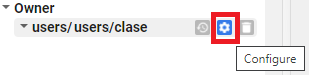
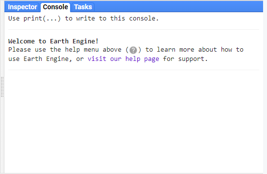
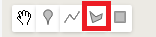
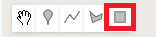
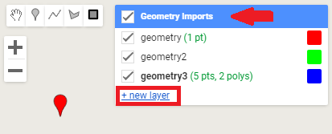
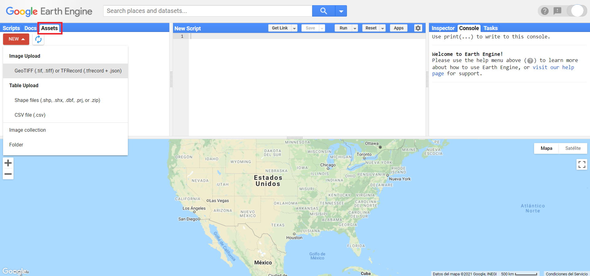

```{r setup, include=FALSE}
# Set global options for chunks
knitr::opts_chunk$set(out.width = "500px", dpi=150)
```

```{=latex}
% Para cambiar los parámetros por default de las cajas de tips o notas
\setlength{\aweboxleftmargin}{0.1\linewidth}.
\setlength{\aweboxcontentwidth}{0.85\linewidth}
\setlength{\aweboxvskip}{6mm}
\setlength{\aweboxrulewidth}{5pt}
\definecolor{abvrulecolor}{RGB}{48,90,255}
```

\newpage
# Introducción

## ¿Qué es Google Earth Engine?

Google Earth Engine (GEE) es una plataforma, desarrollada por Google, que permite realizar procesamientos geoespaciales a gran escala, utilizando bases de datos inmensas. Uno de los principales intereses de esta plataforma es reducir el tiempo invertido en pre procesamiento y facilitar los análisis realizados con información geoespacial. 

## ¿Cómo Funciona Google Earth Engine (GEE)?
### Background

Desde hace varios años existen varias misiones espaciales que registran datos de la Tierra a traves de distintos satelites, las cuales se han almacenado en acervos de imágenes. Aunque esta información ha sido muy útil para el desarrollo científico, siempre había existido el problema de la "Big-Data" (bases de datos enormes). Es decir, que dichos acervos de imágenes cuentan con millones de imágenes disponibles, lo cual resultaba imposible de procesar y analizar en su totalidad. Esta situación evitaba la posibilidad de aprovechar el potencial total de esta información.

GEE nace entonces de la necesidad de aprovechar esa "Big-Data", ofreciendo una herramienta que pueda lidiar tecnológicamente con la parte más complicada y engorrosa del manejo de información, permitiendo entonces que los usuarios se concentren en la generación de resultados, y nuevos desarrollos científicos. 

Para logar este objetivo, se creó una infraestructura con tres elementos claves que son los que permiten el funcionameinto de GEE: el catálogo de información, capacidad computacional y APIs.

#### Catálogo de información

GEE, recopiló la informacion geoespacial de diferentes fuentes alrededor del mundo y creó copias de esos datos en su propio *datacenter* logrando asi almacenar mas de 20 petabytes (20 000 000 de gigabytes) de informacion, en un solo lugar.

GEE ofrece un amplio repositorio de información geográfica global, cuya información ya se encuentra cargada su catálogo, facilitando un sencillo acceso a diferentes Datasets. entre la información que se puede consultar directamente en GEE se encuentran: acervos para todo el mundo de imágenes Landsat (1-8), MODIS, Sentinel (1-3, 5), SRTM, AVHRR, GOESS, ALOS, mosaicos anuales de PALSAR/PALSAR 2 y algunos productos derivados de estas imágenes u otros insumos como información climática global (WorldClim), capas de cambios en la cobertura forestal (Global Forest Cover Change), información de la altura del dosel global (Global Forest Canopy height), mapas de densidad de carbono globales (Global Aboveground and Belowground Biomass Carbon Density Map), datos de precipitación globales (CHIRPS), límites políticos (FAO GAUL: Global Administrative Unit Layers 2015, Country Boundaries), polígonos de áreas protegidas mundiales (WDPA: World Database on Protected Areas (polygons)), densidad poblacional (GPWv411: Population Density (Gridded Population of the World Version 4.11)), cuencas (WWF HydroSHEDS Hydrologically Conditioned DEM, 3 Arc-Seconds), entre otras.

::: {.tipblock data-latex=""}
Para consultar toda la información que esta disponible en GEE se puede consultar la siguiente liga: https://developers.google.com/earth-engine/datasets
:::

#### Capacidad computacional

Paralelamente GEE puso a disposicion, junto al datacenter, unos servidores (los cuales en 2010 tenian una capcidad más o menos equivalente a 10 000 computadores personales), para poder realizar rápida y eficazmente cálculos y computaciones sobre esos datos.

::: {.tipblock data-latex=""}
Se estima que GEE era capaz (en 2010) de en cuestión de días, ejecutar funciones que en un computador personal habria tomado 15 años.  
:::

#### API

GEE es una API (Application Program Interface). Esto significa que es una interfaz que permite la comunicación entre nosotros (usuarios) y los servidores de Google, proporcionando el acceso Y uso de la capacidad computacional de Google para nuestros análisis. GEE tiene el objetivo de facilitar la creación de programas. Por ello, cuenta con una serie de funciones, métodos y algoritmos preprogramados que se pueden llamar con una simpe línea. 

GEE ofrece dos APIs una en JavaScript la cual se accede online, es la mas conocida, más actualizada, más amigable con los usuarios, con más documentación disponible, y sobre la cual estaremos hablando; y una API en Python, la cual se puede trabajar desde la consola de Pyhton y permite entonces -hasta cierto punto- usar complementariamente librerias de Python, permitiendo asi procesamientos mas complejos, o funcionalidades que la API de Java no permite. la API de Python tiene las desventajas que tiene menos documentación, y tiene algunas diferencias (que pueden resutlar poco intuitivas) a la hora de programar.

########Grafico########

## Ventajas de la API de Java

Entre las principales ventajas de utilizar esta API radica en: 

1. Los datos pueden ser consultados directamente en la nube, por lo que no requieren ser descargados para trabajar con ellos (lo que ahorra tiempo y espacio de almacenamiento para el usuario). En cambio, si se quiere usar alguna librería de Python será necesaria la descarga de la informacion.
2. El procesamiento se hace en la nube, a través de internet, utilizando el poder de cómputo asignado para la API, lo cual reduce el gasto de memoria RAM (solo necesita una conexión estable y el consumo de RAM depende del comsuno del navegador). En la API de Python hay mayor consumo de memoria RAM (para ejecutar la consola de python y sus librerias) y requiere igualmente una conexion estable a internet.
3. Su interfaz es mucho más amigable con los ususarios, ofreciendo una plataforma más interactiva para programar, y más sencilla para enseñar.
4. Se pueden realizar fácilmente consultas de las colecciones de imágenes, y sus metadatos, antes de decidir importarlos. La API de Python no permite realizar ese tipo de consutas fácilmente, de modo que hay que tener previamente absoluta claridad sobre la colección de imágenes que se va a utilizar. 
5. Otra gran ventaja de la plataforma radica en que los códigos se guardan en la sesión de cada usuario. Esto permite mantener un control de los códigos y automáticamente se genera un registro histórico (parecido al git), lo cual facilita el seguimiento y comparación de cambios entre las versiones (y permite revertir a versiones anteriores). Además, se pueden generar repositorios compartidos para generar proyectos colaborativos. 

## Lenguaje Javascript

La sintaxis de JavaScript tiene algunas peculiaridades que deben cumplirse para que se pueda correr el código sin problemas. Entre la sintaxis básica se pueden considerar los siguientes puntos _(de igual forma iremos tocando la gramatica del código a lo largo de los ejemplos)_:

1. Es un lenguaje sensible a mayúsculas y minúsculas. De tal manera que puede haber dos objetos diferentes uno llamado `a` y otro diferente llamado `A`.
2. Siempre se debe cerrar cualquier comando con un `;`. (aunque de no hacerlo el código funcionara igualmente).
3. Comúnmente en Javascript se utiliza el _lower Camel Case_ (unir palabras pero cada una comenzando con su respectiva mayúscula) para unir palabras, en lugar de guiones o guión bajo. Por ejemplo: `intervalMean` o `updateMask`.
4. Todas las variables, funciones, objetos deben ser definidos mediante la función `var`.
5. Para definir variables se utiliza el operador `=`.
6. Los operadores matemáticos son: `+ - * /`.
7. Para concatenar dos cadenas de caracteres se utiliza el símbolo `+`.
8. Para realizar comentarios se puede utilizar `//` para comentarios de una línea o `/* … */` para comentarios de varias líneas
9. Se puede utilizar el operador `.` para aplicar una función al objeto que lo precede. Por ejemplo, `imagen.updateMask(mascara);`
10.  No es sensible a las tabulaciones, aunque son recomendadas para un código ordenado.
11. Son igualmente validas las comillas sencillas `''` como las comillas dobles `""`, pero no deben mezclarse ambos tipos de comillas en una misma línea.

\newpage
# Primeros pasos

## Registro para el uso de GEE Javascript API

######################graficos

Lo primero que hay que hacer para poder utlizar la API Javascript de Google Earth Engine es ingresar a su sitio para registrarse como usuario. Para ello, hay que acceder a la siguient liga:

**https://earthengine.google.com/**

Después le damos click en la esquina superior derecha donde dice **Sign Up**. Se ingresan todos los datos que pide el formulario. Recordar que para utilizar GEE requerimos de una cuenta de Google para poder utilizar la API.

::: {.tipblock data-latex=""}
Se recomienda dar de alta una cuenta de Google que tenga suficiente espacio disponible en Google Drive, ya que será la forma más fácil de exportar los resultados generados en GEE.
:::

Una vez realizado el registro, hay que esperar un tiempo (puede ser minutos o dias) hasta que llegue una confirmación por parte de GEE a nuestro correo informando que ya se puede hacer uso de la API.

Una vez que tengamos dicha confirmación, podemos acceder a la API accediendo a la siguiente liga: 

**https://code.earthengine.google.com/**

y se accede con la cuenta de Google con la que nos registramos.

## Elementos básicos de la interfaz gráfica

Una vez abierto la Javascript API, se observa la siguiente pantalla

```{r, echo = F}
knitr::include_graphics("Img/GEE_inicio_API.png")
```

Los elementos de la API se enlistan a continuación:

**Pantalla de Repositorios**

```{r, echo = F}
knitr::include_graphics("Img/left_panel.png")
```

Es el espacio donde se guardan y ordenan los scripts del usuario. En ella se pueden crear repositorios y folders para organizar los archivos de código, como se muestra a continuación. 

```{r, echo = F}
knitr::include_graphics("Img/repositorio.png")
```

Dentro de este espacio existen varias categorías (los primeros tres se pueden utilizar para determinar distintos niveles de acceso para diversos usuarios): 
1. Propietario (**Owner**): En esta sección se guardan los codigos creados por el mismo usuario.
2. Editor (**Writer**): En este apartado se guardan códigos que pueden ser creados por otros usuarios, pero para los cuales tenemos autorización de modificarlos.    
3. Lector (**Reader**): En esta parte aparecen codigos que otros usuarios nos han compartido acceso, pero no tenemos autorización de modificarlos.   
4. Ejemplos: se pueden consultar ejemplos de código para hacer algunas tareas específicas. Por ejemplo, existe un apartado específico para consultar las distintas maneras de enmascarar nubes utilizando distintas colecciones de imágenes (i.e., Landsat 4-7, Landsat 8, Sentinel-2, MODIS).
5.  Archivo: se pueden guardar archivos de código que ya no se utilicen, pero que no se desean eliminar.

::: {.tipblock data-latex=""}
El usuario puede compartir repositorios con otros usuarios de GEE como lector o editor. De esta manera, todos los archivos que se encuentren dentro de un repositorio serán compartidos con los usuarios indicados. Esta opción está disponible al darle click en el símbolo del engranaje a la derecha de cada repositorio (aparece una vez que se coloca el puntero sobre el nombre del repositorio).
```{r, echo = F}

```
:::

**Docs**

```{r, echo = F}
knitr::include_graphics("Img/docs.png")
```

Es un área donde se pueden consultar todas las funciones y algoritmos que se encuentran preprogramados y cargados en GEE. Además, para cada función se indica lo que hace, la entrada que requiere y el tipo de objeto que se obtiene como salida, así como los argumentos de la función. Estas funciones se encuentran agrupadas por objetos del servidor (los objetos se explican más adelante).
adicionalmente tiene un buscador, donde se pueden consultar tambien las funciones.

```{r, echo = F}
knitr::include_graphics("Img/doc_ejemplo.png")
```

**Assets**

```{r, echo = F}
knitr::include_graphics("Img/assets.png")
```

En este apartado el usuario puede subir y guardar su propia información para ser utilizada dentro de GEE. Se pueden subir archivos en formato raster, vector (.shp con sus archivos auxiliares, o un .zip) o separado por comas, únicamente.

```{r, echo = F}
knitr::include_graphics("Img/newAssets.png")
```

para subir un nuevo archivo, dar click en el boton **NEW**, seleccionar el tipo de archivo, y seguir las instrucciones, 
1. para los archivos raster, solo hace falta seleccionar el archivo correspondiente y dar click en upload.
2. para los archivos tipo _.shp_ es necesario subir **los archivos auxiliares** ( _dbf_, _prj_, _shx_, _cpg_, _fix_, _qix_, _sbn_, y/o _shp.xml_) con el mismo nombre. para los archivos _.zip_ es necesario que contenga **los archivos auxiliares**.
3. para los archivos _.csv_ es nescesario que exista una columna de longitud y otra de latitud, las coordenadas deben ser decimales y estar en EPSG:4326 (WGS 84).El nombre de esas columnas se debe indicar en _Advanced options_ / _x column_ - _Y column_. Además, se debe tener **absoluta claridad** del tipo de delimitador (ejemplo: coma: _,_ punto y coma: _;_ u otro diferente) y este debe ser especificado en _Advanced options_ / _CSV delimiter_.

::: {.tipblock data-latex=""}
El usuario puede compartir sus archivos con otros usuarios de GEE como lector o editor. De esta manera, el archivo compartido podra ser consultado por los usuarios indicados. Esta opción está disponible al darle click en el símbolo de compartir a la derecha de cada archivo (aparece una vez que se coloca el puntero sobre el nombre del archivo).
```{r, echo = F}
knitr::include_graphics("Img/shareAssets.png")
```
:::

**Pantalla de rutinas**

```{r, echo = F}
knitr::include_graphics("Img/editor.png")
```

Esta ventana es donde se va a escribir el código en JavaScript. En la parte superior de esta pantalla se encuentran varios botones. El primero, `Get link` sirve para compartir el código que se tenga abierto mediante una liga. Además, al darle click en la flecha de despliegue (en la opcion _Manage Links_ ) se puede hacer un manejo de las ligas que se tengan activas, así como borrar ligas que ya no se utilicen.

```{r, echo = F}
knitr::include_graphics("Img/links.png")
```

A su derecha se encuentra el botón de `Save` el cual permite guardar el código con el que se esté trabajando. Además, al darle click en la flecha de despliegue se puede usar la opcion _Save as_ para crear una copia del código con otro nombre.

```{r, echo = F}
knitr::include_graphics("Img/save.png")
```

A continuación está el botón de `Run` que sirve para correr el código que se muestra en la pantalla de rutinas, de principio a fin. Al darle click en este botón se envía el código a los servidores de Google y se realiza el procedimiento indicado.

```{r, echo = F}
knitr::include_graphics("Img/run.png")
```

A su derecha se encuentra el botón de `Reset` el cual sirve para borrar todo el código que se tenga escrito en la pantalla de rutinas. 

Después se encuentra el botón de Apps que sirve para crear Apps a partir del código que se encuentra en la pantalla. 

Por último, en el botón del engranaje se encuentran opciones para prender y apagar funciones como subrayar sugerencias en la pantalla de rutinas o autocompletar símbolos como ', ", ( y \{.


::: {.tipblock data-latex=""}
Cuando se corre un código en la consola con el botón de Run, éste no corre directamente en los servidores de Google, sino que éstos se transcriben a código GeoJSON, se envían a los servidores de Google y se espera una respuesta.
:::

::: {.tipblock data-latex=""}
Para buscar un texto especifico dentro del código, se debe dar click en la pantalla de rutinas y presionar ctrl+F (algunos atajos pueden variar segun la configuracion del teclado). Esta pantalla permite buscar una cadena de caracteres determinada dentro del código. Además, al volver a presionar ctrl+F tambien se activa el recuadro de sustitución, el cual resulta de gran ayuda para sustituir una cadena de caracteres determinada por otra. Para consultar el listado completo de atajos se puede presionar ctrl+shift+H.
:::

**Search**

```{r, echo = F}
knitr::include_graphics("Img/search.png")
```

Es una barra de búsqueda en la que se pueden buscar fuentes de datos o sitios. Resulta útil para encontrar la ruta de algun Dataset o colección en particular, así como para consultar sus metadatos, bandas y características. 

**Map**
```{r, echo = F}
knitr::include_graphics("Img/drawing.png")
```

En esta pantalla de mapa se pueden: 

1. Dibujar y visualizar puntos, polígonos, líneas o rectángulos
2. Mostrar la información que se haya indicado mediante la función `Map.addLayer`.
3. Añadir un mapa base (google maps , o google earth).

**Layer manager**

```{r, echo = F}
knitr::include_graphics("Img/layer.png")
```

Permite prender y apagar las capas que se estén mostrando en el área del mapa. Además, permite modificar las características necesarias para su visualización (p.ej., transparencia, color, distribución del histograma, compuesto de color, etc). Este  menú aparece una vez que se cargan capas a la pantalla de mapas.

**Consola**

```{r, echo = F}

```

La consola consiste en la pantalla de comunicación con el servidor. En ella se muestran los errores que se obtienen al correr un código o se pueden mostrar la información indicada por la función `print()`.

**Inspector**

```{r, echo = F}
knitr::include_graphics("Img/inspector.png")
```

Permite consultar los valores de las capas que se muestran en el mapa, al dar click sobre el punto de interés.

**Tasks**

```{r, echo = F}
knitr::include_graphics("Img/task.png")
```

En esta pestaña se muestran los trabajos que se hayan exportado mediante la función `Export.image` o `Export.table` y permite correr el trabajo de exportación al sitio donde el usuario le haya indicado (drive, assets). Además, en esta pestaña se:

1. Muestran las tareas para ejecutar (con el boton de run, el cual permite especificar detalles de la exportacion).
2. Muestran las tareas en ejecucion (gris).
3. Muestra el tiempo demorado en el trabajo.
2. Así como cuando el trabajo se ha finalizado (azul).
3. Cuando hay un error en algun objeto exportado, en esta ventana se verá el trabajo marcado en rojo, indicando el error. Por último, al dar click sobre el signo de interrogación que aparece al colocar el cursor sobre algún trabajo, permite obtener mayor información del trabajo, por ejemplo, el error que arrojó el servidor al tratar de realizar una exportación o la ubicación del archivo exportado.

\newpage 
# Interfaz de usuario: Visualización de datos, gráficos y exportación

## Imprimir en consola

La interfaz más sencilla de la API es imprimir objetos en la consola. Esto se realiza mediante la función `print`. Al llamar esta función sobre algún objeto, éste se evalua y se imprime su estructura en la consola. Esta función permite obtener información básica de los objetos como su tipo de objeto, número de registros, características y propiedades de los elementos que lo conforman. Además, esta función resulta muy útil para eliminar errores de programación (_bugs_) en los códigos.

```{js, echo = T}
print(Objeto);
print('Hola Mundo');
```

## Map

Permite agregar objetos del lado del servidor a la pantalla de mapas, así como controlar algunos parámetros de dicha pantalla.

::: {.tipblock data-latex=""}
Para revisar todas las funciones disponibles para la interfaz del usuario, ver la sección de **Code Editor ** en la siguiente liga: https://developers.google.com/earth-engine/apidocs. Además, en esta sección se indican los argumentos que acepta cada función, así como el tipo de objeto de la salida.
:::

**Map.addLayer**

La función `Map.addLayer` permite mostrar elementos en la parte de mapa de la API. Por lo tanto, permite mostrar objetos de tipo `ee.Feature` o `ee.Image`. Adicionalmente, se pueden indicar otros parámetros como la forma de visualización de los objetos y el nombre de la capa. Los argumentos de la función `Map.addLayer` incluyen el objeto a añadir a la pantalla de mapas, seguido de un diccionario que señala las bandas a añadir y los valores máximos y mínimos para el despliegue de la capa y por último, se puede indicar el nombre de la capa.

Al utilizar `Map.addLayer` sobre una imagen  se pueden indicar los siguientes argumentos: `bands`, `min` o `max`. Estos se deben pasar dentro de un par de llaves (`{}`) como un diccionario. Esta función también permite asignar colores mediante el argumento de `palette`. Dependiendo de las bandas que se elija mostrar se puede mostrar únicamente una banda en tonos de gris o un compuesto RGB. Por ejemplo, para cargar una imagen a la pantalla de mapas:

```{js, echo = T}
Map.addLayer(image, {bands: ['B1', 'B2', 'B3'], min: 0, max: 2000}, 'RGB');
```

::: {.tipblock data-latex=""}
En algunas ocasiones, al intentar cargar objetos en la pantalla de mapas, que sean producto de procesamientos demandantes, la consola puede mostrar un error indicando que se superó el tiempo de espera o de el límite de memoria disponible. En estos casos, se sugiere exportar el resultado, en lugar de tratar de cargarlo en la pantalla de mapas y después visualizarlo de manera local en algún SIG o software similar (p.ej., QGIS)
:::

Para el caso de los vectores (`features`) se puede realizar una operación similar como:

```{js, echo = T}
Map.addLayer(feature, {palette: ['FF0000', 'FFFF00',' 008000'], min: 0, max: 10},
'featuresColored');
```

::: {.tipblock data-latex=""}
El código de los colores pasados al argumento de _palette_ corresponden a códigos hexadecimales.
:::

**Map.centerObject**

Esta función permite centrar la pantalla de mapas en algún objeto. Además, se puede indicar el zoom con el cual se quiere centrar el objeto.

## Chart

La función principal para realizar gráficos es `ui.Chart`. Esta función tiene varios algoritmos para realizar diferentes tipos de gráficos, sin embargo, existen diferentes opciones de gráficos para distintos tipos de objetos. Los objetos básicos que permite graficar GEE son: vectores (``Feature`), colecciones de vectores (`FeatureCollection`), imágenes (`Image`), colecciones de imágenes (`ImageCollection`), arreglos (`Array`) y listas (`List`). Por otro lado, para indicar los colores a utilizar en el gráfico o el título del mismo se puede utilizar la función `setOptions` sobre el objeto de tipo gráfico.

**Chart.feature**

Este conjunto de funciones permite obtener distintos tipos de gráficos a partir de un vector o una colección de vectores. Algunas de las funciones disponibles incluyen: `ui.Chart.feature.byFeature`, `ui.Chart.feature.byProperty`, `ui.Chart.feature.groups` y `ui.Chart.feature.histogram`. Por ejemplo:

```{js, echo = T}
ui.Chart.feature.byProperty({
  feature: colecciónAtributos, 
  xProperties: 'Clase',
})
```

**Chart.image**

Este conjunto de funciones permiten obtener distintos tipos de gráficos a partir de una imagen o colección de imágenes. Algunas de las funciones que se encuentran disponibles incluyen: `ui.Chart.image.byClass`, `ui.Chart.image.byRegion`, `ui.Chart.image.doySeries`, `ui.Chart.image.histogram`, `ui.Chart.image.seriesByRegion`, entre otras. 

Por ejemplo, para graficar una serie de tiempo a partir de una colección de imágenes se utiliza la función `ui.Chart.image.seriesByRegion`. Este tipo de gráficos permiten graficar la serie de tiempo de algunas áreas determinadas utilizando una colección de imágenes.

```{js, echo = T}
ui.Chart.image.seriesByRegion({
  imageCollection: colecciónImagenes, 
  regions: areas.filter(ee.Filter.eq('Tipo','Bosque')),
  reducer: ee.Reducer.mean(), 
  band: 'NDVI', 
  scale: 30, 
  seriesProperty: 'Tipo'
})
  .setOptions({
    title: 'Bosque',
    colors: ['#EE3A19']
  });
```

::: {.tipblock data-latex=""}
El nombre de las funciones para generar gráficos en GEE dan una idea del tipo de gráfica que se puede generar con dicha función y el tipo de insumos que requiere cada tipo de gráfico.
:::
                                              
## Export

Una vez que se haya obtenido el resultado de interés en GEE se puede exportar para ser manejado en otro programa (p.ej., un SIG). Sin embargo, sólo existen cuatro formatos válidos para exportar desde GEE: raster, vector, mapa y video.

**Export.image**

En el caso de las imágenes, la función para exportar es` Export.image`. Dentro de GEE hay 3 opciones para exportar los resultados de una imagen: `Export.image.toAsset`, `Export.image.toDrive` o `Export.image.toCloudStorage`. El primero permite exportar la imagen como una imagen a la sección de **Assets**, es decir, la sección donde el usuario puede subir su información a GEE. Esta opción es útil para cuando el resultado se va a utilizar en otro procedimiento de GEE. La segunda opción permite exportarlo al Google Drive de la cuenta con la que se tiene acceso a GEE. Esta opción es útil para trabajar con las imágenes en algún entorno local como algún SIG. La última opción permite exportar la imagen al Google Cloud Storage para utilizarla en algún otro proceso a realizar en Google Cloud. La opción que creemos es más común para cualquier usuario será la de `Export.image.toDrive`. 

Resulta obvio que el primero se va a utilizar para exportar imágenes en formato raster, sin embargo, no siempre resulta obvio, ya que algunas veces se pueden convertir imágenes a formato de arreglo (array), tras lo cual hay que volver a convertir la información a formato de imagen (Image) para poder exportarla. La aplicación permite exportar únicamente en formato GTiff o TRFrecord (tensores).

Un ejemplo de cómo exportar una imagen se presenta a continuación.

```{js echo = T}
Export.image.toDrive({
  image: imgDiff,
  description: 'DiferenciaNDVI_2016-2017',
  scale: 30,
  fileFormat: 'GeoTIFF',
  folder: 'DiferenciaNDVIL8'
}); 
```

::: {.tipblock data-latex=""}
En GEE muchas operaciones utilizan el término de scale, sin embargo, este no se refiere a la escala de trabajo en un sentido tradicional (p.ej., 1:50 000), sino que se refiere al tamaño de pixel expresado en m.
:::

::: {.tipblock data-latex=""}
En algunas ocasiones, al intentar exportar una imagen muy grande (mayor a 10 000 000 de pixeles), la consola puede mostrar un error indicando que el objeto a exportar tiene un número muy alto de pixeles. En este caso, se debe aumentar el número de pixeles máximo permitido para la exportación. Esto se logra indicando el argumento `maxPixels` dentro del diccionario que se pasa a Export.image.toDrive. Por ejemplo, `maxPixels: 1e10`, lo cual permite exportar una imagen con hasta 1 x 10^10 pixeles.
:::

**Export.table**

Por su parte, el formato vector permite exportar información vector y tablas sin información geográfica. De nuevo, para poder exportar en el formato vector, el objeto exportado debe estar en formato vector (`feature`). Al igual que en el caso de las imágenes, dentro de GEE hay 3 opciones para exportar objetos de tipo vector: `Export.table.toAsset`, `Export.table.toDrive` o `Export.table.toCloudStorage`. Para el caso de tablas, sin información geográfica asociada, se debe definir el objeto como un objeto vector sin geometría (es decir, `null`) y en la tabla de atributos anexar la información deseada. Un ejemplo del uso de esta función se presenta a continuación:

```{js echo = T}
Export.table.toDrive({
    collection: feature,
    description: 'nombreArchivo',
    folder: 'mifolder',
    fileFormat: 'CSV'
 });
```

**Export.video**

Esta opción permite exportar una colección de imágenes como video ya sea al almacenamiento de la nube de Google `Export.video.toCloudStorage` o al Drive `Export.video.toDrive`. Esta función puede resultar atractiva para observar los cambios de un área de interés, a través del tiempo. Para exportar una colección de imágenes a video se puede realizar de la siguiente manera:

```{js echo = T}
Export.video.toDrive({
    collection: colecciónImgs,
    description: 'videoTimelapse',
    folder: 'mifolder',
    framesPerSecond: 24
 });
```

\newpage
# Tipos de objetos

## Objetos del cliente y del servidor

Existen dos lados de la programación de la API de GEE: el del servidor y el del cliente. De tal manera, un objeto puede ser convertido entre los dos tipos. Por ejemplo, mientras que del lado del cliente una cadena de caracteres puede ser definida simplemente como: `“cadena”`, para convertirla en objeto del lado del servidor deben utilizarse las funciones del servidor, es decir: `ee.String(“cadena”)`. Muchos de los algoritmos pre cargados en GEE únicamente corren sobre objetos del lado del servidor, por lo cual, es recomendable utilizar dicha sintaxis. Adicionalmente, algunas operaciones se pueden hacer utilizando ambos tipos de sintaxis. Por ejemplo, una suma se puede realizar del lado del cliente mediante `1 + 2`, mientras que del lado del servidor se utilizaría `ee.Number(1).add(ee.Number(2))`.

En la mayoría de los casos se va a utilizar la programación del lado del servidor, ya que es la que permite hacer todo el procesamiento en GEE. Por ejemplo, para el caso de los condiciones se sugiere utilizar en lugar de `if` y `else`, `ee.Algorithms.If`. Sin embargo, cabe aclarar que algunas funciones sólo corren del lado del cliente. Por ejemplo, las funciones de la interfaz del usuario, utilizadas para exportar la información a algún archivo (ya sea un raster, un vector o una tabla) `ee.Export...`., agregar una capa a la pantalla del mapa `Map.addLayer()`o crear gráficos, así como imprimir información en la consola `print()`. El siguiente diagrama permite visualizar el lado del usuario y del servidor en el funcionamiento de GEE.

```{r, echo = F}
knitr::include_graphics("Img/daigFunc.png")
```

## Tipos de objetos del lado del cliente

::: {.tipblock data-latex=""}
Vamos a utilizar mucho la función `print()` esta función, permite visualizar en la **consola** diversos objetos. Por ejemplo, si se quiere ver en la consola la palabra _"Hola"_  se usa el comando `print('Hola')`
:::

**Cadenas de texto**

Se refiere a objetos de cadenas de símbolos de tipo carácter alfanumérico. Cualquier secuencia de caracteres puede ser un texto. Estos se definen como cualquier cadena de caracteres que se encuentren entre un par de comillas bien sean dobles  “” o sencillas ''. Por ejemplo; ejercicio 0:

```{js, echo = T}
var cadena = “Esto es una cadena de caracteres”;  //cadena de texto de solo letras
var telefono= '1234567890';                       //cadena de texto de solo numeros
var direccion = 'calle cuarta casa # 16';         //cadena de texto de letras, numeros y
//simbolos
```

::: {.tipblock data-latex=""}
Resulta importante notar que los números en una cadena de texto no serán interpretados como valores numéricos sino como texto.
:::

**Números**

Se refiere a objetos numéricos que indican un valor. Cualquier secuencia de números puede ser un número. Para números decimales se utiliza el punto decimal y no la coma decimal. Por ejemplo; ejercicio 1:

```{js, echo = T}
var numero = 1;     //numero entero
var numero2 = 2.5;  //numero decimal con punto decimal
```

Nótese que al declarar un objeto como numero no se hace uso de comillas.

**Listas**

Se refieren a objetos que contienen varias entradas, las cuales pueden ser numéricas (números), cadenas de texto (texto) o incluso otras listas. Las listas se definen mediante el uso de corchetes `[]` y cada entrada es separada mediante una coma (`,`). Permiten encadenar una serie de valores. Por ejemplo; ejercicio 2:

```{js, echo = T}
var lista = [1, 2, 3, 4, 5, 6, 7, 8];                 //lista numerica 
var listaA = [“primero”, “segundo”, “tercero”];       //lista de texto
var listaB = [“primero”, “segundo”, “tercero”, 4];    //lista de texo y numeros
var listaC = [lista, listaA, listaB];                 //lista de listas
```

Todas las listas automáticamente asignan, en orden, un número a cada elemento dentro de ellas, **siempre empezando desde 0**. Entonces se puede consultar un solo elemento dentro de una lista, aportando el número de su posición dentro de ella. Ejercicio 2.1:

```{js, echo = T}
print(lista[0]);  //primer objeto de la lista llamada "lista"
print(listaA[1]); //segundo objeto de la lista llamada "listaA"
print(listaB[2]); //tercer objeto de la lista llamada "listaB"
print(listaC);    //lista completa con todos sus elementos
```

**Diccionarios (Dictionaries)**

Los diccionarios son objetos que contienen claves (objetos o entradas) y valores asociados a estas claves (definicion del objeto). Los diccionarios se definen mediante el uso de llaves (`{}`) donde se define cada clave seguida de dos puntos (`:`) y la definición del valor, cadena de caracteres, o lista asociada a esa clave. Para ingresar varias entradas, éstas deben ir separadas por una coma.
Las claves o entradas siempre seran leídas como cadenas de texto. Se recomienda que no tengan espacios dentro de ellas, si es nescesario es mejor usar guión bajo `_`. Al hacer `print()` se ordenarán alfabeticamente.

```{js, echo = T}
var dicc = {    //se declara un nuevo diccionario
  clave1: 1,    //la primera entrada es el texto "clave1" que esta definido con el valor
  //de 1 (tipo numero)  
  clave2: "A"   //la segunda entrada es el texto "clave2", y su definicion es la letra
  //"A" (tipo cadena de texto)
};            
```

Para consultar los valores dentro de un diccionario se puede hacer llamando directamente el nombre de la clave deseada dentro de corchetes. Adicionalmente para los diccionarios se recomienda utilizar la notación de `.` seguido del nombre de la clave. la notacion con punto, es recomendada.Por ejemplo; ejercicio 3.1:

```{js, echo = T}
print(dicc["clave1"]);  //notacion de lista, se mostrara en la consola la definicion de 
//"clave1", es decir el valor 1 
print(dicc["clave2"]);  //notacion de lista, se mostrara en la consola la definicion de 
//"clave2", es decir la letra "A"

print(dicc.clave1);  //notacion con punto, se mostrara en la consola la definicion de 
//"clave1", es decir el valor 1 
print(dicc.clave2);  //notacion con punto, se mostrara en la consola la definicion de 
//"clave2", es decir la letra "A"

```

**Funciones (Functions)**

las funciones seran revisadas a mayor profundidad después.

Se refieren a objetos que contienen algún proceso que se realizará a alguna variable. Siempre comienzan con la función `function` seguida por el objeto al que se le aplicará la función, este objeto entre paréntesis, y entre corchetes se coloca el procedimiento que va a realizar la función. Por último, deben regresar un objeto mediante la función `return`. Por ejemplo:

```{js, echo = T}
var maskIm = function(objeto){              //maskIm es una nueva función, y su 
//argumento de entrada es "objeto"
  var image = ee.Image(objeto)              //se define que "objeto" es una imagen 
//raster, y se guarda en la variable image
  var qaImage = image.select('pixel_qa');   //se selecciona solamente la banda de nombre
//"pixel_qa" de la imagen image
  var clearData = qaImage.eq(322);          //se crea una nueva imagen binaria donde 
//sera 1 los pixeles con valor igual a 322, y 0 los demas
  return image.updateMask(clearData);       //se crea una mascara con la imagen binaria,
//y se entreda la imagen original enmascarada
};
```

Aunque las funciones son propiamente objetos del lado del cliente, deben contener únicamente funciones del lado del servidor para que funcionen apropiadamente al trabajar en GEE. Esto permite definir cualquier serie de procesos como una función y que GEE la interprete de manera adecuada en sus servidores. Esto quedará más claro después de repasar la siguiente sección.

::: {.tipblock data-latex=""}
Las funciones que se ejecuten sobre una colección de iamgenes o vectores, sólo funcionan si regresan un objeto de tipo `Feature`, `FeatureCollection`, `Image` o `ImageCollections`, por lo cual, a veces se deben realizar ciertas conversiones para evitar un error.
:::

## Tipo de objetos del lado del servidor

Estas funciones permiten definir objetos en el lado del servidor o convertir objetos en el lado del cliente al servidor. También, en algunos casos los objetos que se obtienen a partir de ciertas funciones retornan un objeto de tipo indefinido (tipo objeto, `ee.Object`), por lo cual, se recomienda convertir dicho objeto al lado del servidor antes de proseguir con su uso.

::: {.tipblock data-latex=""}
Como resultado de algunas operaciones realizadas en GEE, por ejemplo, `first` o `get`, el objeto resultante no tiene un tipo definido, por lo cual, resulta necesario meterlo en un contenedor que indique el tipo de objeto. Este tipo de errores suelen mostrar un mensaje "`...is not a function`"
:::

Por otro lado, toda la información que se encuentra disponible en GEE corresponderá a objetos del servidor. Por ende, la mayoría de los métodos disponibles en GEE trabajarán únicamente con objetos del lado del servidor. 

::: {.tipblock data-latex=""}
Para revisar todos los métodos disponibles en GEE clasificados por tipo de objeto del servidor visitar la sección de **Client libraries** en la siguiente liga: https://developers.google.com/earth-engine/apidocs. Además, en esta sección se indican los argumentos que acepta cada función, así como el tipo de objeto de la salida.
:::

Los objetos del lado del servidor se pueden conceptualizar como contenedores que le indican al servidor qué tipo de objeto es el que se está enviando. Además, cuando se trabaja del lado del servidor, los objetos necesariamente son enviados al servidor para ser evaluados. 

::: {.tipblock data-latex=""}
Para recordar cuáles objetos son del servidor, resulta útil recordar que todos ellos cuentan con el prefijo  `ee` (del servidor de **Earth Engine**), seguido del nombre del tipo de objeto con inicial mayúscula.
:::

**ee.String()**

Es equivalente a la cadena de texto pero del lado del servidor, ya que permite enviar un objeto como cadena de caracteres al servidor. Además, al definir un objeto de este tipo, se puede utilizar cualquier función indicada bajo la librería de **ee.String** en la API (ver liga anterior).

Ejercicio 4:

```{js, echo = T}
var cadena2 = "Esto es una cadena de caracteres";           //esta es una cadena de 
//texto del lado del cliente
var cadenaServ = ee.String(cadena2);                        //aca se convierte el texto 
//del lado del cliente a un ee.String del lado dle servidor
print("Esto está evaluado en el servidor", cadenaServ);     //se muestra primero un 
//texto de cliente, y segundo un ee.String del servidor  
```

**ee.Number()**

Permite enviar un numero como objeto al servidor. Además, al definir un objeto de este tipo, se puede utilizar cualquier función indicada bajo la librería de **ee.Number()** en la API (ver liga anterior).

Ejercicio 5:

```{js, echo = T}
var numServ = ee.Number(1900);                                    //se define un numero 
//como ee.Number del servidor
print("numero como un objeto ee.Number del servidor", numServ);   //se muestra primero 
//un texto de cliente, y segundo el ee.Number del servidor
```

**ee.List()**

Permite enviar un objeto como lista al servidor. Al definir un objeto de este tipo, se puede utilizar cualquier función indicada bajo la librería de **ee.List** (ver liga anterior).

Ejercicio 6:

```{js, echo = T}
var lista = ['hola','12','5%', ee.String('servidor'), ee.Number(64), 8.32]; //se 
//construye una nueva lista con diferentes tipos de objetos del lado del usuario y 
//servidor
var listaServ = ee.List(lista);                                       //se define una 
//lista como ee.List del servidor 

print("Esto está evaluado como una lista del servidor", listaServ);    //se muestra 
//primero un texto del cliente, y segundo el ee.List del servidor
```

Para acceder a un elemento de tipo `ee.List` se utiliza la función `get`. Ejercicio 6.1:

```{js, echo = T}
print(listaServ.get(0));   //se llama solamente al primero objeto de la ee.List del 
//servidor
print(listaServ.get(1));   //se llama solamente al segundo objeto de la ee.List del 
//servidor
```

**ee.Dictionary**

Permite enviar un objeto como diccionario al servidor. Además, al definir un objeto de este tipo, se pueden utilizar cualquier función indicada bajo la librería de **ee.Dictionary** al revisar las librerías disponibles en la API (ver liga anterior).

ejercicio 7

```{js, echo = T}

var dicc = {                                                  //se construye un 
//diccionario de usuario con diferentes tipos de objetos del lado del usuario y servidor
  'texto de usuario':'usuario',
  'string del servidor': ee.String('texto de servidor # 2'),
  'numero de usuario': 4,
  'numero de servidor': ee.Number(3.1416),
  'lista de usuario': [1, 'ejemplo'],
  'lista de servidor': ee.List([ee.String('texto de servidor # 3'), ee.Number(1.44)])
}; 

var diccServ = ee.Dictionary(dicc);                           //se define el diccionario
//de usuario anterior como ee.Dictionary del servidor 

print("Esto está evaluado como una lista del servidor", diccServ);    //se muestra 
//primero un texto del cliente, y segundo el ee.Dictionary del servidor, notese que se 
//ordenaron las claves alfabeticamente

```

Se puede consultar utilizando también la función `get` y el nombre de la clave. ejercicio 7.1

```{js, echo = T}
print(diccServ.get('lista_de_servidor'));        //se muestra el valor que contiene la 
//clave "lista_de_servidor"
print(diccServ.get('numero_de_usuario'));        //se muestra el valor que contiene el 
//elemento "numero_de_usuario"
```

Por último, si se desea obtener las claves disponibles en un `ee.Dictionary` se utiliza la función `.keys`. esta función devuelve una lista.
De igual forma, si se desea obtener los valores disponibles en un `ee.Dictionary` se utiliza la función `.values`. esta función devuelve una lista

```{js, echo = T}
print(diccServe.keys());    //muesta una lista con todas las claves del ee.Dictionary
print(diccServe.values());  //muestra una lista con todos los valores del ee.Dictionary
```

**ee.Date**

Este es la forma en la que GEE permite trabajar con fechas. Permite enviar un objeto como fecha al servidor. Además, al definir un objeto de este tipo, se puede utilizar cualquier función indicada bajo la librería de **ee.Date** (ver liga anterior). 

Hay varias formas de construir una fecha especifica:

1.  Se puede usar un texto de usuario indicando la fecha en el **siguiente formato:** "YYYY-MM-DD", esta fecha **obligatoriamente** debe:
  -  Usar la función `ee.Date()`.
  -  Estar en orden Año Mes Dia (AAAA-MM-DD).
  -  Usar guiones como separadores `-`.
  -  Tener meses numéricos (01, 02, 03, 04, 05, 06, 07, 08, 09, 10, 11, 12).
  -  Tener días de dos digitos (01, 02, 03 ... 09, 10, 11, ... 30).
  -  Estar entre comillas.
2.  Se pueden usar números de usuario, en este caso se debe:
  -  Usar la función `ee.DatefromYMD()`.
  -  Ingresar dentro del parentesis el año, el mes y el dia (en ese orden), separados por comas.
3.  Se puede usar un texto de usuario especificando el formato, para esto se debe:
  -  Especificar el formato de la fecha con la siguiente clave (YYYY=año, MM=mes, D=dia).
  -  Especificar el tipo de separador.
  -  Especificar el orden en el que se ingresará el texto.
  -  Especificar la cantidad de digitos esperada para cada item (año, mes y dia).
  -  El formato debe estar entre comillas.
  -  Luego de especificar el formato, se ingresa **dentro de comillas** el texto a convertir a  `ee.Date` (entre el formato y el texto debe ir una coma).

ejercicio 8
```{js, echo = T}
var fechaString = '2001-10';                 //fecha como un texto de cliente
var fecha = ee.Date(fechaString);             //convierte la fecha de texto de cliente a
//ee.Date del servidor

var fecha2 = ee.Date.fromYMD(2015,03,28);     //crea una ee.Date a partir de definir 
//año, mes y dia con numeros del cliente

var fecha3 = ee.Date.parse('DD_YYYY/MMM', '14_1827/jul'); //crea una fecha a partir de 
//un formato especificado y un texto que cumple con dicho formato, notese que se 
//especifica el orden del dia año y mes, se especifica cada separados, y si se usan años
//como texto deben ser las 3 primeras iniciales del mes en ingles 

print("Fecha como ee.Date a partir de texto", fecha);            //se muestra la fecha 
//como texto de cliente, notese que la fecha se completa automaticamente al primer dia 
//del mes con hora 00:00:00 
print("Fecha como ee.Date a partir de numeros indicando el año mes y dia",fecha2);      
//muestra la ee.Date creada con texto del cliente
print("Fecha como ee.Date a partir de un formato especificado y texto que lo cumple",fecha3);   //muestra la ee.Date creada con numeros que definen año, mes y dia 
//del cliente
```

**ee.Image**

Permite leer un objeto **individual** tipo Raster en el servidor. Además, al definir un objeto de este tipo, se pueden utilizar cualquier función indicada bajo la librería de **ee.Image**. Este va a ser el tipo de objetos para trabajar con cualquier elemento de tipo raster en GEE. Más adelante se explican con mayor detalle.

**ee.ImageCollection**

Al definir un objeto de este tipo, se pueden utilizar cualquier función indicada bajo la librería de **ee.ImageCollection**. Las colecciones de imágenes están formadas por imágenes. Más adelante se explican con mayor detalle.


**ee.Feature**

Permite leer un objeto como vector en el servidor. Además, al definir un objeto de este tipo, se pueden utilizar cualquier función indicada bajo la librería de **ee.Feature**. Este va a ser el tipo de objetos para trabajar con cualquier objeto de tipo vector o tabla. Más adelante se explican con mayor detalle.

**ee.FeatureCollection**

Permite enviar un objeto como colección de vectores al servidor. Además, al definir un objeto de este tipo, se pueden utilizar cualquier función indicada bajo la librería de **ee.FeatureCollection**. Las colecciones de features están formadas por varios vectores. Más adelante se explican con mayor detalle.

**ee.Algorithms**

Este tipo de objetos contienen algoritmos precargados en GEE. Estos algoritmos tienen una gran variedad de aplicaciones, desde operaciones sencillas como una evaluación lógica, p.ej., `ee.Algorithms.If`, hasta algoritmos de segmentación temporal de una serie de imágenes, p.ej.,  `ee.Algorithms.TemporalSegmentation.Ccdc`.

**ee.Array**

Este tipo de objetos corresponden a arreglos multidimensionales. Los arreglos se pueden interpretar como matrices de más de dos dimensiones (p.ej., filas y columnas). Su uso más común se da en el análisis de series de tiempo o con ordenaciones espectrales. Este tipo de objetos cuentan con una serie de funciones, las cuales se pueden consultar bajo la librería de **ee.Array** (ver liga anterior).

**ee.Classifier**

Este tipo de objetos corresponden a algoritmos de clasificación de datos que se encuentran pre cargados en GEE. Por ejemplo, se encuentra el algoritmo de _random forest_, disponible mediante la función `ee.Classifier.smileRandomForest` o _MaxEnt_, disponible mediante la función `ee.Classifier.amnhMaxent`. entre otros.

**ee.Clusterer**

Este tipo de objetos corresponden a algoritmos de clasificaicon no supervisada de datos que se encuentran pre cargados en GEE. Por ejemplo, se encuentra el algoritmo de _k-means_, disponible mediante la función `ee.Clusterer.wekaKMeans` o _Cobweb_, disponible mediante la función `ee.Clusterer.wekaCobweb`.

**ee.Filter**

Este tipo de objetos que normalmente se utilizan para filtrar colecciones ya sean de vectores o de imágenes. Este tipo de objetos permiten definir filtros de distintos tipos, ya sean espaciales, temporales o en función de características de las imágenes o vectores (p.ej., metadatos). Por otro lado, también contienen funciones para combinar filtros. 

**ee.Geometry**

Este tipo de objetos corresponden a distintos tipos de geometrías, que incluyen líneas, polígonos y puntos. Además, en GEE se encuentran varias funciones pre cargadas que se pueden aplicar a este tipo de objetos, p.ej., `ee.Geometry.MultiPolygon.Simplify` para simplificar polígonos múltiples o calcular el área `ee.Geometry.Polygon.area`.

**ee.Join**

Este conjunto de funciones permite realizar uniones entre colecciones de vectores, utilizando los campos de éstos como las claves para realizar las uniones. Por ejemplo, se pueden unir dos colecciones de vectores mediante `ee.Join.merge` o unir los campos de una primera colección con los de una segunda mediante `ee.Join.inner`

**ee.Reducer**

Los reductores permite agregar datos basados en una regla o utilizando una función determinada. Este tipo funciones son las utilizados para generar, por ejemplo, una sola imagen a partir de varias imágenes que comparten una misma extensión espacial. El tipo de reductor define el tipo de agregacion que se aplique, Por ejemplo, se puede reducir con una sencilla estadística (mínimo, máximo, moda, media, mediana, etc.), o reductores áas complejos (histogramas, enlistar, regresion líneal). Tambien pueden reducirse datos con dimensión temporal (colección de imágenes de diferentes fechas), dimensión espacial, según las bandas de las imágenes, o incluso segun los atributos de los vectores. 

**ee.Terrain**

Este conjunto de funciones permite calcular algunas operaciones topográficas, a partir de un modelo digital de elevación (DEM). Por ejemplo, en GEE se encuentran las funciones `ee.Terrain.Aspect` para calcular el aspecto o `ee.Terrain.slope` para calcular la pendiente,

::: {.tipblock data-latex=""}
Resulta útil recordar que normalmente los argumentos de cualquier función del servidor se pasan como un diccionario.
:::

\newpage

# Geometrías

GEE utiliza el objeto ee.Geometry para leer y manejar formas geométricas, estos incluyen geometrías sin area, como son: 
    **Punto** (`ee.Geometry.Point`): una coordenada en X & Y.
    **Multi punto** (`ee.Geometry.MultiPoint`): una lista de puntos.
    **línea** (`ee.Geometry.LineString`): una línea.
    **Multi línea** (`ee.Geometry.MultiLineString`): una lista de líneas.
    **perímetro** (`ee.Geometry.línearRing`): un perímetro (una línea cerrada).

Ejercicio X

```{js echo = T}
var punto = ee.Geometry.Point(-99.14, 19.47); //un punto definido con su coordenada  

var MultiPunto = ee.Geometry.MultiPoint([     //un Multi Punto 
  -74.072, 4.754,                               //definidio a partir de una LISTA
  -75.545, 6.285,                              //de coordenadas de puntos
  -76.533, 3.461,
  -74.819, 10.997,
  -75.501, 10.393]);

var línea = ee.Geometry.LineString([  //una línea definida a partir
  -117.08, 32.04,                     //de una LISTA de
  -104.25, 31.74,                     //las cordenadas de sus vertices
  -96.69, 25.58,
  -95.99, 19.74,
  -87.2, 21.39,
  -87.2, 16.91,
  -82.28, 14.88,
  -83.15, 10.07,
  -77.35, 8.86,
  -71.55, 12.66]); 

var Multilínea = ee.Geometry.MultiLineString([  //una Multi línea definida a
   ee.Geometry.LineString(                      //a partir de una LISTA de
     [-76.017, 26.173, -76.017, 16.173]),       //líneas ee.LineString, que a
  ee.Geometry.LineString(                       //su ves estan definidas por una
    [-73.017, 26.173, -73.017, 16.173]),        //lista de las coordenadas de
  ee.Geometry.LineString(                       //sus vertices
    [-78.434, 20.926, -70.04, 24.401]),
  ee.Geometry.LineString(
    [-78.434, 18.926, -70.04, 22.401])]);

var perímetro = ee.Geometry.línearRing([  //un perímetro definido a partir de
  -105.732, 20.627,                       //una LISTA  de las coordenadas de
  -109.336, 26.544,                       //los vertices
  -113.291, 31.274,
  -114.829, 31.274,
  -109.468, 23.317])
```

tambien hay geometrías que tienen el componente de area, como son: 
    **Rectangulo** (`ee.Geometry.Rectangle`): un rectángulo.
    **polígono** (`ee.Geometry.Polygon`): un polígono
    **Multi polígono** (`ee.Geometry.MultiPolygon`): un lista de polígonos.

Ejercicio X.1
```{js echo = T}
var rectangulo = ee.Geometry.Rectangle(  //un rectángulo definido por las coordenadas 
//de los vértices opuestos
  -104.12, 5.73,
  -88.21, -0.15); 

var polígono = ee.Geometry.Polygon(  //un polígono definido por las coordenadas de 
//sus vértices
  -80.348, -3.36,
  -80.348, -3.36,
  -78.985, -5.113,
  -78.019, -3.228,
  -75.997, -2.394,
  -75.25, -0.901,
  -75.865, 0.11,
  -78.941, 1.428,
  -80.26, 0.725,
  -80.919, -1.911,
  -79.776, -2.614
  );

var Multipolígono = ee.Geometry.MultiPolygon(  //un multipolígono definido por una 
//LISTA de polígonos
  [
    ee.Geometry.Polygon(                                                        //el 
//primer polígono esta definido a partir de dos permietros 
      [ee.Geometry.línearRing(-113.53, 18.81, -101.66, 10.83,-114.93, 8.93),    //el 
//primer perimitro define el polígono 
      ee.Geometry.línearRing(-111.15, 14.52, -113.09, 11.61, -115.72, 13.58)]), //el 
//segundo perímetro define los huecos dentro del polígono
    [-95.77, 17.2,          //el segundo polígono es una LISTA de coordenadas que forman 
//un triángulo
      -108.7, 17.8,
      -110.0, 8.32],
    [-105.6, 15.5,          //el tercer polígono es una LISTA de coordenadas que forman 
//un triángulo
      -105.9, 14.2,
      -103.7, 13.2],
    [-94.98, 14.6,          //el cuarto polígono es una LISTA de coordenadas que forman 
//un triángulo
      -95.50, 13.8,
      -93.13, 11.8],
    [-84.52, 7.62,          //el quinto polígono es una LISTA de coordenadas que forman 
//un triángulo
      -85.84, 0.17,
      -78.10, 4.74],
    [-67.03, 11.0,          //el sexto polígono es una LISTA de coordenadas que forman 
//un triángulo
      -67.64, 6.49,
      -62.11, 2.63]
      ]);
```

\newpage

# Vectores (ee.Features)

Los vectores en GEE son los objetos predeterminados para leer informacion vectorial o de tablas. Un vector estará compuesto por una geometría (punto, línea, polígono, multipolígono), y los atributos asociados a esa geometría (estos atributos son llamados propiedades y estan almacenados en un diccionario).

## Creando Vectores (ee.Features)

Para crear un Vector desde cero es necesario definir una geometría y opcionalmente un diccionario de propiedades (atributos) asociados a esa geometría. Por ejemplo, 

Ejercicio XX:

```{js echo = T}
var polígono = ee.Geometry.Polygon([ //crear un polígono
  -119.24, 32.73,
  -115.02, -3.29,
  -66.5, -3.29,
  -68.43, 32.14
]);

// Crear un vector a partir del polígono y un diccionario de atributos.
var vector = ee.Feature(
  polígono,                       //polígono del vector
  {año: 1500,                     //diccionario de atributos con 3 atributos
  tamaño: '865 kilometros',
  nombres:['hugo','paco','luis']
  });
```

Además, usando la función `.set` se pueden modificar los atributos, o escribir nuevos atributos sobre el vector.

ejercicio xx.1
```{js echo = T}
var vector1 = vector.set('tamaño','neotropico');
```

\newpage
# Feature Collections

Úna colección de vectores es un grupo de vectores individuales combinados en un solo conjunto. esto permite ejecutar operaciones sobre todo el conjunto de vectores.
 
::: {.tipblock data-latex=""}
Una colección de vectores, puede contener como elementos: vectores, geometrías, otras colecciones de vectores.
:::

::: {.tipblock data-latex=""}
Una colección de vectores, puede contener un solo vector o una sola geometría.
:::

ejercicio xxXx
```{js echo = T}
var colección = ee.FeatureCollection(ee.Geometry.Point(16.37, 48.225));
```


ejercicio xxx
```{js echo = T}
var Punto = ee.Feature(ee.Geometry.Point(-99.1362, 19.4352),
    {pais:'Mexico',capital:'cdmx'});

var Multipunto = ee.Feature(ee.Geometry.MultiPoint([     
    -90.496, 14.605,                               
    -88.717, 17.245,                              
    -87.157, 14.094,
    -89.2275, 13.6937,
    -86.273, 12.115
    -84.097, 9.958
    -79.527, 8.983]),
    { pais: 
      ['Guatemala', 
      'Belice', 
      'Honduras', 
      'El Salvador', 
      'Nicaragua', 
      'Costa Rica', 
      'Panama'],
      capital: 
      ['cdad. de Guatemala', 
      'Belmopan', 
      'Tegucigalpa', 
      'San Salvador', 
      'Managua', 
      'San Jose', 
      'cdad. de Panama']});

var línea = ee.Feature(ee.Geometry.LineString([  //una línea definida a partir
  -66.865, 10.479,                     //de una LISTA de
  -74.072, 4.732]),
    {pais: 'Venezuela - Colombia', capital: 'Caracas - Bogota'}); 

var Multilínea = ee.Feature(ee.Geometry.MultiLineString([  
   ee.Geometry.LineString(                      
     [-76.803, 18.021, -82.362, 23.121]),      
  ee.Geometry.LineString(                       
    [-72.311, 18.619, -69.938, 18.494]),        
  ee.Geometry.LineString(                       
    [-66.103, 18.4597, -61.8558, 17.1315]),
  ee.Geometry.LineString(
    [-55.165, 5.861, -58.149, 6.822])]),
    {pais:['Jamacia - Cuba',
    'Haiti - republica Doinicana',
    'Puerto Rico - Antigua y Barbuda',
    'Surinam - Guyana'],
    capital:['Kingston - La Habana',
    'Puerto Principe - Santo Domingo',
    'San Juan - saint John',
    'Paramaribo - Georgetown']
    });

var perímetro = ee.Feature(ee.Geometry.línearRing([  
  -79.354, 27.32,
  -79.332, 23.661,
  -74.19, 21.161,
  -72.235, 23.165,
  -78.039, 27.859]),
    {pais:'Bahamas', capital: 'Nasau'});

var rectangulo = ee.Feature(ee.Geometry.Rectangle(
  -127.97, 50.25,
  -68.2, 27.63),
    {pais:'eeuu', capital:'Washington'}); 

var polígono = ee.Feature(ee.Geometry.Polygon(  
  -80.348, -3.36,
  -80.348, -3.36,
  -78.985, -5.113,
  -78.019, -3.228,
  -75.997, -2.394,
  -75.25, -0.901,
  -75.865, 0.11,
  -78.941, 1.428,
  -80.26, 0.725,
  -80.919, -1.911,
  -79.776, -2.614
  ),{pais:'Ecuador', capital:'Quito'});

var Multipolígono = ee.Feature(ee.Geometry.MultiPolygon(   
  [ee.Geometry.Polygon([-61.955, 10.146,         
      -61.713, 10.967,
      -60.593, 10.881,
    -60.68, 10.081]),
    ee.Geometry.Polygon([-61.779, 12.269,     
      -61.504, 12.205,
      -61.57, 11.968,
      -61.845, 12.044]),
    ee.Geometry.Polygon([-59.703, 13.042,         
      -59.417, 13.032,
      -59.45, 13.32,
      -59.736, 13.342]),
    ee.Geometry.Polygon([-61.526, 15.671,          
      -61.087, 15.512,
      -61.274, 15.194,
      -61.438, 15.279])]),
    {pais:['Trinidad y Tobago',
    'Granada',
    'Barbados',
    'Dominica'],
    capital:['Puerto España',
    'Chantimelle',
    'Bridgetown',
    'Roseau']
    });


var colecciónVectores = ee.FeatureCollection([ //crear una LISTA que incluya todos los 
//vectores
  Multipolígono,
  polígono,
  rectangulo,
  perímetro,
  Multilínea,
  línea,
  Multipunto,
  Punto]);
``` 

::: {.tipblock data-latex=""}
adicionalmente se pueden crear geometrias directamente dibujando con el mouse en el mapa, para ello se utilizan las herramientas de la esquina superior izquierda del panle del mapa:
```{r, echo = F}
knitr::include_graphics("Img/geometrias.png")
```
para crear puntos: 
```{r, echo = F}
knitr::include_graphics("Img/punto.png")
```
para crear lineas: 
```{r, echo = F}
knitr::include_graphics("Img/linea.png")
```
para crear poligonos: 
```{r, echo = F}

```
para crear rectangulos: 
```{r, echo = F}

```
todas las geometrias creadas con estas herrameintas se importaran automaticamente al codigo y se podran ver sobre las lineas del codigo 
```{r, echo = F}
knitr::include_graphics("Img/import.png")
```
estas se les puede cambiar el nombre dando click en el nombre de la geometria importada

usando la mano se pueden mover y modificar las geometrias **DIBUJADAS**
```{r, echo = F}
knitr::include_graphics("Img/mano.png")
```

todas las geometrias dibujadas se importaran como una sola coleccion, pero si se quiere tener geometrias separadas en diferentes colecciones se debe dar click en `new layer`. este meno aparecera cuando se pase el mouse sobre la pestaña de geometias dibujadas
```{r, echo = F}

```
pasando el moouse sobre cada una de las geometrias (en la pestana de geometrias dibujadas), se podra bloquear la capa para evitar modificaciones (con el candado), o cambiar la su configuracion (en el engranaje)
```{r, echo = F}
knitr::include_graphics("Img/dibujarGeo.png")
```

al dar click en el engranaje se abrira un menu donde se podra:
  cambiar el nombre de la geometria (por default es _geometry_)
  cambiar el tipo de geometria  (geometria, vector o coleccion de vectores)
    vector y coleccion de vectores permiten añadir manualmente propiedades
  cambiar el color de la geometria dibujada
  eliminar la geometria

```{r, echo = F}
knitr::include_graphics("Img/menuiGeo.png")
```
:::

## Vectores de GEE 

GEE ofrece un catálogo de colecciones de vectores, se pueden buscar en la barra de búsqueda.
estas colecciones de vectores de GEE se llaman `tables`. 

ejercicio Y
```{js echo = T}
var paises = ee.FeatureCollection('USDOS/LSIB_SIMPLE/2017') //en el buscador se busca 
//una tabla de paises 'countries', y se escribe el ID de la tabla, en este caso es una 
//colección de vectores del departamento de estado de Estados unidos, que contiene las 
//divisiones politicas de los paises del mundo  

```

## Puntos Aleatorios

GEE ofrece la herramienta para generar una colección de vectores, compuesta por puntos aleatorios en una región especificada.

ejercico yy

```{js echo = T}
//determiniar una region especifica donde se quiere lanzar puntos aleatorios
var region = ee.Geometry.Rectangle(-61.36, 31.2, -16.54, 1.93);

// crear 1000 puntos aleatorios en la region especificada
var puntos = ee.FeatureCollection.randomPoints(region,1000);

```
## Visualización de vectores y colecciones de vectores

Las geometrías, vectores y colección de vectores pueden ser visualizados en el mapa de GEE. la configuración predeterminada para estos elementos es verlos con líneas sólidas negras y un relleno semi-opaco gris.
Sin embargo se puede especificar el parametro `color`, dentro de un diccionario en la función `Map.addLayer`, sólo que el color debe ingresarse como código hexadecimal.

::: {.tipblock data-latex=""}
los cambios de los parametros de vizualizacion de los vectores no pueden hacerse en las herramientas de capa del mapa _layers_, solo puede hacerse desde el editor de código. Para consultar el código hexadecimal del color deseado se puede acceder a la siguiente liga:
https://htmlcolorcodes.com/es/
:::

ejercico xy
```{js echo = T}
var ecoregiones = ee.FeatureCollection("RESOLVE/ECOREGIONS/2017");

// especificar el color de la capa 
Map.addLayer(ecoregiones, {}, 'capa p}por default');
Map.addLayer(ecoregiones, {color: '2AF116'}, 'capa color verde');

```

Adicionalmente y **SOLO PARA** colecciones de vectores se pueden especificar parametros adicionales como tañamo del punto `pointRadius` y grosor `strokeWidth` de la línea.
esto se logra con la función `ee.FeatureCollection.draw()`

ejercicio xy.1

```{js echo = T}
Map.addLayer(ecoregiones.draw({color: '2AF116', strokeWidth:5 }), {}, 'capa color verde');
```

::: {.tipblock data-latex=""}
La función `draw` convierte la colección de vectores en una imagen y por eso permite especificar grosor de la línea y de los puntos (este grosor esta medido en pixeles)
:::

Si uno quiere visualizar solo los contornos de los vectorespuede usar la siguiente función:
ejercicio xy.2

ejercicio xy.2
 
```{js echo = T}
var vacia = ee.Image().byte();//crear una imagen vacia

var contornos = vacia.paint({       //sonbre la imagen vacia, dibujar los bordes de los vectores
  featureCollection: ecoregiones,   //definir los vectores a dibujar
  color:'BIOME_NUM',                //definir un atributo de los vectores, para agrupar vectores por color segun ese atributo (puede omitirse)
  width: 3                          //definir el grosor (si no se especifica este parametro se dibujaran los vectores con color solido)
});

Map.addLayer(contornos, {palette: '6e00ff', max: 14}, 'bordes morados'); //mostrar la imagen con los vectores dibujados, y especificar la paleta de color (la cual en este caso es de n solo color por lo tanto todos los contornos seran del mismo color)

Map.addLayer(contornos, {palette: ['FF0000', '00FF00', '0000FF'], max: 14}, 'bordes de colores'); //mostrar la imagen con los vectores dibujados, y especificar la paleta de color en una lista [rojo, verde, azul], esto permite que los vectores se dibujen de diferentes colores segun el atributo 'color' de la variable 'contorno'
```

## filtrando una coleccion de vectores (ee.FeatureCollection)

filtrar una coleccion de vectores permite seleccionar los vectores deseados.
Hay filtros comunes como filtrar por fecha o por localizacion. perp de todas formas si se necesitan filtros mas avanzados se pueden configurar.
  
  filtro por localizacion
    se puede filtrar los vectores usando `.filterBounds()` esto permite insertar una **geometria**, y todos los vectortes de la coleccion que se intersecten con dicha geometria seran seleccionados
    
ejercicio z

```{js echo = T}
var areasProtegidas = ee.FeatureCollection('WCMC/WDPA/current/polygons'); //table dentro de GEE que contiene vectores de areas protegidas globales

var RecCostaRica = ee.Geometry.Rectangle(-86.16, 11.235, -82.601, 8.073); //dibujar una geometria (puede ser cualquier tipo de geometria }, en este caso escogimos un rectangulo, mas o menos sobre Costa Rica)

var filtro = areasProtegidas.filterBounds(RecCostaRica); //areas protegidas que se intersectan con el rectangulo dibujado
```
  
  filtro por atributos
    se puede filtrar los vectores usando `.filterMetadata()` esto permite filtrar los vectores segun un **atributo de los mismos**, y todos los vectortes de la coleccion que se cumplan con la condicion seran seleccionados.
    para usar `.filterMetadata()` dentro del parentesis se debe indicar (separado por comas): el nombre **entre comillas** del atributo a evaluar, el tipo de comparacion a hacer los valores aceptados son:
      "equals",
      "less_than",
      "greater_than",
      "not_equals",
      "not_less_than",
      "not_greater_than",
      "starts_with",
      "ends_with",
      "not_starts_with",
      "not_ends_with",
      "contains",
      "not_contains".
    y finalmente el valor con el que se hara la comparacion
    
ejercicio z.1

```{js echo = T}
var AreasProCRI = areasProtegidas.filterMetadata('ISO3','equals','CRI'); //en este caso cada vector de la coleccion de areas protegidas, tiene un atributo llamado 'ISO3', basandonos en ese atributo, vamos a buscar todos los vectores que tengan (para ese atributo) un valor exactamente igual a 'CRI' (abreviacion de Costa Rica) 

```

::: {.tipblock data-latex=""}
La funcion para filtrar por fecha `.filterDate()` solo aplica en caso que los vectores tengan un atributo llamado _'system:time_start'_  y en ese atributo se encuentre la fecha en fomato _'AAAA-MM-DD'_. en caso que los vectores no tengan ese atributo pero si tengan un atributo de fecha, entonces será nescesario renombrar dicho atributo de fecha a _'system:time_start'_  para ello se puede usar la funcion `.set()` y la funcion `.map()` (la funcion `.map()` se explicara mejor luego)

ejercicio z.2

```{js echo = T}
var Areasfecha = AreasProCRI.map( function(vector){ //map es un afuncion que nos permite ejecturar una operacion sobre todos los vectores de la coleccion
  var fecha = vector.get('STATUS_YR'); //fecha extrae el valor del atributo 'STATUS_YEAR'
  return vector.set('system:time_start',fecha)}); //cada vector se entrega con una nueva propiedad 'system:time_start' que tiene fecha

var filtroFechas = Areasfecha.filterDate(2020,2021); //ahora ya se puede aplicar el filtro de fecha filtrando solo las areas protegidas de Costa Rica declaradas en el año 2020 
```
:::

  finalmente estan los filtros compuestos. estos filtros usan los filtros diponibles bajo la librería de **ee.Filter**

en el ejercicio z.3 se mostrara solo un ejemplo de este filtro, para filtrar vectores que cumplan con todas las condiciones

```{js echo = T}
var areasProMar = areasProtegidas.filter( //se delcara que se ejecutara un filtro compuesto
    ee.Filter.and(  // se crea un filtro compuesto en donde se debne cumplir las siguintes condiciones
      ee.Filter.gte('MARINE',1), //un filtro donde se filtran los vectores que en el atributo marino tengan un valor de 1 o mas (areas protegidas con territorio marino)
      ee.Filter.stringContains('NAME', 'Manglar'),//se filtran las areas protegidas que en su nombre contengan la palabra manglar
      ee.Filter.rangeContains('GIS_M_AREA', 10,100))); //se filtran las areas que tengan un area marina protegida de entre 50 y 100 km2
```
## ejecutar Loops (Mapping)

se pueden ejecutar operaciones dentro de una coleccion de vectores, que se ejecuten para cada vector de la coleccion. 
para aplicar una operacion en todos los vectores de una coleccion se usa la funcion `.map()`

para poder ejecutar la funcion `.map()` es necesario antes definir una funcion (del usuario)

para definir una funcion es necesario tener en cuenta varias coas:
  -usar el comando **function**
  -luego de **function** y dentro de parentesis () definir un nombre cualquiera, que representara el objeto de entrada de la funcion (insumo)
  -luego definir un diccionario dentro del cual se especifiquen los procedimientos a realizar sobre el insumo
  -finalmente antes de cerrar el diccionario especificar el producto de salida (resultado de la funcion) usando el comando **return**

ejercicio P

```{js echo = T}
var paises = ee.FeatureCollection("USDOS/LSIB/2017"); //se llama una tabla de GEE con coleccion de vectores de paises 

var peru = paises.filterMetadata('COUNTRY_NA','equals','Peru'); //se hace un filtro para seleccionar solo a Peru 

var puntos =ee.FeatureCollection.randomPoints(peru, 100).randomColumn('aleatorio'); //creamos una coleccion de vectores de 100 puntos aleatorios en peru, y usando la funcion .randomColumn le asignamos un valor aleatorio (entre 0-1) a cada punto de la coleccion  

var bufferAleatorio = function(punto){   // definimos una funcion llamada buffer cuyo insumo de entrada es un objeto que llamamos 'punto'
  var numero = punto.get('aleatorio'); //aca si tomamos el objeto de entrada 'vector' y le extraemos el valor del atributo 'aleatorio´' (que es un numero del usuario)
  var NumServidor = ee.Number(numero); //convertimos el numero de usuario en un ee.Number del servidor
  var multiplicar = NumServidor.multiply(100000); //multiplicamos dicho numero por 100000
  var redondear = multiplicar.ceil(); //aproximamos el resultado de la multiplicacion al numero entero mas cercano (igual o mayor)
  var area = punto.buffer(redondear); //ejecutamos la funcion .buffer para el objeto llamado 'vector' y el tamaño esta determinado por el numero en 'redondear'
  var tamaño = area.set('radio del buffer',redondear); //le añadimos un atributo en donde especificamos el tamaño del radio del buffer en metros
  var circulo = tamaño.set('area',tamaño.area()); //le añadimos otro ar}tributo llamado 'area' el cual, esta definido calculando el area (con la funcion.area) en metros cuadrados del buffer 
  return circulo; //el resultado de la funcion es entonces el objeto circulo que es un vector poligonal
};

var circulos = puntos.map(bufferAleatorio); //ejecutamos la funcion 'bufferAleatorio' sobre todos los vectores de la coleccion, cada punto de la coleccion entonces entrara como insumo de la funcion bufferAleatorio

```
##Informacion y metadatos

los vectores y a su vez las colecciones de vectores, contienen informacion y metadatos 
los cuales pueden ser consultados con la funcion `print` y ser utiles para los usuarios

::: {.tipblock data-latex=""}
al usar `print` con las colecciones de vectores, la consola tiene un limite de mostrar maximo 5000 vectores. en caso que uno neceite usar `print` wn una coleccion de mas de 5000 vectores, será necesario filtrar la coleccion previamente.
otra opcion es limitar la cantidad de vectores que se vayan a mostrar en la **consola**. Para ello se puede usar la funcion `.limit()` la cual se le especifica la cantidad de vectores que queremos ver (siempre que sean <= 5000)

ejercicio o

```{js echo = T}

var cuencas = ee.FeatureCollection("WWF/HydroSHEDS/v1/Basins/hybas_12"); //llamamos uuna capa de cuencas de alta resolucion de GEE

// 

print(cuencas.size());  //cantidad de vectores en la coleccion (1034083)

print(cuencas); //este comando resultara en un error, porque excede los 5000 vectores

print(cuencas.limit(50)); //solo vamos a mostrar los primero 50 vectores

Map.addLayer(cuencas,{},'todas las cuencas'); //esta capa contiene todos los vectores 1034083. notese que en el mapa si se pueden proyectar mas de 5000 vectores, notese tambien que cargar esta capa es un poco lento y pesado

Map.addLayer(cuencas.limit(1000),{color:'00ff00'},'1000 cuencas filtradas'); //esta capa solo contiene las primeras 1000 cuencas, y carga mucho mas rapido (NorOccidente de Africa)

```
:::

ejemplos para la extraccion de informacion de vectores

ejercicio L
```{js echo = T}
var CUENCAS_MUNDIAL = ee.FeatureCollection("WWF/HydroSHEDS/v1/Basins/hybas_12"); //llamamos uuna capa de cuencas de alta resolucion de GEE

var cuenca = ee.Feature(CUENCAS_MUNDIAL.first()); //filtramos la coleccion solo al primer vector, l}y lo convertimos de una coleccion de un solo elemanto (ee.FeatureCollection) a un vector independiente (ee.Feature)

print('toda la informacion del vector',cuenca); //mostramos toda la informacion del vector

print('nombres de los atributos del vector',cuenca.propertyNames()); //generamos una lista con los nombres de los atributos del vector

print('dicionario de atributos de la cuenca',cuenca.toDictionary()); // generamos un diccionario con todos los atributos y sus valores del vector

print('tiene costa maritima 1=si 0=no' ,cuenca.get('COAST')); // extraemos el valor de un atributo

print('vector solo con atributos seleccionados',cuenca.select(['COAST'],['costa maritima'])); //seleccionamos solo un atributo y lo renombramos

print('perimetro',cuenca.perimeter()); //calculamos el perimetro del vector

print('area',cuenca.area()); //calculamos el area del vector

//

Map.setCenter(-14.7777, 24.1173, 11);  //centramos el mapa en las coordenadas especificadas, y con el zoom indicado

Map.addLayer(cuenca,{color:'000000',},'cuenca'); //mostramos la cuenca

Map.addLayer(cuenca.bounds(),{color:'ff00ff'},'recuadro de extension'); //mostramos el recuadro que abarca todo el vector

Map.addLayer(cuenca.convexHull(),{color:'ffff00'},'poligono minimo convexo'); // mostramos el poligono minimo convexco de la cuenca

Map.addLayer(cuenca.simplify(2000),{color:'FFffff'},'cuenca simplificada'); //simplificamos el vector a una figura con menos vertices

Map.addLayer(cuenca.centroid(),{color:'00FF00'},'centroide'); //mostramos el centroide del vector
```

Para las colecciones de vectores se puede tambien extraer los metadatos (**los metadatos de la coleccion no son los mismos de los vectores que la conforman**)

ejercicio L.1
```{js echo = T}
print('nombres de los metadatos de la coleccion de vectores',CUENCAS_MUNDIAL.propertyNames()); //se muestran los metadatos de la coleccion de vectores

print('ID de la coleccion', CUENCAS_MUNDIAL.get('system:id')); //mostrar un metadato de la coleccion de vectores
```

adicionalmente en las colecciones de vectores se puede resumir la informacion segun los atributos de sus vectores

ejercicio L.2

```{js echo = T}
var canaria = ee.Geometry.Rectangle(-18.89,27.46, -13.26,29.93); // rectangulo que abarca las islas canarias

print('ID cuencas islas canarias',CUENCAS_MUNDIAL.filterBounds(canaria).aggregate_array('HYBAS_ID')); // arroja un alsita con todos los ID de las cuencas de esta zona
print('area subsuperficial promedio de las cuencas islas canarias',CUENCAS_MUNDIAL.filterBounds(canaria).aggregate_mean('SUB_AREA')); // arroja el dato del area subsuperficial promedio de las cuencas de esta zona
print('frecuencias de cuencas islas canarias con o sin costa',CUENCAS_MUNDIAL.filterBounds(canaria).aggregate_histogram('COAST')); // arroja el dato de frecuencias de cada uno de los posibles valores de COAST (1=si tiene costa, 0 =no tiene costa)
print('estadisticas descriptivas del area superficial de las cuencas islas canarias',CUENCAS_MUNDIAL.filterBounds(canaria).aggregate_stats('UP_AREA')); // arroja las estatisticas descriptivas del area supercicial de las cuencas de la zona
```

##reducir una coleccion de vectores

las colecciones tambien permiten agregar atributos de sus vectores en los metadatos de la coleccion,
esta agregacion se llama Reducir

los reductores de atributos, tomaran el valor del atributo de todos los vectores y los convertiran en un solo valor para toda la coleccion (depende el usuario, escoger prmedio, minimo,maximo, mediana, etc).
estos reductores entragaran como resultado un diccionario

ejercicio m
```{js echo = T}
// importar una capa de cuencas
var cuencasHawaii = ee.FeatureCollection('USGS/WBD/2017/HUC06')
  .filterBounds(ee.Geometry.Rectangle(-160.969, 23.104, -154.136, 18.733));

// definir una funcion que ejecute la diferencia entre el area reportada en el atributo vector y la calculada en GEE
var areaDife = function(cuenca) {
  // calcular el area de la cuenca en km2 (por default area siempre se calcula en m2)
  var area = cuenca.area().divide(1000000);
  // calcular la diferencie de areas, para ello se extrae del vector el valor del atributo 'areasqkm', y lo convertimos en un ee.Number
  var dife = area.subtract(ee.Number.parse(cuenca.get('areasqkm')));
  // el resultado es añadir un nuevo atributo 'diferencia' que contenga el valor calculado elevado al cuadrado. (esto para calcular el error cuadratico medio)
  return cuenca.set('diferencia', dife.pow(2));
};

// calcular el error cuadratico medio de toda la coleccion.
var RECM = ee.Number(
  // ejecutar la funcion 'areaDife' para todos los vectores de la coleccion
  cuencasHawaii.map(areaDife)
  // agregar el atributo de 'diferencia' que contiene el error cuadratico medio de cada vector, para obtener el error cuadratico medio promedio de toda la coleccion
  .reduceColumns(ee.Reducer.mean(), ['diferencia'])
  //esto entrega un dicionario, pero solo nos interesa el valor que queda en la clave 'mean'
  .get('mean')
)
//finalmente calculamos la raiz cuadrada del error cuadratico medio promedio de toda la coleccion.
//para obetener la raiz del error cuadratico medio
.sqrt();
```
tambien se puede usar coleccion de vectores para reducir las informacion raster de una imagen
por ejemplo se puede tomar una imagen de precipitacion y ver cual es precipitacion total para cada vector

ejercicio n
```{js echo = T}
//importar una imagen de clima de WorldClim y renombrar sus bandas
var clima = ee.Image("WORLDCLIM/V1/BIO").rename([
  'Annual_mean_temperature',
  'Mean_diurnal_range',
  'Isothermality',
  'Temperature_seasonality',
  'Max_temperature_of_warmest_month',
  'Min_temperature_of_coldest_month',
  'Temperature_annual_range',
  'Mean_temperature_of_wettest_quarter',
  'Mean_temperature_of_driest_quarter',
  'Mean_temperature_of_warmest_quarter',
  'Mean_temperature_of coldest_quarter',
  'Annual_precipitation',
  'Precipitation_of_wettest month',
  'Precipitation_of_driest month',
  'Precipitation_seasonality',
  'Precipitation_of_wettest_quarter',
  'Precipitation_of_driest_quarter',
  'Precipitation_of_warmest_quarter',
  'Precipitation_of_coldest_quarter']);

print('bandas de la imagen de clima ',clima.bandNames());

// importar una capa de cuencas filtrada a Puerto Rico
var cuencasPuertorRico = ee.FeatureCollection('USGS/WBD/2017/HUC06')
  .filterBounds(ee.Geometry.Rectangle(-79.906, 25.196, -59.6, 9.776));

print('propiedades de los vectores de cuencas',cuencasPuertorRico.first().propertyNames());

var cuencaClima = clima.reduceRegions(cuencasPuertorRico, ee.Reducer.sum());

print('vectores con informacion de clima', cuencaClima);
print('propiedades de los vectores de cuencas con clima ',cuencaClima.first().propertyNames());
```

##interpolar de vector a imagen
##convertir de vector a imagen
##unir coleccionesde vectores
##exportar vectores

\newpage
# Imagen

## Características

Las imágenes que se encuentran disponibles en colecciones de imágenes en GEE, corresponden a información en formato raster que cuenta con una resolución espacial, espectral, radiométrica particular. Los metadatos de cada imagen se encuentran como propiedades de ésta. A diferencia de las imágenes a las que posiblemente el usuario esté acostumbrado a manejar, GEE permite el manejo de imágenes donde cada banda puede tener una resolución de pixel o tipo de datos distinta (Integer, Float, 16 bits, etc.). Esto no afecta el uso de estas imágenes pero puede ser importante a considerar para exportar imágenes cuyas bandas tienen distinta resolución espacial (p.ej., Sentinel-2).

## Información y metadatos

Los metadatos de la imagen se encuentran como propiedades. Para consultarlas se puede utilizar el siguiente comando: `ee.Image.propertyNames()`. Otros comandos que facilitan la consulta de algunos elementos particulares son: `.bandNames()`, `.projection()`, `.projection().nominalScale()`, para conocer el nombre de las bandas de la imágenes, su proyección y el tamaño de pixel en m que presenta, respectivamente.

::: {.tipblock data-latex=""}
La proyección de trabajo para todas las capas es de EPSG:3857 WGS84 pseudomercator. Si se requiere cambiar de proyección se puede utilizar la función `reproject`, aunque no se recomienda utilizarla, a menos que sea estrictamente necesario.
:::

## Funciones comunes

### Selección de bandas

Una vez, revisado los nombres de las bandas de una imagen, se pueden  seleccionar ciertas bandas mediante la función `select`. Para seleccionar una única banda sólo se requiere indicar el nombre de la banda, mientras que si se desea seleccionar varias bandas, éstas deben indicarse dentro de una lista. Por ejemplo: 

```{js, echo = T}
ee.Image.select('B1');
ee.Image.select(['B1','B2','B3']);
```

### Cambio de nombres de bandas

Por default, el nombre de las bandas de las imágenes suelen corresponder a la letra 'B' más un número que indica el número de banda. Por ejemplo, 'B1', 'B2','B3', etc. En algunos casos, el usuario puede preferir sustituir estos nombres con letras que indiquen la longitud de onda que contiene cada banda. En estos casos, se puede utilizar la función `rename` para cambiar los nombres de las bandas. Por ejemplo:

```{js, echo = T}
var seleccionBandas = ee.Image.select(['B2','B3','B4']);
seleccionBandas = seleccionBands.rename(['B','G','R']);
```

### Cortes

Se pueden realizar cortes de una imagen para quedarse con un área específica utilizando la 
función: 

```{js, echo = T}
ee.Image.clip(roi);
```

Esto permite trabajar únicamente con la región de interés (en el ejemplo anterior, específicada en el objeto *roi*).

::: {.tipblock data-latex=""}
Se sugiere evitar el uso de la función `clip` a menos que sea estrictamente necesario, ya que aumenta el tiempo de procesamiento.
:::

### Operaciones matemáticas

Dentro de GEE se puede realizar cualquier operación matemática entre bandas o entre imágenes. Los operadores para realizar esta operaciones son: `.subtract(), .add(), .divide(), .multiply()`. Además, GEE cuenta con una función de `.normalizedDifference()` para calcular un índice normalizado, a partir de las bandas que se indiquen como: `.normalizedDifference()`. Por ejemplo, para calcular el NDVI primero se indica la banda del infrarrojo y luego la del rojo. Si se quiere realizar un índice un poco más complicado se puede calcular mediante la función de `.expression()`. En esta función se indica primero la fórmula del cálculo que se va a realizar y posteriormente se indica en un diccionario la equivalencia de los términos utilizados en la fórmula y los nombres de las bandas de la imagen: 

```{js, echo = T}
var NDVI = ee.Image.expression( '(NIR - R) / (NIR + R)', {
  'NIR' = image.select('B4'),
  'R' = image.select('B3)
});
```

Dentro de las fórmulas utilizadas dentro de expression se puede utilizar la notación estándar matemática (`+, -, /, *`), modulo (`%`), exponente (`**`), relacionales(`>, <, >=, <=, !=, ==`), lógicos (`&&, ||, !, ^`), o if then else (`?:`).

### Operaciones relacionales, condicionales y booleanas

Se pueden utilizar operadores relacionales, condicionales, booleanos sobre las imágenes para crear clases o máscaras. Se pueden utilizar las siguientes notaciones para hacer comparaciones de los valores una imagen con cierto valor `.lt()`, `.lte()`, `.gt()`, `.gte()`, `.eq()`, `.neq()`, que equivalen a menor que (*less than*), menor que o igual (*less than or equal*), mayor que (*greater than*), mayor que o igual (*greater than or equal*), igual (*equal*) o no igual (*not equal*), respectivamente. Además se pueden utilizar operadores relacionales para unir dos condiciones mediante `.and()` u `.or()`, es decir, y u o. Por ejemplo, la siguiente línea permite crear una máscara de las áreas que tengan valores menores o iguales a 0.2 y mayores o iguales a 0: 

```{js, echo = T}
ee.Image.lte(0.2).and(ee.Image.gte(0));
```

Otra forma de crear máscaras es indicando valores por bits. En este caso, se indica el valor del bit de interés y después se evalua una condición sobre una banda determinada. Por ejemplo, para Landsat 8, la banda de evaluación de la calidad de la imagen corresponde a la banda 'pixel_qa'. En esta banda, el bit 5 indica cobertura de nubes, así que primero se define una variable que indique que el bit 5 es el que será evaluado. Después se selecciona la banda 'pixel_qa' para después evaluar una condición sobre ella. En este caso, se crea una máscara que tenga valores a conservar (1) en áreas donde el bit 5 sea 0; por el contrario, contendrá valores a eliminar (0) en áreas donde el bit 5 no sea 0.

```{js, echo = T}
var nubesBit = (1 << 5);
var qa = image.select('pixel_qa');
var mask = qa.bitwiseAnd(nubesBit).eq(0);
```

### Enmascaramiento

La función `updateMask` permite enmascarar los pixeles de una imagen, utilizando otra imagen como máscara que indique cuáles pixeles se deben conservar (valores de 1) y cuáles enmscarar (valores de 0).

```{js, echo = T}
ee.Image.updateMask(mascara);
```

::: {.tipblock data-latex=""}
Aunque en GEE existe la función `mask` para enmascarar áreas de una imagen, se sugiere siempre utilizar `updateMask`. La función `mask` simplemente substituye la máscara original de la imagen, mientras que `updateMask` combina la máscara anterior con la nueva. Por ello, el usar `updateMask` evita desenmascarar áreas que podrían no ser de interés para el usuario.
:::

### Agregar bandas

El usuario puede estar interesado en agregar una banda al conjunto de bandas que contiene por default una imagen. Por ejemplo, se podría agregar una banda que contenga algún índice calculado con las bandas originales de la imagen. Esto se puede lograr utilizando la función `addBands`. Por ejemplo:

```{js, echo = T}
var ndvi = imagen.normalizedDifference(['B5' , 'B4']);
imagen = imagen.addBands(ndvi);

```

#### Ejercicio: Consulta y procesamiento de imagen

En GEE hay algunos objetos que constan de imágenes únicas, por lo tanto, se pueden utilizar directamente los métodos para el procesamiento de imágenes. Un ejemplo muy utilizado de este tipo de objetos es el modelo digital de elevación (DEM) producido por la misión SRTM. Para buscar cuál es la localización para acceder a esta información se puede ir a la barra de búsqueda (**Search**) y escribir SRTM. Debería aparecer una ventana así:

```{r, echo = F}
knitr::include_graphics("Img/SRTM.png")
```

Posteriormente se da click sobre el primer resultado y debería abrirse la siguiente ventana.

```{r, echo = F}
knitr::include_graphics("Img/SRTM_prop.png")
```

En dicha ventana, se puede copiar la ubicación de la imagen del DEM de SRTM en los servidores de Google. Posteriormente, en la pantalla de rutinas se puede escribir la siguiente línea para guardar la imagen SRTM en un objeto nuevo llamado dem.

```{js, echo = T}
var dem = ee.Image("CGIAR/SRTM90_V4");
```

Posteriormente, se puede cortar el dem a la extensión que nos interesa. En este caso se utilizará la colección con los límites políticos del mundo que se encuentra cargada en GEE. Ésta se puede buscar de igual manera que la capa de SRTM en la barra de búsqueda. Posteriormente, se puede consultar la información que contiene la capa en la pestaña de 'TABLE SCHEMA'. Por último, se aplica un filtro para seleccionar el país que nos interesa, en este caso México.

```{js  echo = T}
var MX = ee.FeatureCollection("USDOS/LSIB_SIMPLE/2017")
  .filter(ee.Filter.eq('country_co','MX'));
```

Y por último, se corta la imagen a la extensión del polígono de interés.

```{js, echo = T}
var demCortado = dem.clip(geometry);
```

Para comparar el dem antes y después de cortar la imagen a la extensión del polígono de interés, se pueden cargar los dos objetos: `dem` y `demCortado`

```{js, echo = T}
Map.addLayer(dem, {min: 0, max:4000}, 'dem');
Map.addLayer(demCortado, {min: 0, max:4000}, 'demMX');
```

Posteriormente, se define una máscara de todas las áreas que tengan una elevación menor o igual a 2500 m s.n.m. y mayor o igual a 1000 m s.n.m. Después, se aplica esta máscara al DEM cotado para mantener únicamente las áreas que cumplan con el criterio anterior.

```{js, echo = T}
var mascara = demCortado.lte(2500).and(demCortado.gte(1000));
var imgEnmascarada = demCortado.updateMask(mascara);
```

A continuación, se puede renombrar la banda de la imagen de 'elevation' a 'elevación' y se agrega la imagen a la pantalla de mapas.

```{js, echo = T}
imgEnmascarada = imgEnmascarada.rename('elevacion');
Map.addLayer(imgEnmascarada,{min: 1000, max: 2500}, 'imgEnmascarada');
```

Por último, se puede generar un gráfico para obtener un histograma de los valores de elevación del DEM. Para hacer esto, se utiliza la función `ui.Chart.image.histogram` y se indica la imagen de la cual se quiere obtener el histograma (`image`), la escala en m a la que se quiere obtener los valores del histograma (`scale`) y el número máximo de clases (`maxBuckets`). Por último, se agrega este gráfico a la consola con un `print`.

```{js, echo = T}
var graficoHistorgrama = ui.Chart.image.histogram({
  image: imgEnmascarada,
  scale: 9000,
  maxBuckets: 10
  });

print(graficoHistorgrama,'graficoHistorgrama');
```

```{r, echo = F}
knitr::include_graphics("Img/histElevacion.png")
```

\newpage
# colecciones de imágenes

Las imágenes que se encuentran disponibles en los servidores de GEE se encuentran en forma de colecciones, es decir, dentro de una `ImageCollection`. Estas se pueden definir como colecciones de objetos  `ee.Image`. Normalmente, el primer paso para trabajar con estas colecciones radica en delimitar el área y periodo de estudio, para lo cual se utilizan las funciones de filter. Por ejemplo, para delimitar un área se puede utilizar `ImageCollection.filterBounds()`, mientras que para delimitar por fecha `ImageCollection.filterDate()`. Además, se pueden filtrar, de acuerdo con otros criterios contenidos en los metadatos de las imágenes. Por ejemplo, se puede definir un valor umbral de porcentaje de nubosidad de las imágenes con las que se desean trabajar o ciertos parámetros de la geometría del registro.

Adicionalmente, si se desea calcular una nueva banda para todas las imágenes de la colección, se debe aplicar una función que agregue la nueva banda a cada imagen y aplicar dicha función a cada imagen de la colección mediante la función `map`.

## Características

Las colecciones de imágenes son objetos de GEE que contienen un conjunto de imágenes. La mayoría de los acervos de imágenes disponibles en GEE van a ser definidos como colecciones de imágenes. Para el manejo de varias imágenes se recomienda utilizar esta estructura, en lugar de listas u otro tipo de objetos.

## Información y metadatos

Las colecciones de imágenes contienen los metadatos e información de todas las imágenes que contienen. De tal manera, se puede utilizar esta información para filtrar y utilizar únicamente las imágenes que cumplen con ciertos criterios.

::: {.tipblock data-latex=""}
No se puede escribir o cambiar los objetos que se encuentran directamente hospedados en GEE. Por ejemplo, si se quiere mapear una función que sobreescriba alguna característica de las colecciones de imágenes en GEE, se debe hacer una copia de éstas para que se pueda sobreescribir la característica de interés.
:::

## Funciones comunes

### Filtros sobre colecciones de imágenes

Los filtros permiten filtrar las colecciones de imágenes a partir de los metadatos de las imágenes que contiene. De tal manera, se puede filtrar por: superposición con algún polígono de interés, fecha de registro, metadatos de las escenas (path, row, porcentaje de nubosidad), entre otras. 

Para filtrar una colección de imágenes se van a utilizar los objetos `ee.Filter`. Existen diversos tipos de filtros, algunos ya se encuentran precargados, pero otros se pueden definir manualmente. Por ejemplo, para filtrar por fecha se puede utilizar `.filterDate`:

```{js, echo = T}
ee.ImageCollection.filterDate('2015-01-01','2016-01-01');
```

Por otro lado para filtrar espacialmente con la extensión de un polígono se puede realizar mediante `.filterBounds`:

```{js, echo = T}
ee.ImageCollection.filterBounds(polygon1); 
```

Si se desea filtrar por alguna característica de los metadatos se puede hacer mediante `filter` y después definiendo el filtro del metadaro con `ee.Filter`. Otra forma de realizar este proceso es mediante `filterMetadata`. Las siguientes dos líneas obtienen el mismo resultado.

```{js, echo = T}
ee.ImageCollection.filter(ee.Filter.lt('CLOUD_COVER', 20));
ee.ImageCollection.filterMetadata('CLOUD_COVER','less_than', 20);
```

### Selección de bandas

Al igual que con las imágenes, se puede utilizar la función `select` para seleccionar un conjunto de bandas de todas las imágenes que se encuentran en la colección. De igual manera que con las imágenes individuales, para seleccionar una única banda sólo se requiere indicar el nombre de la banda, mientras que si se desea seleccionar varias bandas, éstas deben indicarse dentro de una lista. Notése que el nombre de las bandas. Por ejemplo: 

```{js, echo = T}
ee.ImageCollection.select('B1');
ee.ImageCollection.select(['B1','B2','B3']);
```

### Ordenar colección

La función `sort` permite ordenar una colección de imágenes por alguna propiedad de las imágenes. Por default, las colecciones de imágenes están ordenadas cronológicamente. Sin embargo, se puede cambiar este orden para que las ordene por alguna característica de las imágenes, por ejemplo, por orden de menor a mayor cobertura de nubes. Por default, la función `sort` ordena la colección de imágenes en orden ascendente, de acuerdo al valor de la característica de las imágenes indicadas. Sin embargo, si se desea ordenar de manera descendente, esto se puede indicar utilizando el argumento `ascending: false`. En el siguiente ejemplo, primero se ordena la colección en orden ascendente y en el segundo, descendente.

```{js, echo = T}
ee.ImageCollection.sort('PropiedadImagenes');
ee.ImageCollection.sort('PropiedadImagenes', false);
```

### Obtener primera imagen

En algunas ocasiones resulta útil obtener la primera imagen de una colección de imágenes para ver si se llevó a cabo el procedimiento deseado sobre la colección. Para ello, se utiliza la función `first` que devuelve la primera imagen que se encuentra en la colección y permite agregarla en la pantalla de mapas para analizarla más a detalle. 

```{js, echo = T}
ee.ImageCollection.first()
```

### Número de valores sin enmascarar por pixel

Para conocer el número de valores sin enmascarar por pixel en la colección de imágenes se utiliza la función `count`. 

```{js, echo = T}
ee.ImageCollection.count();
```

### Unión de colecciones

Para unir una colección de imágenes con otra se utiliza la función `merge`. Un caso típico de tal operación sería el unir dos colecciones de Landsat, por ejemplo, Landsat 7 y 8.

::: {.tipblock data-latex=""}
Las colecciones Landsat 7 y 8 no tienen las mismas bandas, ni los nombres de las bandas corresponden entre sí. Por ejemplo, la banda 1 de Landsat 7 corresponde al espectro del azul (blue), mientras que en Landsat 8, la banda 1 corresponde al azul de costa (coastal blue). En este caso, conviene primero filtrar y renombrar las bandas a unir para asegurarse que el nombre las bandas a unir en una colección corresponda con las de la otra. 
:::

La unión de una colección de landsat 7 y con una landsat 8 se podría hacer de la siguiente manera:

```{js, echo = T}
var l7 = ee.ImageCollection("LANDSAT/LE07/C01/T1_SR");
var l8 = ee.ImageCollection("LANDSAT/LC08/C01/T1_SR");

l7 = l7.select('B4')
  .rename('NIR');
l8 = l8.select('B5')
  .rename('NIR');

var l7y8 = l7.merge(l8);
```

### Mapeo

Para realizar alguna operación sobre todas las imágenes de una `ee.ImageCollection` se utilizar la función `map`. Esto va a aplicar la función que se defina en el interior de ella a cada imagen dentro de la colección. Por ejemplo, si quisieramos agregar una banda con un índice de vegetación a todas las imágenes se podría hacer de la siguiente manera:

```{js, echo = T}
ee.ImageCollection.map(function(image){
	return image.normalizedDifference('NIR','R');
});
```

::: {.tipblock data-latex=""}
Notar que la función `map` es distinta de la función `Map` que permite agregar objetos a la pantalla de mapas. Recordar que Javascript es un lenguaje sensible a mayúsculas y minúsculas.
:::

Este tipo de operación es la sugerida para realizar operaciones de tipo ciclo, en lugar de otras funciones de ciclo (e.g., `for`).

::: {.tipblock data-latex=""}
La función `map` sólo funciona con funciones del lado del servidor, así que se recomienda evitar el uso de funciones del lado del cliente como `print`, `Map`, `Export`, `Chart`.
:::

### Reducción

Los reductores permiten crear un mosaico (una sola imagen), a partir de una colección de imágenes. Estos son muy útiles para hacer mosaicos multitemporales u obtener información de la colección de imágenes (por ejemplo, cuántas observaciones válidas tiene cada pixel en un año). Para reducir una colección de imágenes se utilizará la función `reduce` e indicando el método a utilizar mediante un objeto tipo `ee.Reducer`.

 De tal manera, se puede indicar si el resultado corresponderá a la media  `ee.Reducer.mean()`, mediana  `ee.Reducer.median()`, moda  `ee.Reducer.mode()`, mínimo  `ee.Reducer.min()`, máximo `ee.Reducer.max()` o inclusive la media de un intervalo determinado de observaciones `ee.Reducer.intervalMean()`. Otra forma de realizar estas mismas reducciones es utilizando directamente las funciones `min`, `max`, `mean`, `mode`, `median`. Las siguientes dos líneas realizan exactamente el mismo proceso:

```{js, echo = T}
ee.ImageCollection.reduce(ee.Reducer.mean());
ee.ImageCollection.mean();
```

::: {.tipblock data-latex=""}
Al aplicar una reducción a una colección de imágenes, el nombre de las bandas será el mismo que el de las bandas de cada imagen con un sufijo que indica la función utilizada para hacer la reducción. Por ejemplo, al utilizar `ee.Reducer.mean()` sobre una colección de imágenes cuyas bandas se llaman `B1` y `B2`, las bandas de la imagen producto de la reducción se llamarán `B1_mean` y `B2_mean`.
:::

### Compuestos y mosaicos

Si se desean hacer mosaicos a partir de varias imágenes se puede realizar en GEE mediante dos funciones: `ee.ImageCollection.mosaic()` y `ee.ImageCollection.qualityMosaic()`. La principal diferencia entre estas dos funciones radica en que la primera simplemente pega las imágenes de acuerdo al orden que tienen en la colección (es decir, la última hasta arriba). Por el contrario, la función de `qualityMosaic()` permite priorizar el pixel que quedará en el mosaico final a partir del valor más alto de alguna banda. Esto puede ser útil para realizar por ejemplo un mosaico del pixel con mayor valor de NDVI. En el caso de `qualityMosaic()` hay que indicar la banda que se utilizará como la banda de calidad para crear el mosaico.

```{js, echo = T}
var mosaicImg = ee.ImageCollection.mosaic();
var mosaicQualImg = ee.ImageCollection.qualityMosaic({qualityBand: 'ndvi'})
```

::: {.tipblock data-latex=""}
El utilizar la función `mosaic()` siempre le dará preferencia a los pixeles más recientes ya que la colección por default se encuentra ordenada por fechas de adquisición de la imagen.
:::

#### Ejercicio: Filtro de colección de imágenes y visualización

Para filtrar la colección de reflectancia de la superficie de imágenes de Landsat 8 de mayor calidad (tier 1) por fecha, porcentaje de cobertura de nubes de las imágenes, así como por su "path" y "row" se puede realizar en un solo paso aplicando múltiples filtros. En este caso, primero se indica la ruta de la colección que se desea utilizar. Para encontrar esta ruta se puede buscar la colección de interés en la barra de **Search**, después se le da click y del lado izquierdo aparecerá la ruta de la colección. Por otro lado, en esta misma ventana, en la pestaña de 'BANDS' se puede consultar las bandas y los nombres de las bandas que contiene cada imagen. Por su parte, en la pestaña de 'IMAGE PROPERTIES' se pueden consultar los metadatos que contienen las imágenes de esta colección. 

```{r, echo = F}
knitr::include_graphics("Img/Ruta_colección.png")
```

Una vez que se conoce la ruta de la colección de interés, se llama dicha colección. Después se especifican los filtros. En este caso, primero se filta por fecha, en formato YYYY-MM-DD (año, mes, día), seguido de filtros de los metadatos de las imágenes: 'CLOUD_COVER_LAND', 'WRS_PATH', 'WRS_ROW'. En este caso se debe escribir exactamente igual el campo de los metadatos (CLOUD_COVER_LAND) y en la definición del filtro se debe explicitar si se desea utilizar los valores que sean iguales (eq), distintos (neq), mayores (gt), menores (lt), mayores o igual (gte) o menores o iguales(lte).

```{js, echo = T}
var L8imgCol = ee.ImageCollection("LANDSAT/LC08/C01/T1_SR")
  .filterDate('2015-01-01','2016-01-01')
  .filter(ee.Filter.lte('CLOUD_COVER_LAND',50))
  .filter(ee.Filter.eq('WRS_PATH',28))
  .filter(ee.Filter.eq('WRS_ROW',46));
```

Para explorar algunas características de la colección de imágenes filtradas podemos escribir el siguiente comando para ver sus características en la consola.

```{js, echo = T}
print(L8imgCol);
```

Una vez corrido el comando anterior, en la consola se puede consultar cuántas imágenes cumplieron con los filtros indicados. En este ejemplo, la colección filtrada incluye 17 imágenes.
Después, se pueden consultar las características de las imágenes incluidas en la colección. Para ello, en la consola se le da un click a la flecha ubicada a la isquierda de la colección en la consola a **Features**, después a cualquier imagen (**Image**) y por último a **Properties**. Ahí se pueden ver los metadatos de cada imagen y por lo tanto, los campos de información que se pueden utilizar para filtrar una colección de imágenes, basado en los metadatos de las imágenes. Esta información es la misma que se puede obtener en la barra de **Search**.

```{r, echo = F}
knitr::include_graphics("Img/CamposImgCol.png")
```

A continuación podemos ordenar la colección en orden ascendente de acuerdo al metadato de 'CLOUD_COVER_LAND'. Posteriormente, se selecciona la primera imagen, es decir, la de menor cobertura de nubes. Nótese que en este paso al definir la variable `L8imgFirst`, ya únicamente seleccionamos una sola imagen, por lo tanto, éste va a ser un objeto `ee.Image`. La función `first()` devuelve la primera imagen de una colección y es útil para visualizar el tipo de información que está en la colección de imágenes.

```{js, echo = T}
L8imgCol = L8imgCol.sort('CLOUD_COVER_LAND');
var L8imgFirst = L8imgCol.first(); 
print(L8imgFirst);
```

Por último, se puede agregar esta imagen a la ventana de mapas para visualizar la información. En el primer caso se agrega la información sin pasar más argumentos. En el segundo caso, se indican las bandas y el orden que se desea cargar, así como los valores mínimos y máximos del histograma, y un nombre para la capa. 

```{js, echo = T}
Map.addLayer(L8imgFirst);
Map.addLayer(L8imgFirst,{bands: ['B4','B3','B2'], min: 95, max: 1288}, 'RGB menos nubes L8');
```

```{r, echo = F}
knitr::include_graphics("Img/RGBIm.png")
```

#### Ejercicio: Enmascaramiento de nubes, cálculo de índices y reducción

Utilizando la colección que ya se filtró en el ejercicio anterior se hará un mapeo y una reducción. En este ejercicio se obtendrá el ndvi promedio entre 2015 y 2016.

Para calcular el ndvi promedio lo primero que hay que hacer es aplicar la máscara de nubes que viene en la misma colección de imágenes de Landsat 8. Al aplicar esta máscara se eliminarán los pixeles cuya información provenga de nubes. Después se definirá una función para calcular el ndvi para cada imagen contenida en la colección de imágenes. Para ello se utiliza la función `normalizedDifference`, indicando las bandas del infrarrojo cercano (NIR) y rojo (R). También, se utilizará la función `rename` para cambiar el nombre dado por default a la nueva banda calculada. Posteriormente, se agrega esta banda a la imagen con `addBands` Después, se utiliza la función `map` para aplicarla a cada una de las imágenes.

Primero se define la función para enmascarar las nubes. En este caso, se indican los bits que corresponden a nubes y a sombras, es decir, los bits 5 y 3 respectivamente. Después se selecciona la banda que contiene la información de la máscara de nubes, la cual en landsat 8 se llama 'pixel_qa'. Posteriormente se selecciona esta banda y se evalua que en los dos bits antes mencionados el valor sea igual a cero, es decir, que sea un pixel clasificado como despejado. En este procedimiento se indica que la consulta de los valores se debe hacer por bits (`bitwiseAnd`) y que las dos evaluaciones deben de ser cero (`and`). Posteriormente, se define una máscara en función de esos valores y se actualiza la máscara (`updateMask`).

```{js, echo = T}
function maskL8sr(image) {
  var cloudShadowBitMask = (1 << 3);
  var cloudsBitMask = (1 << 5);
  var qa = image.select('pixel_qa');
  var mask = qa.bitwiseAnd(cloudShadowBitMask).eq(0)
                 .and(qa.bitwiseAnd(cloudsBitMask).eq(0));
  return image.updateMask(mask);
}
```

Posteriormente se define la función para calcular el NDVI de todas las imágenes.

```{js, echo = T}
var ndviCalc = function(image){
  var ndvi = image.normalizedDifference(['B5','B4']);
  ndvi = ndvi.rename('ndvi');
	return image.addBands(ndvi);
};
```

::: {.tipblock data-latex=""}
Si no se cambia el nombre de la banda producida por `normalizedDifference`, por default, ésta va a recibir el nombre de `nd`.
:::

Para ver una muestra de cómo se ve la primer imagen con y sin la máscara de nubes, primero se agregará la imagen con nubes a la pantalla de mapa.

```{js, echo = T}
Map.addLayer(L8imgCol.first(), 
  {bands:['B4','B3','B2'], min: 0, max: 1300},
  'Imagen con nubes');
```

```{r, echo = F}
knitr::include_graphics("Img/imNubes.png")
```

A continuación se aplican las dos funciones utilizando `map` y sobreescribir el objeto L8imgCol.

```{js, echo = T}
L8imgCol = L8imgCol
  .map(maskL8sr)
  .map(ndviCalc);
print(L8imgCol);
```

Después se muestra la primera imagen sin nubes.

```{js, echo = T}
Map.addLayer(L8imgCol.first(), 
  {bands:['B4','B3','B2'], min: 0, max: 1300},
  'Imagen sin nubes');
```

```{r, echo = F}
knitr::include_graphics("Img/imSinNubes.png")
```

En la consola se puede observar que todas las imágenes ahora contienen una nueva banda llamada ndvi.

```{r, echo = F}
knitr::include_graphics("Img/imConNDVI.png")
```

Posteriormente, se puede reducir la colección de imágenes para formar una sola imagen que represente el valor promedio de ndvi en el periodo de la colección (2015 - 2016). Para ello se utiliza la función `reduce`. También se calculará la desviación estándar de los valores de NDVI. Estas dos imágenes se guardarán en dos nuevos objetos.

```{js, echo = T}
var L8imgMean = L8imgCol.reduce(ee.Reducer.mean());
var L8imgSD = L8imgCol.reduce(ee.Reducer.stdDev());
```

Por último, agregamos los dos resultados a la pantalla de mapas.

```{js, echo = T}
Map.addLayer(L8imgMean, {min:-0.14, max:0.15}, 'NDVI mean 2015 - 2016');
Map.addLayer(L8imgSD, {min:0, max:0.13}, 'NDVI SD 2015 - 2016');
```

El resultado se ve así:

```{r, echo = F}
knitr::include_graphics("Img/imNDVI.png")
```

Se pueden prender y apagar las capas de la pantalla de mapas utilizando el menú que se despliega al posicionar el puntero sobre el letrero de layers y prendiendo y apagando las capas con las palomitas a la izquierda de cada capa.

Estás funciones van a ser de mucha utilidad para juntar resultados de varias imágenes en una sola colección o unir dos colecciones (p.ej., Landsat 7 y 8).

El último paso será cortar la imagen a una extensión de interés. En este caso primero se define un área de interés mediante coordenadas: 

```{js  echo = T}
var geometry = ee.Geometry.Polygon(
        [[[-101.82737418916153, 19.836437094032178],
          [-101.82737418916153, 19.368119068204525],
          [-101.15171500947403, 19.368119068204525],
          [-101.15171500947403, 19.836437094032178]]], null, false);
```

Para cortar las dos imágenes que se crearon y mostrarlas en la pantalla de mapas.

```{js  echo = T}
L8imgMean = L8imgMean.clip(geometry);
L8imgSD = L8imgSD.clip(geometry);

Map.addLayer(L8imgMean, {min:0.2, max:0.8}, 'NDVI mean 2015 - 2016 clip');
Map.addLayer(L8imgSD, {min:0, max:0.3}, 'NDVI SD 2015 - 2016 clip');
```

#### Ejercicio: Cáculo de diferencia de dos imágenes y exportación de resultado.

Se reutilizarán las funciones previamente definidas para generar un mosaico igual al ya generado, pero ahora con fechas de 2016-01-01 al 2017-01-01. Primero se filtra la colección de imágenes y se mapean las funciones para enmascarar las nubes y agregar el NDVI a las imágenes.

```{js, echo = T}
var L8imgColT2 = ee.ImageCollection("LANDSAT/LC08/C01/T1_SR")
  .filterDate('2016-01-01','2017-01-01')
  .filter(ee.Filter.lte('CLOUD_COVER_LAND',50))
  .filter(ee.Filter.eq('WRS_PATH',28))
  .filter(ee.Filter.eq('WRS_ROW',46));

L8imgColT2 = L8imgColT2
  .map(maskL8sr)
  .map(ndviCalc);
```

::: {.tipblock data-latex=""}
Para trabajar con una colección de imágenes se sugiere que primero se apliquen los filtros espaciales y temporales (`filter`), así como la selección de las bandas a utilizar (`select`), antes de realizar operaciones sobre todas las imágenes de la colección (`map`).
:::

Después se selecciona únicamente las bandas de NDVI y se reduce la colección de imágenes para generar una imagen del valor promedio de NDVI. Posteriormente, se recorta la imagen a la extensión del polígono del área de interés. Finalmente, a esta imagen se le restarán los valores de la imagen del 2015-01-01 al 2016-01-01. De esta manera, los valores más negativos representarán valores más bajos de NDVI en el año 2 respecto al año 1.

```{js, echo = T}
L8imgColT2 = L8imgColT2.select('ndvi');
var L8imgMeanT2 = L8imgColT2.reduce(ee.Reducer.mean());

L8imgMeanT2 = L8imgMeanT2.clip(geometry);

var imgDiff = L8imgMeanT2.subtract(L8imgMean);  
```

Posteriormente, se agrega el resultado a la pantalla de mapas.

```{js, echo = T}
Map.addLayer(imgDiff,{min:-0.3, max: 0.1, 
  palette:['FF0000', 'FFFF00', '008000'] }, 
  'Diferencia NDVI 2015 vs 2016');
```


```{r, echo = F}
knitr::include_graphics("Img/imDifNDVI.png")
```

Por último, para exportar el resultado se ingresan varios parámetros a la función que incluyen: la imagen a exportar, el nombre para guardar el archivo, la escala de la imagen (tamaño de pixel en metros), formato a utilizar y si se desea guardar dentro de un folder del Google Drive. Estos argumentos, al igual que otras funciones en GEE se pasa dentro de un diccionario.

```{js echo = T}
Export.image.toDrive({
  image: imgDiff,
  description: 'DiferenciaNDVI_2016-2017',
  scale: 30,
  fileFormat: 'GeoTIFF',
  folder: 'DiferenciaNDVIL8'
}); 
```


\newpage
# Importación de información a GEE (Assets)

Se pueden importar varios tipos de archivos a GEE para utilizarlos en la API: imágenes, archivos vector (shapefiles), archivos separados por comas (csv), colecciones de imágenes exportadas por el mismo GEE y folders. Para importar cualquier de estos tipos de archivos simplemente se tiene que ingresar a la pestaña de **Assets** en al panel izquierdo y después dar click en **NEW** e indicar el archivo que se quiere importar a GEE.

```{r, echo = F}

```

Posteriormente se da click en **SELECT** y se seleccionan los arhivos que se quieren subir. Además, directamente en esta ventana se pueden agregar algunos campos a la información. Por último, se da click en **UPLOAD** (ubicado en la esquina inferior derecha de esta ventana) para subir los archivos a la cuenta de GEE (ocupando espacio en Google Drive). Recordar que para archivos shapefile sólo se aceptan archivos con las extensiones: shp, zip, dbf, prj, shx, cpg, fix, qix, sbn o shp.xml. 

::: {.tipblock data-latex=""}
Si se agrega algún otro archivo que tenga una extensión distinta a las aceptadas (shp, zip, dbf, prj, shx, cpg, fix, qix, sbn o shp.xml) la consola va a arrojar un error. En este caso hay que evitar seleccionar el archivo con la extensión que está provocando el error (p.ej., sbx).
:::

```{r, echo = F}
knitr::include_graphics("Img/Asset2.png")
```

Una vez que se haya dado click en **UPLOAD**, el progreso en la subida del archivo a GEE se puede consultar en la pestaña de **TASKS**. Un vez terminado, el archivo podrá ser accesado dentro de la pestaña de **Assets**. A veces no aparece el archivo recién importado, por lo cual se sugiere refrescar los elementos de esta sección presionando el botón que se encuentra a la derecha de NEW.

```{r, echo = F}
knitr::include_graphics("Img/Asset3.png")
```

::: {.tipblock data-latex=""}
Al igual que en la pestaña donde se organizan los repositorios y los códigos, en la pestaña de **Assets** se puede organizar la información en folders.
:::

\newpage
# Uso conjunto de vectores e imágenes

Además de las funciones que existen en GEE para realizar operaciones sobre imágenes, colecciones de imágenes, vectores o colecciones de vectores, existen algunas funciones que permiten combinar estos dos tipos de información para realizar ciertos procesos. Los dos tipos de procesos más comúnmente utilizados son el muestro de una imagen por vectores o la reducción de una imagen por vectores.

## Funciones comunes

### Muestreo por información vector(es)

Este tipo de operaciones normalmente se utilizan para muestrear los datos de una imagen y obtener por ejemplo, muestras por clases de coberturas para después entrenar un clasificador o para obtener los valores de un raster en formato de vector (como puntos). En GEE, existen tres funciones para hacer este proceso, para un raster completo, `ee.Image.sample` o para un rectángulo `ee.Image.sampleRectangle` o para varias regiones `ee.Image.sampleRegions`. Por ejemplo, la función `ee.Image.sample` toma como argumentos el vector utilizado para determinar el área de muestreo, así como la escala a la que se desea realizar el muestreo. En este ejemplo, primero se define una geometría y después se hace el muestreo.

```{js echo = T}
var bosque1 = ee.Geometry.Rectangle(-101.53892, 19.74148, 
  -101.51906,19.72362);
```

```{js echo = T}
var muestreo = L8imgMean
  .sample({
    region: bosque1,
    scale:30
  });

print(muestreo, 'muestreo');
```

::: {.tipblock data-latex=""}
Si se desea obtener la información de un muestreo de una imagen con su correspondiente información espacial, se puede utilizar el argumento `geometries: true`. Esto dará como resultado una tabla con la misma información, pero con las coordenadas geográficas de los centros de los pixeles de la imagen muestreada.
:::

### Reducción de una imagen por región(es)

Este tipo de operaciones normalmente se utilizan para resumir los valores de algún raster por áreas de interés. En GEE, existen dos funciones para realizar este proceso, para una única región `ee.Image.reduceRegion` o para varias regiones `ee.Image.reduceRegions`. Por ejemplo, la función `ee.Image.reduceRegion` permite obtener estadísticas de la imagen en la extensión indicada por el vector. En este caso, además hay que indicar el reductor que se desea utilizar.

```{js echo = T}
var reduccion = ee.Image(L8imgMean)
  .reduceRegion({
    reducer: ee.Reducer.mean(),
    geometry: bosque1,
    scale: 30
  });
  
print(reduccion, 'reduccion');
```

::: {.tipblock data-latex=""}
En algunas ocasiones, los procesos de `reduceRegions` o `sampleRegions` pueden demandar muchos recursos computacionales y arrojar un error de 'computation timed out'. En estos casos, se pueden utilizar los argumentos de `scale` o `tileScale` para lograr que este corra. `Scale` permite aumentar el tamaño de pixel al que se va a resumir la información, por lo cual permite reducir los costos computacionales. De igual manera, `tileScale` permite definir un factor de reescalamiento que permite reducir la carga computacional de un proceso.
:::

\newpage
# Clasificación supervisada

Dentro de GEE se pueden hacer clasificaciones supervisadas con algunos algoritmos populares como CART (Classification and Regression Trees), Random Forests, Naive Bayes, Gradient Tree Boost, Support Vector Machine, MaxEnt (Maximum Entropy) y Decistion Trees. Como todos los demás objetos dentro de GEE tienen su propio tipo de objetos contenedor.

## Classifier

Los objetos `ee.Classifier` son los objetos que van a permitir trabajar con clasificadores dentro de GEE. Algunos ejemplos de estos son: `ee.Classifier.smileCART`, `ee.Classifier.smileRandomForest`, `ee.Classifier.amnhMaxent`, entre otros. De nuevo, todos los algoritmos disponibles en GEE, así como los argumentos que aceptan, se pueden consultar en la página de ayuda, en la pestaña de referencia (Reference) en el apartado de librerías del cliente (Client libraries).

```{js echo = T}
var rfClassif = ee.Classifier.smileRandomForest();
```

## Entrenamiento 

Debido a que estos clasificadores trabajan en un esquema supervisado, requieren de la provisión de muestras de entrenamiento para entrenar al algoritmo. Esto se puede hacer directamente en la API, aunque quizás no sea lo más cómodo para el usuario. En este paso se recomienda capturar los datos de entrenamiento en algún SIG, p.ej., QGIS, y luego importar el archivo vector a GEE (ver sección importar datos a GEE).

Una vez definido el clasificador que se va a utilizar, para entrenar al clasificador se utiliza la función `train`. Los argumentos de esta función indican los vectores utilizados como áreas de entrenamiento, el nombre del campo que indica el esquema de clasificación dentro de la colección de vectores, así como las bandas a utilizar de la imagen.

```{js echo = T}
var trainedClassifier = rfClassif.train({
  features: training,
  classProperty: 'clase',
  inputProperties: ['CB','B','G','R','NIR','SWIR1','SWIR2']
});
```

## Clasificación

Una vez que se tiene entrenado el clasificador, el siguiente paso consta de clasificar la imagen completa en las clases de interés. Para ello, se utiliza la función `classify`, la cual permite hacer predicciones sobre la clase de cada pixel, a partir de los insumos indicados en la fase de entrenamiento. Por ejemplo:

```{js echo = T}
var classifiedImg = imagen.classify(trainedClassifier);
```

## Evaluación

La última fase de una clasificación consta de la evaluación de los resultados utilizando otro conjunto de datos que no haya sido utilizado en la fase de entrenamiento. Comúnmente a estos datos se le conoce como los datos de validación o verificación. En este caso, primero se extrae la información de las clases predichas para los datos de validación y después se compara con la información de referencia. Comúnmnete se utiliza una matriz de confusión para realizar dicha evaluación. En GEE se puede obtener dicha matriz mediante la función `errorMatrix`. Además, para calcular la precisión total de la clasificación sobre los datos de validación se utiliza la función `accuracy`. Por ejemplo:

```{js echo = T}
var validErrMat = validacion.errorMatrix('claseRef', 'clasePred');
var validAcc = validacion.accuracy();
```

### Ejercicio: Clasificación

En este ejercicio se hará una clasificación supervisada utilizando el algoritmo Random Forests. Para ello se utilizarán 7 polígonos como sitios de entrenamiento, pertenecientes a 4 clases: Bosque, No bosque, Agua y Urbano. Estos polígonos se definirán directamente en la API a través de sus coordenadas como objetos `ee.Geometry` de tipo rectangulo. Posteriormente, cada polígono se transforma en un objeto de tipo vector (`Feature`) y se le asigna la propiedad de 'clase' como número a través de un diccionario. Por último, se hace una colección de vectores.

```{js echo = T}
var bosque1 = ee.Geometry.Rectangle(-101.53892, 19.74148, 
  -101.51906,19.72362);
var bosque2 = ee.Geometry.Rectangle(-101.64826, 19.49264, 
  -101.62839,19.47545);
var noBosque1 = ee.Geometry.Rectangle(-101.35448, 19.65992, 
  -101.34509,19.65990);
var noBosque2 = ee.Geometry.Rectangle(-101.56907, 19.58312, 
  -101.54939,19.56435);
var urbano = ee.Geometry.Rectangle(-101.20999, 19.71300, 
  -101.19688,19.70338);
var agua1 = ee.Geometry.Rectangle(-101.60826, 19.66885, 
  -101.58569,19.64316);
var agua2 = ee.Geometry.Rectangle(-101.74686, 19.43937, 
  -101.733453,19.427012);

var polígonos = ee.FeatureCollection([
  ee.Feature(noBosque1, {'clase': 0}),
  ee.Feature(noBosque2, {'clase': 0}),
  ee.Feature(bosque1, {'clase': 1}),
  ee.Feature(bosque2, {'clase': 1}),
  ee.Feature(agua1, {'clase': 2}),
  ee.Feature(agua2, {'clase': 2}),
  ee.Feature(urbano, {'clase': 3}),
]);

Map.addLayer(polígonos, {}, 'polígonosEntrenamiento');
```

A continuación se vuelve a filtrar la colección de Landsat 8 por fecha, porcentaje de nubosidad sobre la superficie terrestre, y un filtro espacial. En este caso, se usó la función `filterBounds` que permite filtrar espacialmente la colección de acuerdo a la extensión del polígono de interés. Por último, se aplica la función para enmascarar nubes a todas las imágenes de la colección usando `map`.

```{js echo = T}
var L8imgCol = ee.ImageCollection("LANDSAT/LC08/C01/T1_SR")
  .filterBounds(polígonos)
  .filterDate('2015-01-01','2016-01-01')
  .filter(ee.Filter.lte('CLOUD_COVER_LAND',50))
  .map(maskL8sr);
```

El siguiente paso consta de reducir la colección para generar una sola imagen con el valor promedio para todas las bandas. Después, se corta la imagen a la extensión del área de estudio. Ya que no se van a utilizar todas las bandas de la imagen para la clasificación, se indica el nombre de las bandas que se van a utilizar dentro de una lista. Por último, se van a renombrar las bandas para recordar más fácilmente el espectro de cada banda.

```{js echo = T}
var L8imgMean = L8imgCol.reduce(ee.Reducer.mean())
  .select(['B1_mean','B2_mean','B3_mean','B4_mean','B5_mean','B6_mean','B7_mean'])
  .rename(['CB','B','G','R','NIR','SWIR1','SWIR2'])
  .clip(geometry);

print(L8imgMean);
```

Una vez que ya se tiene la imagen sobre la que se va a hacer la clasificación, se muestrean los valores de los pixeles que se encuentren dentro de cada polígono de los datos de entrenamiento utilizando la función `sampleRegions`. A esta función hay que indicar la colección de vectores que se va a utilizar, así como la propiedad de los vectores que indica la clase y la escala a la que se van a muesrear los pixeles en m. El resultado de este procedimiento corresponde a una colección de vectores, en la cual cada vector corresponde a un pixel dentro de un polígono de entrenamiento. De tal manera, para cada vector se indica la clase a la que pertenece, así como el valor en cada una de las bandas en la imagen muestreada.

```{js echo = T}
var training = L8imgMean
  .sampleRegions({
    collection: polígonos,
    properties: ['clase'],
    scale: 30
  });
```

El siguiente paso es entrenar al clasificador utilizando la colección de vectores anterior. En este caso, se va a utilizar el algoritmo Random Forests. Para llamar este algoritmo se utiliza `ee.Classifier.smileRandomForest()`. En este caso, se utilizarán 30 árboles de clasificación. Posteriormente, se entrena este algoritmo mediante la función `train`. Los argumentos para la función `train` se pasan como un diccionario el cual indica la colección de vectores a utilizar para el entrenamiento, el nombre de la clase objetivo y el nombre de las propiedades de la imagen, es decir, el nombre de las bandas. 

```{js echo = T}
var trainedClassifier = ee.Classifier.smileRandomForest(30).train({
  features: training,
  classProperty: 'clase',
  inputProperties: ['CB','B','G','R','NIR','SWIR1','SWIR2']
});
```
    
Una vez entrenado el clasificador, se puede clasificar la imagen completa utilizando la función `classify`. Como argumentos de esta función se indica el clasificador entrenado que se desea utilizar. El resultado de la función `classify` va a ser un objeto de tipo `ee.Image` que contiene la clase predicha en el campo `classification`. Por último, se agrega a la pantalla de mapas para ver los resultados.

```{js echo = T}
var classifiedImg = L8imgMean.classify(trainedClassifier);

Map.addLayer(classifiedImg,{min:0, max:3, 
  palette:['#fcff21','#20da25','#05a9da','#dadada']},
  'Clasificación RF L8');
```

```{r, echo = F}
knitr::include_graphics("Img/RFClass.png")
```

Posteriormente, se puede hacer un gráfico para analizar el perfil espectral de las clases de interés. Para hacer esto, primero se agrega la banda con la clasificación a la imagen que contiene la media de la reflectancia de la superficie (`L8imgMean`). Después, se utiliza la función `ui.Chart.image.byClass` para crear un gráfico por clase. Como argumentos a esta función se indica el nombre de la banda que contiene las categorías de la clasificación (`'classification'`), el reductor que se va a utilizar para resumir los valores por clase (`ee.Reducer.mean()`), las regiones de las cuales se va a obtener esta información (`polígonos`), las etiquetas de las clases `['NoBosque','Bosque','Agua','Urbano']`, la escala en m de trabajo para aplicar el reductor (`240`) y algunas opciones para ponerle título y asignar los colores al gráfico. Por último, hay que imprimir el gráfico con la función de `print` y el gráfico aparecerá en la consola.

```{js echo = T}
var imgConClass = L8imgMean.addBands(classifiedImg);
  
var chartClassSpec = ui.Chart.image.byClass({
  image: imgConClass,
  classBand: 'classification',
  reducer: ee.Reducer.mean(),
  region: polígonos,
  classLabels: ['NoBosque','Bosque','Agua','Urbano'],
  scale: 240
}).setOptions({
  title: 'Perfil espectral por clase',
  colors: ['#fcff21','#20da25','#05a9da','#dadada']
});

print(chartClassSpec);
```

```{r, echo = F}
knitr::include_graphics("Img/SpectralSignClass.png")
```

Una vez que se tiene la clasificación del área de interés se van a cargar los datos de verificación para calcular la matriz de error y la precisión total de la clasificación. Primero se carga la información de los polígonos de verificación.

```{js echo = T}
var bosque3 = ee.Geometry.Rectangle(-101.62016,19.61895, 
  -101.60543,19.60492);
var noBosque3 = ee.Geometry.Rectangle(-101.313746,19.716531, 
  -101.306380,19.709505);
var urbano2 = ee.Geometry.Rectangle(-101.609880,19.517665, 
  -101.602523,19.510752);
var agua3 = ee.Geometry.Rectangle(-101.272720,19.612100, 
  -101.272668,19.611594);

var polígonosVerif = ee.FeatureCollection([
  ee.Feature(noBosque3, {'clase': 0}),
  ee.Feature(bosque3, {'clase': 1}),
  ee.Feature(agua3, {'clase': 2}),
  ee.Feature(urbano2, {'clase': 3}),
]);
```

El siguiente paso es extraer la información de la imagen clasificada, de acuerdo con la extensión de los datos de verificación. Este paso es exactamente igual al que se hizo con los datos de entrenamiento, pero ahora utilizando los datos de verificación y la imagen clasificada en lugar de la imagen de reflectancia. De igual manera, el resultado de este paso es una colección de vectores.

```{js echo = T}
var validating = classifiedImg
  .sampleRegions({
  collection: polígonosVerif,
  properties: ['clase'],
  scale: 30,
});
```

El siguiente paso es calcular la matriz de error mediante la función `errorMatrix` indicando en primer lugar el campo de la clase "verdadera" ('clase') y en segundo lugar el campo de la predicción ('classification'). Después, se van a mostrar estos dos objetos en la consola mediante print para inspeccionar su contenido.

```{js echo = T}
var validErrMat = validating.errorMatrix('clase', 'classification');
var validAcc = validErrMat.accuracy();

print('Validation error matrix: ', validErrMat);
print('Validation overall accuracy: ', validAcc);
```

::: {.tipblock data-latex=""}
Por default la imagen que se obtiene de una función `.classify` obtiene el nombre de 'classification', por eso la propiedad que se muestrea en el paso de `sampleRegions` y con la que se hace la matriz de error `errorMatrix` se llama 'classification'.
:::

Para exportar estos resultados primero hay que pasar los datos a tipo vector. Para ello, se va a crear una vector sin geometría (que es lo que indica el `null` en el primer campo del `ee.Feature`), seguido de un diccionario que contiene los datos que se desean exportar (que podrían interpretarse como una tabla de atributos). En el caso de la matriz de error, primero se debe convertir a un arreglo mediante la función `.array()`. 

```{js echo = T}
var expConfMatrix =  ee.Feature(null, {matrix: validErrMat.array()});
var expAccuracy = ee.Feature(null, ee.Dictionary({Accuracy: validAcc}));
```

Posteriormente se define una función para exportar (`ExportTable`) y se utiliza para exportar la matriz de error y el valor de precisión total. Esta función toma dos argumentos, el objeto a exportar y el nombre que se le va a dar al archivo a exportar. Debido a que la función `Export.table.toDrive` sólo permite exportar objetos de tipo `ee.FeatureCollection`, se debe meter a los objetos de tipo `ee.Feature` en un contenedor `ee.FeatureCollection`. Por último, se debe indicar que el formato para guardar el archivo es uno separado por comas (CSV) y se puede indicar el folder dentro del que se quiere guardar la tabla exportada. 

```{js echo = T}
var exportTable = function(feature, name){
  Export.table.toDrive({
    collection: feature,
    description: name,
    folder: 'Clasificacion_RF',
    fileFormat: 'CSV'
 });
};

exportTable(ee.FeatureCollection(expConfMatrix), 'confMatrix');
exportTable(ee.FeatureCollection(expAccuracy), 'validAcc');
```

