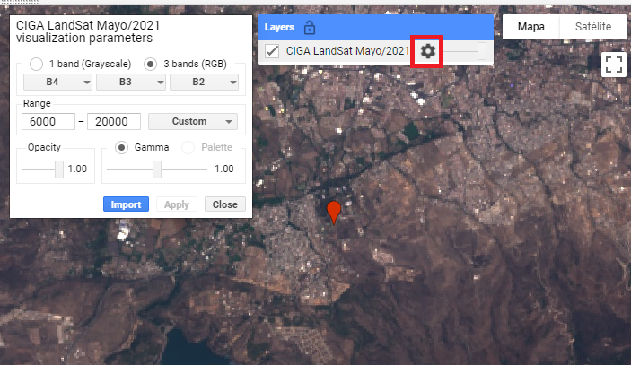
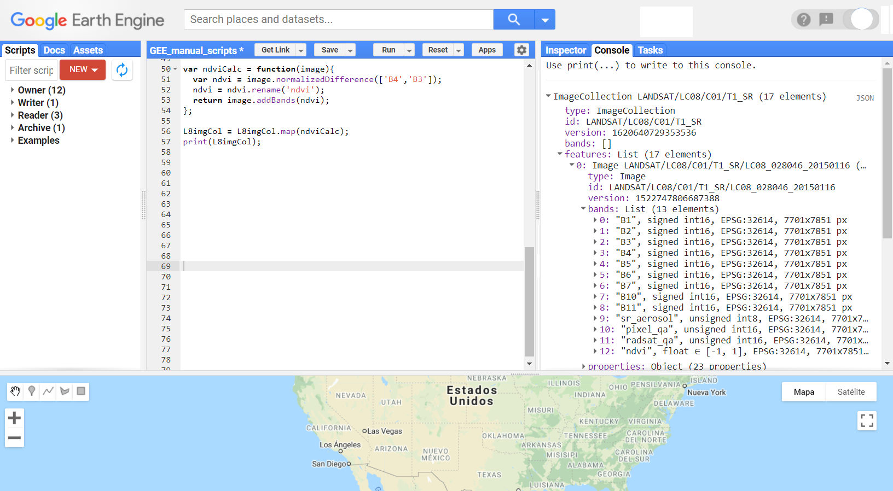
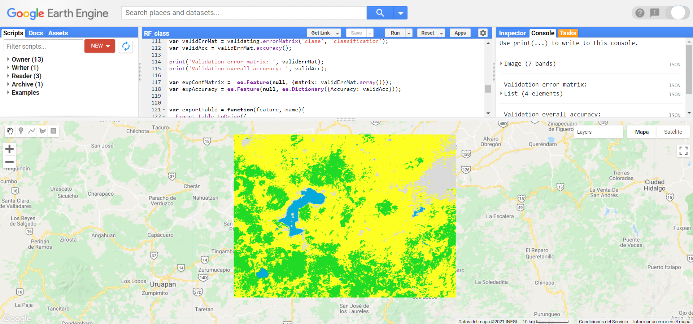

```{r setup, include=FALSE}
# Set global options for chunks
knitr::opts_chunk$set(out.width = "500px", dpi=150)
```

```{=latex}
% Para cambiar los parámetros por default de las cajas de tips o notas
\setlength{\aweboxleftmargin}{0.1\linewidth}.
\setlength{\aweboxcontentwidth}{0.85\linewidth}
\setlength{\aweboxvskip}{6mm}
\setlength{\aweboxrulewidth}{5pt}
\definecolor{abvrulecolor}{RGB}{48,90,255}
```

\newpage
# Introducción

## ¿Qué es Google Earth Engine?

Google Earth Engine (GEE) es una plataforma, desarrollada por Google, que permite realizar procesamientos geoespaciales a gran escala y utilizando bases de datos inmensas. Uno de los principales intereses de esta plataforma es reducir el tiempo invertido en pre procesamiento y facilitar los análisis realizados con información geoespacial. 

## ¿Cómo Funciona Google Earth Engine (GEE)?
### background

Desde hace varios años hay misisones espaciales tomando datos de la tierra a traves de distintos satelites. Y  toda esa informacion se ha ido almacenando en acervos de imagenes. Aunque esa informacion ha sido muy util en el desarrollo ciencitifco, siempre habia habido el problema de la "Big-Data" (bases de datos enormes). Es decir, dichos acervos de imagenes son de gran dimension (millones de imagenes disponibles), lo cual resultaba imposible de procesar y analisar toda la informacion disponible. evitando asi poder aprovechar el potencial total de esta información.

GEE nace entonces de la necesidad de lograr analisis de esa "Big-Data", ofreciendo una herramienta que pueda lidiar tecnologicamente con la parte mas complicada y engorrosa del manejo de informacion, permitiendo entonces que los ususarios se concentren en la generacion de resultados, y nuevos desarrollos cientificos. 

Para logar este objetivo, se creó una infraestructura con 3 elementos claves que son quienes permiten el funcionameinto de GEE: catalogo de informacion, capacidad computacional, APIs

#### Catálogo de información


GEE, recopiló informacion geoespacial de diferentes fuentes al rededor del mundo, creó copias de esos datos en su propio datacenter logrando asi almacenar mas de 20 petabytes (20'000.000 de gigabytes) de informacion, en un solo lugar.

GEE ofrece un amplio repositorio de información geográfica global, cuya informacion ya se encuentra cargada su catalogo, facilitando un sencillo acceso a diferentes Datasets. entre la información que se puede consultar directamente en GEE se encuentran: acervos para todo el mundo de imágenes Landsat (1-8), MODIS, Sentinel (1-3, 5), SRTM, AVHRR, GOESS, ALOS, mosaicos anuales de PALSAR/PALSAR 2 y algunos productos derivados de estas imágenes u otros insumos como información climática global ( WorldClim), capas de cambios en la cobertura forestal (Global Forest Cover Change), información de la altura del dosel global (Global Forest Canopy height), mapas de densidad de carbono globales (Global Aboveground and Belowground Biomass Carbon Density Map), datos de precipitación globales (CHIRPS), límites políticos (FAO GAUL: Global Administrative Unit Layers 2015, Country Boundaries), polígonos de áreas protegidas mundiales (WDPA: World Database on Protected Areas (polygons)), densidad poblacional (GPWv411: Population Density (Gridded Population of the World Version 4.11)), cuencas (WWF HydroSHEDS Hydrologically Conditioned DEM, 3 Arc-Seconds), entre otras.

::: {.tipblock data-latex=""}
Para consultar toda la información que esta disponible en GEE se puede consultar la siguiente liga: https://developers.google.com/earth-engine/datasets
:::

#### Capacidad computacional


Paralelamente GEE puso a dispocicion, junto al datacenter, unos servidores (los cuales en 2010 tenian una capcidad mas o menos equivalente a 10.000 computadores personales), para poder realizar rapida y eficazmente calculos y computaciones sobre esos datos

::: {.tipblock data-latex=""}
Se estima que GEE era capaz (en 2010) de en cuestion de dias, ejecutar funciones que en un computador personal habria tomado 15 años  
:::

#### API


GEE es una API (Application Program Interface), lo que basicamente significa, es una interfaz que permite la comunicación entre nosotros (ususarios) y los servidores de Google, proporcionando el acceso Y uso de la capacidad computacional de Google para nuestros analisis. GEE tiene el objetivo de facilitar la creación de programas. Por ello, cuenta con una serie de funciones, métodos y algoritmos preprogramados que se pueden llamar con una simpe línea. 

GEE ofrece dos APIs una en JavaScript la cual se accede online, es la mas conocida, mas actualizada, mas amigable con los usuarios, con mas docuemntacion disponible, y sobre la cual estaremos hablando; y una API en Python, la cual se puede trabajar desde la consola de Pyhton y permite entonces -hasta cierto punto- usar complementariamente librerias de Python, permitiendo asi procesamientos mas complejos, o funcionalidades que la API de Java no permite. la APi de Pyhton tiene las desventajas que tiene menos documentacion, y tiene algunas diferencias (que pueden resutlar poco intuitivas) a la hora de programar.

########Grafico########

## Ventajas de la API de Java

Entre las principales ventajas de utilizar esta API radica en: 

1. Los datos pueden ser consultados directamente en la nube, por lo que no requieren ser descargados para trabajar con ellos (lo que ahorra tiempo y espacio de almacenamiento para el usuario). En cambio, si se quiere usar alguna libreria de Python será necesaria la descarga de la informacion
2. El procesamiento se hace en la nube, a traves de internet, utilizando el poder de cómputo asignado para la API, lo cual reduce el gasto de memoria RAM (solo necesita una conexciaon estable y el consumo de ram depende del comsuno del navegador). en la API de Python hay mayor consumo de memoria RAM (para ejecutar la consola de python y sus librerias) y requiere igualmente una conexion estable a internet.
3. Su interfaz es mucho mas amigable con los ususarios, ofreciendo una plataforma mas interactiva para programar, y mas sencilla para enseñar
4. Se pueden realizar facilmente consultas de las colecciones de imagenes, y sus metadatos, antes de ecidir importarlos. la API de Pyhton no permite realizar ese tipo de consutas facilmente, de modo que tener previamente absoluta claridad sobre la coleccion de imagenes que se va a utilizar. 
5. Otra gran ventaja de la plataforma radica en que los códigos se guardan en la sesión de cada usuario. Esto permite mantener un control de los códigos y automáticamente se genera un registro histórico (parecido al git), lo cual facilita el seguimiento y comparación de cambios entre las versiones (y permite revertir a versiones anteriores). Además, se pueden generar repositorios compartidos para generar proyectos colaborativos. 

## Lenguaje Javascript

La API permite trabajar mediante la programación en lenguaje Javascript, en una interfaz gráfica que resulta más amigable con el usuario. Además, para utilizarla únicamente requiere de una conexión a internet y un navegador. Toda la información del usuario es guardada en la cuenta asociada de Google en dicha plataforma. Existen otras opciones para trabajar con GEE, como la API de Python, sin embargo, los autores consideramos que la API de Javascript resulta la más sencilla de utilizar y se encuentra mejor documentada. 

La sintaxis de JavaScript tiene algunas peculiaridades que deben cumplirse para que se pueda correr el código sin problemas. Entre la sintaxis básica se pueden considerar los siguientes puntos _(de igual forma iremos tocando la gramatica del codigo a lo largo de los ejemplos)_:

1. Es un lenguaje sensible a mayúsculas y minúsculas. De tal manera que puede haber dos objetos diferentes uno llamado `a` y otro diferente llamado `A`.
2. Siempre se debe cerrar cualquier comando con un `;`. (aunque de no hacerlo el codigo funcionara igualmente)
3. Comúnmente en Javascript se utiliza el _lower Camel Case_ (unir palabras pero cada una comenzando con su respectiva mayuscula) para unir palabras, en lugar de guiones o guión bajo. Por ejemplo: `intervalMean` o `updateMask` .
4. Todas las variables, funciones, objetos deben ser definidos mediante la función `var`.
5. Para definir variables se utiliza el operador `=`.
6. Los operadores matemáticos son: `+ - * /`.
7. Para concatenar dos cadenas de caracteres se utiliza el símbolo `+`.
8. Para realizar comentarios se puede utilizar `//` para comentarios de una línea o `/* … */` para comentarios de varias líneas
9. Se puede utilizar el operador `.` para aplicar una función al objeto que lo precede. Por ejemplo, `imagen.updateMask(mascara);`
10.  No es sensible a las tabulaciones, aunque son recomendadas para un código ordenado.
11. Son igualmente validas las comillas sencillas `''` como las comillas dobles `""`, pero no deben mezclarse ambos tipos de comillas en una misma linea

\newpage
# Primeros pasos

## Registro para el uso de GEE Javascript API

######################graficos

Lo primero que hay que hacer para poder utlizar la API Javascript de Google Earth Engine es ingresar a su sitio para registrarse como usuario. Para ello, hay que acceder a la siguient liga:

**https://earthengine.google.com/**

Después le damos click en la esquina superior derecha donde dice **Sign Up**. Se ingresan todos los datos que pide el formulario. Recordar que para utilizar GEE requerimos de una cuenta de Google para poder utilizar la API.

::: {.tipblock data-latex=""}
Se recomienda dar de alta una cuenta de Google que tenga suficiente espacio disponible en Google Drive, ya que será la forma más fácil de exportar los resultados generados en GEE.
:::

Una vez realizado el registro, hay que esperar un tiempo (puede ser minutos o dias) hasta que llegue una confirmación por parte de GEE a nuestro correo informando que ya se puede hacer uso de la API.

Una vez que tengamos dicha confirmación, podemos acceder a la API accediendo a la siguiente liga: 

**https://code.earthengine.google.com/**

y se accede con la cuenta de Google con la que nos registramos.

## Elementos básicos de la interfaz gráfica

Una vez abierto la Javascript API, se observa la siguiente pantalla

```{r, echo = F}
knitr::include_graphics("Img/GEE_inicio_API.png")
```

Los elementos de la API se enlistan a continuación:

**Pantalla de Repositorios**

```{r, echo = F}
knitr::include_graphics("Img/left_panel.png")
```

Es el espacio donde se guardan y ordenan los scripts del usuario. En ella se pueden crear repositorios y folders para organizar los archivos de código, como se muestra a continuacion. 

```{r, echo = F}

```

Dentro de este espacio existen varias categorías (Los primeros tres se pueden utilizar para determinar distintos niveles de acceso para diversos usuarios): 
1. propietario (**Owner**): aca se guardan los codigos creados por el mismo usuario
2. editor (**Writer**): aca se guardan codigos que pueden ser creados por otros usuarios, pero para los cuaels tenemos autorizacion de modificarlos    
3. lector (**Reader**): aca aparecen codigos que otros usuarios nos han compartido acceso, pero no tenemos autizacion de mosificarlos   
4. ejemplos: se pueden consultar ejemplos de código para hacer algunas tareas específicas. Por ejemplo, existe un apartado específico para consultar las distintas maneras de enmascarar nubes utilizando distintas colecciones de imágenes (i.e., Landsat 4-7, Landsat 8, Sentinel-2, MODIS)
5.  archivo: se pueden guardar archivos de código que ya no se utilicen, pero que no se desean eliminar.

::: {.tipblock data-latex=""}
El usuario puede compartir repositorios con otros usuarios de GEE como lector o editor. De esta manera, todos los archivos que se encuentren dentro de un repositorio serán compartidos con los usuarios indicados. Esta opción está disponible al darle click en el símbolo del engranaje a la derecha de cada repositorio (aparece una vez que se coloca el puntero sobre el nombre del repositorio).

```{r, echo = F}
knitr::include_graphics("Img/engranaje.png")
```
:::

**Docs**

```{r, echo = F}
knitr::include_graphics("Img/docs.png")
```

Es un área donde se puede consultar todas las funciones y algoritmos que se encuentran preprogramados y cargados en GEE. Además, para cada función le indica lo que hace, la entrada y salida que requiere y los argumentos de la función. Estas funciones se encuentran agrupados por objetos del servidor (los objetos se explican mas adelante).
adicionalmente tiene un buscador, donde se pueden consultar tambien las funciones.

```{r, echo = F}
knitr::include_graphics("Img/doc_ejemplo.png")
```


**Assets**

```{r, echo = F}
knitr::include_graphics("Img/assets.png")
```

En este apartado el usuario puede subir y guardar su propia información para ser utilizada dentro de GEE. Se pueden subir archivos en formato raster, vector (.shp con sus archivos auxiliares, o un .zip) o separado por comas, únicamente.

```{r, echo = F}
knitr::include_graphics("Img/newAssets.png")
```

para subir un nuevo archivo, dar click en el boton **NEW**, seleccionar el tipo de archivo, y seguir las instrucciones, 
1. para los archivos raster, solo hace falta seleccionar el archivo correspondiente y dar click en upload
2. para los archivos tipo _.shp_ es necesario subir **los archivos auxiliares** ( _dbf_, _prj_, _shx_, _cpg_, _fix_, _qix_, _sbn_, y/o _shp.xml_) con el mismo nombre. para los archivos _.zip_ es necesario que contenga **los archivos auxiliares**
3. para los archivos _.csv_ es nescesario que exista una columna de longitud y otra de latitud, las coordenadas deben ser decimales y estar en EPSG:4326 (WGS 84).El nombre de esas columnas se debe indicar en _Advanced options_ / _x column_ - _Y column_. Ademas se debe tener **absoluta claridad** del tipo de delimitador (ejemplo: coma: _,_ punto y coma: _;_ u otro diferente) y este debe ser especificado en _Advanced options_ / _CSV delimiter_

::: {.tipblock data-latex=""}
El usuario puede compartir sus archivos con otros usuarios de GEE como lector o editor. De esta manera, el archivo compartido podra ser consultado los usuarios indicados. Esta opción está disponible al darle click en el símbolo de compartir a la derecha de cada archivo (aparece una vez que se coloca el puntero sobre el nombre del archivo)

```{r, echo = F}
knitr::include_graphics("Img/shareAssets.png")
```

:::

**Pantalla de rutinas**

```{r, echo = F}
knitr::include_graphics("Img/editor.png")
```

Esta ventana es donde se va a escribir el código en JavaScript. En la parte superior de esta pantalla se encuentran varios botones. El primero, `Get link` sirve para compartir el código que se tenga abierto mediante una liga. Además, al darle click en la flecha de despliegue (en la opcion _Manage Links_ ) se puede hacer un manejo de las ligas que se tengan activas, así como borras ligas que ya no se utilicen.

```{r, echo = F}
knitr::include_graphics("Img/links.png")
```

A su derecha se encuentra el botón de `Save` el cual permite guardar el código con el que se esté trabajando. Además, al darle click en la flecha de despliegue se puede usar la opcion _Save as_ para crear una copia del codigo con otro nombre.

```{r, echo = F}
knitr::include_graphics("Img/save.png")
```

A continuación está el botón de `Run` que sirve para correr el código que se muestra en la pantalla de rutinas, de principio a fin. Al darle click en este botón se envía el código a los servidores de Google y se realiza el procedimiento indicado.

```{r, echo = F}
knitr::include_graphics("Img/run.png")
```

A su derecha se encuentra el botón de `Reset` el cual sirve para borrar todo el código que se tenga escrito en la pantalla de rutinas. 

Después se encuentra el botón de Apps que sirve para crear Apps a partir del código que se encuentra en la pantalla. 

Por último, en el botón del engranaje se encuentran opciones para prender y apagar funciones como subrayar sugerencias en la pantalla de rutinas o autocompletar símbolos como ', ", ( y \{.


::: {.tipblock data-latex=""}
Cuando se corre un codigo en la consola con el botón de Run, éste no corre directamente en los servidores de Google, sino que éstos se transcriben a código GeoJSON, se envían a los servidores de Google y se espera una respuesta.
:::

::: {.tipblock data-latex=""}
Para buscar un texto especifico dentro del codigo, se debe dar click en la pantalla de rutinas y presionar ctrl+H, (algunos atajos pueden variar segun la configuracion del teclado). Esta pantalla permite buscar una cadena de caracteres determinada dentro del código. Además, tambien se activa el recuadro de sustitución, el cual resulta de gran ayuda para sustituir una cadena de caracteres determinada por otra.
:::

**Search**

```{r, echo = F}
knitr::include_graphics("Img/search.png")
```

Es una barra de búsqueda en la que se pueden buscar fuentes de datos o sitios. Resulta útil para encontrar la ruta de algun Dataset o colección en particular, así como para consultar sus metadatos, bandas y características. 

**Map**
```{r, echo = F}
knitr::include_graphics("Img/drawing.png")
```
1. El mapa donde se pueden dibujar y visualizar puntos, polígonos, líneas o rectángulos
2. mostrar la información que se haya indicado mediante la función `Map.addLayer`.
3. añadir un mapa base (google maps , o google earth)

**Layer manager**

```{r, echo = F}

```

Permite prender y apagar las capas que se estén mostrando en el área del mapa. Además, permite modificar las características necesarias para su visualización (p.ej., transparencia, color, distribución del histograma, compuesto de color, etc). Este  menú aparece una vez que se cargan capas a la pantalla de mapas.

**Consola**

```{r, echo = F}
knitr::include_graphics("Img/rigthPanel.png")
```

La consola consiste en la pantalla de comunicación con el servidor. En ella se muestran los errores que se obtienen al correr un codigo o se pueden mostrar la información indicada por la función `print()`.

**Inspector**

```{r, echo = F}
knitr::include_graphics("Img/inspector.png")
```

Permite consultar los valores de las capas que se muestran en el mapa, al dar click sobre el punto de interés.

**Tasks**

```{r, echo = F}
knitr::include_graphics("Img/task.png")
```
Muestra los trabajos que se hayan exportado mediante la función Export.image o Export.table y permite correr el trabajo de exportación al sitio donde el usuario le haya indicado (drive, assets). 
1. muestra las tareas para ejecutar (con el boton de run, el cual permite especificar detalles de la exportacion)
2. muestra las tareas en ejecucion (gris)
3. muestra el tiempo demorado en el trabajo
2. así como cuando el trabajo se ha finalizado (azul).
3. cuando hay un error en algun objeto exportado, en esta ventana se verá el trabajo marcado en rojo, indicando el error. Por último, al dar click sobre el signo de interrogación que aparece al colocar el cursor sobre algún trabajo, permite obtener mayor información del trabajo, por ejemplo, el error que arrojó el servidor al tratar de realizar una exportación o la ubicación del archivo exportado.

\newpage
# Tipos de objetos

## Objetos del cliente y del servidor

Existen dos lados de la programación de la API de GEE: el del servidor y el del cliente. De tal manera un objeto puede ser convertido entre los dos. Por ejemplo, mientras que del lado del cliente una cadena de caracteres puede ser definida simplemente como: `“cadena”`, para convertirla en objeto del lado del servidor deben utilizarse las funciones del servidor, es decir: `ee.String(“cadena”)`. Muchos de los algoritmos pre cargados en GEE únicamente corren sobre objetos del lado del servidor, por lo cual, es recomendable utilizar dicha sintaxis. Adicionalmente algunas operaciones se pueden hacer utilizando ambos tipos de sintaxis. Por ejemplo, una suma se puede realizar del lado del cliente mediante `1 + 2`, mientras que del lado del servidor se utilizaría `ee.Number(1).add(ee.Number(2))`.

En la mayoría de los casos se va a utilizar la programación del lado del servidor, ya que es la que permite hacer todo el procesamiento en GEE. Por ejemplo, para el caso de los condiciones se sugiere utilizar en lugar de `if` y `else`, `ee.Algorithms.If`. Sin embargo, cabe aclarar que algunas funciones sólo corren del lado del cliente. Por ejemplo, las funciones de interfaz del usuario, utilizadas para exportar la información a algún archivo (ya sea un raster, un vector o una tabla) `ee.Export...`., agregar una capa a la pantalla del mapa `Map.addLayer()`o crear gráficos, así como imprimir información en la consola `print()`, sólo corren del lado del cliente. El siguiente diagrama permite visualizar el lado del usuario y del servidor en el funcionamiento de GEE.

```{r, echo = F}
knitr::include_graphics("Img/daigFunc.png")
```

## Tipos de objetos del lado del cliente

::: {.tipblock data-latex=""}
Vamos a utilizar mucho la funcion `print()` esta funcion, permite visualizar en la **consola** diversos objetos. por ejemplo, si se quiere ver en la consola la palabra _"Hola"_  se usa el comando `print('Hola')`
:::

**Cadenas de texto**

Se refiere a objetos de cadenas de símbolos de tipo carácter alfanumérico. Cualquier secuencia de caracteres puede ser un texto Estos se definen como cualquier cadena de caracteres que se encuentren entre un par de comillas bien sean dobles  “” o sencillas ''. Por ejemplo:

```{js, echo = T}
var cadena = “Esto es una cadena de caracteres”;  //cadena de texto de solo letras
var telefono= '1234567890';                       //cadena de texto de solo numeros
var direccion = 'calle cuarta casa # 16';         //cadena de texto de letras, numeros y simbolos
```

Resulta importante notar que los números en una cadena de texto no serán interpretados como valores numéricos sino como texto.

**Números**

Se refiere a objetos numéricos que indican un valor. Cualquier secuencia de números puede ser un numero. Para números decimales se utiliza el punto decimal y no la coma decimal. Por ejemplo:

```{js, echo = T}
var numero = 1;     //numero entero
var numero2 = 2.5;  //numero decimal
```

Nótese que al declarar un objeto como numero no se hace uso de comillas.

**Listas**

Se refieren a objetos que contienen varias entradas, las cuales pueden ser numéricas (numeros), cadenas de texto (texto) o incluso otras listas. Las listas se definen mediante el uso de corchetes [] y cada entrada es separada mediante una coma (,). Permiten encadenar una serie de valores. Por ejemplo:

```{js, echo = T}
var lista = [1, 2, 3, 4, 5, 6, 7, 8];                 //lista numerica 
var listaA = [“primero”, “segundo”, “tercero”];       //lista de texto
var listaB = [“primero”, “segundo”, “tercero”, 4];    //lista de texo y numeros
var listaC = [lista, listaA, listaB];                 //lista de listas
```

Todas las listas automáticamente asignan, en orden, un número a cada elemento dentro de ellas, **siempre empezando desde 0**. Entonces se puede consultar un solo elemento dentro de una lista, aportando el número de su posición dentro de ella.

```{js, echo = T}
print(lista[0]);  //primer objeto de la lista llamada "lista"
print(listaA[1]); //segundo objeto de la lista llamada "listaA"
print(listaB[2]); //tercer objeto de la lista llamada "listaB"
print(listaC);    //lista completa con todos sus elementos
```

**Diccionarios (Dictionaries)**

Los diccionarios son objetos que contienen claves (objetos) y valores asociados a estas claves (definicion del objeto). Los diccionarios se definen mediante el uso de llaves {} donde se define cada clave seguida de dos puntos ":" y el valor o cadena de caracteres asociada a esa clave. Para ingresar varias entradas, éstas deben ir separadas por una coma.

```{js, echo = T}
var dicc = {    //se declara un nuevo diccionario
  clave1: 1,    //la primera entrada es el texto "clave1" que esta definido con el valor de 1  
  clave2: "A"   //la segunda entrada es el texto "clave2", y su definicion es la letra "A"
};            
```

Para consultar los valores dentro de un diccionario se puede hacer llamando directamente el nombre de la clave deseada.

```{js, echo = T}
print(dicc["clave1"]);  //se mostrara en la consola la definicion de "clave1", es decir el valor 1 
print(dicc["clave2"]);  //se mostrara en la consola la definicion de "clave2", es decir la letra "A"
```

**Funciones (Functions)**

Se refieren a objetos que contienen algún proceso que se realizará a alguna variable. Siempre comienzan con la función `function` seguida por el objeto al que se le aplicará la función, este objeto entre parentesis, y entre corchetes se coloca el procedimiento que va a realizar la función. Por último, deben regresar un objeto mediante la función `return`. Por ejemplo:

```{js, echo = T}
var maskIm = function(objeto){              //maskIm es una nueva funcion, y su argumento de entrada es "objeto"
  var image = ee.Image(objeto)              //se define que "objeto" es una imagen raster, y se guarda en la variable image
  var qaImage = image.select('pixel_qa');   //se selecciona solamente la banda de nombre "pixel_qa" de la imagen image
  var clearData = qaImage.eq(322);          //se crea una nueva imagen binaria donde sera 1 los pixeles con valor igual a 322, y 0 los demas
  return image.updateMask(clearData);       //se crea una mascara con la imagen binaria, y se entreda la imagen original enmascarada
};
```

Aunque las funciones son propiamente objetos del lado del cliente, deben contener únicamente funciones del lado del servidor para que funcionen apropiadamente al trabajar en GEE. Esto permite definir cualquier serie de procesos como una función y que GEE la interprete de manera adecuada en sus servidores. Esto quedará más claro después de repasar la siguiente sección.

::: {.tipblock data-latex=""}
Las funciones que se ejecuten sobre una coleccion de iamgenes o vectores, sólo funcionan si regresan un objeto de tipo `Feature`, `FeatureCollection`, `Image` o `ImageCollections`, por lo cual, a veces se deben realizar ciertas conversiones para evitar un error.
:::

## Tipo de objetos del lado del servidor

Estas funciones permiten definir objetos como objetos en el lado del servidor o convertir objetos en el lado del cliente al servidor. También, en algunos casos los objetos que se obtienen a partir de ciertas funciones retornan un objeto de tipo objeto, por lo cual, se recomienda “llamar” dicho objeto como el servidor antes de proseguir con su uso.

Por otro lado, toda la información que se encuentra disponible en GEE corresponderá a objetos del servidor. Por ende, la mayoría de los métodos disponibles en GEE trabajarán únicamente con objetos del lado del servidor. 

::: {.tipblock data-latex=""}
Para revisar todos los métodos disponibles en GEE clasificados por tipo de objeto del servidor visitar la sección de **Client libraries** en la siguiente liga: https://developers.google.com/earth-engine/apidocs. Además, en esta sección se indican los argumentos que acepta cada función, así como el tipo de objeto de la salida.
:::

Los objetos del lado del servidor se pueden conceptualizar como contenedores que le indican al servidor qué tipo de objeto es el que se está enviando. Además, cuando se trabaja del lado del servidor, los objetos necesariamente son enviados al servidor para ser evaluados. 

::: {.tipblock data-latex=""}
Para recordar cuáles objetos son del servidor, resulta útil recordar que todos ellos cuentan con el prefijo  `ee` (del servidor de **E**arth**E**ngine), seguido del nombre del tipo de objeto con inicial mayúscula.
:::

**ee.String()**

es equivalente a la cadena de texto pero del lado del servidor.
Permite enviar un objeto como cadena de caracteres al servidor. Además, al definir un objeto de este tipo, se pueden utilizar cualquier función indicada bajo la librería de **ee.String** al revisar las librerías disponibles en la API (ver liga anterior).

```{js, echo = T}
var cadena2 = "Esto es una cadena de caracteres";           //esta es una cadena de texto del lado del cliente
var cadenaServ = ee.String(cadena2);                        //aca se convierte el texto del lado del cliente a un ee.String del lado dle servidor
print("Esto está evaluado en el servidor", cadenaServ);     //se muestra primero un texto de cliente, y segundo un ee.String del servidor  
```

**ee.Number()**

Permite enviar un numero como objeto al servidor. Además, al definir un objeto de este tipo, se pueden utilizar cualquier función indicada bajo la librería de **ee.Number()** al revisar las librerías disponibles en la API (ver liga anterior).

```{js, echo = T}
print("numero del lado del cliente", 2021);                       //se muestra primero un texto de cliente y segundo un numero de cliente
var numServ = ee.Number(1900);                                    //se define un numero como ee.Number del servidor
print("numero como un objeto ee.Number del servidor", numServ);   //se muestra primero un texto de cliente, y segundo el ee.Number del servidor
```

**ee.List()**

Permite enviar un objeto como lista al servidor. Además, al definir un objeto de este tipo, se pueden utilizar cualquier función indicada bajo la librería de **ee.List** al revisar las librerías disponibles en la API (ver liga anterior).

```{js, echo = T}
print("Esto está del lado del cliente", lista);           //se muestra primero un texto del cliente, y segundo una lista del cliente
var listaServ = ee.List(lista);                           //se define una lista como ee.List del servidor
print("Esto está evaluado en el servidor", listaServ);    //se muestra primero un texto del cliente, y segundo el ee.List del servidor
```

Para acceder a un elemento de tipo ee.List se utiliza la función `get`.

```{js, echo = T}
print(listaServe.get(0));   //se llama solamente al primero objeto de la ee.List del servidor
print(listaServe.get(1));   //se llama solamente al segundo objeto de la ee.List del servidor
```

**ee.Dictionary**

Permite enviar un objeto como diccionario al servidor. Además, al definir un objeto de este tipo, se pueden utilizar cualquier función indicada bajo la librería de **ee.Dictionary** al revisar las librerías disponibles en la API (ver liga anterior). 

```{js, echo = T}
print("Esto está del lado del cliente", dicc);        //se muestra primero un texto del cliente, y segundo un diccionario del cliente
var diccServ = ee.Dictionary(dicc);                   //el diccionaio del usuario pasa a ser un ee.Dictionary del servidor
print("Esto está evaluado en el servidor", diccServ); //se muestra primero un texto del cliente, y segundo el ee.Dictionary del servidor
```

Para acceder a un elemento de tipo ee.Dictionary se utiliza la notación de `.` seguido del nombre de la clave. Adicionalmente, se puede consultar utilizando también la función `get` y el nombre de la clave, aunque se recomienda más el uso de la primera.

```{js, echo = T}
print(diccServe.clave1);        //se muestra el valor que contiene el elemento "clave1"
print(diccServe.clave2);        //se muestra el valor que contiene el elemento "clave2"

print(diccServe.get("clave1")); //se muestra el valor que contiene el elemento "clave1"
print(diccServe.get("clave2")); //se muestra el valor que contiene el elemento "clave2"
```

Por último, si se desea obtener las claves disponibles en un ee.Dictionary se utiliza la función `.keys`. esta funcion devuelve una lista
de igual forma si se desea obtener los valores disponibles en un ee.Dictionary se utiliza la función `.values`. esta funcion devuelve una lista

```{js, echo = T}
print(diccServe.keys());    //muesta una lista con todas las claves del ee.Dictionary
print(diccServe.values());  //muestra una lista con todos los valores del ee.Dictionary
```

**ee.Date**

Este es la forma en la que GEE permite trabajar con fechas. Permite enviar un objeto como fecha al servidor. Además, al definir un objeto de este tipo, se pueden utilizar cualquier función indicada bajo la librería de **ee.Date** al revisar las librerías disponibles en la API (ver liga anterior). 

```{js, echo = T}
var fechaString = '2015-01-01';               //fecha como un texto de cliente

print("Fecha String",fechaString);            //se muestra la fecha como texto de cliente

var fecha = ee.Date(fechaString);             //convierte la fecha de texto de cliente a ee.Date del servidor
var fecha2 = ee.Date.fromYMD(2015,01,01);     //crea una ee.Date a partir de definir año, mes y dia con numeros del cliente
print("Fecha como ee.Date",fecha);            //muestra la ee.Date creada con texto del cliente
print("Fecha como ee.Date también",fecha2);   //muestra la ee.Date creada con numeros que definen año, mes y dia del cliente
```

**ee.Image**

Permite enviar un objeto como imagen al servidor. Además, al definir un objeto de este tipo, se pueden utilizar cualquier función indicada bajo la librería de **ee.Image**. Este va a ser el tipo de objetos para trabajar con cualquier elemento de tipo raster en GEE. Más adelante se explican con mayor detalle.

**ee.ImageCollection**

Al definir un objeto de este tipo, se pueden utilizar cualquier función indicada bajo la librería de **ee.ImageCollection**. Las colecciones de imágenes están formadas por imágenes. Más adelante se explican con mayor detalle.

**ee.Feature**

Permite enviar un objeto como atributo al servidor. Además, al definir un objeto de este tipo, se pueden utilizar cualquier función indicada bajo la librería de **ee.Feature**. Este va a ser el tipo de objetos para trabajar con cualquier objeto de tipo vector o tabla. Más adelante se explican con mayor detalle.

**ee.FeatureCollection**

Permite enviar un objeto como colección de atributos  al servidor. Además, al definir un objeto de este tipo, se pueden utilizar cualquier función indicada bajo la librería de **ee.FeatureCollection**. Las colecciones de atributos están formadas por atributos. Más adelante se explican con mayor detalle.

**ee.Algorithms**

Este tipo de objetos contienen algoritmos precargados en GEE. Estos algoritmos tienen una gran variedad de aplicaciones, desde operaciones sencillas como una evaluación lógica `ee.Algorithms.If`, hasta algoritmos de segmentación temporal de una serie de imágenes `ee.Algorithms.TemporalSegmentation.Ccdc`.

**ee.Array**

Este tipo de objetos corresponden a arreglos multidimensionales. Los arreglos se pueden interpretar como matrices de más de dos dimensiones (p.ej., filas y columnas). Su uso más común se da en análisis de series de tiempo con imágenes. Este tipo de objetos cuentan con una serie de funciones, las cuales se pueden consultar bajo la librería de **ee.Array** (ver liga anterior).

**ee.Classifier**

Este tipo de objetos corresponden a algoritmos de clasificación de datos que se encuentran pre cargados en GEE. Por ejemplo, se encuentra el algoritmo de _random forests_, disponible mediante la función `ee.Classifier.smileRandomForest` o _MaxEnt_, disponible mediante la función `ee.Classifier.amnhMaxent`.

**ee.Clusterer**

Este tipo de objetos corresponden a algoritmos de agrupamiento de datos que se encuentran pre cargados en GEE. Por ejemplo, se encuentra el algoritmo de _k-means_, disponible mediante la función `ee.Clusterer.wekaKMeans` o _Cobweb_, disponible mediante la función `ee.Clusterer.wekaCobweb`.

**ee.Filter**

Este tipo de objetos que normalmente se utilizan para filtrar colecciones ya sean de atributos o de imágenes. Este tipo de objetos permiten definir filtros de distintos tipos, ya sean espaciales, temporales o en función de características de las imágenes o atributos. Por otro lado, también contienen funciones para combinar filtros. 

**ee.Geometry**

Este tipo de objetos corresponden a distintos tipos de geometrías, desde líneas, polígono y puntos. En GEE se encuentran varias funciones que se pueden aplicar sobre este tipo de objetos, p.ej., `ee.Geometry.MultiPolygon.Simplify` para simplificar polígonos múltiples o calcular el área `ee.Geometry.Polygon.area`.

**ee.Join**

Este conjunto de funciones permite realizar uniones entre colecciones de atributos, utilizando los campos de éstos como las claves para realizar las uniones. Por ejemplo, se pueden unir dos colecciones de atributos mediante `ee.Join.merge` o unir los campos de una primera colección con los de una segunda mediante `ee.Join.inner`

**ee.Reducer**

Este conjunto de funciones permite reducir una colección de imágenes para crear una única imagen. Por ejemplo, se puede reeducir una colección de imágenes mediante el cáclulo de su media `ee.Reducer.mean` o el cálculo de su desviación estándar `ee.Reducer.stdDev`.

**ee.Terrain**

Este conjunto de funciones permite calcular algunas operaciones topográficas básicas como calcular el aspecto a partir de un modelo digital de elevación (DEM). Por ejemplo, en GEE se encuentran las funciones `ee.Terrain.Aspect` para calcular el aspecto o `ee.Terrain.slope` para calcular la pendiente,

::: {.tipblock data-latex=""}
Como resultado de algunas operaciones realizadas en GEE, por ejemplo, `first` o `get`, el objeto resultante no tiene un tipo definido, por lo cual, resulta necesario meterlo en un contenedor que indique el tipo de objeto. Este tipo de errores suelen mostrar un mensaje "`...is not a function`"
:::

::: {.tipblock data-latex=""}
Resulta útil recordar que normalmente los argumentos de cualquier función del servidor se pasan como un diccionario.
:::

\newpage 
# Interfaz de usuario: Visualización de datos, gráficos y exportación

## Imprimir en consola

La interfaz más sencilla de la API es imprimir objetos en la consola. Esto se realiza mediante la función `print`. Al llamar esta función sobre algún objeto, éste se evalua y se imprime su estructura en la consola. Esta función permite obtener información básica de los objetos como su tipo de objeto, número de registros, características y propiedades de los elementos que lo conforman. Además, esta función resulta muy útil para eliminar errores de programación (_bugs_) en los códigos.

```{js, echo = T}
print(Objeto);
```

## Map

Permite agregar objetos del lado del servidor a la pantalla de mapas, así como controlar algunos parámetros de dicha pantalla.

::: {.tipblock data-latex=""}
Para revisar todas las funciones disponibles para la interfaz del usuario, ver la sección de **Code Editor ** en la siguiente liga: https://developers.google.com/earth-engine/apidocs. Además, en esta sección se indican los argumentos que acepta cada función, así como el tipo de objeto de la salida.
:::

**Map.addLayer**

La función `Map.addLayer` permite mostrar elementos en la parte de mapa de la API. Por lo tanto, permite mostrar objetos de tipo `ee.Feature` o `ee.Image`. Adicionalmente se pueden indicar otros parámetros como la forma de visualización de los objetos y el nombre de la capa. Como argumentos de la función `Map.addLayer` se indica el objeto a añadir a la pantalla de mapas, seguido de un diccionario que señala las bandas a añadir y los valores máximos y mínimos para el despliegue de la capa y por último, se puede indicar el nombre de la capa.

Al utilizar `Map.addLayer` sobre una imagen se se pueden indicar los siguientes argumentos: `bands`, `min` o `max`. Estos se deben pasar dentro de un `{}` como un diccionario. Esta función también permite asignar colores mediante el argumento de `palette`. Dependiendo de las bandas que se elija mostrar se puede mostrar únicamente una banda en tonos de gris o un compuesto RGB. 

```{js, echo = T}
Map.addLayer(image, {bands: ['B1', 'B2', 'B3'], min: 0, max: 2000}, 'RGB');
```

::: {.tipblock data-latex=""}
En algunas ocasiones, al intentar cargar objetos en la pantalla de mapas, que sean producto de procesamientos demandantes, la consola puede mostrar un error indicando que se superó el tiempo de espera o de el límite de memoria disponible. En estos casos, se sugiere exportar el resultado, en lugar de tratar de cargarlo en la pantalla de mapas y después visualizarlo de manera local en algún SIG o software similar (p.ej., QGIS)
:::

Para el caso de los atributos (`features`) se puede realizar una operación similar como

```{js, echo = T}
Map.addLayer(feature, {palette: ['FF0000', 'FFFF00',' 008000'], min: 0, max: 10},
'featuresColored');
```

::: {.tipblock data-latex=""}
El código de los colores pasados al argumento de _palette_ corresponden a códigos hexadecimales.
:::

**Map.centerObject**

Esta función permite centrar la pantalla de mapas en algún objeto. Además, se puede indicar el zoom con el cual se quiere centrar el objeto.

## Chart

La función principal para realizar gráficos es ui.Chart. Esta función tiene varios algoritmos para realizar diferentes tipos de gráficos, sin embargo, existen diferentes opciones de gráficos para distintos tipos de objetos. Los objetos básicos que permite graficar GEE son: atributos (``Feature`), colecciones de atributos (`FeatureCollection`), imágenes (`Image`), colección de imágenes (`ImageCollection`), arreglos (`Array`) y listas (`List`). Por otro lado, para indicar los colores a utilizar en el gráfico o el título del mismo se puede utilizar la función `setOptions` sobre el objeto de tipo gráfico.

***Chart.feature***

Este conjunto de funciones permite obtener distintos tipos de gráficos a partir de un atributo o una colección de atributos. Algunas de las funciones disponibles incluyen: `ui.Chart.feature.byFeature`, `ui.Chart.feature.byProperty`, `ui.Chart.feature.groups` y `ui.Chart.feature.histogram`.

```{js, echo = T}
ui.Chart.feature.byProperty({
  feature: coleccionAtributos, 
  xProperties: 'Clase',
})
```

**Chart.image**

Este conjunto de funciones permiten obtener distintos tipos de gráficos a partir de una imagen o colección de imágenes. Algunas de las funciones que se encuentran disponibles incluyen: `ui.Chart.image.byClass`, `ui.Chart.image.byRegion`, `ui.Chart.image.doySeries`, `ui.Chart.image.histogram`, `ui.Chart.image.seriesByRegion`, entre otras. 

Por ejemplo, para graficar una serie de tiempo a partir de una colección de imágenes se utiliza la función `ui.Chart.image.seriesByRegion`. Este tipo de gráficos permiten graficar la serie de tiempo de algunas áreas determinadas utilizando una colección de imágenes.

```{js, echo = T}
ui.Chart.image.seriesByRegion({
  imageCollection: coleccionImagenes, 
  regions: areas.filter(ee.Filter.eq('Tipo','Deforestacion')),
  reducer: ee.Reducer.mean(), 
  band: 'NDVI', 
  scale: 30, 
  seriesProperty: 'Tipo'
})
  .setOptions({
    title: 'Deforestacion',
    colors: ['#EE3A19']
  });
```

::: {.tipblock data-latex=""}
El nombre de las funciones para generar gráficos en GEE dan una idea del tipo de gráfica que se puede generar con dicha función y el tipo de insumos que requiere cada tipo de gráfico.
:::
                                              
## Export

Una vez que se haya obtenido el resultado de interés en GEE se puede exportar para ser manejado en otro programa. Sin embargo, sólo existen cuatro formatos válidos para exportar desde GEE: raster, vector, mapa y video.

**Export.image**

En el caso de las imágenes, la función para exportar es` Export.image`. Dentro de GEE hay 3 opciones para exportar los resultados de una imagen: `Export.image.toAsset`, `Export.image.toDrive` o `Export.image.toCloudStorage`. El primero permite exportar la imagen como una imagen a la sección de **Assets**, es decir, la sección donde el usuario puede subir su información a GEE. Esta opción es útil para cuando el resultado se va a utilizar en otro procedimiento de GEE. La segunda opción permite exportarlo al Google Drive de la cuenta con la que se tiene acceso a GEE. Esta opción es útil para trabajar con las imágenes en algún entorno local como algún SIG. La última opción permite exportar la imagen al Google Cloud Storage para utilizarla en algún otro proceso a realizar en Google Cloud. La opción que creemos es más común para cualquier usuario será la de `Export.image.toDrive`. 

Resulta obvio que el primero se va a utilizar para exportar imágenes en formato raster, sin embargo, no siempre resulta obvio ya que algunas veces se pueden convertir imágenes a formato de arreglo (array), tras lo cual hay que volver a convertir la información a formato de imagen (Image) para poder exportarla. La aplicación permite exportar únicamente en formato GTiff o TRFrecord (tensores).

Un ejemplo de cómo exportar una imagen se presenta a continuación.

```{js echo = T}
Export.image.toDrive({
  image: imgDiff,
  description: 'DiferenciaNDVI_2016-2017',
  scale: 30,
  fileFormat: 'GeoTIFF',
  folder: 'DiferenciaNDVIL8'
}); 
```

::: {.tipblock data-latex=""}
En GEE muchas operaciones utilizan el término de scale, sin embargo, este no se refiere a la escala de trabajo en un sentido tradicional (p.ej., 1:50 000), sino que se refiere al tamaño de pixel expresado en m.
:::

::: {.tipblock data-latex=""}
En algunas ocasiones, al intentar exportar una imagen muy grande (mayor a 10 000 000 de pixeles), la consola puede mostrar un error indicando que el objeto a exportar tiene un número muy alto de pixeles. En este caso, se debe aumentar el número de pixeles máximo permitido para la exportación. Esto se logra indicando el argumento `maxPixels` dentro del diccionario que se pasa a Export.image.toDrive. Por ejemplo, `maxPixels: 1e10`, lo cual permite exportar una imagen con hasta 1 x 10^10 pixeles.
:::

**Export.table**

Por su parte, el formato vector permite exportar información vector y tablas sin información geográfica. De nuevo, para poder exportar en el formato vector, el objeto exportado debe ser en formato atributo (`feature`). Al igual que en el caso de las imágenes, dentro de GEE hay 3 opciones para exportar objetos de tipo atributo: `Export.table.toAsset`, `Export.table.toDrive` o `Export.table.toCloudStorage`. Para el caso de tablas, sin información geográfica asociada, se debe definir el objeto como un objeto atributo sin geometría (es decir, `null`) y en la tabla de atributos anexar la información deseada. Un ejemplo del uso de esta función se presenta a continuación:

```{js echo = T}
Export.table.toDrive({
    collection: feature,
    description: 'nombreArchivo',
    folder: 'mifolder',
    fileFormat: 'CSV'
 });
```

**Export.video**

Esta opción permite exportar una colección de imágenes como video ya sea al almacenamiento de la nube de Google `Export.video.toCloudStorage` o al Drive `Export.video.toDrive`. Esta función puede resultar atractiva para observar los cambios de un área de interés a través del tiempo. Para exportar una colección de imágenes a video se puede realizar de la siguiente manera:

```{js echo = T}
Export.video.toDrive({
    collection: coleccionImgs,
    description: 'videoTimelapse',
    folder: 'mifolder',
    framesPerSecond: 24
 });
```

\newpage
# Features

## Trazado de polígonos, líneas, puntos

\newpage
# Feature Collections

\newpage
# Imagen

## Características

Las imágenes que se encuentran disponibles en colecciones de imágenes de GEE corresponden a información en formato raster que cuenta con una resolución espacial, espectral, radiométrica particular. Los metadatos de cada imagen se encuentran como propiedades de ésta. A diferencia de las imágenes a las que posiblemente el usuario esté acostumbrado a manejar, GEE permite el manejo de imágenes donde cada banda puede tener una resolución de pixel o tipo de datos (Integer, Float, 16 bits, etc) distinta. Esto no afecta el uso de estas imágenes pero puede ser importante a considerar para exportar imágenes cuyas bandas tienen distinta resolución espacial (p.ej., Sentinel-2).

## Información y metadatos

Los metadatos de la imagen se encuentran como propiedades. Para consultarlas se puede utilizar el siguiente comando: `ee.Image.propertyNames();` Así se pueden consultar todas las propiedades de una imagen. Sin embargo, algunos comandos que facilitan la consulta de algunos elementos son: `.bandNames()`, `.projection()`, `.projection().nominalScale()`, para conocer el nombre de las bandas de la imagenes, su proyección y el tamaño de pixel en m que presenta, respectivamente.

::: {.tipblock data-latex=""}
La proyección de trabajo para todas las capas es de EPSG:3857 WGS84 pseudomercator. Si se requiere cambiar de proyección se puede utilizar la función `reproject`, aunque no se recomienda utilizarla a menos que sea estrictamente necesario.
:::

## Funciones comunes

### Selección de bandas

Una vez, revisado los nombres de las bandas de una imagen, se pueden  seleccionar ciertas bandas mediante la función `select`. Para seleccionar una única banda sólo se requiere indicar el nombre de la banda, mientras que si se desea seleccionar varias bandas, éstas deben indicarse dentro de una lista. Por ejemplo: 

```{js, echo = T}
ee.Image.select('B1');
ee.Image.select(['B1','B2','B3']);
```

### Cambio de nombres de bandas

Por default, el nombre de las bandas de las imagenes suelen corresponder a la letra 'B' más un número que indica el número de banda. Por ejemplo, 'B1', 'B2','B3', etc. En algunos casos, el usuario puede preferir sustituir estos nombres con letras que indiquen la longitud de onda que contiene cada banda. En estos casos, se puede utilizar la función `rename` para cambiar los nombres de las bandas. Por ejemplo:

```{js, echo = T}
var seleccionBandas = ee.Image.select(['B2','B3','B4']);
seleccionBandas = seleccionBands.rename(['B','G','R']);
```

### Cortes

Se pueden realizar cortes de una imagen para quedarse con un área específica utilizando la 
función: 

```{js, echo = T}
ee.Image.clip();
```

::: {.tipblock data-latex=""}
Se sugiere evitar el uso de la función `clip` a menos que sea estrictamente necesario, ya que aumenta el tiempo de procesamiento.
:::

### Operaciones matemáticas

Dentro de GEE se puede realizar cualquier operación matemática entre bandas o entre imágenes. Los operadores para realizar esta operaciones son: `ee.Image.subtract(), .add(), .divide(), .multiply()`. Además, GEE cuenta con una función de `.normalizedDifference()` para calcular un índice normalizado, a partir de las bandas que se indiquen como: `ee.Image.normalizedDifference()`. Por ejemplo, para calcular el NDVI primero se indica la banda del infrarrojo y luego la del rojo. Si se quiere realizar un índice un poco más complicado se puede calcular mediante la función de `.expression()`. En esta función se indica primero la fórmula del cálculo que se va a realizar y posteriormente se indica en un diccionario la equivalencia de los términos utilizados en la fórmula y los nombres de las bandas de la imagen: 

```{js, echo = T}
var NDVI = ee.Image.expression( '(NIR - R) / (NIR + R)', {
  'NIR' = image.select('B4'),
  'R' = image.select('B3)
});
```

Dentro de las fórmulas utilizadas dentro de expression se puede utilizar la notación estándar matemática (`+, -, /, *`), modulo (`%`), exponente (`**`), relacionales(`>, <, >=, <=, !=, ==`), lógicos (`&&, ||, !, ^`), o if then else (`?:`).

### Operaciones relacionales, condicionales y booleanas

Se pueden utilizar operadores relacionales, condicionales, booleanos sobre las imágenes para crear clases o máscaras. Se pueden utilizar las siguientes notaciones para hacer comparaciones de los valores una imagen con cierto valor `.lt()`, `.lte()`, `.gt()`, `.gte()`, `.eq()`, `.neq()`. Además se pueden utilizar operadores relacionales para unir dos condiciones mediante `.and()` u `.or()`. Por ejemplo, la siguiente linea permite crear una máscara de las áreas que tengan valores menores o iguales a 0.2 y mayores o iguales a 0: 

```{js, echo = T}
ee.Image.lte(0.2).and(ee.Image.gte(0));
```

Otra forma de crear máscaras es indicando valores por bits. En este caso, se indica el valor del bit de interés y después se evalua una condición sobre una banda determinada. Por ejemplo, para Landsat 8, la banda de evaluación de la calidad de la imagen corresponde a la banda 'pixel_qa'. En esta banda, el bit 5 indica cobertura de nubes, así que primero se define una variable que indique que el bit 5 es el que será evaluado. Después se selecciona la banda 'pixel_qa' para después evaluar una condición sobre ella. En este caso, se crea una máscara que tenga valores a conservar (1) en áreas donde el bit 5 sea 0; por el contrario, contendrá valores a eliminar (0) en áreas donde el bit 5 no sea 0.

```{js, echo = T}
var nubesBit = (1 << 5);
var qa = image.select('pixel_qa');
var mask = qa.bitwiseAnd(nubesBit).eq(0);
```

### Enmascaramiento

La función `updateMask` permite enmascarar los pixeles de una imagen, utilizando otra imagen como máscara que indique cuáles pixeles se deben conservar (valores de 1) y cuáles enmscarar (valores de 0).

```{js, echo = T}
ee.Image.updateMask(mascara);
```

::: {.tipblock data-latex=""}
Aunque en GEE existe la función `mask` para enmascarar áreas de una imagen, se sugiere siempre utilizar `updateMask`. La función `mask` simplemente substituye la máscara original de la imagen, mientras que `updateMask` combina la máscara anterior con la nueva. Por ello, el usar `updateMask` evita desenmascarar áreas que podrían no ser de interés para el usuario.
:::

### Agregar bandas

El usuario puede estar interesado en agregar una banda al conjunto de bandas que contiene por default una imagen. Por ejemplo, se podría agregar una banda que contenga algún índice calculado con las bandas originales de la imagen. Esto se puede lograr utilizando la función `addBands`. Por ejemplo:

```{js, echo = T}
var ndvi = imagen.normalizedDifference(['B5' , 'B4']);
imagen = imagen.addBands(ndvi);

```

#### Ejercicio: Consulta y procesamiento de imagen

En GEE hay algunos objetos que constan de imágenes únicas, por lo tanto, se pueden utilizar directamente los métodos para el procesamiento de imágenes. Un ejemplo muy utilizado de este tipo de objetos es el modelo digital de elevación producido por la misión SRTM. Para buscar cuál es la localización para acceder a esta información se puede ir a la barra de búsqueda (**Search**) y escribir SRTM. Debería aparecer una ventana así:

```{r, echo = F}
knitr::include_graphics("Img/SRTM.png")
```

Posteriormente se da click sobre el primer resultado y debería abrirse la siguiente ventana.

```{r, echo = F}
knitr::include_graphics("Img/SRTM_prop.png")
```

En dicha ventana, se puede copiar la ubicación de la imagen del DEM de SRTM en los servidores de Google. Posteriormente, en la pantalla de rutinas se puede escribir la siguiente línea para guardar la imagen SRTM en un objeto nuevo llamado dem.

```{js, echo = T}
var dem = ee.Image("CGIAR/SRTM90_V4");
```

Posteriormente, se puede cortar el dem a la extensión que nos interesa. En este caso se utilizará la colección con los límites políticos del mundo que se encuentra cargada en GEE. Ésta se puede buscar de igual manera que la capa de SRTM en la barra de búsqueda. Posteriormente, se puede consultar la información que contiene la capa en la pestaña de 'TABLE SCHEMA'. Por último, se aplica un filtro para seleccionar el país que nos interesa, en este caso México.

```{js  echo = T}
var MX = ee.FeatureCollection("USDOS/LSIB_SIMPLE/2017")
  .filter(ee.Filter.eq('country_co','MX'));
```

Y por último, se corta la imagen a la extensión del polígono de interés.

```{js, echo = T}
var demCortado = dem.clip(geometry);
```

Para comparar el dem antes y después de cortar la imagen a la extensión del polígono de interés, se pueden cargar los dos objetos: `dem` y `demCortado`

```{js, echo = T}
Map.addLayer(dem, {min: 0, max:4000}, 'dem');
Map.addLayer(demCortado, {min: 0, max:4000}, 'demMX');
```

Posteriormente, se define una máscara de todas las áreas que tengan una elevación menor o igual a 2500 m s.n.m. y mayor o igual a 1000 m s.n.m. Después, se aplica esta máscara al DEM cotado para mantener únicamente las áreas que cumplan con el criterio anterior.

```{js, echo = T}
var mascara = demCortado.lte(2500).and(demCortado.gte(1000));
var imgEnmascarada = demCortado.updateMask(mascara);
```

Por último, se puede renombrar la banda de la imagen de 'elevation' a 'elevación' y se agrega la imagen a la pantalla de mapas.

```{js, echo = T}
imgEnmascarada = imgEnmascarada.rename('elevacion');
Map.addLayer(imgEnmascarada,{min: 1000, max: 2500}, 'imgEnmascarada');
```

\newpage
# Colecciones de imágenes

La mayoría de los objetos que se encuentran disponibles en los servidores de GEE se encuentran en forma de colecciones: `FeatureCollection` o `ImageCollection`. Estas se pueden definir como colecciones de objetos Feature o Image. Normalmente, el primer paso para trabajar con estas colecciones radica en delimitar el área y periodo de estudio, para lo cual se utilizan las funciones de filter. Por ejemplo, para delimitar un área se puede utilizar `ImageCollection.filterBounds()`, mientras que para delimitar por fecha `ImageCollection.filterDate()`. Además, se pueden filtrar, de acuerdo con otros criterios contenidos en los metadatos de las imágenes. Por ejemplo, se puede definir un valor umbral de porcentaje de nubosidad de las imágenes con las que se desean trabajar o en ciertos parámetros de la geometría del registro.

Adicionalmente, si se desea calcular una nueva banda para todas las imágenes de la colección, se debe aplicar una función que agregue la nueva banda a cada imagen y aplicar dicha función a cada imagen de la colección mediante la función map.

## Características

Las colecciones de imágenes son objetos de GEE que contienen un conjunto de imágenes. En GEE este tipo de objetos va a ser el que va a contener los acervos de imágenes disponibles. Para el manejo de varias imágenes se recomienda utilizar esta estructura, en lugar de listas u otro tipo de objetos.

## Información y metadatos

Las colecciones de imágenes contienen los metadatos e información de todas las imágenes que contienen. De tal manera, se puede utilizar esta información para filtrar y utilizar únicamente las imágenes que cumplen con ciertos criterios.

::: {.tipblock data-latex=""}
No se puede escribir o cambiar los objetos que se encuentran directamente hospedados en GEE. Por ejemplo, si se quiere mapear una función que sobreescriba alguna característica de las colecciones de imágenes en GEE, se debe hacer una copia de éstas para que se pueda sobreescribir la característica de interés.
:::

## Funciones comunes

### Filtros sobre Colecciones de imágenes

Los filtros permiten filtrar las colecciones de imágenes a partir de los metadatos de las imágenes que contiene. De tal manera, se puede filtrar por: superposición con algún polígono de interés, fecha de registro, características de las escenas (path, row, porcentaje de nubosidad), entre otras. 

Para filtrar una colección de imágenes se van a utilizar los objetos `ee.Filter`. Existen diversos tipos de filtros, algunos ya se encuentran precargados, pero otros se pueden definir manualmente. Por ejemplo, para filtrar por fecha se puede utilizar `.filterDate`:

```{js, echo = T}
ee.ImageCollection.filterDate('2015-01-01','2016-01-01');
```

Por otro lado para filtrar espacialmente con la extensión de un polígono se puede realizar mediante `.filterBounds`:

```{js, echo = T}
ee.ImageCollection.filterBounds(polygon1); 
```

Si se desea filtrar por alguna característica de los metadatos se puede hacer mediante `filter` y después definiendo el filtro del metadaro con `ee.Filter`. Otra forma de realizar este proceso es mediante `filterMetadata`. Las siguientes dos líneas obtienen el mismo resultado.

```{js, echo = T}
ee.ImageCollection.filter(ee.Filter.lt('CLOUD_COVER', 20));
ee.ImageCollection.filterMetadata('CLOUD_COVER','less_than', 20);
```

### Selección de bandas

Al igual que con las imágenes, se puede utilizar la función `select` para seleccionar un conjunto de bandas de todas las imágenes que se encuentran en la colección. De igual manera que con las imágenes individuales, para seleccionar una única banda sólo se requiere indicar el nombre de la banda, mientras que si se desea seleccionar varias bandas, éstas deben indicarse dentro de una lista. Notése que el nombre de las bandasPor ejemplo: 

```{js, echo = T}
ee.ImageCollection.select('B1');
ee.ImageCollection.select(['B1','B2','B3']);
```

### Ordenar colección

La función `sort` permite ordenar una colección de imágenes por alguna propiedad de las imágenes. Por default, las colecciones de imágenes están ordenadas cronológicamente. Sin embargo, se puede cambiar este orden para que las ordene por alguna característica de las imágenes, por ejemplo, por orden de menor a mayor cobertura de nubes. Por default, la función `sort` ordena la colección de imágenes en orden ascendente de acuerdo al valor de la característica de las imágenes indicadas. Sin embargo, si se desea ordenar de manera descendente, esto se puede indicar utilizando el argumento `ascending: false`. En el siguiente ejemplo, primero se ordena la colección en orden ascendente y en el segundo, descendente.

```{js, echo = T}
ee.ImageCollection.sort('PropiedadImagenes');
ee.ImageCollection.sort('PropiedadImagenes', false);
```

### Obtener primera imagen

En algunas ocasiones resulta útil obtener la primera imagen de una colección de imágenes para ver si se llevó a cabo el procedimiento deseado sobre la colección. Para ello, se utiliza la función `first` que devuelve la primera imagen que se encuentra en la colección y permite agregarla en la pantalla de mapas para analizarla más a detalle. 

```{js, echo = T}
ee.ImageCollection.first()
```

### Número de valores sin enmascarar por pixel

Para conocer el número de valores sin enmascarar por pixel en la colección de imágenes se utiliza la función `count`. 

```{js, echo = T}
ee.ImageCollection.count();
```

### Unión de colecciones

Para unir una colección de imágenes con otra se utiliza la función `merge`. Un caso típico de tal operación sería el unir dos colecciones de Landsat, por ejemplo, Landsat 7 y 8.

::: {.tipblock data-latex=""}
Las colecciones Landsat 7 y 8 no tienen las mismas bandas, ni los nombres de las bandas corresponden entre sí. Por ejemplo, la banda 1 de Landsat 7 corresponde al espectro del azul (blue), mientras que en Landsat 8, la banda 1 corresponde al azul de costa (coastal blue). En este caso, conviene primero filtrar y renombrar las bandas a unir para asegurarse que el nombre las bandas a unir en una colección corresponda con las de la otra. 
:::

La unión de una colección de landsat 7 y con una landsat 8 se podría hacer de la siguiente manera:

```{js, echo = T}
var l7 = ee.ImageCollection("LANDSAT/LE07/C01/T1_SR");
var l8 = ee.ImageCollection("LANDSAT/LC08/C01/T1_SR");

l7 = l7.select('B4')
  .rename('NIR');
l8 = l8.select('B5')
  .rename('NIR');

var l7y8 = l7.merge(l8);
```

### Mapeo

Para realizar alguna operación sobre todas las imágenes de una ImageCollection se utilizar la función `map`. Esto va a aplicar la función que se defina en el interior de ella a cada imagen dentro de la colección. Por ejemplo, si quisieramos agregar una banda con un índice de vegetación a todas las imágenes se podría hacer de la siguiente manera:

```{js, echo = T}
ee.ImageCollection.map(function(image){
	return image.normalizedDifference('NIR','R');
});
```

::: {.tipblock data-latex=""}
Notar que la función `map` es distinta de la función `Map` que permite agregar objetos a la pantalla de mapas.
:::

Este tipo de operación es la sugerida para realizar operaciones de tipo ciclo, en lugar de otras funciones de ciclo (e.g., `for`).

::: {.tipblock data-latex=""}
La función `map` sólo funciona con funciones del lado del servidor, así que se recomienda evitar el uso de funciones del lado del cliente como `print`, `Map`, `Export`, `Chart`.
:::

### Reducción

Los reductores permiten crear un mosaico (una sola imagen), a partir de una colección de imágenes. Estos son muy útiles para hacer mosaicos multitemporales u obtener información de la colección de imágenes (por ejemplo, cuántas observaciones válidas tiene cada pixel en un año).Para reducir una colección de imágenes se utilizará la función `reduce` e indicando el método a utilizar mediante un objeto tipo `ee.Reducer`.

### Reducers
 De tal manera, se puede indicar si el resultado corresponderá a la media  `ee.Reducer.mean()`, mediana  `ee.Reducer.median()`, moda  `ee.Reducer.mode()`, mínimo  `ee.Reducer.min()`, máximo `ee.Reducer.max()` o inclusive la media de un intervalo determinado de observaciones `ee.Reducer.intervalMean()`. Otra forma de realizar estas mismas reducciones es utilizando directamente las funciones `min`, `max`, `mean`, `mode`, `median`. Las siguientes dos líneas realizan exactamente el mismo proceso:

```{js, echo = T}
ee.ImageCollection.reduce(ee.Reducer.mean());
ee.ImageCollection.mean();
```

::: {.tipblock data-latex=""}
Al aplicar una reducción a una colección de imágenes, el nombre de las bandas será el mismo que el de las bandas de cada imágen con un sufijo que indica la función utilizada para hacer la reducción. Por ejemplo, al utilizar `ee.Reducer.mean()` sobre una colección de imágenes cuyas bandas se llaman `B1` y `B2`, las bandas de la imagen producto de la reducción se llamarán `B1_mean` y `B2_mean`.
:::

### Compuestos y mosaicos

Si se desean hacer mosaicos a partir de varias imágenes se puede realizar en GEE mediante dos funciones: `ee.ImageCollection.mosaic()` y `ee.ImageCollection.qualityMosaic()`. La principal diferencia entre estas dos funciones radica en que la primera simplemente pega las imágenes de acuerdo al orden que tienen en la colección (es decir, la última hasta arriba). Por el contrario, la función de `qualityMosaic()` permite priorizar el pixel que quedará en el mosaico final a partir del valor más alto de alguna banda. Esto puede ser útil para realizar por ejemplo un mosaico del pixel con mayor valor de NDVI. En el caso de `qualityMosaic()` hay que indicar la banda que se utilizará como la banda de calidad para crear el mosaico.

```{js, echo = T}
var mosaicImg = ee.ImageCollection.mosaic();
var mosaicQualImg = ee.ImageCollection.qualityMosaic({qualityBand: 'ndvi'})
```

::: {.tipblock data-latex=""}
El utilizar la función `mosaic()` siempre le dará preferencia a los pixeles más recientes ya que la colección por default se encuentra ordenada por fechas de adquisición de la imagen.
:::

#### Ejercicio: Filtro de colección de imágenes y visualización

Para filtrar la colección de reflectancia de la superficie de imágenes de Landsat 8 de mayor calidad (tier 1) por fecha, porcentaje de cobertura de nubes de las imágenes, así como por su "path" y "row" se puede realizar en un solo paso aplicando múltiples filtros. En este caso, primero se indica la ruta de la colección que se desea utilizar. Para encontrata esta ruta se puede buscar la colección de interés en la barra de **Search**, después se le da click y del lado izquierdo aparecerá la ruta de la colección. Por otro lado, en esta misma ventana, en la pestaña de 'BANDS' se puede consultar las bandas y los nombres de las bandas que contiene cada imagen. Por su parte, en la pestaña de 'IMAGE PROPERTIES' se pueden consultar los metadatos que contienen las imágenes de esta colección. 

```{r, echo = F}
knitr::include_graphics("Img/Ruta_coleccion.png")
```

Una vez que se conoce la ruta de la colección de interés, se llama dicha colección. Después se especifican los filtros. En este caso, primero se filta por fecha, en formato YYYY-MM-DD (año, mes, día), seguido de filtros de los metadatos de las imágenes: 'CLOUD_COVER_LAND', 'WRS_PATH', 'WRS_ROW'. En este caso se debe escribir exactamente igual el campo de los metadatos (CLOUD_COVER_LAND) y en la definición del filtro se debe explicitar si se desea utilizar los valores que sean iguales (eq), distintos (neq), mayores (gt), menores (lt), mayores o igual (gte) o menores o iguales(lte).

```{js, echo = T}
var L8imgCol = ee.ImageCollection("LANDSAT/LC08/C01/T1_SR")
  .filterDate('2015-01-01','2016-01-01')
  .filter(ee.Filter.lte('CLOUD_COVER_LAND',50))
  .filter(ee.Filter.eq('WRS_PATH',28))
  .filter(ee.Filter.eq('WRS_ROW',46));
```

Para explorar algunas características de la colección de imágenes filtradas podemos escribir el siguiente comando para ver sus características en la consola.

```{js, echo = T}
print(L8imgCol);
```

Una vez corrido el comando anterior, en la consola se puede consultar cuántas imágenes cumplieron con los filtros indicados. En este ejemplo, la colección filtrada incluye 17 imágenes.
Despues se pueden consultar las características de las imágenes incluidas en la colección. Para ello, en la consola se le da un click a la flecha ubicada a la isquierda de la colección en la consola a **Features**, después a cualquier imagen (**Image**) y por último a **Properties**. Ahí se pueden ver los metadatos de cada imagen y por lo tanto, los campos de información que se pueden utilizar para filtrar una colección de imágenes, basado en los metadatos de las imágenes. Esta información es la misma que se puede obtener en la barra de **Search**.

```{r, echo = F}
knitr::include_graphics("Img/CamposImgCol.png")
```

A continuación podemos ordenar la colección en orden ascendente de acuerdo al metadato de 'CLOUD_COVER_LAND'. Posteriormente, se selecciona la primera imagen, es decir, la de menor cobertura de nubes. Nótese que en este paso al definir la variable `L8imgFirst`, ya únicamente seleccionamos una sola imagen, por lo tanto, éste va a ser un objeto ee.Image. La función `first()` devuelve la primera imagen de una colección y es útil para visualizar el tipo de información que está en la colección de imágenes.

```{js, echo = T}
L8imgCol = L8imgCol.sort('CLOUD_COVER_LAND');
var L8imgFirst = L8imgCol.first(); 
print(L8imgFirst);
```

Por último, se puede agregar esta imagen a la ventana de mapas para visualizar la información. En el primer caso se agrega la información sin pasar más argumentos. En el segundo caso, se indican las bandas y el orden que se desea cargar, así como los valores mínimos y máximos del histograma, y un nombre para la capa. 

```{js, echo = T}
Map.addLayer(L8imgFirst);
Map.addLayer(L8imgFirst,{bands: ['B4','B3','B2'], min: 95, max: 1288}, 'RGB menos nubes L8');
```

```{r, echo = F}
knitr::include_graphics("Img/RGBIm.png")
```

#### Ejercicio: Enmascaramiento de nubes, cálculo de índices y reducción

Utilizando la colección que ya se filtró en el ejercicio anterior se hará un mapeo y una reducción. En este ejercicio se obtendrá el ndvi promedio entre 2015 y 2016.

Para calcular el ndvi promedio lo primero que hay que hacer es aplicar la máscara de nubes que viene en la misma colección de imágenes de Landsat 8. Al aplicar esta máscara se eliminarán los pixeles cuya información provenga de nubes. Después se definirá una función para calcular el ndvi para cada imagen contenida en la colección de imágenes. Para ello se utiliza la función `normalizedDifference`, indicando las bandas de NIR y R. También se utilizará la función `rename` para cambiar el nombre dado por default a la nueva banda calculada. Posteriormente, se agrega esta banda a la imagen con `add.Bands` Después, se utiliza la función `map` para aplicarla a cada una de las imágenes.

Primero se define la función para enmascarar las nubes. En este caso, se indican los bits que corresponden a nubes y a sombras, es decir, los bits 5 y 3 respectivamente. Después se selecciona la banda que contiene la información de la máscara de nubes, la cual en landsat 8 se llama "pixel_qa". Posteriormente se selecciona esta banda y se evalua que en los dos bits antes mencionados el valor sea igual a cero, es decir, que sea un pixel clasificado como despejado. En este procedimiento se indica que la consulta de los valores se debe hacer por bits (`bitwiseAnd`) y que las dos evaluaciones deben de ser cero (`and`). Posteriormente, se define una máscara en función de esos valores y se actualiza la máscara (`updateMask`).

```{js, echo = T}
function maskL8sr(image) {
  var cloudShadowBitMask = (1 << 3);
  var cloudsBitMask = (1 << 5);
  var qa = image.select('pixel_qa');
  var mask = qa.bitwiseAnd(cloudShadowBitMask).eq(0)
                 .and(qa.bitwiseAnd(cloudsBitMask).eq(0));
  return image.updateMask(mask);
}
```

Posteriormente se define la función para calcular el NDVI de todas las imágenes.

```{js, echo = T}
var ndviCalc = function(image){
  var ndvi = image.normalizedDifference(['B5','B4']);
  ndvi = ndvi.rename('ndvi');
	return image.addBands(ndvi);
};
```

::: {.tipblock data-latex=""}
Si no se cambia el nombre de la banda producida por `normalizedDifference`, por default, ésta va a recibir el nombre de `nd`.
:::

Para ver una muestra de cómo se ve la primer imagen con y sin la máscara de nubes, primero se agregará la imagen con nubes a la pantalla de mapa.

```{js, echo = T}
Map.addLayer(L8imgCol.first(), 
  {bands:['B4','B3','B2'], min: 0, max: 1300},
  'Imagen con nubes');
```

```{r, echo = F}
knitr::include_graphics("Img/imNubes.png")
```

A continuación se aplican las dos funciones utilizando `map` y sobreescribir el objeto L8imgCol.

```{js, echo = T}
L8imgCol = L8imgCol
  .map(maskL8sr)
  .map(ndviCalc);
print(L8imgCol);
```

Después se muestra la primera imagen sin nubes.

```{js, echo = T}
Map.addLayer(L8imgCol.first(), 
  {bands:['B4','B3','B2'], min: 0, max: 1300},
  'Imagen sin nubes');
```

```{r, echo = F}
knitr::include_graphics("Img/imSinNubes.png")
```

En la consola se puede observar que todas las imágenes ahora contienen una nueva banda llamada ndvi.

```{r, echo = F}

```

Posteriormente, se puede reducir la colección de imágenes para formar una sola imagen que represente el valor promedio de ndvi en el periodo de la colección (2015 - 2016). Para ello se utiliza la función `reduce`. También se calculará la desviación estándar de los valores de NDVI. Estas dos imágenes se guardarán en dos nuevos objetos.

```{js, echo = T}
var L8imgMean = L8imgCol.reduce(ee.Reducer.mean());
var L8imgSD = L8imgCol.reduce(ee.Reducer.stdDev());
```

Por último, agregamos los dos resultados a la pantalla de mapas.

```{js, echo = T}
Map.addLayer(L8imgMean, {min:-0.14, max:0.15}, 'NDVI mean 2015 - 2016');
Map.addLayer(L8imgSD, {min:0, max:0.13}, 'NDVI SD 2015 - 2016');
```

El resultado se ve así:

```{r, echo = F}
knitr::include_graphics("Img/imNDVI.png")
```

Se pueden prender y apagar las capas de la pantalla de mapas utilizando el menú que se despliega al posicionar el puntero sobre el letrero de layers y prendiendo y apagando las capas con las palomitas a la izquierda de cada capa.

Estás funciones van a ser de mucha utilidad para juntar resultados de varias imágenes en una sola colección o unir dos colecciones (p.ej., Landsat 7 y 8).

El último paso será cortar la imagen a una extensión de interés. En este caso primero se define un área de interés mediante coordenadas: 

```{js  echo = T}
var geometry = ee.Geometry.Polygon(
        [[[-101.82737418916153, 19.836437094032178],
          [-101.82737418916153, 19.368119068204525],
          [-101.15171500947403, 19.368119068204525],
          [-101.15171500947403, 19.836437094032178]]], null, false);
```

Para cortar las dos imágenes que se crearon y mostrarlas en la pantalla de mapas.

```{js  echo = T}
L8imgMean = L8imgMean.clip(geometry);
L8imgSD = L8imgSD.clip(geometry);

Map.addLayer(L8imgMean, {min:0.2, max:0.8}, 'NDVI mean 2015 - 2016 clip');
Map.addLayer(L8imgSD, {min:0, max:0.3}, 'NDVI SD 2015 - 2016 clip');
```

#### Ejercicio: Cáculo de diferencia de dos imágenes y exportación de resultado.

Se reutilizarán las funciones previamente definidas para generar un mosaico igual al ya generado, pero ahora con fechas de 2016-01-01 al 2017-01-01. Primero se filtra la colección de imágenes y se mapean las funciones para enmascarar las nubes y agregar el NDVI a las imágenes.

```{js, echo = T}
var L8imgColT2 = ee.ImageCollection("LANDSAT/LC08/C01/T1_SR")
  .filterDate('2016-01-01','2017-01-01')
  .filter(ee.Filter.lte('CLOUD_COVER_LAND',50))
  .filter(ee.Filter.eq('WRS_PATH',28))
  .filter(ee.Filter.eq('WRS_ROW',46));

L8imgColT2 = L8imgColT2
  .map(maskL8sr)
  .map(ndviCalc);
```

::: {.tipblock data-latex=""}
Para trabajar con una colección de imágenes se sugiere que primero se apliquen los filtros espaciales y temporales (`filter`), así como la selección de las bandas a utilizar (`select`), antes de realizar operaciones sobre todas las imágenes de la colección (`map`).
:::

Después se selecciona únicamente las bandas de NDVI y se reduce la colección para generar una imágen del valor promedio de NDVI. Posteriormente, se recorta la imagen a la extensión del polígono del área de interés. Finalmente, a esta imagen se le restarán los valores de la imagen del 2015-01-01 al 2016-01-01. De esta manera, los valores más negativos representarán valores más bajos de NDVI en el año 2 respecto al año 1.

```{js, echo = T}
L8imgColT2 = L8imgColT2.select('ndvi');
var L8imgMeanT2 = L8imgColT2.reduce(ee.Reducer.mean());

L8imgMeanT2 = L8imgMeanT2.clip(geometry);

var imgDiff = L8imgMeanT2.subtract(L8imgMean);  
```

Posteriormente, se agrega el resultado a la pantalla de mapas.

```{js, echo = T}
Map.addLayer(imgDiff,{min:-0.3, max: 0.1, 
  palette:['FF0000', 'FFFF00', '008000'] }, 
  'Diferencia NDVI 2015 vs 2016');
```


```{r, echo = F}
knitr::include_graphics("Img/imDifNDVI.png")
```

Por último, para exportar el resultado se ingresan varios parámetros a la función que incluyen: la imagen a exportar, el nombre para guardar el archivo, la escala de la imagen (tamaño de pixel en metros), formato a utilizar y si se desea guardar dentro de un folder del Google Drive. Estos argumentos, al igual que otras funciones en GEE se pasa dentro de un diccionario.

```{js echo = T}
Export.image.toDrive({
  image: imgDiff,
  description: 'DiferenciaNDVI_2016-2017',
  scale: 30,
  fileFormat: 'GeoTIFF',
  folder: 'DiferenciaNDVIL8'
}); 
```


\newpage
# Importación de información a GEE (Assets)

Se pueden importar varios tipos de archivos a GEE para utilizarlos en la API: imágenes, archivos vector (shapefiles), archivos separados por comas (csv), colecciones de imágenes exportadas por el mismo GEE y folders. Para importar cualquier de estos tipos de archivos simplemente se tiene que ingresar a la pestaña de **Assets** en al panel izquierdo y después dar click en NEW e indicar el archivo que se quiere importar a GEE.

```{r, echo = F}
knitr::include_graphics("Img/Asset1.png")
```

Posteriormente se da click en SELECT y se seleccionan los arhivos que se quieren subir. Además, directamente en esta ventana se pueden agregar algunos campos a la información. Por último, se da click en UPLOAD (ubicado en la esquina inferior derecha de esta ventana) para subir los archivos a la cuenta de GEE (ocupando espacio en Google Drive). Recordar que para archivos shapefile sólo se aceptan archivos con las extensiones: shp, zip, dbf, prj, shx, cpg, fix, qix, sbn o shp.xml. 

::: {.tipblock data-latex=""}
Si se agrega algún otro archivo que tenga una extensión distinta a las aceptadas (shp, zip, dbf, prj, shx, cpg, fix, qix, sbn o shp.xml) la consola va a arrojar un error. En este caso hay que evitar seleccionar el archivo con la extensión que está provocando el error (p.ej., sbx).
:::

```{r, echo = F}
knitr::include_graphics("Img/Asset2.png")
```

Una vez que se haya dado click en UPLOAD, el progreso en la subida del archivo a GEE se puede consultar en la pestaña de TASKS. Un vez terminado, el archivo podrá ser accesado dentro de la pestaña de **Assets**. A veces no aparece el archivo recién importado, por lo cual se sugiere refrescar los elementos de esta sección presionando el botón que se encuentra a la derecha de NEW.

```{r, echo = F}
knitr::include_graphics("Img/Asset3.png")
```

::: {.tipblock data-latex=""}
Al igual que en la pestaña donde se organizan los repositorios y los códigos, en la pestaña de **Assets** se puede organizar la información en folders.
:::

\newpage
# Uso conjunto de atributos e imágenes

Además de las funciones que existen en GEE para realizar operaciones sobre imágenes, colecciones de imágenes, atributos o colecciones de atributos, existen algunas funciones que permiten combinar estos dos tipos de información para realizar ciertos procesos. Los dos tipos de procesos más comúnmente utilizados son el muestro de una imagen por atributos o la reducción de una imagen por atributos.

## Funciones comunes

### Muestreo por atributo(s)

Este tipo de operaciones normalmente se utilizan para muestrear los datos de una imagen y obtener por ejemplo, muestras por clases de coberturas para después entrenar un clasificador o para obtener los valores de un raster en formato de vector (como puntos). En GEE, existen tres funciones para hacer este proceso, para un raster completo, `ee.Image.sample` o para un rectángulo `ee.Image.sampleRectangle` o para varias regiones `ee.Image.sampleRegions`. Por ejemplo, la función `ee.Image.sample` toma como argumentos el atributo utilizado para determinar el área de muestreo, así como la escala a la que se desea realizar el muestreo. En este ejemplo, primero se define una geometría y después se hace el muestreo.

```{js echo = T}
var bosque1 = ee.Geometry.Rectangle(-101.53892, 19.74148, 
  -101.51906,19.72362);
```

```{js echo = T}
var muestreo = L8imgMean
  .sample({
    region: bosque1,
    scale:30
  });

print(muestreo, 'muestreo');
```

::: {.tipblock data-latex=""}
Si se desea obtener la información de un muestreo de una imagen con su correspondiente información espacial, se puede utilizar el argumento `geometries: true`. Esto dará como resultado la misma información, pero con las coordenadas espaciales de los centros de los pixeles de la imagen muestreada.
:::

### Reducción de una imagen por región(es)

Este tipo de operaciones normalmente se utilizan para resumir los valores de algún raster por áreas de interés. En GEE, existen dos funciones para realizar este proceso, para una única región `ee.Image.reduceRegion` o para varias regiones `ee.Image.reduceRegions`. Por ejemplo, la función `ee.Image.reduceRegion` permite obtener estadísticas de la imagen en la extensión indicada por el atributo.

```{js echo = T}
var reduccion = ee.Image(L8imgMean)
  .reduceRegion({
    reducer: ee.Reducer.mean(),
    geometry: bosque1,
    scale: 30
  });
  
print(reduccion, 'reduccion');
```

::: {.tipblock data-latex=""}
En algunas ocasiones, los procesos de `reduceRegions` o `sampleRegions` pueden demandar muchos recursos computacionales y arrojar un error de "computation timed out". En estos casos, se pueden utilizar los argumentos de `scale` o `tileScale` para lograr que este corra. `Scale` permite aumentar el tamaño de pixel al que se va a resumir la información, por lo cual permite reducir los costos computacionales. De igual manera, `tileScale` permite definir un factor de reescalamiento que permite reducir la carga computacional de un proceso.
:::

\newpage
# Clasificación supervisada

Dentro de GEE se pueden hacer clasificaciones supervisadas con algunos algoritmos populares como CART (Classification and Regression Trees), Random Forests, Naive Bayes, Gradient Tree Boost, Support Vector Machine, MaxEnt (Maximum Entropy) y Decistion Trees. Como todos los demás objetos dentro de GEE tienen su propio tipo de objetos contenedor.

## Classifier

Los objetos `ee.Classifier` son los objetos que van a permitir trabajar con clasificadores dentro de GEE. Algunos ejemplos de estos son: `ee.Classifier.smileCART`, `ee.Classifier.smileRandomForest`, `ee.Classifier.amnhMaxent`, entre otros. De nuevo, todos los algoritmos disponibles en GEE, así como los argumentos que aceptan, se pueden consultar en la página de ayuda, en la pestaña de referencia (Reference) en el apartado de librerías del cliente (Client libraries).

```{js echo = T}
var rfClassif = ee.Classifier.smileRandomForest();
```

## Entrenamiento 

Debido a que estos clasificadores trabajan en un esquema supervisado, requieren de la provisión de muestras de entrenamiento para entrenar al algoritmo. Esto se puede hacer directamente en la API, aunque quizás no sea lo más cómodo para el usuario. En este paso se recomienda capturar los datos de entrenamiento en algún SIG, p.ej., QGIS, y luego importar el archivo vector a GEE (ver sección importar datos a GEE).

Una vez definido el clasificador que se va a utilizar, para entrenar al clasificador se utiliza la función `train`. Los argumentos de esta función indican los atributos utilizados como áreas de entrenamiento, el nombre del campo que indica el esquema de clasificación dentro de la colección de atributos, así como las bandas a utilizar de la imagen.

```{js echo = T}
var trainedClassifier = rfClassif.train({
  features: training,
  classProperty: 'clase',
  inputProperties: ['CB','B','G','R','NIR','SWIR1','SWIR2']
});
```

## Clasificación

Una vez que se tiene entrenado el clasificador, el siguiente paso consta de clasificar la imagen completa en las clases de interes. Para ello, se utiliza la función `classify`, la cual permite hacer predicciones sobre la clase de cada pixel, a partir de los insumos indicados en la fase de entrenamiento. Por ejemplo:

```{js echo = T}
var classifiedImg = imagen.classify(trainedClassifier);
```

## Evaluación

La última fase de una clasificación consta de la evaluación de los resultados utilizando otro conjunto de datos que no haya sido utilizado en la fase de entrenamiento. Comúnmente a estos datos se le conoce como los datos de validación. En este caso, primero se extrae la información de las clases predichas para los datos de validación y después se compara con la información de referencia. Comúnmnete se utiliza una matriz de confusión para realizar dicha evaluación. En GEE se puede obtener dicha matriz mediante la función `errorMatrix`. Además, para calcular la precisión total de la clasificación sobre los datos de validación se utiliza la función `accuracy`. Por ejemplo:

```{js echo = T}
var validErrMat = validacion.errorMatrix('claseRef', 'clasePred');
var validAcc = validacion.accuracy();
```

### Ejercicio: Clasificación

En este ejercicio se hará una clasificación supervisada utilizando el algoritmo Random Forests. Para ello se utilizarán 7 polígonos como sitios de entrenamiento, pertenecientes a 4 clases: Bosque, No bosque, Agua y Urbano. Estos polígonos se definirán directamente en la API a través de sus coordenadas como objetos `ee.Geometry` de tipo rectangulo. Posteriormente, cada polígono se transforma en un objeto de tipo atributo (`Feature`) y se le asigna la propiedad de "clase" como número a través de un diccionario. Por último, se hace una colección de atributos.

```{js echo = T}
var bosque1 = ee.Geometry.Rectangle(-101.53892, 19.74148, 
  -101.51906,19.72362);
var bosque2 = ee.Geometry.Rectangle(-101.64826, 19.49264, 
  -101.62839,19.47545);
var noBosque1 = ee.Geometry.Rectangle(-101.35448, 19.65992, 
  -101.34509,19.65990);
var noBosque2 = ee.Geometry.Rectangle(-101.56907, 19.58312, 
  -101.54939,19.56435);
var urbano = ee.Geometry.Rectangle(-101.20999, 19.71300, 
  -101.19688,19.70338);
var agua1 = ee.Geometry.Rectangle(-101.60826, 19.66885, 
  -101.58569,19.64316);
var agua2 = ee.Geometry.Rectangle(-101.74686, 19.43937, 
  -101.733453,19.427012);

var poligonos = ee.FeatureCollection([
  ee.Feature(noBosque1, {'clase': 0}),
  ee.Feature(noBosque2, {'clase': 0}),
  ee.Feature(bosque1, {'clase': 1}),
  ee.Feature(bosque2, {'clase': 1}),
  ee.Feature(agua1, {'clase': 2}),
  ee.Feature(agua2, {'clase': 2}),
  ee.Feature(urbano, {'clase': 3}),
]);

Map.addLayer(poligonos, {}, 'poligonosEntrenamiento');
```

A continuación se vuelve a filtrar la colección de Landsat 8 por fecha, porcentaje de nubosidad sobre la superficie terrestre, y un filtro espacial. En este caso, se usó la función `filterBounds` que permite filtrar espacialmente la colección de acuerdo a la extensión del polígono de interés. Por último, se aplica la función para enmascarar nubes a todas las imágenes de la colección usando `map`.

```{js echo = T}
var L8imgCol = ee.ImageCollection("LANDSAT/LC08/C01/T1_SR")
  .filterBounds(poligonos)
  .filterDate('2015-01-01','2016-01-01')
  .filter(ee.Filter.lte('CLOUD_COVER_LAND',50))
  .map(maskL8sr);
```

El siguiente paso consta de reducir la colección para generar una sola imagen con el valor promedio para todas las bandas. Después, se corta la imagen a la extensión del área de estudio. Ya que no se van a utilizar todas las bandas de la imagen para la clasificación, se indica el nombre de las bandas que se van a utilizar dentro de una lista. Por último, se van a renombrar las bandas para recordar más fácilmente el espectro de cada banda.

```{js echo = T}
var L8imgMean = L8imgCol.reduce(ee.Reducer.mean())
  .select(['B1_mean','B2_mean','B3_mean','B4_mean','B5_mean','B6_mean','B7_mean'])
  .rename(['CB','B','G','R','NIR','SWIR1','SWIR2'])
  .clip(geometry);

print(L8imgMean);
```

Una vez que ya se tiene la imagen sobre la que se va a hacer la clasificación, se muestrean los valores de los pixeles que se encuentren dentro de cada polígono de los datos de entrenamiento utilizando la función `sampleRegions`. A esta función hay que indicar la colección de atributos que se va a utilizar, así como la propiedad de los atributos que indica la clase y la escala a la que se van a muesrear los pixeles en m. El resultado de este procedimiento corresponde a una colección de atributos, en la cual cada atributo corresponde a un pixel dentro de un polígono de entrenamiento. De tal manera, para cada atributo se indica la clase a la que pertenece, así como el valor en cada una de las bandas en la imagen muestreada.

```{js echo = T}
var training = L8imgMean
  .sampleRegions({
    collection: poligonos,
    properties: ['clase'],
    scale: 30
  });
```

El siguiente paso es entrenar al clasificador utilizando la colección de atributos anterior. En este caso, se va a utilizar el algoritmo Random Forests. Para llamar este algoritmo se utiliza `ee.Classifier.smileRandomForest()`. En este caso, se utilizarán 30 árboles de clasificación. Posteriormente, se entrena este algoritmo mediante la función `train`. Los argumentos para la función `train` se pasan como un diccionario el cual indica la colección de atributos a utilizar para el entrenamiento, el nombre de la clase objetivo y el nombre de las propiedades de la imagen, es decir, el nombre de las bandas. 

```{js echo = T}
var trainedClassifier = ee.Classifier.smileRandomForest(30).train({
  features: training,
  classProperty: 'clase',
  inputProperties: ['CB','B','G','R','NIR','SWIR1','SWIR2']
});
```
    
Una vez entrenado el clasificador, se puede clasificar la imagen completa utilizando la función `classify`. Como argumentos de esta función se indica el clasificador entrenado que se desea utilizar. El resultado de la función `classify` va a ser un objeto de tipo `ee.FeatureCollection` que contiene la clase predicha en el campo `classification`. Por último, se agrega a la pantalla de mapas para ver los resultados.

```{js echo = T}
var classifiedImg = L8imgMean.classify(trainedClassifier);

Map.addLayer(classifiedImg,{min:0, max:3, 
  palette:['#fcff21','#20da25','#05a9da','#dadada']},
  'Clasificación RF L8');
```

```{r, echo = F}

```

Una vez que se tiene la clasificación del área de interés se van a cargar los datos de verificación para calcular la matriz de error y la precisión total de la clasificación. Primero se carga la información de los polígonos de verificación.

```{js echo = T}
var bosque3 = ee.Geometry.Rectangle(-101.62016,19.61895, 
  -101.60543,19.60492);
var noBosque3 = ee.Geometry.Rectangle(-101.313746,19.716531, 
  -101.306380,19.709505);
var urbano2 = ee.Geometry.Rectangle(-101.609880,19.517665, 
  -101.602523,19.510752);
var agua3 = ee.Geometry.Rectangle(-101.272720,19.612100, 
  -101.272668,19.611594);

var poligonosVerif = ee.FeatureCollection([
  ee.Feature(noBosque3, {'clase': 0}),
  ee.Feature(bosque3, {'clase': 1}),
  ee.Feature(agua3, {'clase': 2}),
  ee.Feature(urbano2, {'clase': 3}),
]);
```

El siguiente paso es extraer la información de la imagen clasificada de acuerdo con la extensión de los datos de verificación. Este paso es exactamente igual al que se hizo con los datos de entrenamiento, pero ahora utilizando los datos de verificación y la imagen clasificada en lugar de la imagen de reflectancia. De igual manera, el resultado de este paso es una colección de atributos.

```{js echo = T}
var validating = classifiedImg
  .sampleRegions({
  collection: poligonosVerif,
  properties: ['clase'],
  scale: 30,
});
```

El siguiente paso es calcular la matriz de error mediante la función `errorMatrix` indicando en primer lugar el campo de la clase "verdadera" ('clase') y en segundo lugar el campo de la predicción ('classification). Después se van a mostrar estos dos objetos en la consola mediante print para inspeccionar su contenido.

```{js echo = T}
var validErrMat = validating.errorMatrix('clase', 'classification');
var validAcc = validErrMat.accuracy();

print('Validation error matrix: ', validErrMat);
print('Validation overall accuracy: ', validAcc);
```

::: {.tipblock data-latex=""}
Por default la imagen que se obtiene de una función `.classify` obtiene el nombre de 'classification', por eso la propiedad que se muestrea en el paso de `sampleRegions` y con la que se hace la matriz de error `errorMatrix` se llama 'classification'.
:::

Para exportar estos resultados primero hay que pasar los datos a tipo atributo. Para ello, se van a crear atributos sin geometría (que es lo que indica el `null` en el primer campo del `ee.Feature`), seguido de un diccionario que contiene los datos que se desean exportar. En el caso de la matriz de error, primero se debe convertir a un arreglo mediante la función `.array()`. 

```{js echo = T}
var expConfMatrix =  ee.Feature(null, {matrix: validErrMat.array()});
var expAccuracy = ee.Feature(null, ee.Dictionary({Accuracy: validAcc}));
```

Posteriormente se define una función para exportar (`ExportTable`) y se utiliza para exportar la matriz de error y el valor de precisión total. Esta función toma dos argumentos, el objeto a exportar y el nombre que se le va a dar al archivo a exportar. Debido a que la función `Export.table.toDrive` sólo permite exportar objetos de tipo `ee.FeatureCollection`, se debe meter a los objetos de tipo `ee.Feature` en un contenedor `ee.FeatureCollection`. Por último, se debe indicar que el formato para guardar el archivo es uno separado por comas (CSV) y se puede indicar el folder dentro del que se quiere guardar la tabla exportada. 

```{js echo = T}
var exportTable = function(feature, name){
  Export.table.toDrive({
    collection: feature,
    description: name,
    folder: 'Clasificacion_RF',
    fileFormat: 'CSV'
 });
};

exportTable(ee.FeatureCollection(expConfMatrix), 'confMatrix');
exportTable(ee.FeatureCollection(expAccuracy), 'validAcc');
```

