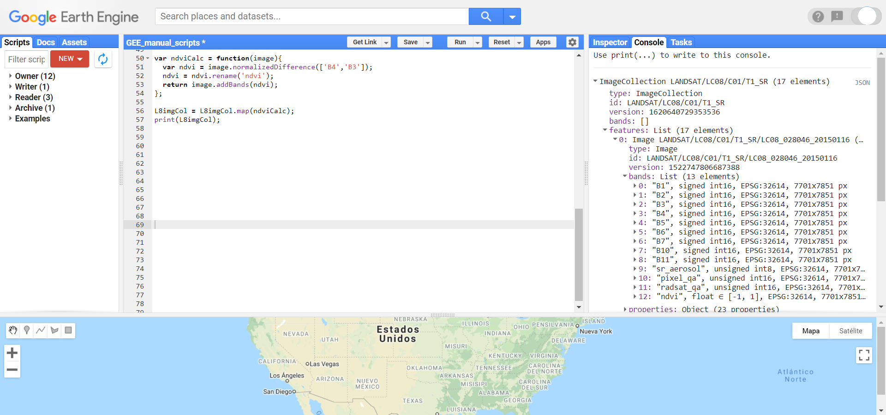

```{r setup, include=FALSE}
# Set global options for chunks
knitr::opts_chunk$set(out.width = "500px", dpi=150)
```

\newpage

# Introducción

## ¿Qué es Google Earth Engine?

Google Earth Engine (GEE) es una API (Application Program Interface) que permite tener acceso y hacer uso de los servidores de Google, así como de un amplio repositorio de información geográfica. Esta API tiene el objetivo de facilitar la creación de un programa. Por ello, cuenta con una serie de funciones, métodos y algoritmos que se pueden llamar con una simpe línea. Por otro lado, entre la información que se puede consultar directamente en GEE se encuentran: acervos para todo el mundo de imágenes Landsat (1-8), MODIS, Sentinel (1-3, 5), SRTM, AVHRR, GOESS, capas como el WorldClim, límites políticos, densidad poblacional, cuencas, WWF watersheds (cuencas), entre otras. Para consultar toda la información que esta disponible en GEE se puede consultar la siguiente liga: https://developers.google.com/earth-engine/datasets

## Ventajas

Entre las principales ventajas de utilizar esta API radica en: 

1. Los datos pueden ser consultados directamente en la nube, por lo que no requieren ser descargados para trabajar con ellos (lo que ahorra tiempo y espacio de almacenamiento para el usuario).
2. El procesamiento se hace en la nube utilizando el poder de cómputo asignado para la API, el cual supera el potencial de cualquier computadora de uso personal. Esto permite realizar operaciones que de otra manera serían imposibles.
3. Muchos datos se encuentran en distintos niveles de procesamiento, por lo cual, se pueden utilizar sin tener que realizar el pre procesamiento. Esto  facilita su uso (p.ej., Landsat datos crudos (raw data), o reflectancia en la superficie de la atmósfera (top of atmosphere) o reflectancia en la superficie terrestre (Surface reflectance))
4. Se pueden realizar consultas basadas en los metadatos, lo cual permite limitar las imágenes a utilizar por área de interés, fecha de registro, características de nubosidad, geometría del registro (azimut, ángulo de elevación, entre otros), u otras propiedades de los productos.
5. Otra gran ventaja de la plataforma radica en que los códigos se guardan en la sesión de cada usuario. Esto permite mantener un control de los códigos y automáticamente se genera un registro histórico (parecido al git), lo cual facilita el seguimiento y comparación de cambios entre las versiones (y permite revertir a versiones anteriores). Además, se pueden generar repositorios compartidos para generar proyectos colaborativos. 
6. En GEE se pueden realizar distintos tipos de procesamientos como aplicar filtros, realizar operaciones entre capas, cálculo de capas, cálculo métricas de textura, segmentación de objetos, reproyecciones, cálculo de estadísticas por regiones o de imágenes enteras, clasificaciones, entre otras.

## Lenguaje Javascript

La API permite trabajar mediante la programación en lenguaje Javascript, en una interfaz gráfica que resulta más amigable con el usuario. Además, únicamente requiere de una conexión a internet y un navegador. Toda la información del usuario es guardada en la cuenta asociada de Google en dicha plataforma. Adicionalmente, la API de Javascript es la que cuenta con mayor documentación y ayuda, por lo cual, los autores consideramos que resulta la más sencilla de utilizar. 

La sintaxis de JavaScript tiene algunas peculiaridades que deben cumplirse para que se pueda correr el código sin problemas. Entre la sintaxis básica se puede considerar los siguientes puntos:

1. Es un lenguaje sensible a mayúsculas y minúsculas. De tal manera que `a` puede ser un objeto y `A`, otro.
2. Siempre se debe cerrar cualquier comando con un `;`.
3. Comúnmente en Javascript se utiliza el _lower Camel Case_ para unir palabras, en lugar de guiones o guión bajo. Por ejemplo: `intervalMean` o `updateMask` .
4. Todas las variables, funciones, objetos deben ser definidos mediante la función `var`.
5. Para definir variables se utiliza el operador `=`.
6. Los operadores matemáticos son: `+ - * /`.
7. Para concatenar dos cadenas de caracteres se utiliza el símbolo `+`.
8. Para realizar comentarios se puede utilizar `//` para comentarios de una línea o `/* … */` para comentarios de varias líneas
9. Se puede utilizar el operador `.` para aplicar una función al objeto que lo precede. Por ejemplo, `imagen.updateMask(mascara);`
10.  No es sensible a las tabulaciones, aunque son recomendadas para un código ordenado.


# Primeros pasos
## Registro para el uso de GEE Javascript API

Lo primero que hay que hacer para poder utlizar la API Javascript de Google Earth Engine es ingresar a su sitio para registrarse como usuario. Para ello, hay que acceder a la siguient liga:

**https://earthengine.google.com/**

Después le damos click en la esquina superior derecha donde dice **Sign Up**. Ingresamos todos los datos que nos piden. Recordar que para utilizar GEE requerimos de una cuenta de Google para poder utilizar la API.

Una vez realizado el registro, esperaremos unos minutos hasta que nos llegue una confirmación por parte de GEE a nuestro correo informando que ya se puede hacer uso de la API.

Una vez que tengamos dicha confirmación, podemos acceder a la API accediendo a la siguiente liga: 

**https://code.earthengine.google.com/**

y accediendo con la cuenta de Google con la que nos registramos.

## Elementos básicos de la interfaz gráfica

Una vez abierto la Javascript API, se observa la siguiente pantalla

```{r, echo = F}
knitr::include_graphics("Img/GEE_inicio_API.png")
```

Los elementos de la API se enlistan a continuación:

**Consola**

La consola consiste en la pantalla de comunicación con el servidor. En ella se muestran los errores que se obtienen al correr un script o se pueden mostrar la información indicada por la función print.

**Pantalla de Repositorios**

Es el espacio donde se guardan los scripts del usuario. En ella se pueden crear repositorios, folders y scripts para organizar éstos últimos. Dentro de este espacio existen varias categorías: propietario (owner), editor (writer), lector (reader), ejemplos y archivo. Estos se pueden utilizar para determinar distintos niveles de acceso para distintos usuarios. Dentro de cada repositorio se puede asignar el control de acceso para otros usuarios.

**Docs**

Es un área donde se puede consultar todas las funciones y algoritmos que se encuentran cargadas en GEE. Además, para cada función le indica lo que hace, la entrada y salida que requiere y los argumentos de la función.

**Assets**

En este apartado el usuario puede subir su propia información para ser utilizada dentro de GEE. Se pueden subir archivos en formato raster o vector únicamente.

**Search**

Es una barra de búsqueda en la que se pueden buscar fuentes de datos o sitios.

**Map**

El mapa donde se pueden dibujar puntos, polígonos, líneas o rectángulos y muestra la información que se haya indicado mediante la función Map.addLayer.

**Layer manager**

Permite prender y apagar las capas que se estén mostrando en el área del mapa. Además, permite modificar las características necesarias para su display.

**Inspector**

Permite consultar los valores de las capas que se muestran en el mapa, al dar click sobre el punto de interés.

**Tasks**

Muestra los trabajos que se hayan exportado mediante la función Export.image o Export.table y permite correr el trabajo de exportación al sitio donde el usuario le haya indicado (drive, assets). También muestra el tiempo demorado en el trabajo, así como cuando el trabajo se ha finalizado.

# Tipos de objetos

## Server vs Client side

Existen dos lados de la programación de la API de GEE: el del servidor y el del cliente. De tal manera un objeto puede ser convertido entre los dos. Por ejemplo, mientras que del lado del cliente una cadena de caracteres puede ser definida simplemente como: “cadena”, para convertirla en objeto del lado del servidor deben utilizarse las funciones del servidor, es decir: `ee.String(“cadena”)`. Muchos de los algoritmos pre cargados en GEE únicamente corren sobre objetos del lado del servidor, por lo cual, es recomendable utilizar dicha sintaxis. Adicionalmente algunas operaciones se pueden hacer utilizando ambos tipos de sintaxis. Por ejemplo, una suma se puede realizar del lado del cliente mediante `obj1 + obj2`, mientras que del lado del servidor se utilizaría `obj1.add(obj2)`.
Existen casos excepcionales en lo cuales se prefiere utilizar el lado del servidor. Algunos de estos ejemplos incluyen los ciclos, condicionales. Para el caso del cliente se puede utilizar la función for; sin embargo, se recomienda utilizar la función map para realizar este tipo de ciclos del lado del servidor. Para el caso de los condiciones se sugiere utilizar en lugar de if y else, `ee.Algorithms.If`. Por otro lado, las funciones de exportar la información a algún archivo (ya sea un raster, un vector o una tabla) para utilizarlo fuera de GEE sólo corren del lado del cliente.


## Tipos de objetos del lado del cliente

Básicos (de parte del usuario)

### Strings (cadenas de texto)

Se refiere a objetos de cadenas de símbolos de tipo carácter alfanumérico. Cualquier secuencia de caracteres puede ser un string. Estos se definen como cualquier cadena de caracteres que se encuentren entre un par de comillas bien sean dobles  “” o sencillas ''. Por ejemplo:

```{js, echo = T}
var cadena = “Esto es una cadena de caracteres”; //cadena de solo texto	
var telefono= '1234567890'; //cadena de números 
var direccion = 'calle cuarta casa 16'; //cadena con números y texto
```

Resulta importante notar que los números en un String no serán interpretados como valores numéricos sino como texto.

### Number (números)

Se refiere a objetos numéricos que indican un valor. Cualquier secuencia de números puede ser un Number. Para números decimales se utiliza el punto decimal y no la coma decimal. Por ejemplo:

```{js, echo = T}
var numero = 1; //número entero
var numero2 = 2.5; //número decimal
```

Resulta importante notar que al declarar un objeto como Number no se hace uso de comillas.

### Lists (listas)

Se refieren a objetos que contienen varias entradas, las cuales pueden ser numéricas (Number) o cadenas de texto (String). Las listas se definen mediante el uso de corchetes [] y cada entrada es separada mediante una coma (,). Permiten encadenar una serie de valores. Por ejemplo:

```{js, echo = T}
var lista = [1, 2, 3, 4, 5, 6, 7, 8]; //lista numérica
var listaA = [“primero”, “segundo”, “tercero”]; //lista de texto
var listaB = [“primero”, “segundo”, “tercero”, 4]; //lista con texto y número
```

Todas las listas automáticamente asignan, en orden, un número a cada elemento dentro de ellas, siempre empezando desde 0. Entonces se puede consultar un solo elemento dentro de una lista, aportando el número de su posición dentro de ella.

```{js, echo = T}
print(lista[0]); //este elemento será: 1
print(listaA[1]); //este elemento será: “segundo”
print(listaB[2]); // este elemento será: “tercero”
```

### Diccionarios (Dictionaries)

Los diccionarios son objetos que contienen claves y valores asociados a estas claves. Los diccionarios se definen mediante el uso de {} donde se define cada clave seguida de dos puntos y el valor o cadena de caracteres asociada a esa clave. Para ingresar varias entradas, éstas deben ir separadas por una coma.

```{js, echo = T}
var dicc = {
  clave1: 1,
  clave2: "A"
}; 
```

Para consultar los valores dentro de un diccionario se puede hacer llamando directamente el nombre de la clave deseada.

```{js, echo = T}
print(dicc["clave1"]); // Esto devuelve 1
print(dicc["clave2"]); // Esto devuelve "A"
```

### Funciones (Functions)

Se refieren a objetos que contienen algún proceso que se realizará a alguna variable. Siempre comienzan con la función function seguida por el objeto al que se le aplicará la función y entre corchetes se coloca el procedimiento que va a realizar la función. Por último, deben regresar un objeto mediante la función return. Por ejemplo:

```{js, echo = T}
var maskIm = function(image){
  var qaImage = image.select('pixel_qa');
  var clearData = qaImage.eq(322);
  return image.updateMask(clearData);
};
```

## Tipo de objetos del lado del servidor

Estas funciones permiten definir objetos como objetos en el lado del servidor o convertir objetos en el lado del cliente al servidor. También, en algunos casos los objetos que se obtienen a partir de ciertas funciones retornan un objeto de tipo objeto, por lo cual, se recomienda “castear” el objeto al tipo de objeto deseado antes de proseguir con su uso.

Por otro lado, toda la información que se encuentra disponible en GEE corresponderá a objetos del servidor. Por ende, la mayoría de los métodos disponibles en GEE trabajarán únicamente con objetos del lado del servidor. Para revisar todos los métodos disponibles en GEE clasificados por tipo de objeto del servidor se puede consultar en la sección de **Client libraries**: https://developers.google.com/earth-engine/apidocs

Los objetos del lado del servidor se pueden conceptualizar como contenedores que le indican al servidor qué tipo de objeto es el que se está enviando. Además, cuando se trabaja del lado del servidor, los objetos necesariamente son enviados al servidor para ser evaluados. Todos los objetos del servidor comienzan con `ee`.

### ee.String

Permite enviar un objeto como cadena de caracteres al servidor. Además, al definir un objeto de este tipo, se pueden utilizar cualquier función indicada bajo la librería de **ee.String** al revisar las librerías disponibles en la API (ver liga anterior).

```{js, echo = T}
print(cadena);
var cadenaServ = ee.String(cadena);
print("Esto está evaluado en el servidor", cadenaServ);
```

### ee.List

Permite enviar un objeto como lista al servidor. Además, al definir un objeto de este tipo, se pueden utilizar cualquier función indicada bajo la librería de **ee.List** al revisar las librerías disponibles en la API (ver liga anterior).

```{js, echo = T}
print("Esto está del lado del cliente", lista);
var listaServ = ee.List(lista);
print("Esto está evaluado en el servidor", listaServ);
```

Para acceder a un elemento de tipo ee.List se utiliza la función `get`.

```{js, echo = T}
print(listaServe.get(0));
print(listaServe.get(1));
```

### ee.Dictionary

Permite enviar un objeto como diccionario al servidor. Además, al definir un objeto de este tipo, se pueden utilizar cualquier función indicada bajo la librería de **ee.Dictionary** al revisar las librerías disponibles en la API (ver liga anterior). 

```{js, echo = T}
print("Esto está del lado del cliente", dicc);
var diccServ = ee.Dictionary(dicc);
print("Esto está evaluado en el servidor", diccServ);
```

Para acceder a un elemento de tipo ee.Dictionary se utiliza la notación de `.` seguido del nombre de la clave. Adicionalmente, se puede consultar utilizando también la función `get` y el nombre de la clave, aunque se recomienda más el uso de la primera.

```{js, echo = T}
print(diccServe.clave1);
print(diccServe.clave2);

print(diccServe.get("clave1"));
print(diccServe.get("clave2"));
```

Por último, si se desea obtener las claves disponibles en un diccionario se utiliza la función `keys`.

```{js, echo = T}
print(diccServe.keys());
```

### ee.Date

Este es la forma en la que GEE permite trabajar con fechas. Permite enviar un objeto como fecha al servidor. Además, al definir un objeto de este tipo, se pueden utilizar cualquier función indicada bajo la librería de **ee.Date** al revisar las librerías disponibles en la API (ver liga anterior). 

```{js, echo = T}
var fechaString = '2015-01-01';

print("Fecha String",fechaString);

var fecha = ee.Date(fechaString);
var fecha2 = ee.Date.fromYMD(2015,01,01);

print("Fecha como ee.Date",fecha);
print("Fecha como ee.Date también",fecha2);

```

### ee.Image

Permite enviar un objeto como imagen al servidor. Además, al definir un objeto de este tipo, se pueden utilizar cualquier función indicada bajo la librería de **ee.Image** al revisar las librerías disponibles en la API (ver liga anterior). Este va a ser el tipo de objetos para trabajar con cualquier elemento de tipo raster en GEE. Más adelante se explican con mayor detalle.

### ee.ImageCollection

Permite enviar un objeto como una colección de imágenes al servidor. Además, al definir un objeto de este tipo, se pueden utilizar cualquier función indicada bajo la librería de **ee.ImageCollection** al revisar las librerías disponibles en la API (ver liga anterior). Las colecciones de imágenes están formadas por imágenes. Más adelante se explican con mayor detalle.

### ee.Feature

Permite enviar un objeto como atributo al servidor. Además, al definir un objeto de este tipo, se pueden utilizar cualquier función indicada bajo la librería de **ee.Feature** al revisar las librerías disponibles en la API (ver liga anterior). Este va a ser el tipo de objetos para trabajar con cualquier objeto de tipo vector o tabla. Más adelante se explican con mayor detalle.

### ee.FeatureCollection

Permite enviar un objeto como colección de atributos  al servidor. Además, al definir un objeto de este tipo, se pueden utilizar cualquier función indicada bajo la librería de **ee.FeatureCollection** al revisar las librerías disponibles en la API (ver liga anterior). Las colecciones de atributos están formadas por atributos. Más adelante se explican con mayor detalle.

### Otros objetos

Dentro de GEE existen otros objetos del servidor que permiten realizar diferentes funciones como por ejemplo: ee.Algorithms, ee.Array, ee.Classifier, ee.ConfusionMatrix, ee.Geometry, ee.Model, entre otros. Cada uno de estos objetos se utiliza para una función distinta en GEE. Más adelante se revisarán algunos de los más comunmente utilizados.
 
# Display de datos y exportación

## Map

La función `Map.addLayer` permite mostrar elementos en la parte de mapa de la API. Por lo tanto, permite mostrar objetos de tipo `ee.Feature` o `ee.Image`. Adicionalmente se pueden indicar otros parámetros como la forma del display de los objetos y el nombre de la capa. Por ejemplo, se puede utilizar los siguientes parámetros para mostrar una imagen

```{js, echo = T}
Map.addLayer(image, {bands: ['B1', 'B2', 'B3'], min: 0, max: 2000}, 'RGB');
```

Para el caso de los features se puede realizar una operación similar como

```{js, echo = T}
Map.addLayer(feature, {palette: ['FF0000', 'FFFF00',' 008000'], min: 0, max: 10},
'featuresColored');
```

## Chart

La función principal para realizar gráficos es ui.Chart. Esta función tiene varios algoritmos para realizar diferentes tipos de gráficos, por ejemplo, para los objetos Feature, Image o Array.

## Export

Todo el procesamiento se puede realizar en la nube y únicamente el usuario puede exportar los resultados de interés. Sin embargo, sólo existen dos formatos válidos para exportar desde GEE: raster o vector.

Resulta obvio que el primero se va a utilizar para exportar imágenes en formato raster, sin embargo, no siempre resulta obvio ya que algunas veces se pueden convertir imágenes a formato de arreglo (array), tras lo cual hay que volver a convertir la información a formato de imagen (Image) para poder exportarla. La aplicación permite exportar únicamente en formato GTiff o TRFrecord (tensores).

Por su parte, el formato vector permite exportar información vector y tablas sin información geográfica. De nuevo, para poder exportar en el formato vector, el objeto exportado debe ser en formato atributo (feature). Para el caso de tablas sin información geográfica asociada se debe definir el objeto como un objeto atributo sin geometría (es decir, null) y en la tabla de atributos anexar la información deseada.

```{js echo = T}
Export.image.toDrive({
  image: imgDiff,
  description: 'DiferenciaNDVI_2016-2017',
  scale: 30,
  fileFormat: 'GeoTIFF',
  folder: 'DiferenciaNDVIL8'
}); 
```

## Puntos para recordar

1. Existen algunas características adicionales que conviene tener en cuenta para trabajar en GEE. En GEE muchas operaciones utilizan el término de scale, sin embargo, ésta no se refiere a la escala de trabajo en un sentido tradicional (p.ej., 1:50 000), sino que se refiere al tamaño de pixel expresado en m.
2. La proyección de trabajo para todas las capas es de EPSG:3857 WGS84 pseudomercator. Por ello, todas las capas se trabajan en esa proyección. Si se requiere cambiar de proyección se puede utilizar la función `reproject`.
3. Cuando se corre un script en la consola con el botón de Run, éste no corre directamente en los servidores de Google, sino que éstos se transcriben a código GeoJSON, se envían a los servidores de Google y se espera una respuesta.
4. No se puede escribir o cambiar los objetos que se encuentran directamente hospedados en GEE. Por ejemplo, si se quiere mapear una función que sobreescriba alguna característica de las colecciones de imágenes en GEE, se debe hacer una copia de éstas para que se pueda sobreescribir la característica de interés.
5. Las funciones, al igual que las funciones para exportar, sólo funcionan si regresan un objeto de tipo Feature o Image, por lo cual, a veces se deben realizar ciertas conversiones para evitar un error.
6. El límite de memoria destinado a objetos que se desean ver en consola, mediante un print, tienen un tamaño mucho menor que el que se permite al únicamente correr un objeto con export. Por lo tanto, resulta una mejor práctica exportar los resultados, en lugar de mostrarlos en consola.
7. Si un proceso muestra un error de "computation timed out" se puede elegir alterar los valores de scale o de bestEffort o Tiles para lograr que este corra.

# Features

## Trazado de polígonos, líneas, puntos

# Feature Collections

# Imagen

## Características

Las imágenes que se encuentran disponibles en colecciones de imágenes de GEE corresponden a información en formato raster que cuenta con una resolución espacial, espectral, radiométrica particular. Los metadatos de cada imagen se encuentran como propiedades de ésta. A diferencia de las imágenes a las que posiblemente el usuario esté acostumbrado a manejar, GEE permite el manejo de imágenes donde cada banda puede tener una resolución de pixel o tipo de datos (Integer, Float, 16 bits, etc) distinta. Esto no afecta el uso de estas imágenes pero puede ser importante a considerar para exportar imágenes cuyas bandas tienen distinta resolución espacial (p.ej., Sentinel-2).

## Información y metadatos

Los metadatos de la imagen se encuentran como propiedades. Para consultarlas se puede utilizar el siguiente comando: `ee.Image.propertyNames();` Así se pueden consultar todas las propiedades de una imagen. Sin embargo, algunos comandos que facilitan la consulta de algunos elementos son: `.bandNames()`, `.projection()`, `.projection().nominalScale()`, para conocer el nombre de las bandas de la imagenes, su proyección y el tamaño de pixel en m que presenta, respectivamente.

Una vez, revisado los nombres de las bandas de una imagen, se pueden  seleccionar ciertas bandas mediante: 

```{js, echo = T}
ee.Image.select('B1')
ee.Image.select(['B1','B2','B3']) 
```

## Operaciones básicas

Se pueden hacer mosaicos mediante el uso de la función mosaic sobre una colección de imágenes. Por ejemplo: 

```{js, echo = T}
ee.ImageCollection.mosaic();
```

También se pueden realizar cortes de una imagen para quedarse con un área específica utilizando la 
función: 

```{js, echo = T}
ee.Image.clip();
```

## Operaciones matemáticas

Dentro de GEE se puede realizar cualquier operación matemática entre bandas o entre imágenes. Los operadores para realizar esta operaciones son: `ee.Image.subtract(), .add(), .divide(), .multiply()`. Además, GEE cuenta con una función de `.normalizedDifference()` para calcular un índice normalizado, a partir de las bandas que se indiquen como: `ee.Image.normalizedDifference(['B4' , 'B3'])`. Por ejemplo, para calcular el NDVI primero se indica la banda del infrarrojo y luego la del rojo. Si se quiere realizar un índice un poco más complicado se puede calcular mediante la función de `.expression()`. En esta función se indica primero la fórmula del cálculo que se va a realizar y posteriormente se indica en un diccionario la equivalencia de los términos utilizados en la fórmula y los nombres de las bandas de la imagen: 

```{js, echo = T}
var NDVI = ee.Image.expression( '(NIR - R) / (NIR + R)', {
'NIR' = image.select('B4'),
'R' = image.select('B3)
});
```

Dentro de las fórmulas utilizadas dentro de expression se puede utilizar la notación estándar matemática (`+, -, /, *`), modulo (`%`), exponente (`**`), relacionales(`>, <, >=, <=, !=, ==`), lógicos (`&&, ||, !, ^`), o if then else (`?:`).

## Operaciones relacionales, condicionales y booleanas

Se pueden utilizar operadores relacionales, condicionales, booleanos sobre las imágenes para crear clases o máscaras. Se pueden utilizar las siguientes notaciones para hacer comparaciones de los valores una imagen con cierto valor `.lt()`, `.lte()`, `.gt()`, `.gte()`, `.eq()`, `.neq()`. Además se pueden utilizar operadores relacionales para unir dos condiciones mediante `.and()` u `.or()`. Por ejemplo: 

```{js, echo = T}
ee.Image.lte(0.2).and(ee.Image.gte(0));
```

# Colecciones de imágenes

La mayoría de los objetos que se encuentran disponibles en los servidores de GEE se encuentran en forma de colecciones: `FeatureCollection` o `ImageCollection`. Estas se pueden definir como colecciones de objetos Feature o Image. Normalmente, el primer paso para trabajar con estas colecciones radica en delimitar el área y periodo de estudio, para lo cual se utilizan las funciones de filter. Por ejemplo, para delimitar un área se puede utilizar ImageCollection.filterBounds(area), mientras que para delimitar por fecha ImageCollection.filterDate(periodStart,periodEnd). Además, se pueden filtrar, de acuerdo con otros criterios contenidos en los metadatos de las imágenes. Por ejemplo, se puede definir un valor umbral de porcentaje de nubosidad de las imágenes con las que se desean trabajar o en ciertos parámetros de la geometría del registro.

Adicionalmente, si se desea calcular una nueva banda para todas las imágenes de la colección, se debe aplicar una función que agregue la nueva banda a cada imagen y aplicar dicha función a cada imagen de la colección mediante la función map.

## Características

Las colecciones de imágenes son objetos de GEE que contienen un conjunto de imágenes. En GEE este tipo de objetos va a ser el que va a contener los acervos de imágenes disponibles. Para el manejo de varias imágenes se recomienda utilizar esta estructura, en lugar de listas u otro tipo de objetos.

## Información y metadatos

Las colecciones de imágenes contienen los metadatos e información de todas las imágenes que contienen. De tal manera, se puede utilizar esta información para filtrar y utilizar únicamente las imágenes que cumplen con ciertos criterios.

## Filtros sobre Colecciones de imágenes

Los filtros permiten filtrar las colecciones de imágenes a partir de los metadatos de las imágenes que contiene. De tal manera, se puede filtrar por: superposición con algún polígono de interés, fecha de registro, características de las escenas (path, row, porcentaje de nubosidad), entre otras. 

Para filtrar una colección de imágenes se van a utilizar los objetos `ee.Filter`. Existen diversos tipos de filtros, algunos ya se encuentran precargados, pero otros se pueden definir manualmente. Por ejemplo, para filtrar por fecha se pueden utilizar:

```{js, echo = T}
ee.ImageCollection.filterDate('2015-01-01','2016-01-01');
```

Por otro lado para filtrar espacialmente con la extensión de un polígono se puede realizar mediante:

```{js, echo = T}
ee.ImageCollection.filterBounds(polygon1); 
```

Si se desea filtrar por alguna característica de los metadatos se puede hacer mediante:

```{js, echo = T}
ee.ImageCollection.filter(ee.Filter.lte('CLOUD_COVER', 20));
```

## Visualización de imágenes

Las imágenes se pueden visualizar en el área del mapa de la API mediante la función `Map.addLayer()`. Esta función tiene varias opciones que permiten visualizar las imágenes. Algunos de los argumentos que se pueden indicar son: `bands`, `min` o `max`. Estos se deben pasar dentro de un `{}` como un diccionario a la función: `Map.addLayer({bands: ['B1', 'B2, 'B3'], max: 10, min: 0})`. Esta función también permite asignar colores mediante el argumento de `palette` y utilizar el código de colores hexadecimal. Dependiendo de las bandas que se elija mostrar se puede mostrar únicamente una banda en tonos de gris o un compuesto RGB. 

### Ejercicio 1: Filtro de colección de imágenes y visualización

Para filtrar la colección de reflectancia de la superficie de imágenes de Landsat 8 de mayor calidad (tier 1) por fecha, porcentaje de cobertura de nubes de las imágenes, así como por su "path" y "row" se puede realizar en un solo paso aplicando múltiples filtros. En este caso, primero se indica la ruta de la colección que se desea utilizar. Para encontrata esta ruta se puede buscar la colección de interés en la barra de **Search**, después se le da click y del lado izquierdo aparecerá la ruta de la colección. Por otro lado, en esta misma ventana, en la pestaña de 'BANDS' se puede consultar las bandas y los nombres de las bandas que contiene cada imagen. Por su parte, en la pestaña de 'IMAGE PROPERTIES' se pueden consultar los metadatos que contienen las imágenes de esta colección. 

```{r, echo = F}
knitr::include_graphics("Img/Ruta_coleccion.png")
```

Una vez que se conoce la ruta de la colección de interés, se llama dicha colección. Después se especifican los filtros. En este caso, primero se filta por fecha, en formato YYYY-MM-DD (año, mes, día), seguido de filtros de los metadatos de las imágenes: 'CLOUD_COVER_LAND', 'WRS_PATH', 'WRS_ROW'. En este caso se debe escribir exactamente igual el campo de los metadatos (CLOUD_COVER_LAND) y en la definición del filtro se debe explicitar si se desea utilizar los valores que sean iguales (eq), distintos (neq), mayores (gt), menores (lt), mayores o igual (gte) o menores o iguales(lte).

```{js, echo = T}
var L8imgCol = ee.ImageCollection("LANDSAT/LC08/C01/T1_SR")
  .filterDate('2015-01-01','2016-01-01')
  .filter(ee.Filter.lte('CLOUD_COVER_LAND',50))
  .filter(ee.Filter.eq('WRS_PATH',28))
  .filter(ee.Filter.eq('WRS_ROW',46));
```

Para explorar algunas características de la colección de imágenes filtradas podemos escribir el siguiente comando para ver sus características en la consola.

```{js, echo = T}
print(L8imgCol);
```

Una vez corrido el comando anterior, en la consola se puede consultar cuántas imágenes cumplieron con los filtros indicados. En este ejemplo, la colección filtrada incluye 17 imágenes.
Despues se pueden consultar las características de las imágenes incluidas en la colección. Para ello, en la consola se le da un click a la flecha ubicada a la isquierda de la colección en la consola a **Features**, después a cualquier imagen (**Image**) y por último a **Properties**. Ahí se pueden ver los metadatos de cada imagen y por lo tanto, los campos de información que se pueden utilizar para filtrar una colección de imágenes, basado en los metadatos de las imágenes. Esta información es la misma que se puede obtener en la barra de **Search**.

```{r, echo = F}

```

A continuación podemos ordenar la colección en orden ascendente de acuerdo al metadato de 'CLOUD_COVER_LAND'. Posteriormente, se selecciona la primera imagen, es decir, la de menor cobertura de nubes. Nótese que en este paso al definir la variable `L8imgFirst`, ya únicamente seleccionamos una sola imagen, por lo tanto, éste va a ser un objeto ee.Image.

```{js, echo = T}
L8imgCol = L8imgCol.sort('CLOUD_COVER_LAND');
var L8imgFirst = L8imgCol.first(); 
print(L8imgFirst);
```

Por último, se pueden agregar esta imagen a la ventana de mapas para visualizar la información. En el primer caso se agrega la información sin pasar más argumentos. En el segundo caso, se indican las bandas y el orden que se desea cargar, así como los valores mínimos y máximos del histograma, y un nombre para la capa. 

```{js, echo = T}
Map.addLayer(L8imgFirst);
Map.addLayer(L8imgFirst,{bands: ['B4','B3','B2'], min: 95, max: 1288}, 'RGB menos nubes L8');
```

```{r, echo = F}
knitr::include_graphics("Img/Ejercicio1_2.png")
```

## Mapeo

Para realizar alguna operación sobre todas las imágenes de una ImageCollection se utilizar la función `map`. Esto va a aplicar la función que se defina en el interior de ella a cada imagen dentro de la colección. Por ejemplo, si quisieramos agregar una banda con un índice de vegetación a todas las imágenes se podría hacer de la siguiente manera:

```{js, echo = T}
ee.ImageCollection.map(function(image){
	return image.normalizedDifference('NIR','R');
});
```

Este tipo de operación es la sugerida para realizar operaciones de tipo ciclo, en lugar de otras funciones de ciclo (e.g., `for`)

## Reducción

Los reductores permiten crear un mosaico (una sola imagen), a partir de una colección de imágenes. Estos son muy útiles para hacer mosaicos multitemporales u obtener información de la colección de imágenes (por ejemplo, cuántas observaciones válidas tiene cada pixel en un año).

Para reducir una colección de imágenes se utilizará la función `reduce` e indicando el método a utilizar mediante un objeto tipo `ee.Reducer`. De tal manera, se puede indicar si el resultado corresponderá a la media  `ee.Reducer.mean()`, mediana  `ee.Reducer.median()`, moda  `ee.Reducer.mode()`, mínimo  `ee.Reducer.min()`, máximo `ee.Reducer.max()` o inclusive la media de un intervalo determinado de observaciones `ee.Reducer.intervalMean()` Esto se puede realizar mediante el siguiente procedimiento:

```{js, echo = T}
ee.ImageCollection.reduce(ee.Reducer.mean());
```

Al aplicar una reducción a una colección de imágenes, el nombre de las bandas será el mismo que el de las bandas de cada imágen con un sufijo que indica la función utilizada para hacer la reducción. Por ejemplo, al utilizar `ee.Reducer.mean()` sobre una colección de imágenes cuyas bandas se llaman `B1` y `B2`, las bandas de la imagen producto de la reducción se llamarán `B1_mean` y `B2_mean`.

## Compuestos y mosaicos

Si se desean hacer mosaicos a partir de varias imágenes se puede realizar en GEE mediante dos funciones: `ee.ImageCollection.mosaic()` y `ee.ImageCollection.qualityMosaic()`. La principal diferencia entre estas dos funciones radica en que la primera simplemente pega las imágenes de acuerdo al orden que tienen en la colección (es decir, la última hasta arriba). Por el contrario, la función de `qualityMosaic()` permite priorizar el pixel que quedará en el mosaico final a partir del valor más alto de alguna banda. Esto puede ser útil para realizar por ejemplo un mosaico del pixel con mayor valor de NDVI.

### Ejercicio 2: Enmascaramiento de nubes, cálculo de índices y reducción

Utilizando la colección que ya se filtró en el ejercicio anterior se hará un mapeo y una reducción. En este ejercicio se obtendrá el ndvi promedio entre 2015 y 2016.

Para calcular el ndvi promedio lo primero que hay que hacer es aplicar la máscara de nubes que viene en la misma colección de imágenes de Landsat 8. Al aplicar esta máscara se eliminarán los pixeles cuya información provenga de nubes. Después se definirá una función para calcular el ndvi para cada imagen contenida en la colección de imágenes. Para ello se utiliza la función `normalizedDifference`, indicando las bandas de NIR y R. También se utilizará la función `rename` para cambiar el nombre dado por default a la nueva banda calculada. Posteriormente, se agrega esta banda a la imagen con `add.Bands` Después, se utiliza la función `map` para aplicarla a cada una de las imágenes.

Primero se define la función para enmascarar las nubes. En este caso, se indican los bits que corresponden a nubes y a sombras, es decir, los bits 5 y 3 respectivamente. Después se selecciona la banda que contiene la información de la máscara de nubes, la cual en landsat 8 se llama "pixel_qa". Posteriormente se selecciona esta banda y se evalua que en los dos bits antes mencionados el valor sea igual a cero, es decir, que sea un pixel clasificado como despejado. En este procedimiento se indica que la consulta de los valores se debe hacer por bits (`bitwiseAnd`) y que las dos evaluaciones deben de ser cero (`and`). Posteriormente, se define una máscara en función de esos valores y se actualiza la máscara (`updateMask`).

```{js, echo = T}
function maskL8sr(image) {
  var cloudShadowBitMask = (1 << 3);
  var cloudsBitMask = (1 << 5);
  var qa = image.select('pixel_qa');
  var mask = qa.bitwiseAnd(cloudShadowBitMask).eq(0)
                 .and(qa.bitwiseAnd(cloudsBitMask).eq(0));
  return image.updateMask(mask);
}
```

Posteriormente se define la función para calcular el NDVI de todas las imágenes.

```{js, echo = T}
var ndviCalc = function(image){
  var ndvi = image.normalizedDifference(['B5','B4']);
  ndvi = ndvi.rename('ndvi');
	return image.addBands(ndvi);
};
```

Para ver una muestra de cómo se ve la primer imagen con y sin la máscara de nubes, primero se agregará la imagen con nubes a la pantalla de mapa.

```{js, echo = T}
Map.addLayer(L8imgCol.first(), 
  {bands:['B4','B3','B2'], min: 0, max: 1300},
  'Imagen con nubes');
```

```{r, echo = F}
knitr::include_graphics("Img/Ejercicio2_nubes.png")
```

A continuación se aplican las dos funciones utilizando `map` y sobreescribir el objeto L8imgCol.

```{js, echo = T}
L8imgCol = L8imgCol
  .map(maskL8sr)
  .map(ndviCalc);
print(L8imgCol);
```

Después se muestra la imagen sin nubes.

```{js, echo = T}
Map.addLayer(L8imgCol.first(), 
  {bands:['B4','B3','B2'], min: 0, max: 1300},
  'Imagen sin nubes');
```

```{r, echo = F}

```

En la consola se puede observar que todas las imágenes ahora contienen una nueva banda llamada ndvi.

```{r, echo = F}

```

Posteriormente, se puede reducir la colección de imágenes para formar una sola imagen que represente el valor promedio de ndvi en el periodo de la colección (2015 - 2016). Para ello se utiliza la función `reduce`. También se calculará la desviación estándar de los valores de NDVI. Estas dos imágenes se guardarán en dos nuevos objetos.

```{js, echo = T}
var L8imgMean = L8imgCol.reduce(ee.Reducer.mean());
var L8imgSD = L8imgCol.reduce(ee.Reducer.stdDev());
```

Por último, agregamos los dos resultados a la pantalla de mapas.

```{js, echo = T}
Map.addLayer(L8imgMean, {min:-0.14, max:0.15}, 'NDVI mean 2015 - 2016');
Map.addLayer(L8imgSD, {min:0, max:0.13}, 'NDVI SD 2015 - 2016');
```

El resultado se ve así:

```{r, echo = F}
knitr::include_graphics("Img/Ejercicio2_2.png")
```

Se pueden prender y apagar las capas de la pantalla de mapas utilizando el menú que se despliega al posicionar el puntero sobre el letrero de layers y prendiendo y apagando las capas con las palomitas a la izquierda de cada capa.

Estás funciones van a ser de mucha utilidad para juntar resultados de varias imágenes en una sola colección o unir dos colecciones (p.ej., Landsat 7 y 8).

El último paso será cortar la imagen a una extensión de interés. En este caso primero se define un área de interés mediante coordenadas: 

```{js  echo = T}
var geometry = 
    /* color: #d63000 */
    /* displayProperties: [
      {
        "type": "rectangle"
      }
    ] */
    ee.Geometry.Polygon(
        [[[-101.82737418916153, 19.836437094032178],
          [-101.82737418916153, 19.368119068204525],
          [-101.15171500947403, 19.368119068204525],
          [-101.15171500947403, 19.836437094032178]]], null, false);
```

En este caso se puede definir un polígono, indicando que es un objeto del lado del servidor `ee.Geometry` de tipo polígono, es decir, `ee.Geometry.Polygon`. Otra forma de trazar el polígono es utilizando las funciones de trazado ubicadas en la esquina superior izquierda de la pantalla de mapas. Una última forma de cargar un archivo de un objeto en GEE es importarlo desde un archivo externo. Esto se verá más adelante en la sección **XXX**.

Para cortar las dos imágenes que se crearon y mostrarlas en la pantalla de mapas.

```{js  echo = T}
L8imgMean = L8imgMean.clip(geometry);
L8imgSD = L8imgSD.clip(geometry);

Map.addLayer(L8imgMean, {min:0.2, max:0.8}, 'NDVI mean 2015 - 2016 clip');
Map.addLayer(L8imgSD, {min:0, max:0.3}, 'NDVI SD 2015 - 2016 clip');
```

## Exportación de resultados

Una vez que se obtuvieron los resultados deseados. Estos se pueden exportar fuera de GEE con las funciones Export. En el caso de las imágenes, la función para exportar es` Export.image`. Dentro de GEE hay 3 opciones para exportar los resultados de una imagen: `Export.image.toAsset`, `Export.image.toDrive` o `Export.image.toCloudStorage`. El primero permite exportar la imagen como una imagen a la sección de **Assets**, es decir, la sección donde el usuario puede subir su información a GEE. Esta opción es útil para cuando el resultado se va a utilizar en otro procedimiento de GEE. La segunda opción permite exportarlo al Google Drive de la cuenta con la que se tiene acceso a GEE. Esta opción es útil para trabajar con las imágenes en algún entorno local como algún SIG. La última opción permite exportar la imagen al Google Cloud Storage para utilizarla en algún otro proceso a realizar en Google Cloud. La opción que creemos es más común para cualquier usuario será la de `Export.image.toDrive`. 

### Ejercicio 3: Cáculo de diferencia de dos imágenes y exportación de resultado.

Se reutilizarán las funciones previamente definidas para generar un mosaico igual al ya generado, pero ahora con fechas de 2016-01-01 al 2017-01-01. Primero se filtra la colección de imágenes y se mapean las funciones para enmascarara las nubes y agregar el NDVI a las imágenes.

```{js, echo = T}
var L8imgColT2 = ee.ImageCollection("LANDSAT/LC08/C01/T1_SR")
  .filterDate('2016-01-01','2017-01-01')
  .filter(ee.Filter.lte('CLOUD_COVER_LAND',50))
  .filter(ee.Filter.eq('WRS_PATH',28))
  .filter(ee.Filter.eq('WRS_ROW',46));

L8imgColT2 = L8imgColT2
  .map(maskL8sr)
  .map(ndviCalc);
```

Después se selecciona únicamente las bandas de NDVI y se reduce la colección para generar una imágen del valor promedio de NDVI. Posteriormente, se recorta la imagen a la extensión del polígono del área de interés. Finalmente, a esta imagen se le restarán los valores de la imagen del 2015-01-01 al 2016-01-01. De esta manera, los valores más negativos representarán valores más bajos de NDVI en el año 2 respecto al año 1.

```{js, echo = T}
L8imgColT2 = L8imgColT2.select('ndvi');
var L8imgMeanT2 = L8imgColT2.reduce(ee.Reducer.mean());

L8imgMeanT2 = L8imgMeanT2.clip(geometry);

var imgDiff = L8imgMeanT2.subtract(L8imgMean);  
```

Posteriormente, se agrega el resultado a la pantalla de mapas.

```{js, echo = T}
Map.addLayer(imgDiff,{min:-0.3, max: 0.1, 
  palette:['FF0000', 'FFFF00', '008000'] }, 
  'Diferencia NDVI 2015 vs 2016');
```


```{r, echo = F}
knitr::include_graphics("Img/Ejercicio3_1.png")
```

Por último, para exportar el resultado se ingresan varios parámetros a la función que incluyen: la imagen a exportar, el nombre para guardar el archivo, la escala de la imagen (tamaño de pixel en metros), formato a utilizar y si se desea guardar dentro de un folder del Google Drive. Estos argumentos, al igual que otras funciones en GEE se pasa dentro de un diccionario.

```{js echo = T}
Export.image.toDrive({
  image: imgDiff,
  description: 'DiferenciaNDVI_2016-2017',
  scale: 30,
  fileFormat: 'GeoTIFF',
  folder: 'DiferenciaNDVIL8'
}); 
```


# Importación de información a GEE (Assets)

Se pueden importar varios tipos de archivos a GEE para utilizarlos en la API: imágenes, archivos vector (shapefiles), archivos separados por comas (csv), colecciones de imágenes exportadas por el mismo GEE y folders. Para importar cualquier de estos tipos de archivos simplemente se tiene que ingresar a la pestaña de **Assets** en al panel izquierdo y después dar click en NEW e indicar el archivo que se quiere importar a GEE.

```{r, echo = F}
knitr::include_graphics("Img/Asset1.png")
```

Posteriormente se da click en SELECT y se seleccionan los arhivos que se quieren subir. Además, directamente en esta ventana se pueden agregar algunos campos a la información. Por último, se da click en UPLOAD (ubicado en la esquina inferior derecha de esta ventana) para subir los archivos a la cuenta de GEE (ocupando espacio en Google Drive). Recordar que para archivos shapefile sólo se aceptan archivos con las extensiones: shp, zip, dbf, prj, shx, cpg, fix, qix, sbn o shp.xml. Si se agrega algún otro archivo que tenga una extensión distinta a las anteriores va a arrojar un error. 

```{r, echo = F}
knitr::include_graphics("Img/Asset2.png")
```

Una vez que se haya dado click en UPLOAD, el progreso en la subida del archivo a GEE se puede consultar en la pestaña de TASKS. Un vez terminado, el archivo podrá ser accesado dentro de la pestaña de **Assets**. A veces no aparece el archivo recién importado, por lo cual se sugiere refrescar los elementos de esta sección presionando el botón que se encuentra a la derecha de NEW.

```{r, echo = F}
knitr::include_graphics("Img/Asset3.png")
```

# Clasificación supervisada

Dentro de GEE se pueden hacer clasificaciones supervisadas con algunos algoritmos populares como CART (Classification and Regression Trees), Random Forests, Naive Bayes, Gradient Tree Boost, Support Vector Machine, MaxEnt (Maximum Entropy) y Decistion Trees. Como todos los demás objetos dentro de GEE tienen su propio tipo de objetos contenedor.

## Classifier

Los objetos `ee.Classifier` son los objetos que van a permitir trabajar con clasificadores dentro de GEE. Algunos ejemplos de estos son: `ee.Classifier.smileCART`, `ee.Classifier.smileRandomForest`, `ee.Classifier.amnhMaxent`, entre otros. De nuevo, todos los algoritmos disponibles en GEE se pueden consultar en la página de ayuda, en la pestaña de referencia (Reference) en el apartado de librerías del cliente (Client libraries).

Debido a que estos clasificadores trabajan en un esquema supervisado, requieren de la provisión de muestras de entrenamiento. Esto se puede hacer directamente en la API, aunque quizás no sea lo más cómodo para el usuario. En este paso se recomienda capturar los datos de entrenamiento en algún SIG, p.ej., QGIS, y luego importar el archivo vector a GEE (ver sección importar datos a GEE).

### Ejercicio 4: Clasificación

En este ejercicio se hará una clasificación supervisada utilizando el algoritmo Random Forests. Para ello se utilizarán 7 polígonos como sitios de entrenamiento, pertenecientes a 4 clases: Bosque, No bosque, Agua y Urbano. Estos polígonos se definirán directamente en la API a través de sus coordenadas como objetos `ee.Geometry` de tipo rectangulo. Posteriormente, cada polígono se transforma en un objeto de tipo atributo (`Feature`) y se le asigna la propiedad de "clase" como número a través de un diccionario. Por último, se hace una colección de atributos.

```{js echo = T}
var bosque1 = ee.Geometry.Rectangle(-101.53892, 19.74148, 
  -101.51906,19.72362);
var bosque2 = ee.Geometry.Rectangle(-101.64826, 19.49264, 
  -101.62839,19.47545);
var noBosque1 = ee.Geometry.Rectangle(-101.35448, 19.65992, 
  -101.34509,19.65990);
var noBosque2 = ee.Geometry.Rectangle(-101.56907, 19.58312, 
  -101.54939,19.56435);
var urbano = ee.Geometry.Rectangle(-101.20999, 19.71300, 
  -101.19688,19.70338);
var agua1 = ee.Geometry.Rectangle(-101.60826, 19.66885, 
  -101.58569,19.64316);
var agua2 = ee.Geometry.Rectangle(-101.74686, 19.43937, 
  -101.733453,19.427012);

var poligonos = ee.FeatureCollection([
  ee.Feature(noBosque1, {'clase': 0}),
  ee.Feature(noBosque2, {'clase': 0}),
  ee.Feature(bosque1, {'clase': 1}),
  ee.Feature(bosque2, {'clase': 1}),
  ee.Feature(agua1, {'clase': 2}),
  ee.Feature(agua2, {'clase': 2}),
  ee.Feature(urbano, {'clase': 3}),
]);

Map.addLayer(poligonos);
```

A continuación se vuelve a filtrar la colección de Landsat 8 por fecha, porcentaje de nubosidad sobre la superficie terrestre, y un filtro espacial. En este caso, se usó la función `filterBounds` que permite filtrar espacialmente la colección de acuerdo a la extensión del polígono de interés. Por último, se aplica la función para enmascarar nubes a todas las imágenes de la colección usando `map`.

```{js echo = T}
var L8imgCol = ee.ImageCollection("LANDSAT/LC08/C01/T1_SR")
  .filterDate('2015-01-01','2016-01-01')
  .filter(ee.Filter.lte('CLOUD_COVER_LAND',50))
  .filterBounds(poligonos)
  .map(maskL8sr);
```

El siguiente paso consta de reducir la colección para generar una sola imagen con el valor promedio para todas las bandas. Después, se corta la imagen a la extensión del área de estudio. Ya que no se van a utilizar todas las bandas de la imagen para la clasificación, se indica el nombre de las bandas que se van a utilizar dentro de una lista. Por último, se van a renombrar las bandas para recordar más fácilmente el espectro de cada banda.

```{js echo = T}
var L8imgMean = L8imgCol.reduce(ee.Reducer.mean())
  .clip(geometry)
  .select(['B1_mean','B2_mean','B3_mean','B4_mean','B5_mean','B6_mean','B7_mean'])
  .rename(['CB','B','G','R','NIR','SWIR1','SWIR2']);

print(L8imgMean);
```

Una vez que ya se tiene la imagen sobre la que se va a hacer la clasificación, se muestrean los valores de los pixeles que se encuentren dentro de cada polígono de los datos de entrenamiento utilizando la función `sampleRegions`. A esta función hay que indicar la colección de atributos que se va a utilizar, así como la propiedad de los atributos que indica la clase y la escala a la que se van a muesrear los pixeles en m. El resultado de este procedimiento corresponde a una colección de atributos, en la cual cada atributo corresponde a un pixel dentro de un polígono de entrenamiento. De tal manera, para cada atributo se indica la clase a la que pertenece, así como el valor en cada una de las bandas en la imagen muestreada.

```{js echo = T}
var training = L8imgMean
  .sampleRegions({
    collection: poligonos,
    properties: ['clase'],
    scale: 30
  });
```

El siguiente paso es entrenar al clasificador utilizando la colección de atributos anterior. En este caso, se va a utilizar el algoritmo Random Forests. Para llamar este algoritmo se utiliza `ee.Classifier.smileRandomForest()`. En este caso, se utilizarán 30 árboles de clasificación. Posteriormente, se entrena este algoritmo mediante la función `train`. Los argumentos para la función `train` se pasan como un diccionario el cual indica la colección de atributos a utilizar para el entrenamiento, el nombre de la clase objetivo y el nombre de las propiedades de la imagen, es decir, el nombre de las bandas. 

```{js echo = T}
var trainedClassifier = ee.Classifier.smileRandomForest(30).train({
  features: training,
  classProperty: 'clase',
  inputProperties: ['CB','B','G','R','NIR','SWIR1','SWIR2']
});
```
    
Una vez entrenado el clasificador, se puede clasificar la imagen completa utilizando la función `classify`. Como argumentos de esta función se indica el clasificador entrenado que se desea utilizar. El resultado de la función `classify` va a ser un objeto de tipo `ee.FeatureCollection` que contiene la clase predicha en el campo `classification`. Por último, se agrega a la pantalla de mapas para ver los resultados.

```{js echo = T}
var classifiedImg = L8imgMean.classify(trainedClassifier);

Map.addLayer(classifiedImg,{min:0, max:3, 
  palette:['#fcff21','#20da25','#05a9da','#dadada']},
  'Clasificación RF L8');
```

Una vez que se tiene la clasificación del área de interés se van a cargar los datos de verificación para calcular la matriz de error y la precisión total de la clasificación. Primero se carga la información de los polígonos de verificación.

```{js echo = T}
var bosque3 = ee.Geometry.Rectangle(-101.62016,19.61895, 
  -101.60543,19.60492);
var noBosque3 = ee.Geometry.Rectangle(-101.313746,19.716531, 
  -101.306380,19.709505);
var urbano2 = ee.Geometry.Rectangle(-101.609880,19.517665, 
  -101.602523,19.510752);
var agua3 = ee.Geometry.Rectangle(-101.272720,19.612100, 
  -101.272668,19.611594);

var poligonosVerif = ee.FeatureCollection([
  ee.Feature(noBosque3, {'clase': 0}),
  ee.Feature(bosque3, {'clase': 1}),
  ee.Feature(agua3, {'clase': 2}),
  ee.Feature(urbano2, {'clase': 3}),
]);
```

El siguiente paso es extraer la información de la imagen clasificada de acuerdo con la extensión de los datos de verificación. Este paso es exactamente igual al que se hizo con los datos de entrenamiento, pero ahora utilizando los datos de verificación y la imagen clasificada en lugar de la imagen de reflectancia. De igual manera, el resultado de este paso es una colección de atributos.

```{js echo = T}
var validating = classifiedImg
  .sampleRegions({
  collection: poligonosVerif,
  properties: ['clase'],
  scale: 30,
});
```

El siguiente paso es calcular la matriz de error mediante la función `errorMatrix` indicando en primer lugar el campo de la clase "verdadera" ('clase') y en segundo lugar el campo de la predicción ('classification). Después se van a mostrar estos dos objetos en la consola mediante print para inspeccionar su contenido.

```{js echo = T}
var validErrMat = validating.errorMatrix('clase', 'classification');
var validAcc = validErrMat.accuracy();

print('Validation error matrix: ', validErrMat);
print('Validation overall accuracy: ', validAcc);
```

Para exportar estos resultados primero hay que pasar los datos a tipo atributo. Para ello, se van a crear atributos sin geometría (que es lo que indica el `null` en el primer campo del `ee.Feature`), seguido de un diccionario que contiene los datos que se desean exportar. En el caso de la matriz de error, primero se debe convertir a un arreglo mediante la función `.array()`. 

```{js echo = T}
var expConfMatrix =  ee.Feature(null, {matrix: validErrMat.array()});
var expAccuracy = ee.Feature(null, ee.Dictionary({Accuracy: validAcc}));
```

Posteriormente se define una función para exportar (`ExportTable`) y se utiliza para exportar la matriz de error y el valor de precisión total. Esta función toma dos argumentos, el objeto a exportar y el nombre que se le va a dar al archivo a exportar. Debido a que la función `Export.table.toDrive` sólo permite exportar objetos de tipo `ee.FeatureCollection`, se debe meter a los objetos de tipo `ee.Feature` en un contenedor `ee.FeatureCollection`. Por último, se debe indicar que el formato para guardar el archivo es uno separado por comas (CSV) y se puede indicar el folder dentro del que se quiere guardar la tabla exportada. 

```{js echo = T}
var exportTable = function(feature, name){
  Export.table.toDrive({
    collection: feature,
    description: name,
    folder: 'Clasificacion_RF',
    fileFormat: 'CSV'
 });
};

exportTable(ee.FeatureCollection(expConfMatrix), 'confMatrix');
exportTable(ee.FeatureCollection(expAccuracy), 'validAcc');
```

# Análisis de series de tiempo

### Ejercicio 5: Análisis de series de tiempo

# Avanzado (Opcional)

## Creación de tus propias colecciones de imágenes

Las colecciones de imágenes también se pueden crear mediante la asignación de un conjunto de imágenes en particular mediante la función: 

```{js, echo = T}
ee.ImageCollection.fromImages([ee.Image1, ee.Image2]);
```

También se pueden unir dos colecciones de imágenes mediante la función: 

```{js, echo = T}
ee.ImageCollection.merge(ee.ImageCollection);
```

Ver where y expression

** Esto quizás no tiene mucho caso de desarrollar, ya es como algo más avanzado**

## Iteraciones

Hay ocasiones donde se desea realizar una operación cíclica; sin embargo, esta operación requiere algún objeto de una iteración anteriore. Por ejemplo, podríamos querer calcular la diferencia de valores de NDVI de una imagen en un tiempo dado contra la imagen de un periodo de tiempo anterior. En este caso, la función que permite realizar este tipo de operaciones es .iterate();
Debido a que el objeto que regresa iterate es indeterminado, se debe castear como lista y después se puede castear como ee.ImageCollection.
**Esto hay que desarrollarlo porque está más complejo**

## Transformaciones espectrales

Algunas de las transformaciones espectrales que se pueden realizar en GEE incluyen: 1) el cálculo del índice de vegetación de diferencia normalizada (normalizedDifference()), el “spectral unmixing” (unmix()), y dos métodos para realizar “pansharpening” (rgbToHsv(y hsvToRgb())).

En el caso del spectral unmixing se pueden definir los “spectral endmembers” por clase y por banda y luego utilizarlos para realizar el “unmixing”. En este caso se definen las clases como listas de valores por banda y posteriormente se realiza el unmix. Por ejemplo: 

```{js, echo = T}
var veg = [50, 80, 90, 42]
var urban = [1, 20, 60, 70]
var fractions = image.unmix([veg, urban]);
```

## Convoluciones

Dentro de GEE se pueden realizar convoluciones como puede ser el aplicar algún tipo de filtro para suavisar o resaltar ciertos atributos. Esto se logra mediante la función .convolve(). Dentro de esta función se tiene que indicar un objeto de Kernel con las dimensiones y función que se desea aplicar. Por ejemplo, para aplicar un filtro Gaussiano se puede realizar mediante los siguientes comandos: 

```{js, echo = T}
ee.image.convolve(ee.Kernel.gaussian({radius: 7, sigma: 2, units: “pixels”}));
```

Dentro del kernel se puede indicar el radio a utilizar para aplicar el filtro, las unidades a utilizar (pixeles o metros) y la desviación estándar de la función gaussiana. Otro tipo de kernels se pueden utilizar en GEE entre los que se incluyen: `ee.Kernel.circle()`, `ee.Kernel.diamond()`, `ee.Kernel.euclidean()`, `ee.Kernel.rectangle()`, `ee.Kernel.cross()`, entre otros.

Dentro de los kernels la opción de normalizar viene por default, en el cual la suma de todos los valores dentro del kernel (ya sean pixeles completos o no) suman 1. También se puede utilizar el argumento de magnitud para multiplicar cada valor dentro del kernel por este valor. 
Para definir kernels propios se puede realizar mediante la función `ee.Kernel.fixed()`.

## Operaciones morfológicas

Se pueden realizar algunas operaciones morfológicas como calcular la media, moda, mínimo y máximo focales. Dentro de estas funciones también se debe definir el kernel que se va a utilizar para calcular estos valores. Por ejemplo, 

```{js, echo = T}
ee.image.focal_mode({kernel: ee.Kernel.circle({radius: 3), iterations: 1})
```

## Gradientes

Esto no le entendí muy bien qué es

## Detección de bordes

Dentro de GEE existen algunos algoritmos pre construidos diseñados para la detección de bordes como: Canny edge detector, hough transform

## Textura

Dentro de GEE también existen funciones para calcular la textura GLCM de las imágenes. Estas variables incluyen 8 posibles texturas a calcular: contraste, disimilitud, homogeneidad, entropia, segundo momento angular, media, varianza y correlación. Estas variables se pueden calcular mediante el siguiente comando en el cual se indica el tamaño de ventana en pixeles a utilizar:

```{js, echo = T}
ee.image.glcmTexture({size: 4});
```

Por otro lado también se pueden calcular medidas de asociaciones espaciales entre los valores de los pixeles de una imagen utilizando Geary's C. 

# Métodos basados en objetos

## Mapeo de costos acumulativos

El calculo de mapas de costo se puede realizar en GEE mediante la función: 

```{js, echo = T}
cost.cumulativeCost({
source: image,
maxDistance: 20 * 1000 // 20 km
});
```


# Google Earth Engine Apps (experimental)

# Google Earth Engine cuenta con un módulo para facilitar la implementación de Apps a partir de códigos realizados por el usuario.

# TensorFlow
