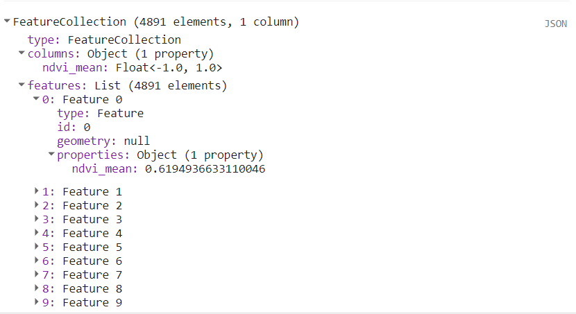
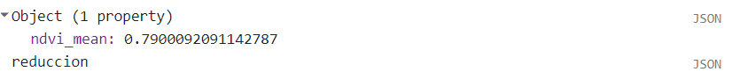
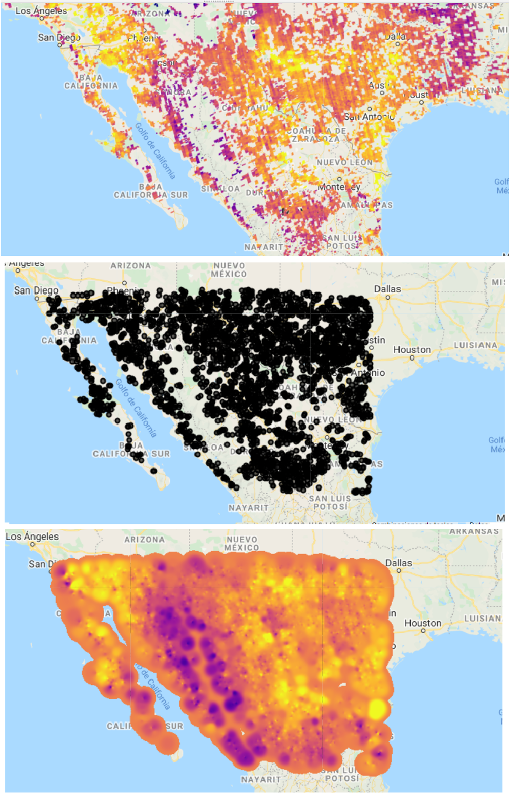
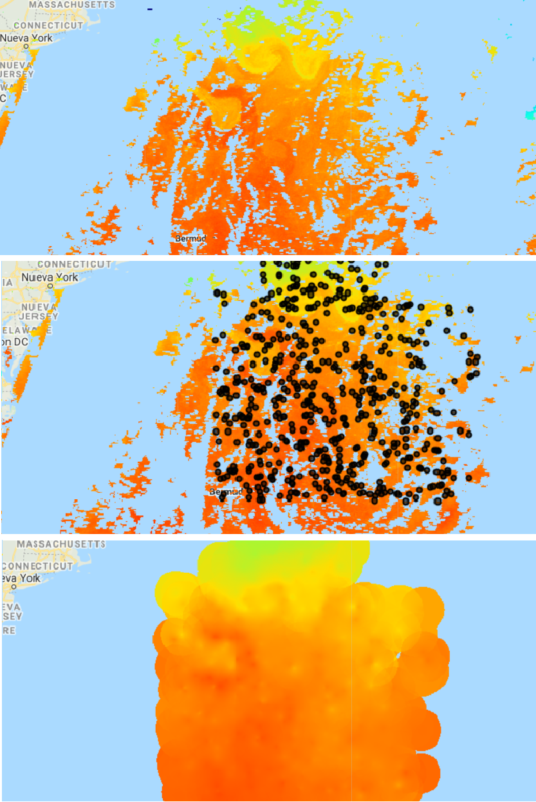

\newpage

# Uso conjunto de vectores e imágenes

Además de los métodos que existen en GEE para realizar operaciones sobre
imágenes, colecciones de imágenes, vectores o colecciones de vectores,
existen algunos métodos que permiten combinar estos dos tipos de
información para realizar ciertos procesos. Los dos tipos de procesos
más comúnmente utilizados son el muestreo de una imagen por vectores y
la reducción de una imagen por vectores.

## Métodos comunes

### Muestreo por vector(es) {.unnumbered}

\index{sample} \index{sampleRectangle} \index{sampleRegions} Este tipo
de operaciones normalmente se utilizan para muestrear los datos de una
imagen y obtener, por ejemplo, muestras por clases de coberturas para
después entrenar un clasificador o para obtener los valores de un ráster
en formato de vector (como puntos). En GEE, existen tres métodos para
hacer este proceso: para un ráster completo (`.sample`), para un
rectángulo (`.sampleRectangle`) o para varias regiones
(`.sampleRegions`). Por ejemplo, el método `.sample` toma como
argumentos el vector utilizado para determinar el área de muestreo, así
como la escala a la que se desea realizar el muestreo. En este ejemplo,
primero se define una geometría y después se hace el muestreo
(`r colorize("Fig.")` \@ref(fig:fc111)).

Ejercicio 29

```{js echo = T}
// Definir región a muestrear
var bosque1 = ee.Geometry.Rectangle(-101.53892, 19.74148, 
  -101.51906,19.72362);
```

```{js echo = T}
// Muestrear imagen
var muestreo = L8imgMean
  .sample({
    region: bosque1,
    scale:30
  });
```

```{r fc111, echo = F, out.width="80%", fig.cap="Ejemplo de la salida de la consola de una colección de vectores obtenida mediante el método sample."}

```

::: {.bluebox2 data-latex=""}
::: {.awesomeblock data-latex="{5pt}{\\faLightbulb}{darkblue}"}
Si se desea obtener la información de un muestreo de una imagen con su
correspondiente información espacial, se puede utilizar el argumento
`geometries: true`. Esto dará como resultado una tabla con la misma
información, pero con las coordenadas geográficas de los centros de los
píxeles de la imagen muestreada.
:::
:::

### Reducción de una imagen por región(es) {.unnumbered}

\index{reduceRegion} \index{reduceRegions} Este tipo de operaciones
normalmente se utilizan para resumir los valores de algún ráster en
ciertas áreas de interés. En GEE, existen dos métodos para realizar este
proceso: para una única región (`.reduceRegion`) o para varias regiones
(`.reduceRegions`). Por ejemplo, el método `.reduceRegion` permite
obtener estadísticas de la imagen en la extensión indicada por un área
de interés (`geometry`). En este caso, además hay que indicar el
reductor (`reducer`) y el tamaño de píxel para realizar la operación
(`scale`; `r colorize("Fig.")` \@ref(fig:fc112)).

```{js echo = T}
// Reducción por región
var reduccion = ee.Image(L8imgMean)
  .reduceRegion({
    // Reductor a utilizar
    reducer: ee.Reducer.mean(),
    // Definir el área de interés a resumir
    geometry: bosque1,
    // Tamaño de píxel
    scale: 30
  });
```

(ref:sub6) `.reduceRegion`

```{r fc112, echo = F, out.width="80%", fig.cap="Ejemplo de la salida de la consola del promedio obtenido mediante el método (ref:sub6)."}

```

::: {.bluebox2 data-latex=""}
::: {.awesomeblock data-latex="{5pt}{\\faLightbulb}{darkblue}"}
En algunas ocasiones, los procesos de `.reduceRegions` o
`.sampleRegions` pueden demandar muchos recursos computacionales y
arrojar un error de 'computation timed out'. Para evitarlo, se pueden
utilizar los argumentos de `scale` o `tileScale`, ya que ambos
argumentos permiten reducir los costos computacionales del proceso.
`Scale` permite aumentar el tamaño de píxel al que se va a resumir la
información, mientras que `tileScale` permite definir un factor de
escalamiento.
:::
:::

## Interpolación de un vector a una imagen

Este procedimiento consiste en tomar los datos numéricos de un vector e
interpolarlos a áreas fuera de los vectores, lo cual resulta en una
imagen con valores en toda el área de interés.

### Ponderación de distancia inversa {.unnumbered}

\index{inverseDistance} Este método interpola un valor para los píxeles
de una imagen de acuerdo a los puntos con información y los pondera
según su distancia, generando un promedio de esos valores. Esto provoca
que los píxeles más cercanos tengan más influencia sobre el resultado de
la interpolación que los píxeles más alejados. Para consultar más
detalles sobre el procedimiento de interpolación, revisar Basso et al.
(1999). Esta interpolación se realiza con el método `.inverseDistance`,
donde hay que especificar al menos:

-   El radio a interpolar alrededor de cada vector.
-   El atributo (la propiedad) numérica del vector, que se interpolará.
-   El promedio global de la variable.
-   La desviación estándar global de la variable.

El siguiente ejercicio tiene como objetivo interpolar valores de metano
(CH~4~) para el norte de México. La imagen Sentinel-5 que se utilizará
no tiene los valores de CH~4~ para toda el área de estudio, sino que
muchos de los píxeles se encuentran sin valores o enmascarados, es por
ello que queremos interpolar la imagen, para poder tener valores
continuos en toda el área. Para ello se generarán 10000 muestras
(puntos), que consisten en el valor de CH~4~ de 10000 píxeles
aleatorios. Con la ayuda de unos reductores extraemos el promedio y la
desviación estándar de todas las muestras (puntos) y finalmente
interpolamos las muestras en buffers de 70 km, usando como argumento el
promedio y la desviación estándar (`r colorize("Fig.")`
\@ref(fig:fc113)).

Ejercicio 30

```{js echo = T}
// Importamos datos de metano de 5 días, los filtramos y sacamos el 
// promedio.
var ch4 = ee.ImageCollection('COPERNICUS/S5P/OFFL/L3_CH4')
  .select('CH4_column_volume_mixing_ratio_dry_air')
  .filterDate('2020-01-01', '2020-01-05')
  .mean()
  .rename('ch4');

// Definimos un rectángulo de área de estudio al norte de México.
var norteMex =
  ee.Geometry.Rectangle(-117.33, 32.753, -97.773, 22.634);

// Crear una colección de vectores para interpolar.
// Se crean dos bandas adicionales para la imagen indicando la 
// longitud y latitud de cada píxel
var muestras = ch4.addBands(ee.Image.pixelLonLat()) 
  // Se crea una colección 
  // de vectores (sin geometría) en la región norteMex y aproximadamente 
  // cuántos puntos generar
  .sample({region: norteMex, numPixels: 10000, 
    // resolución de la imagen en metros por píxel
    scale:1000}) 
  // Función para cada punto generado
  .map(function(sample) { 
    // Tomar el valor del punto de latitud
    var lat = sample.get('latitude'); 
    // Tomar el valor del punto de Longitud
    var lon = sample.get('longitude'); 
    // Tomar el valor del punto de metano
    var ch4 = sample.get('ch4'); 
    // Crear una geometría para el vector asignándole el valor de metano
    return ee.Feature(ee.Geometry.Point([lon, lat]), {ch4: ch4});
  });

// Combinar un reductor de promedio y desviación estándar
var Reductores = ee.Reducer.mean().combine({
  reducer2: ee.Reducer.stdDev(),
  sharedInputs: true});

// Estimar el promedio y la desviación estándar de metano de los puntos.
var stats = muestras.reduceColumns({
  reducer: Reductores,
  selectors: ['ch4']});

// Interpolar para 70 km.
var interpolado = muestras.inverseDistance({
  // Rango de interpolación para cada punto
  range: 70000, 
  // Atributo numérico a interpolar
  propertyName: 'ch4', 
  // Promedio (parámetro para el método)
  mean: stats.get('mean'), 
  // Desviación estándar (parámetro para la método)
  stdDev: stats.get('stdDev'), 
  }); 
```
(ref:sub1) CH~4~

```{r fc113, echo = F, out.width="80%", fig.cap="Visualización de la capa inicial de (ref:sub1), puntos de muestreo e imagen interpolada."}

```

### Kriging {.unnumbered}

\index{kriging} Es un método de interpolación que utiliza un estimado de
la semivarianza para crear una imagen de valores interpolados que sea
una combinación óptima de los datos conocidos. En este método hay que
especificar algunos parámetros que describen la forma de la función de
semivarianza ajustada a los datos conocidos, los cuales incluyen: el
intervalo de la varianza (`range`), la meseta (`sill`), el valor del
efecto pepita (`nugget`), la distancia máxima a analizar (`maxDistance`)
y la función a utilizar como reductor (`reducer`). Este ejercicio
mostrará cómo interpolar la información de la temperatura superficial
del mar (imagen), a partir de un muestreo de puntos (vectores;
`r colorize("Fig.")` \@ref(fig:fc114)).

Ejercicio 31

```{js echo = T}
// Importar una imagen de temperatura marina superficial
var temperatura = ee.Image('NOAA/AVHRR_Pathfinder_V52_L3/20120802025048')
  .select('sea_surface_temperature')
  .rename('temperatura')
  .divide(100);

// Definir una geometría donde muestrear puntos
var geometria = ee.Geometry.Rectangle([-65.60, 31.75, -52.18, 43.12]);

// Muestrear las temperaturas en 1000 localizaciones aleatorias.
var muestras = temperatura.addBands(ee.Image.pixelLonLat())
  .sample({region: geometria, numPixels: 1000})
  .map(function(sample) {
    var lat = sample.get('latitude');
    var lon = sample.get('longitude');
    var temperatura1 = sample.get('temperatura');
    return ee.Feature(ee.Geometry.Point([lon, lat]), 
    {temperaturaMarina: temperatura1});
  });

// Interpolar a partir de las muestras
var interpolar = muestras.kriging({
  propertyName: 'temperaturaMarina',
  // Forma de la función de la varianza de los datos
  shape: 'exponential', 
  // Rango de la varianza
  range: 100 * 1000, 
  sill: 1.0,
  nugget: 0.1,
  maxDistance: 100 * 1000,
  reducer: 'mean',
});
```

```{r fc114, echo = F, out.width="80%", fig.cap="Visualización de la capa inicial de temperatura de la superficie marina, puntos de muestreo y capa interpolada."}

```
